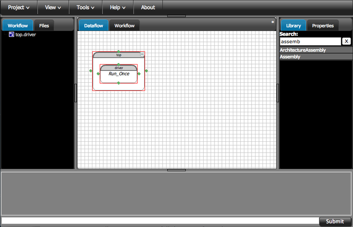
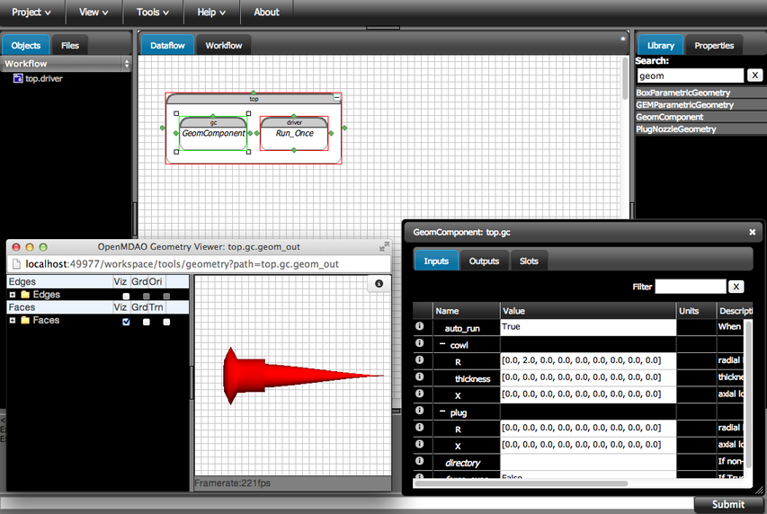
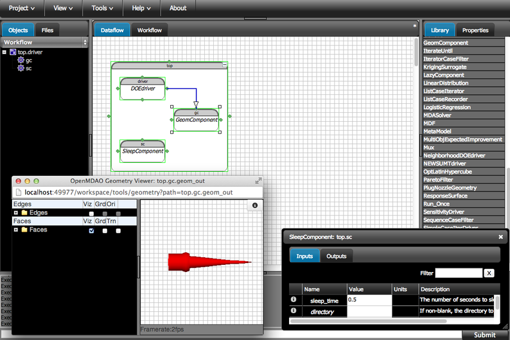

.. index:: geometry

.. _`doe-geometry`:

Design of Experiments with Geometry
===================================

The overview tutorial for geometry support in OpenMDAO provided a very simple example of how to
include and display geometry in OpenMDAO. Now we will provide an example that demonstrates the use
of a geometry object as part of a design of experiments (DOE). This tutorial will dynamically show
how the design of a simple jet engine nozzle can be varied as part of a DOE.

The geometry of the nozzle modeled here is a very simple axisymmetric plug nozzle with a very 
course physical discretization. It's parameterized using an axisymmetric B-spline-based
free-form-deformation method. Keeping the overall number of surface points small helps keep
things running more quickly for  this tutorial. If you wanted to do real analysis, you would
certainly use a much finer discretization,  but this works fine to demonstrate how to work with
geometry in OpenMDAO. 

The nozzle is split into the plug and the cowl, and each has its own control variables. The plug 
has nine control points arranged axially from the back to front that deform the radius and axial
location  discrete geometry points around that axial location. So for the plug, each control point
yields two design  variables: axial location and radius. Overall there are 18 design variables for
the plug. 

The cowl is parameterized by two separate B-splines: one for the  thickness of the cowl and one for
the radius of the cowl centerline. So the cowl has two sets of nine control points, spaced axially
from back to front, which combine to define its geometry. The centerline  parameterization works
just like that of the plug, where you can control the axial location and the radius.  The thickness
control has only a single dimension. Overall, there are 27 design variables for the cowl. 

.. note:: This tutorial will be done in the OpenMDAO GUI. In addition, a 
   script version of this tutorial is available in the file :download:`test_nozzle_geometry_doe.py
   </../examples/openmdao.examples.nozzle_geometry_doe/openmdao/examples/nozzle_geometry_doe/test/test_nozzle_geometry_doe.py>`.

Start by creating a new project in the GUI. We'll name it `DOE Geometry Tutorial`.  As in the overview
tutorial, first you should create an instance of an assembly to work in. On the right-hand side, there is a
Library tab with a text box at the top. In the box type "assemb" and hit enter. This will filter down the
whole library so you can find things more easily. Drag the ``Assembly`` and drop it into the workspace. Name it
`top.`

Setting Up the Geometry Component
----------------------------------

Go back to the Library and filter it by "geom." Drag the ``GeomComponent``  item and drop it into the `top`
assembly. You can name it `gc`. Double-click on `gc` and in the editor window that appears, click the Slots
tab. From the Library, drag the item ``PlugNozzleGeometry`` and drop it into the ``parametric_geometry`` slot.
This adds the nozzle model into  your generic ``GeomComponent`` instance `gc`. If you flip over to the Inputs
tab, you'll see that  there are now some inputs you can modify that will change the geometry. Feel free to
play around  a bit if you like. After you change inputs, right-click on the `gc` element in the Dataflow and
select ``Run`` from the menu so the geometry will change. At this point, you have no way to view that change
in geometry. The next part of the tutorial will explain how to do that. 

Click the Outputs tab. In the Value column for the ``geom_out`` output, there should be a button
labeled **View Geom**. Click that button and the Geometry Viewer window should appear, letting you view the 
nozzle geometry. 

Go back to the ``GeomComponent`` editor window. Click the Inputs tab. Change the value of ``auto_run`` to \
"True." This causes the ``GeomComponent`` to execute whenever any input values change. In general, you would
not want to leave this setting on  when you were running an analysis. If your optimizer sets 10 values in
your geometry model, the model would execute 10 times.  That could get very costly for analysis and
optimization, but when you're just playing with a model and setting inputs by hand, calling ``Run`` each time
can get quite tedious. So in a real scenario, just make sure you set ``auto_run`` back to false before doing 
any serious analysis. 

Now we can edit some of the input values for this geometry and see the geometry updated in the OpenMDAO 
Geometry Viewer window. Edit the ``cowl.R`` array, which controls the radius control points for the cowl. To
do that,  click the cell for the `Name` column for the ``cowl`` input.   The sub-elements of cowl, ``R``,
``thickness``, and ``X``, should be revealed. Click in the `Value` cell for ``R`` to bring up the  editor
for that value. Change the value of the second element  of the ``R`` array to "2.0" and click the **Submit
changes** button. Look in the Geometry Viewer window. The  cowl should change shape. Put the value of the
second element or ``R`` back to "0.0" to prepare for the next part of the tutorial.

         viewer overlaps part of workspace and shows red nozzle and some GeomComponent values.

Setting Up the DOE Driver
---------------------------
From the Library, drag the ``DOEdriver`` item and drop it on the ``driver`` item in the top 
assembly. A confirmation dialog will ask if you really want to replace the existing driver
with the ``DOEdriver``. Click Ok. 

Open up the editor for the ``DOEdriver`` by double-clicking it in the Dataflow. Click on the Slots tab. From
the Library, drag and drop the ``OptLatinHypercube`` item on to the ``DOEgenerator`` slot. A dialog window
will appear asking for the number of samples for this DOE. Enter "20" and click Ok.

We are now going to tell the ``DOEdriver`` what parameters to vary. Click the Parameters tab. Using the **Add
Parameter** button in the lower left, add six  parameters using the values in the following table. 

========================  ==========  ==========
Target                    Low         High
========================  ==========  ==========
``gc.plug.R[7]``            -0.1        0.5
------------------------  ----------  ----------
``gc.plug.R[8]``            -0.1        0.5
------------------------  ----------  ----------
``gc.cowl.R[7]``            -0.1        0.2
------------------------  ----------  ----------
``gc.cowl.R[8]``            -0.1        0.2
------------------------  ----------  ----------
``gc.cowl.thickness[7]``    0.0         0.
------------------------  ----------  ----------
``gc.cowl.thickness[8]``    0.0         0.5
========================  ==========  ==========

We should now be able to run the analysis! Right-click on the `top` Assembly and select ``Run`` from
the menu.  You should notice the geometry change shape, but the analysis runs too quickly to see how the 
geometry looks for each of the 20 designs. You see only the first and the last designs.

.. figure:: nozzle_geom_doe_resized.png
   :align: center
   :alt: workspace with top assembly; a window containing DOEdriver parameters over laps part of workspace

Slowing Down the Analysis
-------------------------

To slow things down a bit, we will add a component to the workflow that does nothing but create a time
delay. This process will also demonstrate some more features of the OpenMDAO GUI. 

From the Library, drag the ``SleepComponent`` into the ``Assembly`` called `top`. Name it `sc`.
Double-click it to open its editor window. Change the input value ``sleep_time`` to "0.5". Close the editor
window. 

We need to add this component to the driver's workflow. First, make sure that the Objects tab is selected on
the left and that the menu below it is set to `Workflow` to reveal the Workflow tree. Then, drag the
``SleepComponent``, `sc`, from  the Dataflow diagram onto ``top.driver`` in the Workflow tree.  

Select Components from the menu on the Objects tab. By clicking on the "top" item in the Components, you
should be able to see all the elements in the top assembly including the `sc` item we just added. 

Now the ``DOEdriver`` will run both the ``GeomComponent`` and the ``SleepComponent`` for each design
iteration.  Go back to the Dataflow and try running the analysis again. With the half-second delay between
each analysis, you can now easily see the geometry change shape.

