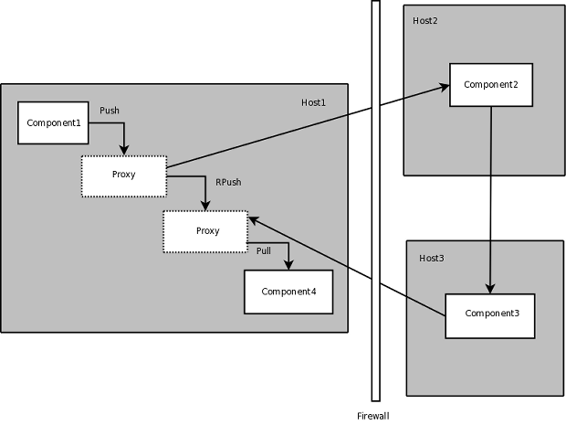

.. index:: variables; transferring between components
.. index:: assembly.connect()

Variables to be transferred between components (see the diagram `Variable
Transfers Between Components`_) are defined by the links created via
assembly.connect(), which is called implicitly while constructing a model. The
assembly maintains a list of all variables linked between its components.
Transfer of regular variables is handled by simply getting the value from the
source and setting the corresponding variable on the destination, after applying
any required unit conversion.

.. _`Variable Transfers Between Components`:

.. figure:: ../generated_images/AssemblyXfer.png
   :align: center

   Variable Transfers Between Components

File variables are handled by determining the absolute paths to the source and
destination files and then performing a copy. Components may specify their
directory either relative to their parent component's directory or by an
absolute path. The top level assembly's directory is set to the process' current
directory when the model is loaded.

Components request their parent assembly to do input and output variable
transfers. The request happens just before execution for inputs and just after
execution for outputs.

Subassemblies perform *border* transfers, transfers from inputs to the
subassembly to the corresponding internal component inputs, and transfers from
internal component outputs to the corresponding outputs of the subassembly. This
is because the subassembly effectively hides its internal components from the
outside world.

Remote component access occurs via proxies. Operations on the proxy are
translated to the equivalent operation on the remote component. So getting
an output variable from a proxy actually requests the value of that variable
from the remote component. Similarly, setting an input on a proxy actually
sets the value on the remote component. File variables are processed in a
similar manner.

.. index:: firewalls; transfers through
.. index:: transfers; between remote components
.. index:: pull links
.. index:: push links

Firewalls introduce the need to be able to *pull* values as well as *push.* (See the
diagram `Transfer Through a Firewall`_.) This is because firewalls are typically
configured one way. A client on the inside can initiate a transaction with a server on
the outside but not vice-versa. So to set an output on a server from inside the
firewall requires a *push* style of link. For an output on that server to be propagated
back requires a *pull* style of link.  The default link style is *push,* but links may
be configured to *pull* as necessary.

.. _`Transfer Through a Firewall`:

.. figure:: ../generated_images/FirewallXfer.png
   :align: center

   Transfer Through a Firewall

Transfers between remote components can be performed directly if they have
connectivity, indicated by *rpush* or *rpull* links. In this case, the parent
assembly checks the link type and then has the component proxy invoke a send or
receive operation on the remote component, with a reference to that component's
peer as an argument.

   Third Party Transfers

   
|

