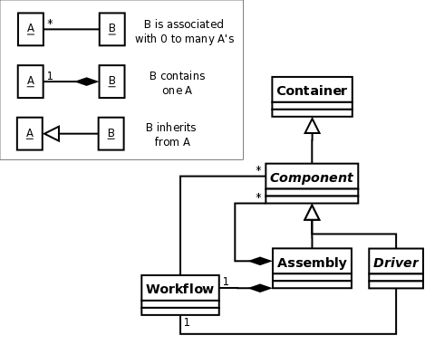
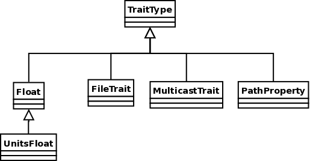
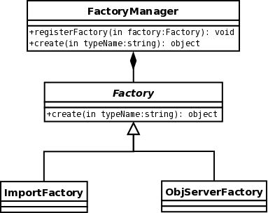
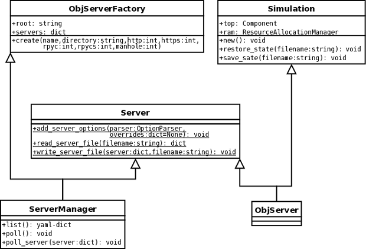

.. index:: diagrams; class
.. index:: pair: Model Composition; classes
.. index:: classes; core

.. _Class-Diagrams:

Class Diagrams
--------------

The following sections present Class Diagrams for Model Composition Classes
(core classes), built-in Variable Classes, Factory Classes, and Server Classes.

Model Composition Classes
===========================

The figure `Class Diagram of Core Classes`_ shows the classes that are the
building blocks of a *model*. A model is a hierarchical structure with an
:term:`Assembly` at its root. Within the :term:`Assembly` is some number of
:term:`Components`, and a :term:`Workflow`, which controls the execution order
of the Components. The Components have attributes that can be linked to
attributes on other Components. An Assembly is a Component, which means that it
can be contained within another :term:`Assembly`. This allows for the creation
of hierarchical models with many levels of nested Assemblies. A :term:`Driver`
is an Assembly that repeatedly executes its workflow until some condition is
met.

.. _`Class Diagram of Core Classes`:

   Class Diagram of Core Classes

.. index:: built-in Trait classes
.. index:: classes; built-in Trait 
.. index:: Traits

Classes for Validation and Conversion of Component Attributes
=============================================================

Validation and conversion of Component attributes is done using the Traits_
package.  There are a large number of built-in trait types to choose from, 
including Int, Float, Str, Array, List, and many others.  You can also define
your own custom traits by inheriting from TraitType and overriding the
``validate()`` function. :term:`Traits` also has built-in support for creation of
graphical editors for each trait when running with a wxPython GUI, but it's not
clear at this point whether this functionality will be useful in the context of
a web GUI. The documentation claims that traits uses something called pyface,
to provide a sort of generalized UI layer that can be tied to various GUI
libraries on the back end. However, it appears that wxPython may be the only
functioning back end at the moment.

.. _Traits: http://code.enthought.com/projects/traits/documentation.php

    
    Class Diagram of Built-in Traits
    
       
.. index:: pair: Factory; classes   

Factory Classes
===============

It is important to give location transparency to the process of object creation,
and using Factory classes lets users do that in an extensible way. The creation
of an object with a specific type and version will be requested, and the
framework will create the object. This creation process could involve spawning a
remote process, instantiating a remote version of the object, and creating a
local proxy to represent the remote object, or it could be a simple import and a
constructor call. To the caller, it makes no difference. The call returns a
local python object, and the true location of the object requested does not
matter.

   Class Diagram of Factory Classes
 
   
.. index:: pair: Server; classes   
.. index:: ServerManager
   
   
Server Classes
==============

Simulations are run in one or more :term:`ObjServer` processes, possibly distributed
among multiple hosts. :term:`ObjServer` processes are created by
:term:`ObjServerFactory`, either dynamically when a particular component type is
needed which is not supported in the main simulation server, by the user when starting
a new simulation via the ServerManager, which acts as a portal, or by the user from
the command line.

The base Server class provides a common mechanism for configuring network
protocols and services, while the Simulation class contains the top-level
component and the ResourceAllocationManager for this simulation object.

   Class Diagram of Server Classes

|

