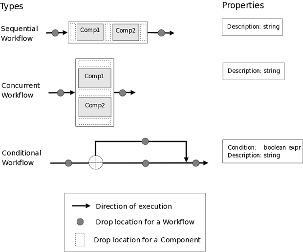
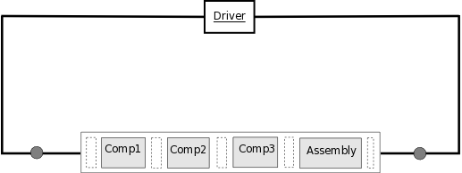

.. _Key-Concepts:

Key Concepts
------------

The following sections attempt to describe some of the concepts that helped to
drive the design.

.. index:: pair: Python; module
.. index:: egg
.. index:: plug-in, registering
.. index:: FactoryManager
.. index:: plug-ins

Plug-ins
========

Users of the framework will be able to extend its functionality using *plug-ins*. Any Python object will be usable as a plug-in as long as it
supports the required interface. Typically, a plug-in will be implemented as a pure
Python module, a Python extension that wraps a shared library, or a file I/O  wrapper
that interacts with a stand-alone executable code. The framework will include support
for file I/O wrapping, including a template engine for generating input files, and
tools to simplify the task of scanning output files for values.

Plug-ins must be *registered* with the framework before the framework can locate
and activate them. In this framework, they will be registered by putting them in
a directory or an :term:`egg` file that is in the search path of the
:term:`FactoryManager` or in the search path of one of the ObjServerFactories
that is itself registered with the FactoryManager.   

The primary types of plug-in interfaces available to extend the framework are
listed below:

.. index:: pair: IComponent; plug-in interface 
.. index:: pair: IContainer; plug-in interface
.. index:: pair: IDriver; plug-in interface
.. index:: pair: IVariable; plug-in interface
.. index:: pair: IVariable; plug-in interface
.. index:: pair: IGeomObject; plug-in interface
.. index:: pair: IResourceAllocator; plug-in interface
.. index:: pair: IFactory; plug-in interface

:ref:`IContainer<IContainer>` - interface to an object that contains Variables that are visible to
the framework.

:ref:`IComponent<IComponent>` - interface to an engineering tool or some sort of calculation. It
inherits from :ref:`IContainer<IContainer>`.

:ref:`IDriver<IDriver>` - interface to optimizers, solvers, parameter studies, and other
objects that iterate over a model. It inherits from :ref:`IComponent<IComponent>`.

:ref:`IVariable<IVariable>` - interface to data objects that are to be passed between linked
components. These data objects have a validate() function to ensure that only 
valid links are allowed. They can also translate values from other IVariables,
e.g., perform unit conversion.

:ref:`IGeomObject<IGeomObject>` - interface to objects with geometry. Typically these will have
parameters that can be modified by components and will have the ability to
return various grid representations of their geometry.

:ref:`IResourceAllocator<IResourceAllocator>` - interface to objects that allocate memory and disk
resources, sometimes on specific servers, based on a resource description.

:ref:`IFactory<IFactory>` - interface to an object that creates other objects used by the
framework. This creation may involve the creation of a remote instance of an
object and a  proxy to represent it in the local process.

(See the section  :ref:`Application-Programming-Interface-(API)` for details on
these interfaces.)

.. index:: geometry
.. index:: Component

Geometry
========

Many analysis components will require some representation of geometry, and that
representation could vary in detail from simple parameters, e.g., length, up to a
full 3d mesh. It's also important that the components dealing with the same
physical object are using geometric representations generated from the same
underlying geometry. Also, real world geometries tend to be complex hierarchical
assemblies of parts, and some components will be interested in only a single part
while others will need, for example, the :term:`OML` of an entire assembly of
parts. The source of the underlying geometry could be one of any number of tools,
from external full featured  :term:`CAD` programs like Pro/Engineer and Catia, to
more aircraft specific codes like :term:`VSP`, to open source geometry kernels
like OpenCASCADE_.

.. _OpenCASCADE: http://www.opencascade.org

.. index:: OpenCascade
.. index:: CAD
.. index:: CAPRI
.. index:: Vehicle Sketch Pad (VSP)

Our goal is to allow other tools in the framework to interact with geometry in a
consistent fashion regardless of the tool used to provide the geometry. To this
end, we intend to use the :term:`CAPRI` API to interact with geometry producers. There
are existing CAPRI interfaces to OpenCASCADE and to a number of popular 
commercial CAD packages, but not to :term:`VSP`. Creating a new CAPRI interface to 
VSP will require significant effort, but that effort is necessary if components
are to interact with VSP as a generic geometry producer in the framework.

.. index:: pair: Component; publishing
.. index:: setuptools
.. index:: Python Package Index
.. index:: egg

Component Publishing
====================

Because increasing the number of available framework components will make the
framework more useful, one of our goals is to make the process of publishing a
component for use by others as easy as possible. 

Python has a popular distribution tool called *setuptools* which packages
modules and any associated dependent files into a single file called an :term:`egg`. An
egg in Python is similar to a jar file in java. Using setuptools, a user can
install multiple versions of the same module in a given Python environment. 
Eggs can be downloaded from an egg server using a simple HTML-based protocol. A
developer can control the distribution of a component by choosing to  publish it
in a particular egg server. For world-wide distribution, it can be placed on a 
public server like the `Python Package Index`_. For more restricted
distribution, it can be placed on  a secure egg server that requires a login id
and password.

.. _`Python Package Index`: http://pypi.python.org/pypi

The component developer will also be able to specify units and valid ranges on
inputs to the component, which increases the likelihood that users
of the component will generate valid results. 

(More on component publishing can be found at the end of the section on
:ref:`Important-Processes`.)

.. index:: ObjServerFactory
.. index:: pair: environment; multi-version
.. index:: config_from_obj()

Multi-version Environment
=========================

Over time, both the Python language and the components used in this framework
will evolve, and multiple versions of both will exist at the same time. This 
framework must allow users to leverage new software without losing the ability 
to work with established software. Therefore, it must provide a  mechanism to
allow different versions of the same component or even components that work
with different versions of Python to exist in the same model.

This can be accomplished by placing incompatible versions in different
processes and letting them communicate across the process boundary. As long as
the :term:`IPC` protocol used to communicate between them is the same on both
sides of the connection, these *incompatible* components can coexist within a
model.

In OpenMDAO, this will be done by setting up an :term:`ObjServerFactory` in a virtual
Python environment and having each :term:`ObjServer` spawned from that factory use
that factory's environment. Each virtual Python environment can run a different
Python version and can also have its own set of modules installed.

Users often want to update a model as its constituent components evolve. To
facilitate this process, we have added a config_from_obj() function to the
IComponent interface so that a newer component can configure itself using an
existing older component. This will allow the user to drag a new version of a
component onto an older version in a model, replacing the older version with
the new version configured as identically as possible to the old one. The
degree to which this automatic replacement will work depends upon the nature of
the differences between the two versions. If the differences are internal to
the component and do not affect its public interface, then the replacement
should just work. Because two versions of the same component cannot exist in
the same process, the newer one will have to be a proxy to a component that is
out of the process, as described above.

.. index:: wxPython

User Interfaces
===============

There will be a wxPython-based GUI and a command line interface, and both will
allow a user to fully exercise the framework. In addition, a web interface will
provide functionality similar to the wxPython GUI, probably with some initial
limitations. Over time, as javascript libraries become more robust, it should
be possible for the web interface to provide most of the functionality of the
local wxPython GUI.

.. index:: view	

Views
=====

There are a number of visual representations of the system that the user will be
able to interact with through the GUI. These visual representations are called
*views.* All views are based on the same underlying data model, so changes in one
view will typically result in changes to other views. For example, if a tool is
added to the dataflow view, it will also appear in the workflow view. However,
some objects will be visible only in a single view. For example, :term:`Workflow`
objects will only be visible in the workflow view. The rest of this section
describes the different views that will be available to a user of the GUI.

.. index:: N squared form
.. index:: free form
.. index:: pair: view; dataflow

Dataflow View
_____________

This view will show the components that make up the process model and the data
connections between those components. Users will be able to drag & drop a 
:term:`Component` onto the dataflow view and connect two Components by dragging
a line between them. Dropping a line on a component will display a connection
dialog allowing individual variables to be connected between the two Components.
The dataflow view can be arranged in either `N squared`_ form or `free form`_,
as shown below.

.. _`N squared`:

.. figure:: ../generated_images/NSquaredView.png
   :align: center

   N-Squared Dataflow View of an Assembly

----------

| 

.. _`free form`:

.. figure:: ../generated_images/DataFlowView.png
   :align: center

   Freeform Dataflow View of an Assembly

.. index:: pair: view; workflow
.. index:: workflow; sequential

Workflow View
_____________

This view shows the execution ordering of the components within an 
:term:`Assembly`. A :term:`Workflow` can include other Workflows, and a number
of different Workflows will be available, e.g., conditional (if,else if,else),
concurrent execution, and sequential execution. (See the figure below showing
`Types of Workflows`_.) The default workflow in an :term:`Assembly` is
`sequential workflow`_.

.. _`Types of Workflows`:

   Types of Workflows

-----------------

|

.. _`sequential workflow`:

   Workflow View Showing a Simple Sequential Workflow

.. index:: pair: problem formulation; view

Data-driven Problem Formulation View
____________________________________

The problem formulation_ view (shown in the next figure) allows a number of desired
outputs to be specified and connected to a particular component. Based on that
connection, additional variables which are the inputs to the connected component
must then have their values filled either by outputs from other components or by
constants.  When no more unfilled  variables exist, the process model is complete. 
When an attempt is made to connect an output to an input, the connection will be
validated to ensure that variable type, units, etc., are compatible. Using that
same type and unit  information, it would also be possible to display only those
outputs that are compatible with a selected input. 

When an attempted connection would create a circular dependency, the user is
notified. Potentially the user  could then be shown a dialog displaying the
circular dependency and could indicate how to break it by introducing, for
example, an equality constraint. Note that Drivers are not subject to the
circular dependency restriction since their purpose is to iterate over a set of
components repeatedly until some condition is satisfied.

.. _formulation:

.. figure:: ../images/arch-doc/DataDrivenPic.png
   :align: center

   Problem Formulation View

.. index:: pair: view; N-squared dataflow	

This view shows the `N-squared`_ dataflow view that corresponds to the previous
problem formulation view.

.. _`N-squared`:

.. figure:: ../generated_images/NSquaredViewDD.png
   :align: center

   N-squared View of Problem Formulation

.. index:: pair: plug-in; view
.. index:: Sockets

Plug-in View
____________

The figure below shows an example of a `plug-in view`_, which shows any Sockets
existing in a particular :term:`Component`. A  :term:`Socket` is just a placeholder
for an object within a :term:`Component` that has a name and  provides a
particular  interface. In other words, it is a location for a plug-in within a
Component. Because any object placed in a Socket must have the interface specified
by the Socket, the enclosing Component will know how to interact with that object.
Adding Sockets to a :term:`Component` class gives the :term:`Component` developer
a way to allow a user to easily customize the behavior of a :term:`Component` at
runtime simply by dragging and dropping objects onto the :term:`Component`.

.. _`plug-in view`:

.. figure:: ../generated_images/PluginView.png
   :align: center

   Plug-in View of a Component

Sockets for optional plug-in objects will be visually distinct from Sockets for 
mandatory plug-ins. For example, optional plug-ins could be displayed as boxes
drawn with dotted lines, and  Sockets for mandatory plug-ins as dashed boxes.
There are  also sockets allowing lists of plug-ins that share a common 
interface.

.. include:: security.rst

.. index:: error handling

Error Handling
==============

Execution of an MDAO model is often a complex process, and when that process
fails, it can be difficult to determine the source of the problem and to correct
it unless information related to the error is readily available, relevant, and
sufficiently detailed. The component and the framework are both responsible
for error handling. 

The component must provide intelligent error messages when it fails to execute
normally or is misconfigured in some way. If possible, it should suggest
ways to correct the problem.  

The framework must ensure that error messages, including any information written
to standard output and error streams, are available to the user, even when those
messages occur in a remote process. The user may also wish to monitor output
files generated by remotely executing codes, so the framework must support that
as well.  In addition, detailed, timestamped information will be written to a
log file that can be accessed in the event of a failure if a more detailed view
of the system state leading up to the failure is needed.
