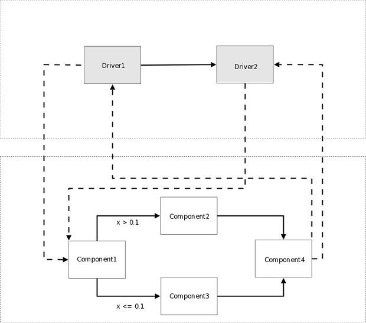
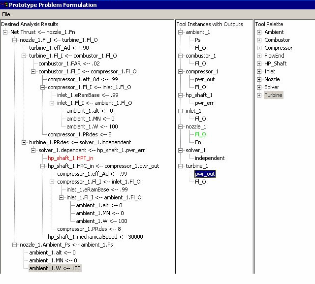
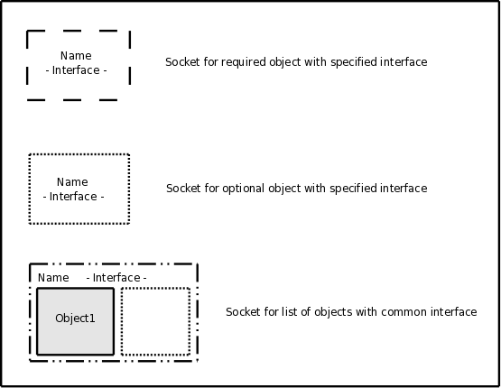

.. _Key-Concepts:

Key Concepts
------------

The following sections attempt to describe some of the concepts that helped to
drive the design.

.. index:: pair: Python; module
.. index:: egg
.. index:: plugins; registering
.. index:: FactoryManager
.. index:: plugins

Plugins
========

Users of the framework will be able to extend its functionality using *plugins*. Any
Python object will be usable as a plugin as long as it supports the required
interface. Typically, a plugin will be implemented as a pure Python module, a Python
extension that wraps a shared library, or a file I/O  wrapper that interacts with a
stand-alone executable code. The framework will include support for file I/O
wrapping, including a template engine for generating input files, and tools to
simplify the task of scanning output files for values.

Plugins must be *registered* with the framework before the framework can locate
and activate them. In this framework, they will be registered by putting them in
a directory or an *egg* file that is in the search path of the
:term:`FactoryManager` or in the search path of one of the ObjServerFactories
that is itself registered with the FactoryManager.   

The primary types of plugin base classes available to extend 
the framework are listed below:

.. index:: pair: Component; plugin base class 
.. index:: pair: Driver; plugin base class
.. index:: pair: TraitType; plugin base class

:ref:`Component<openmdao.main.component.py>` - base class of an engineering tool or some 
sort of calculation. It inherits from :ref:`Container<openmdao.main.container.py>`.

:ref:`Driver<openmdao.main.driver.py>` - base class for optimizers, solvers, 
parameter studies, and other objects that iterate over a set of components. 
It inherits from :ref:`Component<openmdao.main.component.py>`.

TraitType_ - base class used to validate and possibly convert data objects that are
passed between linked components. 

.. _TraitType: http://code.enthought.com/projects/files/ETS32_API/enthought.traits.trait_handlers.TraitType.html

The plugin interfaces available to extend the framework are listed below, and
their source documentation can be found in :ref:`interfaces.py<openmdao.main.interfaces.py>`.

.. index:: pair: IGeomQueryObject; plugin interface
.. index:: pair: IGeomModifier; plugin interface
.. index:: pair: IResourceAllocator; plugin interface
.. index:: pair: IFactory; plugin interface

*IGeomQueryObject* - interface to objects with geometry.
Geometric properties of the object can be queried.

*IGeomModifier* - interface to a geometry kernel that allows
creation of new geometry and modification of existing geometry.

*IResourceAllocator* - interface to objects that
allocate memory and disk resources, sometimes on specific servers, based on a
resource description.

*IFactory* - interface to an object that creates other objects
used by the framework. This creation may involve the creation of a remote
instance of an object and a  proxy to represent it in the local process.

.. index:: geometry
.. index:: Component

Geometry
========

Many analysis components will require some representation of geometry, and that
representation could vary in detail from simple parameters, e.g., length, up to
a full 3D mesh. It is also important that the components dealing with the same
physical object are using geometric representations generated from the same
underlying geometry. Also, real world geometries tend to be complex hierarchical
assemblies of parts, and some components will be interested in only a single
part while others will need, for example, the :term:`OML` of an entire assembly
of parts. The source of the underlying geometry could be one of any number of
tools, from external full featured  :term:`CAD` programs like Pro/Engineer and
Catia, to more aircraft specific codes like :term:`VSP`, to open source geometry
kernels like OpenCASCADE_.

.. _OpenCASCADE: http://www.opencascade.org

.. _BRL-CAD: http://brlcad.org

.. index:: OpenCascade
.. index:: CAD
.. index:: CAPRI
.. index:: Vehicle Sketch Pad (VSP)
.. index:: BRL-CAD

Before OpenMDAO can do anything with a geometry, that geometry must first exist.
There are two primary ways of creating geometry. The first is for a skilled CAD
operator to create the geometry using a particular CAD package and then provide it
to the OpenMDAO user.  In this scenario, using the :term:`CAPRI`  :term:`CAE`
Gateway would allow the user to interact with that existing geometry. The second
way is to create the geometry programmatically from within OpenMDAO using some sort
of geometry creation API. CAPRI does not provide for creation of new geometry.
CAPRI is also commercial software, so we cannot release it as part of OpenMDAO,
but we can provide an OpenMDAO wrapper object that can interact with CAD packages
through the CAPRI API.

After the geometry exists, we can query it.  The querying portion of the CAPRI
API or something similar could be used to facilitate this. This would allow
mesh generators, for example, to create meshes based on the geometry.

Finally, we wish to be able to parametrically manipulate the geometry. Many
commercial CAD packages support this, although in incompatible ways, meaning
that you cannot save a parametric geometry from one CAD package and use it
in another. CAPRI provides a common interface to allow parametric 
manipulation in the commercial CAD programs that provide it.

If we don't have a commercial CAD package that can handle parametric geometry
manipulation, the only available option seems to be to issue a sequence of
commands to a geometry creation API at runtime based on parameter values.  This 
would recreate the geometry whenever the sequence of commands is executed.

Regardless of how the parametric manipulation of geometry happens *within* an
object, the parameters to be manipulated must be handled in the same way as any
other parameter accessible to the framework, whether geometric or not, because
an optimizer must be able to manipulate all parameters in a uniform way.

So we have two possible ways to have fully functional geometry within OpenMDAO.
The CAPRI option works well for users with commercial CAD packages and skilled
CAD operators available to create parametric CAD parts for them. One unfortunate
side effect of this approach is that it limits collaboration with other
potential users of a parametric geometry, because whatever parametric geometry
is built in this fashion will only work in the same CAD package in which it was
built. If the geometry is exported into some format that is readable by other
packages, the parametric information will be lost.

The open source option, i.e., the approach of using a program to build geometry
at runtime based on parameter values and using an open source geometry kernel
built into OpenMDAO, is  not as polished as the commercial CAD approach.
However, it has the advantage that any geometry created in this way will be
available to any OpenMDAO user without requiring the purchase of a commercial
package. This increases the probability of reuse by others, and over time could
result in the creation by the OpenMDAO community of a library of parametric
parts available to anyone.

There is unfortunately no common interface to cover creation, querying, and
parametric manipulation that will work with both the CAPRI option and the open
source approach, but it should be possible to come up with a consistent query
interface that works with both.  This query interface will be patterned after
the query part of the CAPRI API, and should only include query functions that
can be supported by both CAPRI and whatever open source geometry kernel that is
included in OpenMDAO.  This will allow mesh generators and plotting components
to interact with geometry in the same way whether CAPRI is used or not.  The
interface for parametric manipulation will also be consistent because it must
simply expose parameters to the framework in the same manner that non-geometric
parameters are exposed.  Geometry creation is the only functionality that will
be handled differently between the two approaches. A creation API will be
created that is tied to OpenMDAO's internal geometry kernel, but that API will
not work through CAPRI because CAPRI does not support geometry creation.

.. index:: pair: Component; publishing
.. index:: setuptools
.. index:: Python Package Index
.. index:: egg

.. _`Component-Publishing`:

Component Publishing
====================

.. note:: Currently packaging in the Python community is in a state of flux, so
    the remainder of this section will have to be rewritten at some point.
    Python's setuptools has been forked into a package called *distribute,* and  based on
    discussions at PyCon 2010, apparently the plan is that eventually,
    distribute and distutils will go away and be replaced by distutils2,
    which will be  part of the standard library. Much of the functionality of
    setuptools/distribute will be incorporated into distutils2, and
    distutils2 will break backward compatibility with distutils. Eggs are
    apparently going away as well, but  the assumption is that packaged
    distributions created by distutils2 will be usable in a way similar to
    eggs. If distutils2 does in fact become part of the standard library and it
    provides the same functionality that we require from setuptools, we will
    switch over to it. Stay tuned.

Because increasing the number of available framework components will make the
framework more useful, one of our goals is to make the process of publishing a
component for use by others as easy as possible. 

Python has a popular distribution tool called *setuptools* which packages
modules and any associated data files and metadata into a single file
called an *egg*. The metadata found in an egg includes version
information, dependencies, license info, platform info, entry points, as well as
other information.

Eggs can be downloaded from an egg server using a simple HTML-based protocol. A
developer can control the distribution of a component by choosing to  publish it
in a particular egg server. For world-wide distribution, it can be placed on a 
public server like the `Python Package Index`_. For more restricted
distribution, it can be placed on  a secure egg server that requires a login id
and password.

.. _`Python Package Index`: http://pypi.python.org/pypi

The component developer will also be able to specify units and valid ranges on
inputs to the component, which increases the likelihood that users
of the component will generate valid results. 

.. seealso:: :ref:`Publishing-Components`

.. index:: ObjServerFactory
.. index:: pair: environment; multi-version
.. index:: replace()

Multi-version Environment
=========================

Over time, both the Python language and the components used in this framework
will evolve, and multiple versions of both will exist at the same time. This 
framework must allow users to leverage new software without losing the ability 
to work with established software. Therefore, it must provide a  mechanism to
allow different versions of the same component or even components that work
with different versions of Python to exist in the same model.

This can be accomplished by placing incompatible versions in different
processes and letting them communicate across the process boundary. As long as
the protocol used to communicate between the processes is the same on both
sides of the connection, these *incompatible* components can coexist within a
model.

In OpenMDAO, this will be done by setting up an :term:`ObjServerFactory` in a
self-contained Python environment that was created using ``virtualenv`` and having
each :term:`ObjServer` spawned from that factory use that factory's environment.
Each virtual environment can run a different Python version and can also
have its own set of modules installed.

Users often want to update a model as its constituent components evolve. To
facilitate this process, we will add a replace() function to the
Assembly interface so that a new Component can be configured using an
existing older Component. This will allow the user to drag a new version of a
Component onto an older version in a model, replacing the older version with
the new version configured as identically as possible to the old one. The
degree to which this automatic replacement will work depends upon the nature of
the differences between the two versions. If the differences are internal to
the Component and do not affect its public interface, then the replacement
should just work. If the two components have dependency version conflicts, 
the newer one will have to be a proxy to a component that is out of the process, 
as described above, because two versions of the same package cannot exist in
the same process at the same time.

.. index:: wxPython

User Interfaces
===============

There are a number of ways in which a user can interact with the framework.
There will be a command line interface allowing the user to load a model
configuration and execute a set of input cases. There will also be a graphical
interface, although it is not clear at this time whether it will be a
traditional GUI running on the desktop implemented in wxPython or PyQt, or a web
based interface. Initial plans were to implement both kinds of graphical
interface, but given the size of the development team and the amount of time
allowed for development, this is simply not possible. In addition to the command
line and graphical interface, there will also be a programmatic interface that
allows a user to write a python script that can interact with objects in the
framework.

Neither approach to graphical interface development is ideal. Early prototyping
using the wxPython approach has revealed some platform differences between the
Windows and linux versions that were not anticipated. Also, packaging and
distribution is difficult due to dependence on underlying libraries like, for
example, *GTK* on linux.  The current version of the Qt library has a license
that is not compatible with OpenMDAO, although the next version will have an
LGPL license, which is compatible. It is assumed that PyQt, the python wrapper
for Qt will have a similar license to Qt, but this is not certain. 

If a web-based interface is used, there are questions about the richness of the
interface relative to a traditional GUI. There are a number of javascript
libraries like jquery_ and dojo_ for example that are still relatively immature,
but they offer the promise of a browser based application with interactivity
that approaches that of a desktop application. Projects like dojo are being
actively developed, so they may reach the necessary level of maturity in the
near future.  

.. _dojo: http://www.dojotoolkit.org

.. _jquery: http://jquery.com

.. index:: view

Views
=====

There are a number of visual representations of the system that the user will
be able to interact with through the GUI. These visual representations are
called *views.* All views are based on the same underlying data model, so
changes in one view will typically result in changes to other views. For
example, if a tool is added to the dataflow view, it will also appear in the
tree view. The rest of this section describes the different views that will be
available to a user of the GUI.

.. index:: N squared form
.. index:: free form
.. index:: pair: view; dataflow

*Dataflow View*
_______________

This view will show the components that make up the process model and the data
connections between those components. Users will be able to drag & drop a 
:term:`Component` onto the dataflow view and connect two components by dragging
a line between them. Dropping a line on a component will display a connection
dialog allowing individual variables to be connected between the two components.
The dataflow view can be arranged in either `N squared`_ form or `free form`_,
as shown below.

.. _`N squared`:

.. figure:: ../generated_images/NSquaredView.png
   :align: center

   N-Squared Dataflow View of an Assembly

----------

| 

.. _`free form`:

.. figure:: ../generated_images/DataFlowView.png
   :align: center

   Freeform Dataflow View of an Assembly

.. index:: pair: view; workflow
.. index:: workflow; sequential

.. _`Workflow-View`:

*Workflow View*
_______________

An Assembly contains at least one Driver, called *driver*, that manages
execution of the other Components and Drivers within the Assembly. Each Driver
references a workflow that it iterates over until some condition is met.
Nested iterations can be constructed by placing a Driver within the workflow
of another Driver. If a Driver doesn't define its own workflow object, it will
use the default workflow object that lives in the Assembly. There are two existing
Workflow classes currently, SequentialWorkflow and Dataflow.  Dataflow infers
execution order based on data connections between Components, and SequentialWorkflow
supports a simple sequence of Components that run in the order that they are added
to the workflow. A new type of Workflow that allows both data flow and control flow is
planned. This new Workflow will support concurrent execution and conditional
branching.

.. _`control flow`:

   Notional Workflow View of an Assembly

.. index:: pair: problem formulation; view

*Data-driven Problem Formulation View*
______________________________________

The problem formulation_ view (shown in the next figure) allows a number of desired
outputs to be specified and connected to a particular component. Based on that
connection, additional variables which are the inputs to the connected component
must then have their values filled either by outputs from other components or by
constants.  When no more unfilled  variables exist, the process model is complete. 
When an attempt is made to connect an output to an input, the connection will be
validated to ensure that variable type, units, etc., are compatible. Using that
same type and unit  information, it would also be possible to display only those
outputs that are compatible with a selected input. 

When an attempted connection would create a circular dependency, the user is
notified. Potentially the user  could then be shown a dialog displaying the
circular dependency and could indicate how to break it by introducing, for
example, an equality constraint. Note that Drivers are not subject to the
circular dependency restriction since their purpose is to iterate over a set of
components repeatedly until some condition is satisfied.

.. _formulation:

   Problem Formulation View

.. index:: pair: view; N-squared dataflow

This view shows the `N-squared`_ dataflow view that corresponds to the previous
problem formulation view.

.. _`N-squared`:

.. figure:: ../generated_images/NSquaredViewDD.png
   :align: center

   N-squared View of Problem Formulation

.. index:: pair: plugin; view
.. index:: Sockets

*Plugin View*
______________

The figure below shows an example of a `plugin view`_, which shows any Sockets
existing in a particular Component. :term:`Sockets` are just placeholders
for an object within a Component that has a name and  provides a
particular  interface. In other words, it is a location for a plugin within a
Component. Because any object placed in a Socket must have the interface specified
by the Socket, the enclosing Component will know how to interact with that object.
Adding Sockets to a Component class gives the component developer
a way to allow a user to easily customize the behavior of a Component at
runtime simply by dragging and dropping objects onto the Component.

.. _`plugin view`:

   Plugin View of a Component

Sockets for optional plugin objects will be visually distinct from Sockets for 
mandatory plugins. For example, optional plugins could be displayed as boxes
drawn with dotted lines, and  Sockets for mandatory plugins as dashed boxes.
There are  also sockets allowing lists of plugins that share a common 
interface.

.. index:: security

Security
========

.. note::
   The entire section on security will most likely have to be revisited based on
   discussions with potential users in industry.  They want the ability to control
   access to certain data within a component based on the identity of the person
   attempting to access it.  This differs from the *all or nothing* approach 
   described below.

For any system, the security mechanisms employed are determined by the types of
threats to be protected against.  

.. index:: threat definition
.. index:: pair: security; mechanism

*Threat Definition*
___________________

In this system, the threats to be protected against are access to a simulation
by an unapproved user and inadvertent misuse of the system by a legal user.

Users will be identified by some mechanism (such as username, password), and
simulations should not be accessed by any user not listed in the simulation's
approved users. The system will not be addressing issues regarding intentional
*spoofing* of legal user IDs or various other forms of attack on a user's
identity.

There are expected to be situations where simulation methods and/or variables
should not be accessed or modified. For example, a component has some internal
configuration which should not be changed. The system will incorporate
mechanisms to protect the component from unintentional changes by a legal user
but not against deliberate modification of variable or function access
permissions by an expert user.

Simulations are contained within server processes and accessed via network
protocols. Depending upon a site's network configuration, this may allow
access from anywhere on the Internet. It is the site's responsibility to
isolate a simulation's servers from general Internet access if necessary.

.. index:: user access
.. index:: guest ID

*User Access*
_____________

For a given simulation, there is only one class of valid user. Either you can
access the simulation, or you cannot. There are no *special* user classes.

Access control to a simulation is performed when attempting to connect to
the simulation server. The server has an access control list which contains
the user IDs for all legal users. Initially, the access control list contains
only the user who started the simulation. That user may then add other users
or open the simulation to all (via the *guest* ID). Note that the access
control list is just another python object, so any legal user can change it.

To support fully open simulations without having to explicitly list all users,
the system defines a special *guest* account. Any user may identify him or
herself as *guest.* Any simulation including *guest* in the access control list
is accessible by any user identified as *guest.* Once a guest has accessed a
simulation, that person may perform any operation, just like any other legal
user.

.. index:: pair: simulation; distributed
.. index:: encryption

*Distributed Simulations*
_________________________

For distributed simulations, only the top-level server may be accessed
directly by users. Sub-servers are accessible only by other servers in the
same simulation. This is configured in a similar manner to configuring users,
where servers are *users* and a special key is used for identification.

Communication between processes will support encryption. This includes both
the communication between servers and communications between the user
interface and the top-level server.

Bulk data transfers can be performed outside the framework if a component
requires it. Developers are encouraged to use secure methods (such as scp)
in such circumstances.

.. index:: attributes; execute
.. index:: attributes; read/write
.. index:: attributes; readonly
.. index:: attributes
.. index:: pair: locking; simulation

*Method and Variable Accessibility*
___________________________________

Methods and variables have *attributes* controlling their accessibility.
Methods have an *execute* attribute, whereas variables have either a
*read/write* or *readonly* attribute. Any valid user of the system can
manipulate these attributes via a standard framework API.

*Locking* a simulation/component entails removing the ability to change
accessibility via the standard framework API. Such a locked configuration
can then be distributed to other users. The locking process protects
against inadvertent access by users during their simulations.

.. index:: debugging
.. index:: manhole

*Debugging*
___________

For debugging purposes, a *manhole* is optionally provided, which has a separate
authentication mechanism (ssh) from normal framework access. Access to the
manhole is configured at server startup and cannot be enabled afterward. The
manhole provides access to the server's Python interpreter. Initially this will
simply be the interpreter command line prompt. Later versions may provide
higher-level commands pertinent to simulation server debugging and/or GUI
access.

.. index:: error handling

Error Handling
==============

Execution of an MDAO model is often a complex process, and when that process
fails, it can be difficult to determine the source of the problem and to correct
it unless information related to the error is readily available, relevant, and
sufficiently detailed. The component and the framework are both responsible
for error handling. 

The component must provide intelligent error messages when it fails to execute
normally or is misconfigured in some way. If possible, it should suggest
ways to correct the problem.  

The framework must ensure that error messages, including any information written
to standard output and error streams, are available to the user, even when those
messages occur in a remote process. The user may also wish to monitor output
files generated by remotely executing codes, so the framework must support that
as well.  In addition, detailed, timestamped information will be written to a
log file that can be accessed in the event of a failure if a more detailed view
of the system state leading up to the failure is needed.
