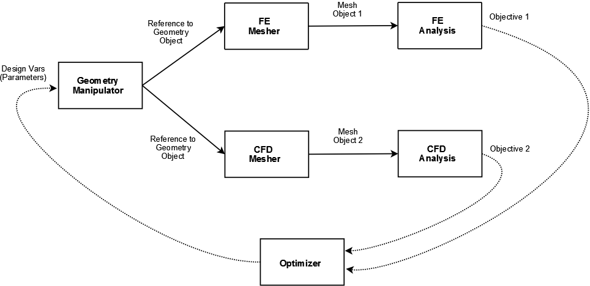

.. index:: geometry interfaces

.. _Geometry-Interfaces-in-OpenMDAO:

Geometry Interfaces in OpenMDAO (Working Document)
--------------------------------------------------

   An OpenMDAO process model that integrates :term:`CFD` & :term:`FEM` based on a common
   geometry model into an optimization problem

.. index:: pair: geometry manipulation; interface

Geometry Manipulation Interface
===============================

*OpenMDAO Level*
________________

**(Constructor)**

The constructor instantiates the geometry manipulator as an OpenMDAO
component. Several specific things have to be done after this
component is instantiated but before it can be used in a process model:

* Instantiate the Geometry object
* Connect to the modeler
* Load the geometry
* Load the feature tree
* Query for list of all available parameters and suppression states
* Create OpenMDAO variable for each parameter using the appropriate traits
* Create OpenMDAO variable for each suppressible feature

**(Setting Parameters and Suppression States)**

*Needed for requirements: Tools/Geometry/Interaction/01 and Tools/Geometry/Interaction/02*

Parameters are set the same way as any other OpenMDAO input variable. For
example, consider a cylinder with two parameters: *radius* and *height*. If we 
have a geometry manipulator called ``geo_manipulator,`` the geometry parameters
can be directly set:

.. testsetup:: parameter_interface

	from openmdao.main.api import Component, Assembly
	from openmdao.lib.api import Float, Bool, CONMINdriver
	
	class GeoMan(Component):

	    radius = Float(7.0, low=1., high=20.0, iotype='in', 
                     units='m',  desc='radius')		
	    height = Float(10.0, low=1., high=50.0, iotype='in', 
                     units='m',  desc='height')	
	    fillet1 = Bool(True, iotype='in')	
	
	    def __init__(self, directory=''):
	        """ Creates a new Vehicle Assembly object """

	        super(GeoMan, self).__init__(directory)
	
	class TLA(Assembly):
    
	    def __init__(self, directory=''):
        
	        super(TLA, self).__init__(directory)

	        # Create GeoMan component instances
        	self.add('geo_manipulator', GeoMan())

	        # Create CONMIN Optimizer instance
        	self.add('driver', CONMINdriver())

	self = TLA()
	geo_manipulator = GeoMan()

.. testcode:: parameter_interface

	geo_manipulator.radius = 5
	geo_manipulator.height = 15

More often, the geometry's parameters will be set as part of an optimization
problem, so they can be declared as design variables when an optimizer is added
to a model.
      
.. testcode:: parameter_interface

	# CONMIN Design Variables 
	self.driver.design_vars = ['geo_manipulator.radius', 
                                   'geo_manipulator.height']
				 
	self.driver.lower_bounds = [3.0, 6.5]
	self.driver.upper_bounds = [12, 25]

Here, *self* is the top level assembly that contains an optimizer, the geometry
manipulator, and some kind of process model such as the one pictured above.

The suppression of features (suppression states) can also be treated the same way
at the component level. Here, the Boolean variable *fillet1* is set to *False* to
suppress the feature fillet1.

.. testcode:: parameter_interface

	geo_manipulator.fillet1 = False

**execute()**

Regenerates model if any parameter or suppression state changes. Raises an
exception if this process breaks associativity or causes incomplete
regeneration of the model.

Note that if no parameters or suppression states change, there is no reason to 
regenerate the geometry or to invalidate any reference to this geometry object,
which would trigger the execution of any components that depend on it (meshers, 
etc.) 

Note also that if the geometry is capable of providing analytical sensitivities
to the parameters, then these would be calculated here.

**save_to_egg()**

Saves current representation of the data model, including all parameters (both
name and value), suppression states (likewise), and tags.

**load()**

Loads representation of the data model, including all parameters, suppression 
states, and tags, from a saved egg.

**tag_volume(volume_label, tag_name, tag_description)**

**tag_face(face_label, tag_name, tag_description)**

**tag_edge(edge_label, tag_name, tag_description)**

**tag_node(node_label, tag_name, tag_description)**

*Needed for the requirement: Tools/Geometry/Interaction/07*

Associates a geometric entity with some metadata. This is useful for marking
an entity for later use by an analysis tool (e.g., marking loads and boundary
conditions.) The most straightforward way to implement the tags' storage would
be to create each tag as an OpenMDAO variable, accessed via its ``tag_name``.

**(Visualization)**

The requirements call for the ability to visualize the geometry. No interface
for this has been worked out. The user must also be able to view the 
feature tree to choose parameters as design variables.

*Python Component Level*
________________________

At a lower level, the geometry manipulation component needs a set of functions
to interact with the geometry object, making the above interface possible at 
the OpenMDAO level. These functions are used in the geometry manipulator and
will not commonly be seen or used by users who build or run models.

**status = initialize(modeler)**

Performs any necessary action prior to loading a model. If the geometry is to
be loaded and run in another process (or another server), some additional
things might need to be passed. A status is returned indicating any error
that occurs.

**load_model(filename)**

Loads the geometry from *filename* into the model.

**parameters = get_parameters()**

Returns a list containing a unique label and a value for all parameters in the
model.

**suppression_states = get_suppression_states()**

Returns a list containing a unique label and a boolean for all suppression
states in the model.

**feature_tree = get_feature_tree()**

Returns a data structure containing the feature tree. The format of this data
structure is not currently known. This information can be used to give the component
user a way to "visualize" the parametric model. Note that technically the
parameters and suppression states can also be extracted from here instead of
using the given functions above.

**set_parameter(id, value)**

Sets a new value for a parameter in the model. The model must be rebuilt for the
effect of the new parameter to be realized.

**set_suppression_state(id, boolean)**

Sets a new value for a suppression state in the model. The model must be rebuilt
for the effect of the new suppression state to be realized.

**status = rebuild_model()**

Rebuilds the model based on the current parameters and suppression states. A
status is returned that indicates whether the regeneration was successful.

**terminate()**

Shuts down the geometry modeler and performs any necessary cleanup.

The Geometry Object and its Query Interface
===========================================

OpenMDAO provides query access to the geometry object at the Python component level.

*Topology Access*
_________________

*Needed for requirement: Tools/Geometry/Interaction/07*

Geometry access for query includes entity query and evaluation, traversal of 
topology, and tag query.

The following functions comprise traversal of the Boundary Representation topology.

**(point) = GetNode(vol, node)**

Returns the (x,y,z) coordinate for a node in the volume.

**(trange, nodes) = GetEdge(vol, edge)**

Returns the nodes associated with an edge in a given volume; *trange* returns the
parameterization *t* in terms of the original curve coordinate (*t*).

**(urange, nloop, loops, edges) = GetFace(vol, face)**

Returns the edges associated with a face in a given volume. *nloop* is the
number of loops, *loops* is the edge loop lengths, and *edges* contains
the edge indices and orientation.

**(nface, faces, name) = GetBoundary(vol, bound)**

Returns the faces associated with a boundary in a given volume. Also returns a
boundary name.

**(nnode, nedge, nface, nbound, name) = GetVolume(vol)**

Returns basic information for a volume, including its name and the number of nodes,
edges, faces, and boundaries that it includes.

*Mesh Generation*
_________________

*Needed for requirement: Tools/Geometry/Grid Generation/01*

**(point, d1, d2) = PointOnEdge(vol, edge, t, req_derivative)**

Returns the Cartesian coordinate of a point on an edge given the point's coordinate in
the local (*t*) parameter space used to mesh the edge. First and second
derivatives can also be returned if available using the ``req_derivative`` parameter
(``0 = no derivatives, 1 = 1st order, 2 = 2nd order``).

**(point, du, dv, duu, duv, dvv) = PointOnFace(vol, face, uv, req_derivative)**

Returns the Cartesian coordinate of a point on a face given the point's coordinate in
the local (*u,v*) parameter space used to mesh the face. First and second
derivatives can also be returned if available using the ``req_derivative`` parameter
(``0 = no derivatives, 1 = 1st order, 2 = 2nd order``.)

**(point_on_edge, t) = NearestOnEdge(vol, edge, coor, point, t_guess)**

Returns the coordinate of the point on a given edge that lies the closest to the
input point. The associated *t* parameter is also returned. Some kernels require
an initial guess in the form of a point on the edge that is nearby.

**(point_on_face, uv) = NearestOnFace(vol, face, coor, point, uv_guess)**

Returns the coordinate of the point on a given edge that lies the closest to the
input point. The associated *t* parameter is also returned. Some kernels require
an initial guess in the form of a point on the face that is nearby.

**status = InEdge(vol, edge, point)**

Returns *True* if the given point lies on the edge.

**status = InFace(vol, face, point)**

Returns *True* if the given point lies on the face.

*Measurements*
______________

*Needed for all requirements in: Tools/Geometry/Interaction/08*

**(length) = LengthOfEdge(vol, edge, t1, t2)**

Returns the arc length for an edge. Parameters *t1* and *t2* can be used to
return the length of a subsection of the edge.

**(arc_length, centroid, bounding_box) = EdgeProperties(vol, edge)**

Returns the arc length (for the full edge) and centroid coordinate for an edge in a given volume.

**(area, centroid, inertia_matrix, bounding_box) = FaceProperties(vol, face)**

Returns the area, centroid coordinate, and inertia matrix for a face in a given volume.

**(mass_properties, bounding_box) = VolumeProperties(vol)**

Returns the mass properties for a given volume. These include volume, wetted area,
center of gravity, inertia matrix, and mass.

*Planar Cuts*
_____________

*Needed for requirements in: Tools/Geometry/Interaction/10*

**(nsec, ivec, data) = VolumeSection(vol, face, type, isvec, idata)**

A basic interface would require a volume label, a set of face labels, and a vector
that defines the normal of the cutting plane. CAPRI suggests a more detailed
interface that allows a few different types of cuts.

*Tesselation*
_____________

While not spelled out directly in the requirements, it is often useful to have the
capability to generate a watertight descretized representation of the geometry
for performing sanity checks.

[Needs Functions]

The Mesh Object
===============

Use Cases
=========

.. figure:: ../images/arch-doc/top_level2.png
   :align: center

   An OpenMDAO process model that shows how multiple geometry manipulators are
   used to provide derived geometries based on the original geometry

