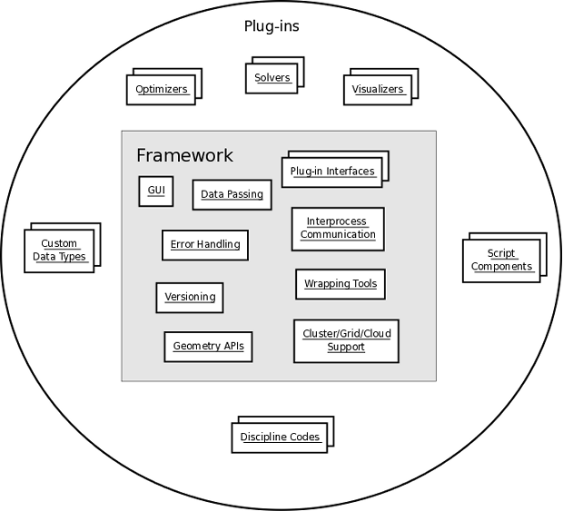

Overview
--------

.. index:: pair: diagram; top-level context
.. index:: plugins

Top-level Context Diagram
=========================

The following figure shows which pieces of the overall MDAO effort are
considered to be part of the framework infrastructure and which are considered
to be :term:`plugins` to the framework.

   Top Level Context Diagram

.. index::  layers; framework

Framework Layers
================

The framework's capabilities can be viewed as a number of layers supporting
component interactions between other components and the user. The diagram below,
`Framework Layers`_, shows a simulation consisting of three components, one of
which runs in a separate process from the main simulation. Also shown are two
user interfaces accessing the simulation: a wxPython GUI which runs in a process
separate from the main simulation server and a web browser which connects to a
web service embedded within the main simulation server.

.. _`Framework Layers`:

.. figure:: ../generated_images/Layers.png
   :align: center

   Framework Layers

.. index:: API
.. index:: simulation GUI
.. index:: wxPython
.. index:: AJAX Javascript 
.. index:: pair: distributed object; protocol 
.. index:: pair: Component; local
.. index:: pair: Component; remote

Component interactions occur via the framework's component :term:`API`. A
distributed object protocol and network layer provide communication between
components in separate processes.

For components whose calculations are performed by an external code, the
framework provides facilities for generating input files, finding a suitable
host, running the external code, parsing output files, etc.

The simulation :term:`GUI` is based on a library of user interface widgets
which are written in terms of a user interface API which the framework
translates to either wxPython calls or equivalent interactions with an AJAX
Javascript library. The simulation GUI accesses component data via the component
API, with the same code supporting local and remote components as well as
wxPython and AJAX based displays.

To provide web access, the main simulation server is configured to support
the HTTP and/or HTTPS protocols.

Care will be taken to design the framework to allow easy extension through the
addition of new component types and new data types to be passed between
components. This includes support for custom editors for each new type.

.. index:: Python; programming language
.. index:: pair: Python; module

Implementation Language
=======================

OpenMDAO will be implemented using the Python_ programming language. Plugins to
the framework will be Python modules. A Python module can be either a text file
written in pure Python code or an extension module, which is a shared library
that conforms to the Python C-API. Because Python is an interpreted language and
is not as fast as compiled languages, numerically intensive components will
typically be implemented using a compiled language, such as C, C++, or FORTRAN,
and will be wrapped as a Python extension module or wrapped using file I/O.

.. _python: http://www.python.org

.. index:: distribution; of framework
.. index:: framework; distributing
.. index:: zope

Distribution
============

The framework will be distributed as a namespace package like other large Python
projects, e.g., zope_. Parts of the framework that are decoupled and deemed
useful on their own will be installable as individual :term:`eggs` like, for
example, *zope.interface*. The framework namespace will also contain a standard
library of open source plugin components. A number of other components that are
not open source, primarily wrappers for NASA analysis codes that cannot be
released open source for various reasons, will be available as individual eggs.

The current package layout of the project is as follows:

**openmdao.main**
    the OpenMDAO framework infrastructure
    
**openmdao.lib**
    standard library of OpenMDAO plugins
    
**openmdao.recipes**
    OpenMDAO specific recipes for zc.buildout_

**openmdao.util**
    OpenMDAO utility routines for file handling, subprocess execution, etc.

**openmdao.test**
    Classes and utilities that are specific to testing various aspects
    of OpenMDAO

**openmdao.examples**
    OpenMDAO tutorial problems and other examples

.. _zope: http://wiki.zope.org/zope3/Zope3Wiki

.. _zc.buildout: http://pypi.python.org/pypi/zc.buildout

Deployment
==========

Each OpenMDAO package will be distributable as a python egg, and each package's
egg will have its own version number. Each specific version of an OpenMDAO
package will also depend on a number specific versions of third party packages,
and all of these will have to be obtained in order to assemble a complete
working application.  This is accomplished by using zc.buildout_ to construct a
python environment containing all of the necessary packages.  A buildout
configuration file will be created for each *official* OpenMDAO release, and
that configuration file will be pinned to a specific set of versioned eggs that
are all compatible with each other. 

In order to assemble a complete working version of OpenMDAO, the following
steps are performed:

    1. bootstrap a buildout using the appropriate python version, e.g.,
         ``python2.5 bootstrap.py``
    2. obtain a buildout configuration file from the OpenMDAO website, e.g.,
          ``wget http://openmdao.org/releases/1.0.3/buildout.cfg``
    3. execute the buildout using that configuration file, e.g.,
          ``bin/buildout``
    
Any needed eggs will be downloaded from the web by the buildout script,
either from the Python Package Index, from OpenMDAO's own package index, or from
some other package index or from a local download cache. Once this process is
completed, the user will have a complete version of the OpenMDAO framework.

Another possibility is to bundle all of the necessary eggs into a large archive,
either a tar file or a zip file, and the user can obtain the archive and run
the buildout as mentioned above. This option is attractive for those who have no
network access.

For Windows users, a self-extracting installer file will most likely be
provided, and this installer will perform the needed buildout steps for the
user.

Once the user has installed the framework, the next step is to build or import
some sort  of model, a configuration of plugin components that work together to
solve some sort of problem. A complex OpenMDAO model may depend upon a large
number of eggs.  Some of those eggs will be found in  the OpenMDAO standard
library, but others will not. Downloading all of those eggs from a package index
every time a new buildout is created could cause unwanted delays and waste
space, so configuring the system to avoid unnecessary copying of distributions
is important. The easiest way to do this is for users to set the
**eggs-directory** attribute in their buildout default configuration file (in
``$HOME/.buildout/default.cfg``).  After **eggs-directory** is set, all eggs needed
by any buildout run by the user will be installed in that directory, and if
a needed egg is found in that directory, it doesn't have to be downloaded.
Multiple versions of the same egg can be present in the **eggs-directory**
since all of their filenames will be unique.

