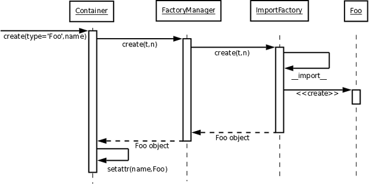
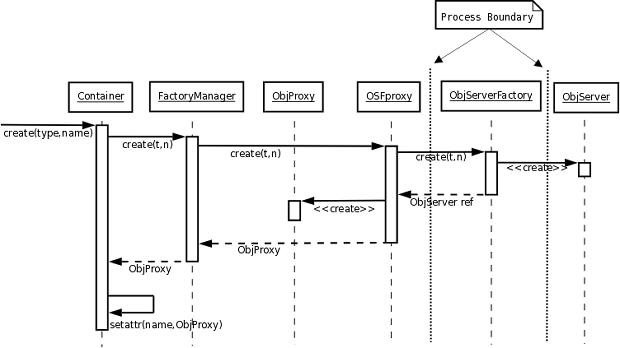
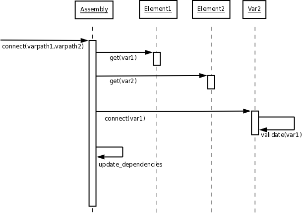
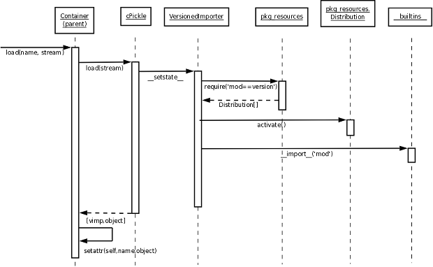
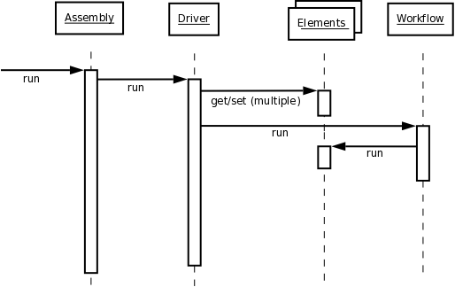
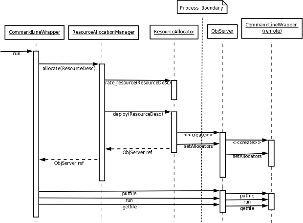
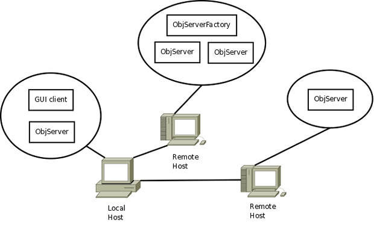

.. _Important-Processes:

Important Processes
-------------------

The following section contains sequence diagrams and some other simple diagrams
that describe some of the fundamental processes that happen within the
framework.

.. index:: Component; creation of
.. index:: FactoryManager
.. index:: Factory

Component Creation
==================

The :term:`FactoryManager` object manages the creation process for all
:term:`Component` and :term:`Container` types in the framework. The creation process
begins with a request to create a specific type, along with an optional dictionary of
attributes describing desired resources, being passed to the FactoryManager.
The resource description dictionary can include attributes that specify version,
server location, memory and disk requirements, etc. The FactoryManager then
passes the create call on to a list of Factory objects until one of them
successfully creates the object and returns a reference to it. That reference is
returned to the original caller.

.. index:: pair: Component; local
.. index:: ImportFactory

*Creation of Local Components*
______________________________

Local components can simply be imported and instantiated if the package containing
them is on the python search path.  The ``create`` function can be used to 
instantiate them if there are openmdao plugin entry points registered for them.

When a new object is requested and the module containing the requested type is
local, *and* no server or other resource description is specified, the request
is passed to the PkgResourcesFactory, which attempts to locate and load an
entry point that matches the desired type.

If the PkgResourcesFactory cannot locate the desired instance factory and
there is no version specified, then the create call is passed to the
ImportFactory, which first uses the normal Python import mechanism to import
the module and then executes the constructor for the requested type.

   
   Creation Process for Local Components

.. index:: Component; distributed
.. index:: ObjServerFactory
.. index:: ObjServer
.. index:: proxy

*Creation of Distributed Components*
____________________________________

When a request is made for a new object of a type that is not available via a local
import, either because the type cannot be located locally or because the resource
description is incompatible with the local copy, the :term:`FactoryManager` will pass
the create message, via a proxy, to the :term:`ObjServerFactory` object on the remote
server. (See the figure `Creation Process for a Distributed Component`_.) The
ObjServerFactory will spawn a separate process containing an ObjServer
that will create the requested object within its process. A proxy in the local process
will communicate with the remote object through the ObjServer. Another figure
shows a more `detailed creation process`_ for a distributed component. 

.. _`Creation Process for a Distributed Component`:

.. figure:: ../generated_images/DistribCreate2.png
   :align: center
   
   Creation Process for a Distributed Component

-----

|

.. _`detailed creation process`:

   
   Detailed Creation Process for a Distributed Component

.. index:: Components; connecting

*Connecting Components*
_______________________

Components communicate by linking output Variables of one component to input
Variables of another. (See the figure `Linking Variables`_.) At the time of connection,
the ``validate()`` function of the input :term:`Variable` object will be called to ensure
that the types of the Variables being connected are compatible. It will also
be possible at this time to create an adaptor, if available, between
incompatible Variables.  

.. _`Linking Variables`:

   Linking Variables

.. index:: cPickle
.. index:: libyaml
.. index:: pair: Model; saving
.. index:: pair: Model; loading
.. index:: Loader object
.. index:: proxy
.. index:: Model; with versioned components, saving 

Saving and Loading a Model
==========================

Because components will continue to evolve over time, component version
information needs to be saved along with any model or submodel so that the
correct component versions can be recreated when a persistent model is loaded
back into memory. Persisting a memory resident model into a stream will be done
using either cPickle or libyaml, depending upon whether the user is concerned
more with human readability or with save/load performance.

By default, cPickle and libyaml use Python's built-in import mechanism to
create the memory resident versions of their saved objects. This does not work
well in this case for a number of reasons. First of all, there may be multiple
versions of a given component available on a particular host, but the wrong
version may be present in Python's sys.path, so a simple import would give the
user the wrong version. Secondly, the desired component module may not be
available at all on the current host, and it may have to be loaded into a remote
host and communicated with using a proxy. Finally, an attempt could be made to
load a submodel containing ``Component_X`` version 2.0 into a larger memory resident
model that contains ``Component_X`` version 1.0. These two incompatible versions of
the same module cannot exist in the same process, so the loader must be able to
handle the problem during the loading process by creating ``Component_X`` version
2.0 in a separate process and communicating with it via a proxy in the local
process.

To solve these problems, a special Loader object will be serialized along with the
other objects in the model. It will be serialized (and restored) before any of the
other objects by serializing a list, e.g., [loader, obj], where *obj* is the top level
object of the model or submodel being serialized. By overriding the loader's
``__setstate__`` and ``__getstate__`` functions, the loader can collect a list of all
dependent modules and their versions at save time, and later, at load time, can
force early importing of the correct versions of all of the dependent modules before
any of the other serialized objects are loaded into memory.

When serializing a remote object via a proxy, things become more complicated.
One possibility is that the proxy object could request the serialized state of the
remote object along with its versioned module list and simply add that to the local 
stream. However, remote objects, e.g.,  :term:`CFD` components, will often have a state 
containing a large amount of data that would be cumbersome to transport across a
network. As a result, it may be easier to keep the serialized state of the remote
object on the same host as the remote object and just return the location of the 
remote serialized state so that it can be located later during a load operation.

.. figure:: ../generated_images/VersionSaveState.png
   :align: center

   Saving a Model with Versioned Components

-------

|

   Loading a Model with Versioned Components

  
.. index:: CommandLineWrapper
.. index:: ResourceAllocator
.. index:: Assembly
.. index:: Driver
.. index:: resource; allocation
.. index:: resource; descriptions               
.. index:: execution

.. _`Execution`:

Execution
=========

Each Component in the system has a ``run()`` function which handles updating of
necessary inputs, executing the Component, and updating outputs. An
:term:`Assembly` is a Component that contains other Components along with at
least one special Component called a Driver. When an Assembly runs, it runs
its top level Driver, which is always named *driver*. A :term:`Driver` is a
Component that performs some kind of iteration over a Workflow, iterating
until some condition is met. A Driver that is an optimizer, for example, would
iterate over its Workflow until it satisfies some convergence criteria or
reaches its maximum allowed number of iterations.  A CaseIterDriver, which is a
Driver that runs input cases that come from a :term:`CaseIterator`, will
iterate over its Workflow until it uses up all of the cases in the
CaseIterator. 

The following figure describes how a single Driver interacts with a Workflow
during execution.

   Execution

In the figure `External Tool Run`_ the :term:`CommandLineWrapper`, when executed,
queries the system for resources that are sufficient to run the desired external
code. Some form of resource description is used to indicate the types and
amounts of resources  that are needed. The resources could be obtained locally
or from a remote  machine, cluster, or load balancer. If the resources are
remote, the :term:`ResourceAllocator` for the remote location will return a reference
to an :term:`ObjServer` with a :term:`CommandLineWrapper` as its top level object. The 
ResourceAllocator that created the ObjServer will specify the 
ResourceAllocators that the remote CommandLineWrapper will have access to for
further resource searches. Generally, only the local ResourceAllocator will be 
available, except in the case of clusters and load balancers.

Resource allocation is required whenever the system needs to run a new process.
This occurs explicitly when a component needs to execute an external code and
implicitly when the system is evaluating components concurrently (such as when
running an optimization). Resource descriptions are represented by a dictionary
whose keys are the various types of resources required and the values have
meaning dependent on the resource. Examples of resources that might be
explicitly specified include ``number_cpus,`` ``memory``, and ``ansys``. Implicit
resources could include ``module_versions``. Batch queuing systems (such as :term:`PBS`)
have other examples of useful keys.

Explicit resource descriptions are part of a component's configuration. Implicit
resource descriptions are maintained by the system. The full resource
description is the union of the two descriptions.

Resource allocators are sent resource descriptions by the resource allocation
manager. Each allocator compares the resource description sent with their
internal list of resources. If the allocator supports every description key, it
then computes its best estimate of time-to-completion. For purposes of
evaluating the allocation decisions, allocators also return the criteria used
when computing their estimate. If the allocator is missing a key, it returns -1.
If the allocator can satisfy the resource requirements but has no estimate, it
returns zero. The allocation manager can then select the best allocator for
deployment of the new process.

.. _`External Tool Run`:

   External Tool Run
 
 
.. index:: variables; transferring between components
.. index:: assembly.connect()

Variables to be transferred between components (see the diagram `Variable
Transfers Between Components`_) are defined by the links created via
``assembly.connect()``, which is called implicitly while constructing a model. The
assembly maintains a list of all variables linked between its components.
Transfer of regular variables is handled by simply getting the value from the
source and setting the corresponding variable on the destination, after applying
any required unit conversion or other translation.

.. _`Variable Transfers Between Components`:

.. figure:: ../generated_images/AssemblyXfer.png
   :align: center

   Variable Transfers Between Components

File variables are handled by determining the absolute paths to the source and
destination files and then performing a copy. Components may specify their
directory either relative to their parent component's directory or by an
absolute path. The top level assembly's directory is set to the process' current
directory when the model is loaded.

Components request their parent assembly to do input and output variable
transfers. The request happens just before execution for inputs and just after
execution for outputs.

Subassemblies perform *passthrough* transfers (transfers from inputs to the
subassembly to the corresponding internal component inputs) and transfers from
internal component outputs to the corresponding outputs of the subassembly. This
is because the subassembly effectively hides its internal components from the
outside world.

Remote component access occurs via proxies. Operations on the proxy are
translated to the equivalent operation on the remote component. So getting
an output variable from a proxy actually requests the value of that variable
from the remote component. Similarly, setting an input on a proxy actually
sets the value on the remote component. File variables are processed in a
similar manner.

.. index:: firewalls; transfers through
.. index:: transfers; between remote components
.. index:: pull links
.. index:: push links

Firewalls introduce the need to be able to *pull* values as well as *push.* (See the
diagram `Transfer Through a Firewall`_.) This is because firewalls are typically
configured one way. A client on the inside can initiate a transaction with a server on
the outside but not vice versa. So to set an output on a server from inside the
firewall requires a *push* style of link. For an output on that server to be propagated
back requires a *pull* style of link.  The default link style is *push,* but links may
be configured to *pull* as necessary.

.. _`Transfer Through a Firewall`:

.. figure:: ../generated_images/FirewallXfer.png
   :align: center

   Transfer Through a Firewall

Transfers between remote components can be performed directly if they have
connectivity, indicated by *rpush* or *rpull* links. In this case, the parent
assembly checks the link type and then has the component proxy invoke a send or
receive operation on the remote component, with a reference to that component's
peer as an argument.

.. figure:: ../generated_images/ThirdPartyTransfer.png
   :align: center

   Third Party Transfers

.. index:: execution; remote distributed

The figure `Remote Distributed Execution`_ shows the different processes that would be
active during a typical distributed execution. On the local host, the main simulation
server process contains an :term:`ObjServer` and a GUI client that provides user access
to that server. The main simulation server communicates with a process containing an
:term:`ObjServerFactory`, which spawns ObjServer processes containing components that are
accessed remotely by the main simulation server. The final remote host contains an
ObjServer process that was started independently of an ObjServerFactory.

.. _`Remote Distributed Execution`:

   Remote Distributed Execution

.. index:: Python Package Index
.. index:: Component, publishing

.. _`Publishing-Components`:

Publishing Components
=====================

The figure below demonstrates that component developers can choose to
publish their component eggs on different servers based on how accessible they
want them to be. They can publish them to a public server, such as the 
`Python Package Index`_, where they will be accessible to anyone in the world 
with no required login or password, or they can choose to publish them to a
server running on their :term:`LAN`. The local egg server on the LAN could be configured
to require login or be open to anyone.

.. _`Python Package Index`: http://pypi.python.org/pypi

.. _`Component Publishing`:

.. figure:: ../generated_images/EggServer.png
   :align: center

   Component Publishing
   
.. seealso:: :ref:`Component-Publishing`

