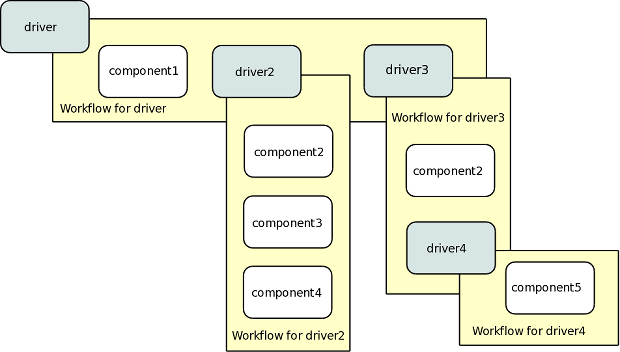
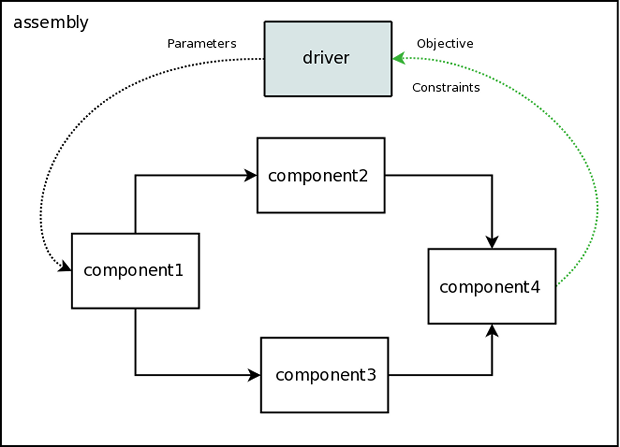
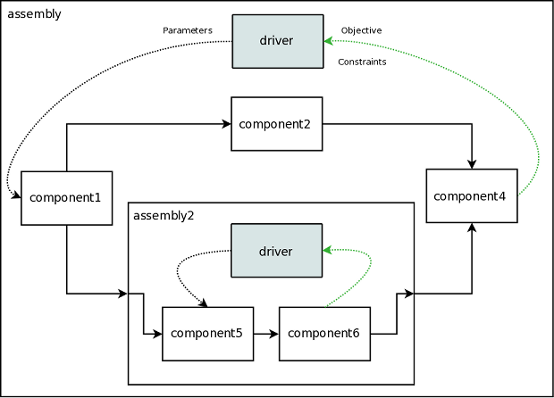

Setting up a Basic Model With Paraboloid
========================================

Working with the Paraboloid component that we built in the previous section, you now have an 
analysis tool that you can run. So how do we set up some kind of analysis with this model? 
Before you get there, we're going to discuss a few more basic concepts in the OpenMDAO framework: 
*Driver*, *Workflow*, and *Assembly*. Then we'll move on to building a simple assembly that lets you run a basic
analysis.

Driver
------
Once you have a bunch of components, you're going to want to do something with them, 
like run an optimization or a Design of Experiments. Any kind of iterative execution 
of components is controlled by a :term:`Driver`. There are a number of different kinds 
of drivers in the standard library, but you could also write your own if need be. 

.. _`workflow overview`:

Workflow
--------

When a Driver is running, it needs to know which components to execute and in what order 
to execute them. This behavior is controlled by the :term:`Workflow` class. Each driver 
has a workflow associated with it. You can think of the workflow as being responsible for 
controlling the process used to run a given analysis. 

Although in many cases a workflow contains just basic components, it can also contain 
other drivers. This allows nested iterative processes to be created. 
Nested iterations provide the flexibility needed to build 
complex optimization processes defined by MDAO architectures. 
Also, Components are allowed to show up multiple times in a single workflow
or in multiple parts of a nested workflow.  This can be used, for 
example, if you need to train a meta model in one part of a workflow 
and then optimize it in another. We often refer to collection of drivers/workflows
in a given model as an :term:`iteration hierarchy`. 

The following figure shows an example of an iteration hierarchy involving four 
different Drivers.  Note that in this example the same component, *component2*, 
appears in two different parts of the iteration hierarchy.

.. _`iteration hierarchy concept`:

   View of an Iteration Hierarchy

Each component can report its location in the iteration hierarchy by its
:term:`iteration coordinates`.  The coordinates are of the form
``<workflow execution count>-<component index in workflow>`` for each level in
the hierarchy. For example, when `component2` above is executing in the
workflow for `driver3` for the first time, its iteration coordinates would be
``1-3.1-1``. These coordinates denote the first execution of the top workflow, third
component (`driver3`), first execution of that driver's workflow, first
component in that workflow (`component2`). To have all components report their
iteration coordinates to stderr (the default):

.. testcode:: iteration_tracing

    from openmdao.util.log import enable_trace, disable_trace
    enable_trace()
   
Later, the tracing can be turned off:

.. testcode:: iteration_tracing

    disable_trace()

Assembly
--------

An :term:`Assembly` is a container for all of your components, drivers, and workflows. When an
Assembly executes, it will always look for a Driver named `driver` and  start there; then it will 
work its way down the iteration hierarchy. 

Besides being a container for all the other objects, an Assembly has two other main functions. 
It is responsible for managing all of the data connections between components in the framework. 
Whenever data needs to move from one component to another, this action is specified via the `connect`
method of the assembly. 

.. _`driver intro2`:

   View of an Assembly Showing Data Flow

An Assembly is also a special type of Component. Assemblies, like regular 
components, can have their own inputs and outputs. You can take advantage of this behavior
to construct nested models that can help simplify a complex analysis a bit. You could 
produce a model of a jet engine from a number of analysis tools, then wrap that 
up into an assembly that is used as part of an aircraft simulation. 

For example, we could replace *component3* from the figure above with an assembly
containing two other components, resulting in the following:

.. _`driver intro1`:

   View of an Assembly within an Assembly

So assemblies allow us to organize our model into a hierarchy of submodels, and within each
submodel, drivers and workflows give us a flexible way to define an iteration scheme.

Building a Basic Model
----------------------

A model is built from an assembly which contains components, drivers, and workflows. 
Each assembly has its own iteration hierarchy, with `driver` at the root, that determines
which components are run and in what order. 

.. testcode:: basic_model_1

    from openmdao.main.api import Assembly
    from openmdao.examples.simple.paraboloid import Paraboloid
    
    class BasicModel(Assembly):
        """A basic OpenMDAO Model"""
    
        def configure(self):
            """ Creates a new Assembly containing a Paraboloid component"""
    
            # Create Paraboloid component instances
            self.add('par', Paraboloid())
    
            # Add to driver's workflow
            self.driver.workflow.add('par')
    
    if __name__ == "__main__":
        a = BasicModel()
        x = 2.3
        y = 7.2
        a.par.x = x
        a.par.y = y
        a.run()
        f = a.par.f_xy
        print "Paraboloid with x = %f and y = %f has value %f" % ( x,y,f )
        

We can see here that you use the ``configure`` method to add 
things into an assembly. Within the ``configure`` method, you use the ``add`` method 
which takes a valid OpenMDAO name and a corresponding component
instance as its arguments. This adds the instance to the
OpenMDAO model using the given name. In this case then, 
the Paraboloid is accessed via ``self.paraboloid``.

Notice that we never added any kind of driver, but we still 
referenced it to add `paraboloid` to the workflow. Assemblies 
always have a default driver, which simply runs once through its 
workflow. In later tutorials, we'll show you how to replace the 
default driver with something else like an optimizer. For now though, 
our models just run once through their workflows. 

.. _`Connecting-Components`:

Connecting Components
----------------------

Of course, most of your models will have more than one component in them, 
and you're going to want to pass some information between them. In OpenMDAO 
we use `connections` for that. Lets take a look at how connections work.

.. testcode:: connect_components

    from openmdao.main.api import Assembly
    from openmdao.examples.simple.paraboloid import Paraboloid
    
    class ConnectingComponents(Assembly):
        """ Top level assembly """
    
        def configure(self):
            """ Creates a new Assembly containing a chain of Paraboloid components"""
    
            self.add("par1",Paraboloid())
            self.add("par2",Paraboloid())
            self.add("par3",Paraboloid())
    
            self.driver.workflow.add(['par1','par2','par3'])
    
            self.connect("par1.f_xy","par2.x")
            self.connect("par2.f_xy","par3.y")
    
    if __name__ == "__main__":
        a = ConnectingComponents()
    
        a.par1.x = 2.3
        a.par1.y = 7.2
        #a.par2.x = 3.4 # cannot do this because already connected to source par1.f_xy
        a.par2.y = 9.8
        a.par3.x = 1.5
        #a.par3.y = 5.2 # cannot do this because already connected to source par2.f_xy
    
        a.run()
    
        print "Paraboloid 3 has output of %f" % a.par3.f_xy
            

The `connect` method takes two arguments, the first of which must be a component
output, and the second of which must be a component input or a sequence of
component inputs. One thing to note is that only one output can
be connected to any given input.  On the other hand, it is fine to connect an output to multiple
inputs. When you connect one output to multiple inputs, we call that ``broadcasting`` the output. 

In the above code, we created a chain of three paraboloid components. However, we could have
configured them slightly differently so that the output of the first paraboloid gets broadcast
to the inputs for the next two. 

.. testcode:: broadcast_components

    from openmdao.main.api import Assembly
    from openmdao.examples.simple.paraboloid import Paraboloid
    
    class ConnectingComponentsUsingBroadcast(Assembly):
    
        """ Top level assembly """
    
        def configure(self):
            """ Creates a new Assembly containing a chain of Paraboloid components"""
    
            self.add("par1",Paraboloid())
            self.add("par2",Paraboloid())
            self.add("par3",Paraboloid())
    
            self.driver.workflow.add(['par1','par2','par3'])
    
            self.connect("par1.f_xy",["par2.x","par3.y"])
            # equivalent to
            #self.connect("par1.f_xy","par2.x")
            #self.connect("par1.f_xy","par3.y")
    
    
    if __name__ == "__main__":
        a = ConnectingComponentsUsingBroadcast()
    
        a.par1.x = 2.3
        a.par1.y = 7.2
        #a.par2.x = 3.4 # cannot do this because already connected to source par1.f_xy
        a.par2.y = 9.8
        a.par3.x = 1.5
        #a.par3.y = 5.2 # cannot do this because already connected to source par1.f_xy
    
        a.run()
    
        print "Paraboloid 3 has output of %f" % a.par3.f_xy
            
            
You can broadcast the output two ways. The above code shows them both. The first way 
is just to issue two separate connections. Notice that both connection calls have ``par1.f_xy``
as their source. The second way provides a shortcut, where you make one connect call, but specify
a list of inputs to connect two. The two methods result in the exact same result, so use whichever 
one you prefer. 

One last note: A variable is not required to be connected to anything. Typically 
components will have numerous inputs, and many of these will contain values
that are set by the user or are perfectly fine at their defaults. That's fine; you 
only need to issue connections when you want to link up multiple codes. 

Variables and Assemblies
------------------------

Variables can be added directly to an assembly and used to *promote* internal variables,
making them visible to components outside of the assembly. A convenience
function called ``create_passthrough`` creates a variable in the assembly and
connects it to an internal component variable in one step.

Consider a similar assembly as shown above, except that we want to promote the
remaining unconnected variables to the assembly boundary so that they can be
linked at that level.

.. testcode:: passthroughs

    from openmdao.main.api import Assembly, set_as_top
    from openmdao.examples.simple.paraboloid import Paraboloid
    
    class ConnectingComponentsUsingPassthroughs(Assembly):
        """ Top level assembly """
    
        def configure(self):
            """ Creates a new Assembly containing a Paraboloid and an optimizer"""
    
            self.add("par1",Paraboloid())
            self.add("par2",Paraboloid())
    
            self.connect("par1.f_xy","par2.x")
    
            self.driver.workflow.add(['par1','par2'])
    
            self.create_passthrough('par1.x', 'par1_x')
            self.create_passthrough('par1.y', 'par1_y')
            self.create_passthrough('par2.y', 'par2_y')
            self.create_passthrough('par2.f_xy', 'par2_f_xy')
    
    
    
    if __name__ == "__main__":
        a = ConnectingComponentsUsingPassthroughs()
    
        #set using assembly passthrough names
        a.par1_x = 8.2
        a.par1_y = 5.3
        #a.par2.x = 1.2 # cannot do because already connected to par1.f_xy
        #self.par2.y = 7.0  #cannot do this because it is passed thru to assembly level
        a.par2_y = 9.9
    
        a.run()
    
        #getting var value with assembly passthrough name
        print "passthrough value and direct value should be same", a.par2_y, a.par2.y
    
        #use passthrough to get output of par2
        print "output of par2 = ", a.par2_f_xy

The ``create_passthrough`` function creates a variable in the assembly. This new variable has
the same name, iotype, default value, units, description, and range characteristics as the
original variable on the component that you're passing through. If you would like to present a different interface
external to the assembly (perhaps you would like different units), then a passthrough
cannot be used. Instead, the desired variables must be manually created and
connected. Most of the time passthroughs are sufficient.

Next we'll move on to our tutorial for setting up a basic optimization, still using the same Paraboloid component 
that we built for this one. 
