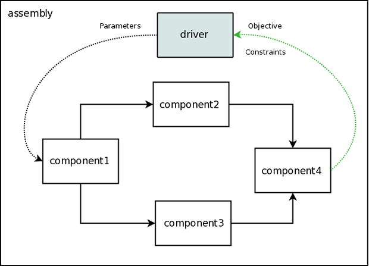

.. index:: MDAO
.. index:: OpenMDAO
.. index:: Component
.. index:: Workflow
.. index:: Assembly

.. _Introduction-to-the-OpenMDAO-Framework:

Overview of the OpenMDAO Framework
======================================

MDAO stands for `Multidisciplinary Design Analysis and Optimization`. OpenMDAO is an
open source framework for analyzing and solving MDAO problems. In OpenMDAO, a
problem is represented by a system of objects called components. Before you start 
looking over all of our tutorials, it might help you to understand the fundamental 
structure of the framework. There are four main classes that you will work with: 
:term:`Component`, :term:`Driver`, :term:`Workflow`, :term:`Assembly`

.. _`component overview`:

Component
---------
A :term:`Component` is responsible for taking its input values and mapping them 
to a set of output values. This mapping can be done a number of ways. You could 
write a component entirely in Python, or you could wrap some external analysis code
that you are already using. 

Once you have a set of components you can connect the inputs and outputs of 
one component to those of other components, allowing data to be passed between them.

The following figure gives a conceptual view of what a simple Component might
look like. This Component has two inputs (*a, b*) and one output (*c*). The
calculation that it performs is to add the two inputs to produce the output.

.. _`Conceptual-View-of-a-Simple-Component`:

.. figure:: Component.png
   :align: center
   :alt: The component is represented by a box with 2 inputs entering from the left and an output leaving at the right; calculation is performed inside the component.

   Conceptual View of a Simple Component

Components within OpenMDAO can be as simple or complex as necessary.
The inputs and outputs to a Component are a kind of :term:`Variable`. 
There are different kinds of variables available in OpenMDAO, such as Float, Int, or Array. 

.. seealso:: :ref:`Variables`

When you connect two variables together, they need be compatible. You can't, for instance, connect 
a String to a Float. Float variables have a special property that allows them to have physical units
specified. The framework will automatically convert between compatible units when they are
connected, and it will prevent you from connecting incompatible units. A more complete description
of connections is given :ref:`below <Connecting-Components>`.

.. seealso:: :ref:`units`

.. _`driver overview`:

Driver
------
Once you have a bunch of components, you're going to want to do something with them, 
like run an optimization or a Design of Experiments. Any kind of iterative execution 
of components is controlled by a :term:`Driver`. There are a number of different kinds 
of drivers in the standard library, but you could also write your own if need be. 

.. _`workflow overview`:

Workflow
--------

When a Driver is running, it needs to know which components to execute and in what order 
to execute them. This behavior is controlled by the :term:`Workflow` class. Each driver 
has a workflow associated with it. You can think of the workflow as being responsible for 
controlling the process used to run a given analysis. 

Although in many cases a workflow contains just basic components, it can also contain 
other drivers. This allows nested iterative processes to be created. 
Nested iterations provide the flexibility needed to build 
complex optimization processes defined by MDAO architectures. 
Also, Components are allowed to show up multiple times in a single workflow
or in multiple parts of a nested workflow.  can be used, for 
example, if you need to train a meta model in one part of a workflow 
and then optimize it in another. We often refer to collection of drivers/workflows
in a given model as an :term:`iteration hierarchy`. 

The following figure shows an example of an iteration hierarchy involving four 
different Drivers.  Note that in this example the same component, *component2*, 
appears in two different workflows.

.. _`iteration hierarchy concept`:

.. figure:: IterationHierarchy.png
   :align: center
   :alt: Figure shows workflows for each of 4 drivers; the workflows contain a total of 5 components

   View of an Iteration Hierarchy

.. _`assembly overview`:  

Assembly 
--------

An :term:`Assembly` is a container for all of your components, drivers, and workflows. When an
Assembly executes, it will always look for a Driver named `driver` and  start there, then work its
way down the iteration hierarchy. 

Besides being a container for all the other objects, an Assembly has two other main functions. 
It is responsible for managing all of the data connections between components in the framework. 
Whenever data needs to move from one component to another, this action is specified via the `connect`
method of the assembly. 

.. _`driver intro2`:

   View of an Assembly Showing Data Flow

   
An Assembly itself is also a special type of Component. Assemblies, like regular 
components, can have their own inputs and outputs. You can take advantage of this behavior
to construct nested models that can help simplify a complex analysis a bit. You could 
produce a model of a jet engine from a number of analysis tools, then wrap that 
up into an assembly that is used as part of an aircraft simulation. 

For example, we could replace *component3* from the figure above with an assembly
containing two other components, resulting in the following:

.. _`driver intro1`:

.. figure:: Intro-Driver1.png
   :align: center
   :alt: Refer to caption

   View of an Assembly within an Assembly

So assemblies allow us to organize our model into a hierarchy of submodels, and within each
submodel, drivers and workflows give us a flexible way to define an iteration scheme.

That's pretty much it for the basic structure of OpenMDAO. There is a lot more to deal with,
but we'll introduce the rest via a series of tutorials in the following sections. 

Building a Simulation Model
---------------------------

A *model* is a hierarchical collection of components with an assembly at its root. 
The root assembly is also called the *top level assembly.* 
Executing the top level assembly executes the entire model.

Consider the top level assembly that was created for the 
:ref:`simple tutorial problem <A-Simple-Tutorial-Problem>`.

.. testcode:: simple_model_Unconstrained_pieces

    from openmdao.main.api import Assembly
    from openmdao.lib.drivers.api import CONMINdriver
    from openmdao.examples.simple.paraboloid import Paraboloid

    class OptimizationUnconstrained(Assembly):
        """Unconstrained optimization of the Paraboloid with CONMIN."""
    
        def configure(self):
            """ Creates a new Assembly containing a Paraboloid and an optimizer"""
        
            # Create CONMIN Optimizer instance
            self.add('driver', CONMINdriver())
        
            # Create Paraboloid component instances
            self.add('paraboloid', Paraboloid())
    
            # Add to driver's workflow
            self.driver.workflow.add('paraboloid')
        

We can see here that components that comprise the top level of this model are
declared in the ``configure`` function. 

The ``add`` method takes a valid OpenMDAO name and a corresponding component
instance as its arguments. This function call adds the instance to the
OpenMDAO model hierarchy using the given name. In this case then, the CONMIN
driver is accessible anywhere in this assembly via ``self.driver``. Likewise,
the Paraboloid is accessed via ``self.paraboloid``.

A Component can also be removed from an Assembly using ``remove``.

.. _`Connecting-Components`:

.. _`connection-overview`: 

Connecting Components
----------------------

Consider once again the top level assembly that was created for the 
:ref:`simple tutorial <A-Simple-Tutorial-Problem>`. We would like to create a few
instances of the ``Paraboloid`` function and connect them together in series.

.. testcode:: connect_components

    from openmdao.main.api import Assembly
    from openmdao.examples.simple.paraboloid import Paraboloid

    class ConnectingComponents(Assembly):
        """ Top level assembly for optimizing a vehicle. """
    
        def configure(self):
            """ Creates a new Assembly containing a Paraboloid and an optimizer"""
        
            self.add("par1",Paraboloid())
            self.add("par2",Paraboloid())
            self.add("par3",Paraboloid())
        
            self.connect("par1.f_xy","par2.x")
            self.connect("par2.f_xy","par3.y")

Components are connected by using the ``connect`` function built into the
assembly. ``Connect`` takes two arguments, the first of which must be a component
output, and the second of which must be a component input or a sequence of
component inputs. These are expressed
using their locations in the OpenMDAO model hierarchy with respect to the scope
of their parent assembly. Additionally, only one output can
be connected to any input.  On the other hand, it is fine to connect an output to multiple
inputs. The violation of any of these rules raises an exception.

A variable is not required to be connected to anything. Typical 
components will have numerous inputs, and many of these will contain values
that are set by the user or are perfectly fine at their defaults.

Variables can be added to an assembly and used to *promote* internal variables,
making them visible to components outside of the assembly. There is a convenience
function called ``create_passthrough`` that creates a variable in the assembly and
connects it to an internal component variable in one step.

Consider a similar assembly as shown above, except that we want to promote the
remaining unconnected variables to the assembly boundary so that they can be
linked at that level.

.. testcode:: passthroughs

    from openmdao.main.api import Assembly, set_as_top
    from openmdao.examples.simple.paraboloid import Paraboloid

    class ConnectingComponents(Assembly):
        """ Top level assembly for optimizing a vehicle. """
    
        def configure(self):
            """ Creates a new Assembly containing a Paraboloid and an optimizer"""
        
            self.add("par1",Paraboloid())
            self.add("par2",Paraboloid())
        
            self.connect("par1.f_xy","par2.x")
        
            self.create_passthrough('par1.x')
            self.create_passthrough('par1.y')
            self.create_passthrough('par2.y')
            self.create_passthrough('par2.f_xy')

The ``create_passthrough`` function creates a variable on the assembly. This new variable has
the same name, iotype, default value, units, description, and range characteristics as the
original variable on the subcomponent. If you would like to present a different interface
external to the assembly (perhaps you would like different units), then a passthrough
cannot be used. Instead, the desired variables must be manually created and
connected. You can find a more detailed example of this in the :ref:`complex tutorial
<A-More-Complex-Tutorial-Problem>`. Most of the time passthroughs are sufficient.

Assemblies also include a way to break variable connections. The ``disconnect``
function can be called to break the connection between an input and an output
or to break all connections to an input or output.

    >>> from openmdao.examples.enginedesign.vehicle import Vehicle
    >>> from openmdao.main.api import set_as_top
    >>> my_car = set_as_top(Vehicle())
    >>>
    >>> # Disconnect all connections to tire_circumference (total:2)
    >>> my_car.disconnect('tire_circumference')
    >>>
    >>> # Disconnect a specific connection
    >>> my_car.disconnect('velocity','transmission.velocity')

You probably won't need to use ``disconnect`` very often. However, some components may
need to reconfigure their connections during runtime, so it is available.

.. _Files-and-Directories:

Interacting with Files and Directories
---------------------------------------

Many components will need to read from and write to files during model execution. For example, a
component might need to generate input files for and parse output files from an external
application. When writing  components such as these, it is important to understand how objects in
OpenMDAO interact with the file system.

The top assembly in the OpenMDAO model hierarchy contains the root path. This path is not known
until after the assembly is instantiated. All components that are part of an assembly with a valid
absolute directory have the same absolute directory.

You can change the absolute path of the working directory for any
component on instantiation by setting the *directory* attribute in the
``__init__`` function. For example, given the simple optimization model, we can specify
a new working directory for the Paraboloid component when it is instantiated.

.. testcode:: simple_model_component_directory

    from openmdao.main.api import Assembly
    from openmdao.lib.drivers.api import CONMINdriver
    from openmdao.examples.simple.paraboloid import Paraboloid

    class OptimizationUnconstrained(Assembly):
        """Unconstrained optimization of the Paraboloid with CONMIN."""
    
        def configure(self):
            """ Creates a new Assembly containing a Paraboloid and an optimizer"""
        
            # Create Paraboloid component instances
            self.add('paraboloid', Paraboloid(directory='folder/subfolder'))

Notice that this is a relative path. **All components in the model hierarchy
must operate in a directory that is a sub-directory of the top level
assembly's absolute path.** If you attempt to give a component an absolute path
that is not a descendant of the top assembly's absolute path, OpenMDAO will terminate
with an exception. If two components need to operate in directories
disparate from the top path in the hierarchy (e.g., one component in the model
needs to run on a scratch disc), then this can be accomplished by using
multiprocessing, wherein each process has its own top level.

