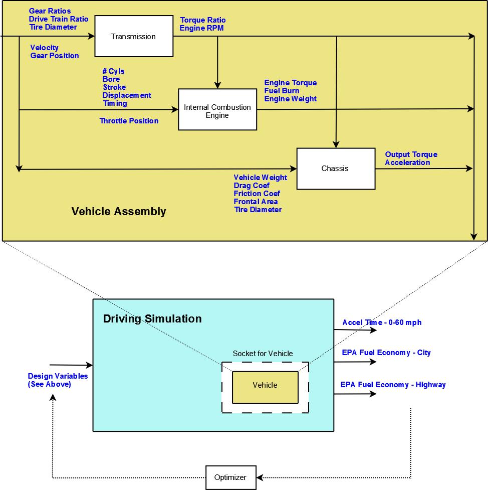

.. index:: tutorial problem

Problem Overview
==================

This tutorial covers some of the more advanced capabilities of OpenMDAO. You should read and understand
the :ref:`simple tutorial problem <A-Simple-Tutorial-Problem>` before starting this one.

The objective of this tutorial problem is to design an automobile that performs "well" as measured
by these three metrics: 

- Time to accelerate from rest to 60 mph
- Fuel economy as measured by the EPA highway driving test
- Fuel economy as measured by the EPA city driving test

We will be designing a conventional automobile with a gasoline-fueled internal
combustion engine and a 5-speed manual transmission. Our scope is preliminary
conceptual design, so we need to choose simulation models with a compact set
of design inputs and a quick execution time to allow exploration of the design
space via multiple executions. An existing vehicle simulation was not
available in the desired form, so we developed one based on physical first
principles. The mathematical model for the engine came from open literature.

To simulate these performance metrics, we need a model of the
vehicle's power-train, including the engine, the transmission, and the rear
differential. We also need the equations of motion for driving the vehicle. A
logical way to divide the vehicle model is to break it into component models
matching each of these subsystems: engine, transmission, and chassis (which
includes the rear differential ratio). In a typical problem, each of these
component models will be a separate implementation, possibly with different
authors or vendors. The design variables for each subsystem are detailed
below.

The engine, transmission, and chassis subsystems of a vehicle are each
described by some kind of mathematical model that depends on a set of design
variables (e.g., compression ratio.) There are also three  simulation
variables: throttle position, gear, and velocity. These variables are
independent of any design and are used during simulation while the vehicle
model is being "driven" to determine the metrics. There are also a couple of
internal inputs, such as RPM and Power, that are provided by other components
in the vehicle. These inter-dependencies define the connection order for
vehicle components in terms of the Data Flow: Transmission -> Engine ->
Chassis.

.. _`process-model`:

The full process model is shown below.

   
   Process Model for Tutorial Problem

The process model includes a driving simulation component, which performs the
simulations and calculates the performance metrics. A typical problem would be
to close an optimization loop around the vehicle model, driving one or more
design variables to minimize the 0-60 acceleration time and maximize the
EPA city and highway mileage.

The Transmission Model
--------------------------

The transmission model must perform two tasks:

1. Provide a transformation from engine output torque to torque at the wheels
2. Calculate the engine RPM

The transmission modeled here is a 5-speed manual. Shifting occurs
instantaneously when the simulation input *CurrentGear* is given a new value.
When the clutch is engaged, the wheel rotation and the engine rotation are
directly linked via the current gear ratio and the differential ratio, so the
engine RPM can be calculated given the velocity. However, this direct linkage
would cause the engine RPM to go to zero as the vehicle stops, so the clutch
partially disengages for low speed operation (i.e., where the engine speed
would drop below 1000 RPM) and sets the engine speed to 1000 RPM. This only
occurs when the transmission is in first gear.

**Transmission - Design Variables:**

======================  ===========================================  ======
Variable                Description                                  Units
======================  ===========================================  ======
``ratio1``              Gear ratio in first gear
----------------------  -------------------------------------------  ------
``ratio2``              Gear ratio in second gear
----------------------  -------------------------------------------  ------
``ratio3``              Gear ratio in third gear
----------------------  -------------------------------------------  ------
``ratio4``              Gear ratio in fourth gear
----------------------  -------------------------------------------  ------
``ratio5``              Gear ratio in fifth gear
----------------------  -------------------------------------------  ------
``final_drive_ratio``   Gear ratio for vehicle's differential
----------------------  -------------------------------------------  ------
``tire_circumference``  Circumference of the tire                    inch
======================  ===========================================  ======

|

**Transmission - Simulation Inputs:**

=================     ===========================================  ======
Variable              Description                                  Units
=================     ===========================================  ======
``current_gear``      Current gear position
-----------------     -------------------------------------------  ------
``velocity``          Current vehicle velocity                     m/s
=================     ===========================================  ======

|

**Transmission - Outputs:**

=================  ===========================================  ======
Variable           Description                                  Units
=================  ===========================================  ======
``torque_ratio``   Ratio of transmission output power to power 
                   at the wheel
-----------------  -------------------------------------------  ------
``RPM``            Engine rotational speed			rpm
=================  ===========================================  ======

  
The Engine Model
------------------

The engine model must provide two pieces of information:

1. Torque at engine output
2. Fuel burn under current load

We used a model published in a master's thesis by S. Sitthiracha (`1`_). It is
a physics-based model of the Otto cycle in a 4-stroke spark-ignition internal
combustion engine. This model allows the construction of a parametrized engine
model with 10 design inputs covering the engine mechanical design (cylinder
bore, stroke, connecting rod length, and compression ratio); intake valve
design (diameter and lift); and the cycle timing (for both intake and spark).
In the thesis, the model is implemented in Simulink and simulated using data
from a family of Mercedes-Benz engines designed in 1969. The model includes
the effects of burn duration, heat loss through the cylinder wall, losses due
to friction and charge heating, and intake orifice flow. Some of these effects
were derived from empirical data and are essentially valid over an engine
speed ranging from 1000 RPM to 6000 RPM.

Sitthiracha's model also includes the fuel type as a design variable. This
introduces a half dozen parameters that are dependent on the fuel chemistry.
To keep our model simple, we set these parameters to values appropriate for
gasoline and did not provide them as design inputs for the engine model.
However, it would not be difficult to modify the component code so any of
these could be used as design variables.

Sitthiracha's model contained a couple of errors in the equations, and a couple
of factors needed to be adjusted to obtain good results. His model also assumed
wide-open throttle, so the effect of a throttle was modeled as an additional
restriction on the intake flow into the cylinder. For simulation, relating the
throttle position to an actual physical foot position is not important. All that
is needed is a continuum of throttle settings between closed and wide open. This
model assumes that closed is 1% of open, but the simulation currently drives it
using a minimum of 7%, which gives a more realistic performance.

The design variables in this problem allow for some significant modification to
the engine design. This strongly affects the engine weight, so we need to estimate
this. A report by Shikida (`2`_) contains some empirical data taken from a
sampling of engines present in the Japanese market in 2000. This data maps engine
displacement and weight vs power. Displacement is essentially a measurement of the
engine size and can be calculated from the design parameters, so the engine model
uses a linear fit between engine weight and displacement to estimate the engine
weight and provide it as an output.

**Engine - Design Variables:**

=================  ===========================================  ========
**Variable**       **Description**            			**Units**
=================  ===========================================  ========
``stroke``         Length of compression zone in cylinder       mm
-----------------  -------------------------------------------  --------
``bore``           Bore (cylinder diameter)                     mm
-----------------  -------------------------------------------  --------
``conrod``         Connecting rod length                        mm
-----------------  -------------------------------------------  --------
``comp_ratio``     Volumetric ratio of compression            
-----------------  -------------------------------------------  --------
``spark_angle``    Spark angle with respect to top dead center  deg
-----------------  -------------------------------------------  --------
``n_cyl``          Number of Cylinders    
-----------------  -------------------------------------------  --------
``IVO``            Intake valve open before top dead center     deg
-----------------  -------------------------------------------  --------
``IVC``            Intake valve close after bottom dead center  deg
-----------------  -------------------------------------------  --------
``L_v``            Maximum valve lift                           mm
-----------------  -------------------------------------------  --------
``D_v``            Intake valve diameter                        mm
=================  ===========================================  ========

|

**Engine - Simulation Inputs:**

=================  ===========================================  ======
Variable           Description                                  Units
=================  ===========================================  ======
RPM		   Engine rotational speed (1000-6000)          rpm
-----------------  -------------------------------------------  ------
throttle           Throttle position                
=================  ===========================================  ======

|

**Engine - Outputs:**

=================  ===========================================  ======
Variable           Description                                  Units
=================  ===========================================  ======
``power``          Power produced by engine                     kW
-----------------  -------------------------------------------  ------
``torque``         Torque produced by engine                    N*m
-----------------  -------------------------------------------  ------
``fuel_burn``      Fuel burn rate                               l/sec
-----------------  -------------------------------------------  ------
``engine_weight``  Engine weight estimate                       kg
=================  ===========================================  ======

**References:**

_`1`. Sitthiracha, Sitthichok, "An Analytical Model of Spark Ignition Engine for Performance Prediction,"
Master's Thesis, King Mongkut's Institute of Technology North Bangkok, 2006.

_`2`. Shikida, Takasuke, Yoshikatsu Nakamura, Tamio Nakakubo, and Hiroyuki Kawase, "Development of the High
Speed 2ZZ-GE Engine," SAE World Congress, March 6-9 2000, SAE 2000-01-0671.

  
The Chassis Model
-------------------

The chassis model must provide the vehicle acceleration given the torque
produced by the engine and scaled by the transmission. The equation used for
the model is the sum of the forces acting on the vehicle in the forward
direction. These forces include both the rolling friction associated with the
tires and the vehicle drag which is proportional to the square of velocity.

**Chassis - Design Variables:**

=================  ===========================================  ======
**Variable**       **Description**                              **Units**
=================  ===========================================  ======
``mass_vehicle``   Vehicle mass                                 kg
-----------------  -------------------------------------------  ------
``Cf``             Rolling friction coefficient            
-----------------  -------------------------------------------  ------
``Cd``             Drag coefficient            
-----------------  -------------------------------------------  ------
``area``           Front profile area                           m*m
=================  ===========================================  ======

|

**Chassis - Simulation Inputs:**

======================  ===========================================  ======
**Variable**            **Description**                              **Units**
======================  ===========================================  ======
``mass_engine``         Engine mass estimate                         kg
----------------------  -------------------------------------------  ------
``velocity``            Current vehicle velocity                     m/s
----------------------  -------------------------------------------  ------
``torque_ratio``        Ratio of transmission output power to power 
                        at the wheel
----------------------  -------------------------------------------  ------
``tire_circumference``  Circumference of the tire                    m
======================  ===========================================  ======

|

**Chassis - Outputs:**

=================  ===========================================  ======
Variable           Description                                  Units
=================  ===========================================  ======
acceleration       Vehicle instantaneous acceleration           m/(s*s)
=================  ===========================================  ======

|

Simulating the Acceleration Test (0-60)
------------------------------------------

.. todo:  I am hiding this quote by using the todo directive without the last colon. When more humor is
   ready to be injected, these lines can be deleted and the quote will show up.

	"I saw this in a movie about a bus that had to **speed** around a city, keeping its **speed** over fifty and if its **speed** dropped, it would explode! I think it was called ... *The Bus That Couldn't Slow Down.*" 
						-- Homer Simpson

The procedure for simulating the maximum acceleration is straightforward. The vehicle is commanded at
wide open throttle, and the resulting acceleration is integrated until the velocity reaches 60 mph. A time
step of 0.1 seconds is used for simulation, which is small enough that a simple (and efficient) trapezoidal
integration was adequate. Gears are shifted at the red line, which is the 6000 RPM limit of the engine model.

Shifting at the red line is not always optimal, though it is optimal for the default
engine given here. The optimal shifting RPMs are dependent on the engine's torque curve as well as the gear
ratios, so creating a generalized yet more optimal shifting procedure would be more numerically intensive. It
would also be possible to use the shift points as variables and let an optimizer solve for their
locations.

Simulating the EPA Mileage Tests
--------------------------------

The EPA mileage tests give an estimate of the fuel consumed while driving a pre-determined
velocity profile that represents a particular class of driving, the two most well-known of
which represent typical city driving and highway driving. These tests aren't actually
performed on the open road but are instead done in the EPA testing garage with the tires on
rollers and a hose connected to the exhaust pipe to measure the composition of the
exhaust gases. The test still uses a driver who must follow a velocity profile given on a
computer screen. The actual velocity profiles are available on the EPA website as follows:

.. _`EPA City Driving Profile`:

.. figure:: ../images/user-guide/EPA-city.gif
   :align: center
   :alt: line graph showing EPA city driving profile

   EPA City Driving Profile

.. _`EPA Highway Driving Profile`:

.. figure:: ../images/user-guide/EPA-highway.gif
   :align: center
   :alt: line graph showing EPA highway driving profile 

   EPA Highway Driving Profile

To simulate these tests, the vehicle model must follow the EPA velocity profiles. That is, the time
history of the gear and throttle position must be found that allows the vehicle to follow these profiles. The
fuel consumed is captured over the profile so that the mileage estimate can be calculated. This can be
summarized by the following procedure:

1. Determine acceleration required to reach next velocity point
2. Determine correct gear
3. Solve for throttle position that matches the required acceleration
4. For that gear and throttle setting, calculate fuel burn

The trickiest part of the entire simulation is determining the right gear. The simulation has to test the
acceleration at min and max throttle to determine if the required acceleration is possible in that gear. The
simulation also has to make sure the engine RPM lies within its min and max values. For low speed (under
10 mph), the transmission is always set to first gear.

Once the gear is determined, a bisection method is used to find the throttle position that matches the
required acceleration within a small tolerance. This solution method converges quickly, especially
when applied over a linear range of the torque curve. However, the EPA profiles are long, with many calculation
points, so simulating these driving profiles consumes much more CPU time than the acceleration test.

.. index:: Component

Components and Variables
==========================

In the previous section, three component models were outlined that together form a vehicle model that can simulate
performance. These models have all been implemented as OpenMDAO components written in Python. This
section will examine these components.

The following instructions will help you locate the directory containing the pieces
needed for the model.

If you have downloaded the latest release version from the website, the files you need should be
here:

::

  openmdao-X.X.X/lib/python2.6/site-packages/openmdao.examples.enginedesign-X.X.X-######.egg/openmdao/examples/enginedesign

``X.X.X`` is the current OpenMDAO version, and ``######`` is a string that
contains the Python version and the operating system description. This path will 
vary depending on your system and version, but there will be only one
*enginedesign* egg.

If you are a developer and have a branch from the source repository, the files you need will be
here:

::

  examples/openmdao.examples.enginedesign/openmdao/examples/enginedesign

The three engine models have been implemented in ``transmission.py, engine.py,`` and ``chassis.py``. It will
be useful to browse these files as you learn some of the basic concepts in this tutorial.

**Building a Python Component**

The first thing we will do is create an OpenMDAO Component called *Transmission.* You may recall
that a Component contains inputs and outputs and provides a method to calculate its outputs
from its inputs. We must create the variables that define these inputs and outputs.

.. testcode:: Code2

    from openmdao.main.api import Component, convert_units
    from openmdao.lib.datatypes.api import Float, Int, Enum

    
    class Transmission(Component):
        """ A simple transmission model."""
    
        ratio1 = Float(3.54, iotype='in', 
                       desc='Gear ratio in First Gear')
        ratio2 = Float(2.13, iotype='in', 
                       desc='Gear ratio in Second Gear')
        ratio3 = Float(1.36, iotype='in', 
                       desc='Gear ratio in Third Gear')
        ratio4 = Float(1.03, iotype='in', 
                       desc='Gear ratio in Fourth Gear')
        ratio5 = Float(0.72, iotype='in', 
                       desc='Gear ratio in Fifth Gear')
        final_drive_ratio = Float(2.8, iotype='in', 
                                  desc='Final Drive Ratio')
        tire_circ = Float(75.0, iotype='in', units='inch', 
                          desc='Circumference of tire (inches)')

        current_gear = Enum(0, (0,1,2,3,4,5), iotype='in', desc='Current Gear',
                            aliases=('N','1st','2nd','3rd','4th','5th'))
        velocity = Float(0., iotype='in', units='mi/h',
                         desc='Current Velocity of Vehicle')

        RPM = Float(1000., iotype='out', units='rpm',
                    desc='Engine RPM')        
        torque_ratio = Float(0., iotype='out',
                             desc='Ratio of output torque to engine torque')    

The *Int* and *Float* variable types were introduced in previous tutorials, but some new parameters are
used here, including the *Enum* type.

.. index:: PEP 8

In this example, we use more complicated names for our variables, so we should cover what makes a
valid variable name. Variables are also Python variables, so they must follow Python's standard
naming convention. They must begin with a letter or underscore and should consist of only
alphanumeric characters and the underscore. Keep in mind that a leading underscore is generally used
for private data or functions. **Spaces cannot be used in a variable name.** Generally, we've tried
to follow the `PEP 8 <http://www.python.org/dev/peps/pep-0008/>`_  standard for component instance 
names as well as Python variable names. PEP 8 prescribes the use of lower case names with words
separated by underscores.

The required parameter *iotype*, the optional parameter *desc*, and the
default value are covered in previous tutorials. The parameter *units* is
introduced here and is used in a few of the variables in Transmission. OpenMDAO contains a Units
module that allows for unit checking and conversion between outputs and
inputs of components. Our units definitions are based on the those given in
Scientific Python and can be found in :ref:`units`. If an output and an
input of the same unit class (e.g., length) are connected in the framework, the value is automatically
converted as it is passed from the output to the input. If an output and an input
of a different unit class are connected (e.g., length and time), an exception is
raised. A variable with no units defined can be connected to a variable with units.

**Only the Float and Array types perform automatic unit conversion and checking.**

The Transmission component uses an enumerated list to define the valid gear positions:

.. testcode:: Code2

        current_gear = Enum(0, (0,1,2,3,4,5), iotype='in', desc='Current Gear',
                        aliases=('N','1st','2nd','3rd','4th','5th'))

An *enumeration* is a discrete variable that has a finite number of valid states. This
transmission is a 5-speed manual, so the valid states are gears 1 through 5 and neutral. The
constructor begins with a default value and a :term:`tuple` containing all of the valid states. Sometimes
it is beneficial to add as the *alias* parameter a second tuple containing a more descriptive
tag. In this case, the alias *'N'* tells you that a value of 0 sets the gear to Neutral. The
Enum is not type-restrictive. You could use the alias strings as the values, though typically
the values are needed because you have some code that operates on an integer number. In our
case, our simulation will upshift by adding 1 to the current gear, which it couldn't do to
the strings. For more information, see :ref:`Enums`.

Finally, ``transmission.py`` needs to do something when it is executed. This code
illustrates how to use the input and output variables to perform a calculation. 

.. testcode:: Code2

    def execute(self):
        """ The 5-speed manual transmission is simulated by determining the
            torque output and engine RPM via the gear ratios.
            """
    
        ratios = [0.0, self.ratio1, self.ratio2, self.ratio3, self.ratio4,
                  self.ratio5]
        
        gear = self.current_gear
        differential = self.final_drive_ratio
        tire_circ = self.tire_circ
        velocity = convert_units(self.velocity, 'mi/h', 'inch/min')
        
        self.RPM = (ratios[gear]*differential*velocity)/(tire_circ)
        self.torque_ratio = ratios[gear]*differential
        
        # At low speeds, hold engine speed at 1000 RPM and partially engage the clutch
        if self.RPM < 1000.0 and self.current_gear == 1 :
            self.RPM = 1000.0
    
You may recall that inputs and outputs are attributes of our component, so they are accessed using
``self.variablename``. It is generally a good idea to create a local copy of a variable for doing calculations in the component for improved efficiency and ease of reading.

We have also imported and used the ``convert_units`` function to convert the value of velocity
from units of mi/h to units of inch/min. This makes the units consistent for the calculation
of RPM. The ``convert_units`` function provides unit conversion capability for your internal
variables. We could also change the definition of the velocity Float, specifying the units
as ``'inch/min'=``, and then the ``convert_units`` call would not be needed.

The transmission model is now complete; the next section will show how to interact with
it in the Python shell. The engine and chassis are created in a similar manner. However, the 
engine's speed is valid only within a range 1000 to 6000 RPM. OpenMDAO's Float and Int
variables allow you to specify an optional maximum and minimum value.

.. testcode:: Code2

    RPM = Float(1000.0, low=1000., high=6000., iotype='in', 
                     units='rpm',  desc='Engine RPM')

The *low* and *high* arguments are used to specify a minimum and maximum value
for RPM. If the engine's RPM is set to a value outside of these limits, an
exception will be raised. OpenMDAO execution is terminated unless this
exception is caught elsewhere and some kind of recovery behavior is defined.

Executing a Component in the Python Shell
==========================================

The Python implementations of the three component models (``engine.py,
transmission.py, chassis.py``) should all make sense now. This section will
demonstrate how to instantiate and use these components in the Python shell.
Make sure that you have activated your Python environment before running the
Python interpreter so that you can access OpenMDAO and the example problems.

Please enter the Python shell. Create an instance of the Engine class by typing the following:

    >>> from openmdao.examples.enginedesign.engine import Engine
    >>> my_engine = Engine()

The object ``my_engine`` is an engine model with default values for all of its inputs. We can interact
with the inputs and outputs by direct inspection:

    >>> my_engine.bore
    82.0

Let's change the engine speed from its default value (1000 RPM) to 2500 RPM.

    >>> my_engine.RPM = 2500
    >>> my_engine.RPM
    2500.0

The value of the engine RPM is now 2500. Let's see what happens if we try to
set the RPM to something invalid.

    >>> my_engine.RPM = "Hello"
    Traceback (most recent call last):
        ...
    TraitError: Trait 'RPM' must be a float in the range [1000.0, 6000.0] but a value of Hello <type 'str'> was specified.
    
The value ``"Hello"`` is invalid because RPM expects a value of type Float. Now,
let's try setting the engine speed to a value that exceeds the maximum, which
is 6000 RPM.

    >>> my_engine.RPM = 7500
    Traceback (most recent call last):
        ...
    TraitError: Trait 'RPM' must be a float in the range [1000.0, 6000.0] but a value of 7500 <type 'int'> was specified.

OpenMDAO raises an exception indicating that the maximum value for RPM has
been violated. This exception can be handled to provide some logical response
to this situation. Now, run the engine and examine the power and torque at
2500 RPM.

    >>> my_engine.run()
    >>> my_engine.torque
    203.963228...
    >>> my_engine.power
    53.3974483...
    
You run a component by calling the ``run`` method. If you recall, you define an ``execute`` method when you
create a component. The ``run`` method calls ``execute`` but also does some other things. Always run your
component with ``run.``

.. index:: Assembly

Assemblies
=============

Now that we've created Python components representing the three vehicle
subsystems, we need to connect them so that they can be executed in sequence.
Recall that an OpenMDAO component that contains a collection of other
components is called an :term:`Assembly`. The Assembly allows a set of
components to be linked together by connecting their inputs and outputs. The
data connections define an execution order based on their dependencies, i.e.,
components that are upstream in the data flow will be executed prior to those
downstream so that input data to a component will always be valid with respect
to the other parts of the workflow. A component will not execute if its inputs
have not changed since its last execution. An Assembly contains a
Driver called *driver* that controls iterations over the workflow.

For the vehicle simulation, a Vehicle assembly is needed that can sequentially execute the Transmission,
Engine, and Chassis components.

.. testcode:: Code5

    from openmdao.main.api import Assembly
    from openmdao.lib.datatypes.api import Float

    from openmdao.examples.enginedesign.transmission import Transmission
    from openmdao.examples.enginedesign.chassis import Chassis
    from openmdao.examples.enginedesign.engine_wrap_c import Engine
    
    class Vehicle(Assembly):
        """ Vehicle assembly. """

        def __init__(self):
            """ Creates a new Vehicle Assembly object """

            super(Vehicle, self).__init__()

            # Create component instances
        
            self.add('transmission', Transmission())
            self.add('engine', Engine())
            self.add('chassis', Chassis())

            # Set up the workflow
            self.driver.workflow.add(['transmission', 'engine', 'chassis'])

The Engine, Transmission, and Chassis components all need to be imported so
their instances can be created; they can be added to the assembly
with ``add``. Please notice that an assembly inherits from Assembly
instead of from Component. When the instances of the Transmission, Engine, and
Chassis are created, their members and data are internally accessible using
*self* plus the instance name, e.g., ``self.transmission``.

Now that the components are instantiated in the assembly, they need to be hooked up:

.. testsetup:: Code5

	# Note: This block of code does not display in the documentation.

	from openmdao.main.api import Assembly
	from openmdao.lib.datatypes.api import Float

	from openmdao.examples.enginedesign.engine import Engine
	from openmdao.examples.enginedesign.transmission import Transmission
	from openmdao.examples.enginedesign.chassis import Chassis
	
	class Vehicle(Assembly):
	    """ Vehicle assembly. """
    
	    def __init__(self):
	        """ Creates a new Vehicle Assembly object """

	        super(Vehicle, self).__init__()

	        # Create component instances
        
	        self.add('transmission', Transmission())
	        self.add('engine', Engine())
	        self.add('chassis', Chassis())

	        # Set up the workflow
	        self.driver.workflow.add(['transmission', 'engine', 'chassis'])

	# This is a trick to get around a limitation in Sphinx's doctest, where
	# there is no way to preserve the indentation level between code
	# blocks, and the concept of "self" is not defined when we fall out of
	# the class scope.
	
	self = Vehicle()

.. testcode:: Code5

        self.connect('transmission.RPM','engine.RPM')
        self.connect('transmission.torque_ratio','chassis.torque_ratio')
        self.connect('engine.torque','chassis.engine_torque')
        self.connect('engine.engine_weight','chassis.mass_engine')

The first argument in the call to ``self.connect`` is the output variable of
the source component instance, and the second argument is the input variable
of the target component instance. For a connection to be valid, the units of
the output and input must be of the same unit class (e.g., length, speed, etc.) If
they differ within the same class (e.g., meters vs. inches), then the value is
converted from the source unit to the target unit before setting the value at
the input. If the classes are incompatible (e.g., meters vs. seconds), then an
exception is raised during execution.

The Vehicle assembly also has inputs and outputs, and it can be hooked up to
other components and included in other assemblies once its variables
are defined. We would like to promote all of the design and simulation
variables from the Engine, Transmission, and Chassis components to the input
and output of the Vehicle assembly. OpenMDAO includes a shortcut for doing
this quickly by creating *passthroughs*:

.. testcode:: Code5

	self.create_passthrough('engine.stroke')
	self.create_passthrough('engine.bore')
	# ...
	# ...
	self.create_passthrough('transmission.ratio1')
	self.create_passthrough('transmission.ratio2')
	# ...
	# ...
	self.create_passthrough('chassis.mass_vehicle')
	self.create_passthrough('chassis.Cf')

The ``create_passthrough`` function creates an identical variable
in the assembly and connects it to the corresponding component variable. So now, all of the
design variables are available as variables in any simulation that includes an instance
of the vehicle model.

However, the engine tutorial throws you a curve ball here. The Engine
and Chassis components are defined with SI units, but the Transmission
component is defined with English units. We have two inputs -- the tire
circumference and the vehicle velocity -- that are each used by two components
with different units. The ``create_passthrough`` function creates an exact copy
of the variable, so we cannot use it here. Instead, we must connect them manually
by declaring variables in our assembly.

.. testcode:: Code5

	class Vehicle(Assembly):
	    """ Vehicle assembly. """
    
	    tire_circumference = Float(75.0, iotype='in', units='inch', 
                                desc='Circumference of tire (inches)')
    
	    velocity = Float(75.0, iotype='in', units='mi/h', 
                       desc='Vehicle velocity needed to determine engine RPM (mi/h)')

Now these inputs are available to connect to the components, so we connect them manually.

.. testsetup:: Code7b

	from openmdao.main.api import Assembly
	from openmdao.lib.datatypes.api import Float, Int

	from openmdao.examples.enginedesign.engine import Engine
	from openmdao.examples.enginedesign.transmission import Transmission
	from openmdao.examples.enginedesign.chassis import Chassis
	
	class Vehicle(Assembly):
	    """ Vehicle assembly. """
    
	    tire_circumference = Float(75.0, iotype='in', units='inch', 
                                    desc='Circumference of tire (inches)')
    
	    velocity = Float(75.0, iotype='in', units='mi/h', 
                desc='Vehicle velocity needed to determine engine RPM (mi/h)')
    
	    def __init__(self):
	        """ Creates a new Vehicle Assembly object. """
        
	        super(Vehicle, self).__init__()

	        # Create component instances
        
	        self.add('transmission', Transmission())
	        self.add('engine', Engine())
	        self.add('chassis', Chassis())

	        # Set up the workflow
	        self.driver.workflow.add(['transmission', 'engine', 'chassis'])

	self = Vehicle()

.. testcode:: Code7b

        self.connect('velocity', 'chassis.velocity')
        self.connect('velocity', 'transmission.velocity')
        self.connect('tire_circumference', 'chassis.tire_circ')
        self.connect('tire_circumference', 'transmission.tire_circ')

This ensures that the units for these inputs to the Vehicle are converted properly for use in the Chassis and 
Transmission components. While this might seem redundant, it demonstrates
a way that Assemblies can be used to define a more consistent external interface.

Executing the Vehicle Assembly
==============================

We can manipulate the Vehicle Assembly in the Python shell just like we did with the engine component
above. As inputs, the Vehicle takes a commanded velocity, throttle position, a gear position, and
a set of vehicle design parameters, and outputs the vehicle's instantaneous acceleration and rate of fuel
burn. 

	>>> from openmdao.examples.enginedesign.vehicle import Vehicle
	>>> my_car = Vehicle()
	>>> my_car.velocity = 25.0
	>>> my_car.current_gear = 3
	>>> my_car.throttle = .5
	>>> my_car.run()
	>>> my_car.acceleration
	1.1086409681...
	>>> my_car.fuel_burn
	0.0027991856...

When we run the Vehicle, we are performing a simple multidisciplinary analysis via the
OpenMDAO framework. Try setting the simulation variables to other values, including ones that should
trigger an exception. (One way to do this is to command a high velocity in first gear, which should
violate the maximum RPM that the engine allows.)

.. index:: F2PY

.. _Wrapping-an-External-Module-Using-F2PY:

Wrapping an External Module Using F2PY
=======================================

As the most computationally intensive component, the engine model in ``engine.py`` is the main performance
bottleneck during repeated execution. As an interpreted language, Python is not the ideal choice for
implementing a numerical algorithm, particularly where performance is important. The performance of
the engine model can be improved by implementing it in a compiled language like C or Fortran.

Python was designed to be smoothly integrated with other languages, in
particular, C and related languages Fortran and C++. This is important for a
scripting language, where code execution is generally slower and it is often
necessary to use a compiled language like C to implement computationally
intensive functions. To complement Python's native integration ability, the
Python community has developed some excellent tools, such as `F2PY
<http://cens.ioc.ee/projects/f2py2e/>`_ (Fortran to Python) and :term:`SWIG`
(Simplified Wrapper and Interface Generator), that simplify the process of
building the wrapper for a code. As the name implies, F2PY is a Python utility
that takes a Fortran source code file and compiles and generates a wrapped
object callable from Python. More information on getting your codes to run in
Python can be found in the :ref:`Plugin-Developer-Guide`.

The main algorithm in ``engine.py`` was rewritten in C as ``engine.C``. A
wrapped shared object of ``engine.C`` was created using F2Py; this tool can
also be used to generate wrappers for C code provided that the signature file
``engine.pyf`` is manually created. The file ``engine.pyf`` defines the
interface for the functions found in ``engine.C``. The C code has been placed
in a function called ``RunEngineCycle`` which can be imported and takes the design and simulation
variables as inputs.

The intent of this exercise is not to teach you how to write a signature file. More
information on this topic can be found in :ref:`Creating-an-Extension-with-F2PY`, while more
extensive details can be found in the `F2PY Users Guide <http://cens.ioc.ee/projects/f2py2e/usersguide/index.html>`_.

The shared object can be generated using the existing signature file and C code by issuing the
following command:

::

    f2py engineC.pyf engineC.c -c

A new Python component named ``engine_wrap_c.py`` was created to replace
``engine.py``. This component contains the same inputs and outputs as
``engine.py``, but replaces the engine internal calculations with a call to
the C function ``RunEngineCycle``. We can import and use this function just like
any Python function:

.. _Code8: 

.. literalinclude:: ../../examples/openmdao.examples.enginedesign/openmdao/examples/enginedesign/engine_wrap_c.py
   :start-after: engine_weight = 0.0
   :end-before: # end engine.py
   :language: python

Notice that the return values are stored in lists, so a scalar value is accessed by grabbing the first
element (element zero). This is not needed for return values from Fortran codes compiled with
F2PY (arguments in Fortran functions are passed by reference), but it is needed for C codes.

You can compare the execution time to see how much faster the C code runs on your hardware. To
run the original Python implementation of Engine, type:

::

    python engine.py
    
Note the elapsed time, which is printed after the engine completes its run. Now type:
    
::

    python engine_wrap_c.py
    
How much faster is the C implementation? We found it to be almost 10 times as fast as the Python
implementation. Both of these scripts run the engine 50 times before termination.

.. index:: Sockets and Interfaces
.. index:: Interfaces
.. _Sockets-and-Interfaces:

Sockets and Interfaces
========================

Now that we have a functional and quick Vehicle assembly, we need to complete
the problem by providing a way to simulate the acceleration and the EPA fuel
economy estimates. The acceleration test requires an integration in time to
match a specified velocity profile. In other words, the vehicle assembly needs 
to be executed at each time step to produce the instantaneous acceleration.
The EPA fuel economy tests are a bit more tricky, though they also require an integration in
time. For these tests, the vehicle assembly must be executed while varying the throttle and
gear position inputs to match a desired acceleration for the integration
segment. Both of these solution procedures were implemented in a Python component
called *DrivingSim.*  This component is found in ``driving_sim.py.``

The component DrivingSim contains an ``execute`` function that performs the time
integration on a Vehicle component. It is not important to understand the
execution details. The basic premise is that this simulation component needs
to contain another OpenMDAO component. This can be done by using a *Socket.*

In OpenMDAO, Sockets are placeholders where different objects can be
substituted to modify the function of a Component. They are used by
Components, Assemblies, and Drivers to provide a place where users can insert
objects that satisfy a certain interface and whose purpose is to perform some
additional calculations. For example, a component calculating the drag on a
wing might provide a Socket to allow the user to insert a custom flap drag
calculation. In the example problem section, a Design Of Experiment (DOE)
Driver uses a Socket to allow different types of DOE to be used.

A Socket can be declared in the DrivingSim class using an *Instance* trait:

.. testcode:: Socket_to_me

    from openmdao.main.api import Assembly
    from openmdao.lib.datatypes.api import Float, Instance

    from openmdao.examples.enginedesign.vehicle import Vehicle
	
    class DrivingSim(Assembly):
	""" Simulation of vehicle performance.
	    
	# Simulation inputs
	end_speed          # Simulation ending speed in mph.
	timestep           # Simulation time step in sec.
	    
	# Outputs
	accel_time        # Time to reach 60 mph from start
	EPA_city          # Fuel economy for city driving
	EPA_highway       # Fuel economy for highway driving
	"""    
	
	# Simulation Parameters
	end_speed = Float(60.0, iotype='in', units='m/h',
			       desc='Simulation final speed')
	timestep = Float(0.1, iotype='in', units='s', 
			      desc='Simulation time step size')
	
	# Sockets
	vehicle = Instance(Vehicle, allow_none=False, 
			   desc='Socket for a Vehicle')
	
	# Outputs
	accel_time = Float(0., iotype='out', units='s', 
				desc='Time to reach end_speed starting from rest')
	EPA_city = Float(0., iotype='out', units='mi/galUS', 
			      desc='EPA Fuel economy - City')
	EPA_highway = Float(0., iotype='out', units='mi/galUS', 
				 desc='EPA Fuel economy - Highway')

An *Instance* is a special type of variable that holds an object. The
first argument in the constructor is the type of object that is allowed to fit in
the socket, which in this case is a Vehicle. The attribute ``allow_none`` can be used
to declare whether filling the socket is optional. For our driving simulation to
run, the socket must be filled with a Vehicle. Notice that a socket is neither an
input or an output, so it does not require an iotype, and it is not available for
passing data in the framework.

.. todo:: We eventually will need to create our own Instance class in order to define the inputs/outputs of an interface.

**DrivingSim - Outputs:**

=================  ===========================================  ========
Variable	   Description			                Units
=================  ===========================================  ========
``accel_time``	   Time for vehicle to accelerate to 60 mph 	s
		   from a stop.
-----------------  -------------------------------------------  --------
``EPA_city``       Fuel economy estimate based on EPA city	mi/galUS
		   driving profile
-----------------  -------------------------------------------  --------
``EPA_highway``    Fuel economy estimate based on EPA highway	mi/galUS
		   driving profile
=================  ===========================================  ========

Ultimately, we want the DrivingSim component to be executed in a model with an optimizer,
which can set the Vehicle's design variables to try and minimize the simulation outputs. To
accomplish this, we need to promote the design variables to become inputs to the DrivingSim.
We did this in the Vehicle assembly by creating a passthrough for each design variable. The
passthrough feature is only available in an assembly, so the DrivingSim component must
inherit from Assembly instead of Component.

Because the socket won't be filled until after the DrivingSim is instantiated, the design
variables cannot be promoted in the ``initialization`` function. Instead, we have to
create a ``callback`` function named ``_xxx_changed`` where ``xxx`` is the name of our socket. For our
case, the socket is named *vehicle,* so the function should be named ``_vehicle_changed``. This
``callback`` function is executed whenever a Vehicle instance is assigned to this socket.

.. testcode:: Socket_to_me

    def _vehicle_changed(self, oldvehicle, newvehicle):
        """Callback whenever a new Vehicle is added to the DrivingSim
        """
        
        self.driver.workflow.add(newvehicle.name)
        
        # set up interface to the framework  
        # pylint: disable-msg=E1101

        # Promoted From Vehicle -> Engine
        self.create_passthrough('vehicle.stroke')
        self.create_passthrough('vehicle.bore')
	# ...

In ``_vehicle_changed``, we create passthroughs to all of our design variables. We
also add the vehicle to the DrivingSim's workflow to tell the
assembly to run the Vehicle whenever it executes.

The final piece of the puzzle is to learn how to insert a vehicle into our socket. This
is done with the ``add`` command.
	
    >>> from openmdao.examples.enginedesign.driving_sim import DrivingSim
    >>> my_sim = DrivingSim()
    >>> from openmdao.examples.enginedesign.vehicle import Vehicle
    >>> my_sim.add('vehicle', Vehicle())
    <openmdao.examples.enginedesign.vehicle.Vehicle object at ...>
    >>> my_sim.run()
    >>> my_sim.accel_time
    7.49...
    >>> my_sim.EPA_city
    24.80...
    >>> my_sim.EPA_highway
    33.45...
    
.. note::
    Be careful not to simply assign the new vehicle instance to the socket (i.e., ``my_sim.vehicle =
    Vehicle()``). If you do this, vital framework connections will be bypassed, and the component will not execute properly.

Setting up an Optimization Problem
==================================

The final step is to create a top level Assembly that defines the problem
using DrivingSim and the vehicle assembly.

The first problem we would like to solve is a single objective optimization problem
where we adjust some of the design variables to minimize the 0-60 acceleration time.
The chosen design variables are the *bore* and *spark angle.* The optimal value of the
first variable should be quite intuitive (i.e., larger bore means faster acceleration),
but the second variable cannot be optimized by mere inspection. 

The optimization will be handled by the gradient optimizer CONMIN.

In ``engine_optimization.py``, we define the class EngineOptimization and
create an instance of CONMINdriver and DrivingSim, which are added to the
driver's workflow. We also create a Vehicle instance and insert it into the
socket in DrivingSim:

.. testcode:: Code9

    from openmdao.main.api import Assembly
    from openmdao.lib.drivers.api import CONMINdriver

    from openmdao.examples.enginedesign.driving_sim import DrivingSim

    class EngineOptimization(Assembly):
        """Optimization of a Vehicle."""
    
        def __init__(self):
            """ Creates a new Assembly containing a DrivingSim and an optimizer"""
        
            super(EngineOptimization, self).__init__()

            # Create CONMIN Optimizer instance
            self.add('driver', CONMINdriver())
        
            # Create DrivingSim instance
            self.add('driving_sim', Driving_Sim())

            # Add Vehicle instance to vehicle socket
            self.driving_sim.vehicle = Vehicle()
        
            # add DrivingSim to workflow
            self.driver.workflow.add('driving_sim')

            # CONMIN Flags
            self.driver.iprint = 1
            self.driver.itmax = 30
        
            # CONMIN Objective 
            self.driver.add_objective('driving_sim.accel_time')
        
            # CONMIN Design Variables 
            self.add_parameters([('driving_sim.spark_angle', -50., 10.),
                                 ('driving_sim.bore', 65., 100.)])

Recall that the *iprint* flag enables or disables the printing of diagnostics
internal to CONMIN, while the *itmax* parameter specifies the maximum number
of iterations for the optimization loop.

The optimization objective is to minimize the 0-60 mph acceleration time by
adjusting the design variables *bore* and *spark angle*. In the previous
examples, we learned to use strings to build mathematical expressions with
variables that point to locations in the data hierarchy, so here we do it once
again with our objectives and design variables. We could submit the design
variables one at a time using multiple calls to ``add_parameter``, but we can
also submit them with a single call to ``add_parameters`` by placing the information
for each design variable in a list of tuples. The information we need for each
variable is the expression that points to it (e.g., ``driving_sim.spark_angle``), and
the minimum and maximum value of the search range for that variable (e.g., ``-.50, 10``).
Once again, if the min and max aren't specified, the low and high attributes
from the OpenMDAO variable will be used if they have been specified.

We are now ready to solve an optimization problem.

Solving the Optimization Problem
==================================

First, let's run the problem inside the Python shell. Load and create an instance of the
EngineOptimization class, setting it as the top assembly.

.. doctest:: optimization_fun

    >>> from openmdao.examples.enginedesign.engine_optimization import EngineOptimization
    >>> from openmdao.main.api import set_as_top
    >>> prob = EngineOptimization()
    >>> set_as_top(prob)
    <openmdao.examples.enginedesign.engine_optimization.EngineOptimization object at ...>

The problem is set up like above. We could run it now, but first let's find out how
the current design performs. We can do this by running the Vehicle component once
and printing the value of the acceleration time.

.. doctest:: optimization_fun

    >>> prob.driving_sim.run()
    >>> prob.driving_sim.accel_time
    7.499...
    >>> prob.driving_sim.bore
    82.0
    >>> prob.driving_sim.spark_angle
    -37.0
    
The unit for this variable is seconds, so the default vehicle design can
accelerate from 0 to 60 mph in seven and a half seconds. We've also printed
the values of the two decision variables which will be changed by the
optimizer. Next, we solve the optimization problem. This may take a while
but should be finished in less than a minute.

:: 

	>>> prob.run()
	...
	>>> prob.driving_sim.accel_time
	5.399...
	>>> prob.driving_sim.bore
	100.0
	>>> prob.driving_sim.spark_angle
	-28.965...

The optimizer has found a new solution that has a much faster acceleration
time: 5.4 seconds vs 7.5. This was accomplished by increasing the bore to
its maximum value, which makes the engine larger, and by optimizing the
spark timing.

You can run this same problem at the command prompt by typing:

::

    python engine_optimization.py

This script prints out a little more information than we've shown in this
example. See the :ref:`simple tutorial problem <A-Simple-Tutorial-Problem>` 
for a refresher on how to set up a component to run at the command prompt.

String expressions can be used to pose more sophisticated objective expressions
that are functions of multiple simulation variables. For example, if you want
to maximize ``accel_time`` instead of minimizing it, you can do this by negating
the expression:

.. testsetup:: Code10

	from openmdao.main.api import Assembly
	from openmdao.lib.drivers.api import CONMINdriver

	from openmdao.examples.enginedesign.driving_sim import DrivingSim

	class EngineOptimization(Assembly):
	    """Optimization of a Vehicle."""
    
	    def __init__(self):
        	""" Creates a new Assembly containing a SimVehicle and an optimizer"""
        
	        super(EngineOptimization, self).__init__()

	        # Create DrivingSim instance
        	self.add('driving_sim', DrivingSim())

	        # Create CONMIN Optimizer instance
        	self.add('driver', CONMINdriver())

	        # add DrivingSim to workflow
	        self.driver.workflow.add('driving_sim')

	self = EngineOptimization()
	
.. testcode:: Code10

	        # CONMIN Objective = Maximize accel_time 
        	self.driver.add_objective('-driving_sim.accel_time')
		
You can build up more complicated expressions from any number of OpenMDAO variables using Python's mathematical syntax:

.. testcode:: Code10

	        # CONMIN Objective = Maximize weighted sum of EPA city and highway fuel economy 
        	self.driver.add_objective('-(.93*driving_sim.EPA_city + 1.07*driving_sim.EPA_highway)')

Here we used a weighted sum of the EPA city and highway fuel economy estimates as the objective in a maximization problem.
Try solving the same optimization problem using this objective.

::

	>>> from openmdao.examples.enginedesign.engine_optimization import EngineOptimization
	>>> from openmdao.main.api import set_as_top
	>>> prob = EngineOptimization()
	>>> set_as_top(prob)
	<openmdao.examples.enginedesign.engine_optimization.EngineOptimization object at 0xe80c3b0>
	>>> prob.driver.add_objective('-(.93*driving_sim.EPA_city + 1.07*driving_sim.EPA_highway)')
	>>> prob.driving_sim.spark_angle
	-37.0
	>>> prob.driving_sim.bore
	82.0
	>>> prob.driving_sim.run()
	>>> prob.driving_sim.EPA_city
	24.807...
	>>> prob.driving_sim.EPA_highway
	33.454...
	>>> prob.run()
	>>> prob.driving_sim.spark_angle
	-7.225...
	>>> prob.driving_sim.bore
	90.581...
	>>> prob.driving_sim.EPA_city
	25.713...
	>>> prob.driving_sim.EPA_highway
	38.696...

You have now completed the more complex tutorial problem.
