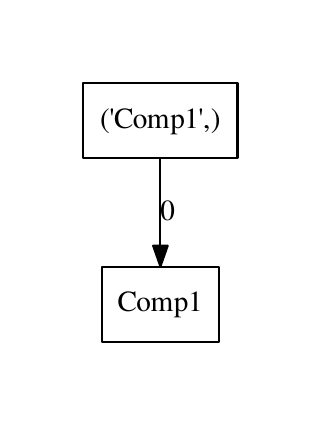
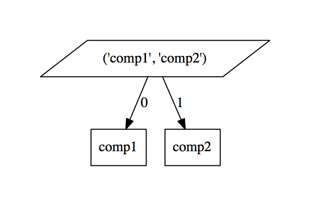
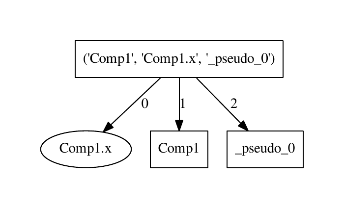
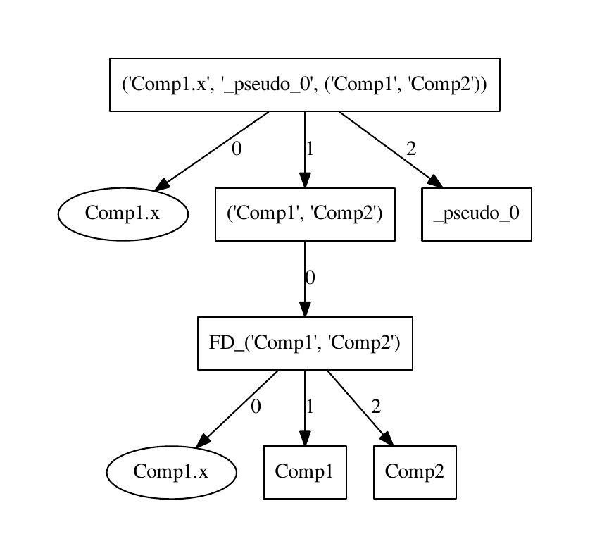
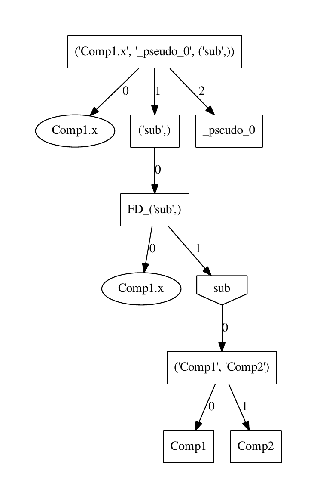
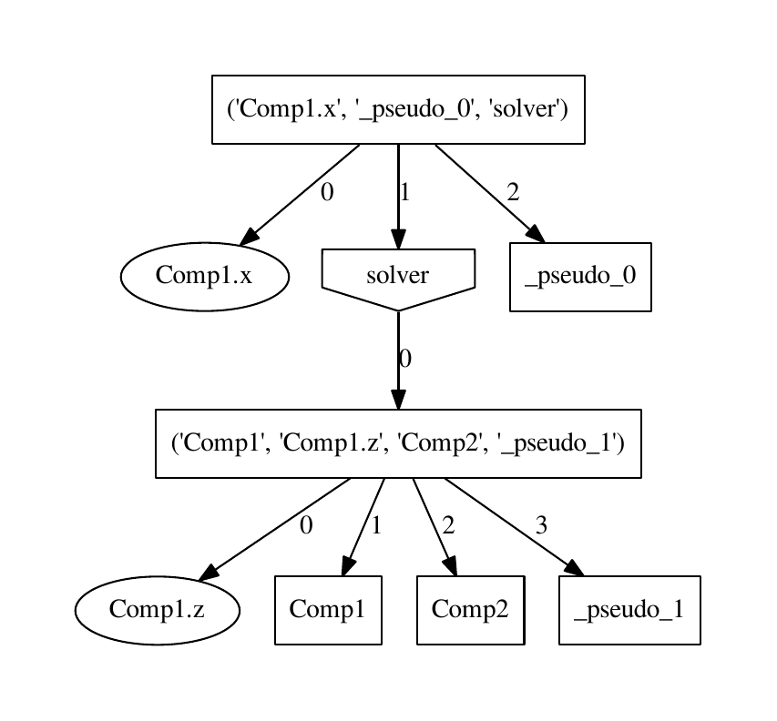
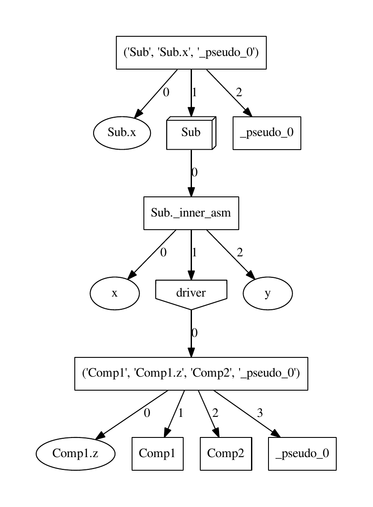

Systems Dictionary
---------------------

The following is a short summary of the types of systems that OpenMDAO will
create from your model when the System Hierarchy is formed. All systems
inherit from the System base class.

SimpleSystem
+++++++++++++

In the System Hierarchy, the `SimpleSystem` is analogous to a Component
in the iteration hierarchy. Every component in your model will have a
corresponding SimpleSystem in the system tree, provided that it's in a
workflow. A SimpleSystem can execute the component and can provide the matrix
vector product of the Jacobian for the derivative solver. Both implicit and
explicit components are represented by SimpleSystems.

SerialSystem
+++++++++++++

A `SerialSystem` is a container system for one or more systems. As
the name implies, the component subsystems are executed sequentially in the
order directed by the connectivity graph. Every driver's workflow has a
corresponding SerialSystem in the system hierarchy. These SerialSystems can
execute the workflow and can calculate a gradient between any inputs and
outputs of the component systems contained therein.

.. _`SimpleSystem`:

The figure above shows the System Hierarchy for a model that has a single
Component in the Driver's workflow. The topmost system is the SerialSystem for
the base driver's workflow. This system contains a SimpleSystem as a
subsystem. The SimpleSystem represents the component ``'Comp1'``.

ParallelSystem
+++++++++++++++

Conversely, a `ParallelSystem` is a container system for two or more
systems that will be executed in parallel. These systems are used only when
OpenMDAO is run under MPI.

.. _`ParallelSystem`:

For this figure, we've built a model with two components that are not
connected; hence they can be executed in parallel. In this case, we have two
SimpleSystems that will be run in parallel, but in more complicated models
groups of components that execute in parallel with each other are
encapsulated in SerialSystems.

Both SerialSystem and ParallelSystem inherit from `CompoundSystem,` which
is never used in the System Hierarchy.

ParamSystem
++++++++++++

If your model contains a driver that allows Parameters, then the system
hierarchy will contain a `ParamSystem` for each parameter. This system does
little calculation and is mostly a bookkeeping entity.

.. _`ParamSystem`:

This figure shows a model where a component named ``'Comp1'``, with input
``'Comp1.x'`` and output ``'Comp1.y'`` is contained in the workflow of a driver
that has a parameter and an objective. The parameter gives us a ParamSystem
called ``'Comp1.x'`` which comes before ``'Comp1'`` in the subsystem execution
order. The objective also gives us another SimpleSystem that executes last.

InVarSystem
++++++++++++

An `InvarSystem` is a system that is created for an input for which a gradient
has been requested when there is not a corresponding parameter and, hence, no
ParamSystem. An InVarSystem will be generated whenever you have a change in
scope, such as the presence of a subassembly, for which a gradient needs to be
calculated in the inner scope and given to the outer scope. In this case, the
InVarSystem marks the input variables in the subscope, much as the ParamSystem
marks them for a driver with parameters. InVarSystems are also created when you
call ``calc_gradient`` manually on a driver and give it inputs that are not
already parameters. This system also does little calculation.

OpaqueSystem
+++++++++++++

If a Driver requires derivatives from its workflow system, and if analytic
derivatives are not defined for all of its components or subdrivers, then the
System Hierarchy is generated differently. OpenMDAO will identify all of the
subsystems that can't provide derivatives and group them into an
`OpaqueSystem`. The algorithm attempts to group them into the smallest
number of OpaqueSystems it can based on their connectivity. An OpaqueSystem
contains its own vectors, so when it executes, it must copy its variables
between the outer and the inner scope before and after it executes its
subsystems. The adjective `opaque` refers to how this system essentially
hides its internal variables from the systems above it in the hierarchy.

When an OpaqueSystem is linearized, it performs a finite difference between
its boundary inputs and boundary outputs and then caches that Jacobian for
use in the linear equations solution.

.. _`OpaqueSystem`:

For this figure, we have expanded our model to contain two components
connected in series. We also have one parameter and one objective. The System
Hierarchy that results contains two more levels. The SimpleSystems for ``Comp1``
and ``Comp2`` are grouped together in the SerialSystem ``FD_('Comp1', 'Comp2')``.
This SerialSystem is contained in an OpaqueSystem called ``('Comp1', 'Comp2')``
which can now provide derivatives by finite difference. There is also an
additional `InVarSystem` for ``'Comp1.x'`` in the OpaqueSystem's SerialSystem
because of the scope change across the OpaqueSystem boundary.

FiniteDiffDriverSystem
+++++++++++++++++++++++

Each driver actually contains two relevant systems. So far we've discussed
the "inner" one, which is the SerialSystem (or ParallelSystem) that is owned
by its workflow. The driver also contains a system that defines its behavior
when placed as a subdriver into a larger model. For the majority of drivers
(such as Optimizers), there isn't an easy analytical way to calculate
derivatives across it without executing it via a finite difference. These
drivers contain a `FiniteDiffDriverSystem` to define their external
behavior, essentially marking them to be included in any OpaqueSystems that
are generated.

The FiniteDiffDriverSystem always contains the workflow's system as a
subsystem. It executes by running its workflow system, but it cannot provide
derivatives and relies on being contained in an OpaqueSystem.

.. _`FiniteDiffDriverSystem`:

In this figure, we have taken the previous model and moved the components into a
subdriver called ``sub`` (denoted by the upside-down home plate). This driver
cannot calculate its derivatives, so it is placed in the OpaqueSystem
``('sub',)``, which contains a SerialSystem ``FD_('sub',)`` that contains
``'sub'``. As before, we also get an InVarSystem for the gradient input because
of the OpaqueSystem scope change.

Note that if our ``sub`` driver also needed derivatives (a nested Optimizer
might), then an additional OpaqueSystem layer would be required. This
is the only situation that allows "nested" OpaqueSystems.

FiniteDiffDriverSystem is derived from `DriverSystem`, but that class is
never used on its own.

TransparentDriverSystem
++++++++++++++++++++++++

Some drivers can be differentiated by including their workflow's components in
the parent driver's gradient solution in some manner. These drivers inherit
from `TransparentDriverSystem`. Presently, the TransparentDriverSystem
is found only when using Driver as a subdriver. Driver runs its workflow
once, so for derivative calculation, its variables can be added to the system
of equations and solved together. The matrix vector product operation
proceeds across the TransparentDriverSystem boundary; hence, it is called
`transparent.`

SolverSystem
+++++++++++++

Solvers are a special case and form a subclass of
TransparentDriverSystem called the `SolverSystem`. As before, the
SolverSystem always contains the workflow's system as a subsystem, and these
components contribute variables and equations to the gradient solution. In
addition, the solver's equality constraint is given a special system called
the `EqConstraintSystem`. This system houses the solver's implicit
relationship.

EqConstraintSystem
+++++++++++++++++++

Every Solver system has an EqConstraintSystem for each of its equality
constraints. These systems define the implicit relationship between the 
solver's parameter (which behaves as an implicit state in the coupled 
gradient solution) and the solver's equality constraint output (which 
behaves as a residual).

.. _`SolverSystem`:

In this figure, we have replaced the undifferentiable ``sub`` with a solver
such as NewtonSolver. Hence, there are no more OpaqueSystems. The solver's
outer system is represented by the upside-down home plate symbol, and it
contains a SerialSystem for its workflow. We've given ``'Comp1'`` another
input ``'Comp1.z'`` to be varied by the solver to drive the output to zero.
The final item in the solver's SerialSystem is the EqConstraintSystem
``'_pseudo_1'``.

Note that equality constraints can also be added to non-differentiable
drivers such as optimizers. While the EqConstraintSystem is still created for
these, the state/residual behavior occurs only under solvers.

AssemblySystem
+++++++++++++++

Finally, let's take the ``solver`` driver and put it in an assembly. In the
system hierarchy, an assembly is represented by an `AssemblySystem`. An
assembly is opaque in nature, with a scope that is inaccessible from the
outside, so the AssemblySystem has an inward and an outward facing system.
The outer system is the AssemblySystem, and it is opaque. Variables must be
passed between the inner and the outer scope before and after execution, though
the only ones that need to be passed are the variables on the assembly
boundary. The inner assembly system is either a SerialSystem or a
ParallelSystem. The gradient of an AssemblySystem must be calculated by
asking the inner system for the gradient of the boundary variables. This
invokes a separate linear solution from the outer solve, though it is solved
during "linearize" and cached. Note that this may incur a higher memory
footprint over just putting everything in one assembly, but assemblies are
useful for encapsulation.

.. _`AssemblySystem`:

For this final figure, we have taken the subdriver ``'solver'`` and placed it
(along with ``'Comp1'`` and ``'Comp2'``) into a subassembly. Since it's the
first driver in the assembly now, the solver's name is now ``'driver'``. Now
the System Hierarchy has the inner and the outer systems for the assembly.
Since we kept the top driver in the top, we needed to create passthroughs for
the ``'Comp1.x'`` and ``'Comp2.y'`` variables; these are called ``'Sub.x'`` and
``'Sub.y'``. Boundary variables that are relevant in gradient calculations of
the outer system show up as the InVarSystem ``'x'`` and the VarSystem ``'y'``.
Everything below driver is as above, though the EqConstraintSystem's name is
now ``'_pseudo_0'`` because each assembly has a separate counter for
PseudoComps.

VarSystem
++++++++++++

A `VarSystem` is a system that is created for an assembly boundary output
for which a derivative is required in an outer scope. It performs little calculation.
