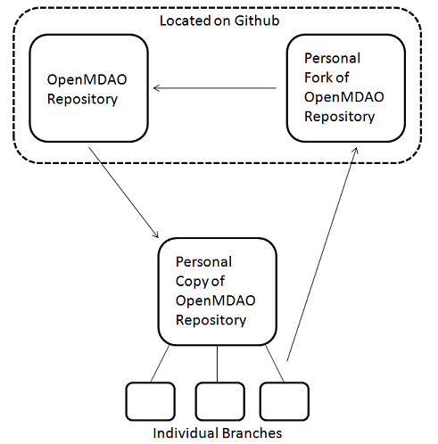

Getting Started
---------------

This document attempts to explain the OpenMDAO development process and how a
developer should interact with the various tools the project uses for
version control, testing, deployment, etc. The source files for the
*Developer Guide* can be found in the ``docs/dev-guide`` directory in the top
level of your OpenMDAO source repository.

.. index:: Git

.. _`developer-requirements`:

System Requirements
===================

Working with OpenMDAO as a developer has some system requirements in addition to those mentioned in
the :ref:`System-Requirements` section under *Getting Started.*  These requirements are described
below.

**git**
  We use git for version control.  You'll need it to access the OpenMDAO
  source repository.  Github, where our source repository is stored, has
  excellent documentation describing how to install git and how to get
  familiar with git and github.  You can find it `here`__.
    
.. __: http://help.github.com

**C/C++ and Fortran Compilers**
  Certain packages used in OpenMDAO contain Python extensions, meaning that they
  contain non-Python source code that must be compiled. Packages currently in use require
  either C/C++ or Fortran compilers.

  - *Linux*:

    - *gcc*
    
    - *gfortran*
      
      If they are not already on your system, they should be easily installable using
      your package manager. OpenMDAO currently builds and passes all tests with
      gcc/gfortran 4.1.2. We expect that later versions of gcc/gfortran 4.X should also
      work.

      
  - *Mac OS X*:
   
    - *gcc*
      
      Is available as part of *Xcode*, which can be found on the OS X distribution disks but typically is not 
      installed by default.  You can also download gcc and install it from source, although
      this is more prone to installation problems.
        
    - *gfortran*
      
      Binaries for gfortran are available `here <http://gcc.gnu.org/wiki/GFortranBinaries#MacOS>`_.

.. _`Windows`:

  - *Windows*:

    - *mingw32*   (for Fortran and C++)
      
     
      You can find mingw32 `here`__. You must do the following things when installing it:
            
      - Check the C++ compiler installation option to get g++ (required to run OpenMDAO)
      
      - Create a file in your home directory called ``pydistutils.cfg`` that contains the following lines:
      
        ::
      
          [build_ext]
          compiler=mingw32
       
      - Make sure to put the ``bin`` directory of the mingw32 install in your path.
           

         
    - *Visual C++ 2008 (Optional)*
      
      You can optionally use Visual C++ 2008 as your C++ compiler. You don't need it, mingw32 will work fine,
      but if you prefer Visual C++ 2008, you're welecome to use it instead. The Express version will work, 
      but others (Professional, Standard) should work too. To get this software,
      go to the `downloads page <http://www.microsoft.com/express/downloads/#2008-Visual-CPP>`_.     
         
.. __: http://sourceforge.net/projects/mingw/files

.. index:: proxy settings

System Configuration
====================

Some steps of the development process, e.g., downloading a branch of the source repository and
downloading Python distributions, require network access.  If you're using Linux or Mac OS X and
are behind an http proxy, you may have to set the ``http_proxy`` environment variable on
your system for git and :term:`virtualenv` to function properly. If you're using Windows 7,
please follow this 
`link <http://answers.oreilly.com/topic/675-how-to-configure-proxy-settings-in-windows-7/>`_
for information on configuring proxy settings.

*Using Git and Github*
++++++++++++++++++++++

The source repository for the OpenMDAO project is available on
:term:`Github`.  There is a wealth of good documentation available online 
about :term:`git` and Github itself. The 
`Github help page <http://help.github.com/>`_ is a good place to start. If you're a 
windows user, make sure to read the details about using Git Bash on the `windows 
specific installation instructions <http://help.github.com/win-set-up-git/>`_. 
The `Pro Git book <http://progit.org/book/>`_ is also excellent.  It's very
important to take a look at these, because git differs from other version
control systems in some significant ways. 

The first major difference is that git has a *staging area* that files must be
placed in before they're committed.  Luckily the ``git commit`` command has 
an option, ``-a``, that will eliminate this odd behavior and commit all of the
modified files in the repository without having to stage them first. See the 
:ref:`Commiting-changes` section for further explanation of ``git commit``.

The other major difference is how branches are handled.  In git, creating a branch
does not create a separate copy of the repository, but instead is basically a pointer
to a commit history within the repository. This makes git branches cheap to create. This
means that you should not hesitate to make a new branch when working on something. This
will be discussed a little more below in the :ref:`getting-the-source-code` section. 

*Git User Setup*
++++++++++++++++

If you have not previously used git on a particular machine where you intend
to work with git repositories, you should follow the instructions `here`__ to
set your username, email, and API token.

.. __: http://help.github.com/set-your-user-name-email-and-github-token

.. index:: repository

This way, your contact information will be included whenever you :term:`commit`
to a :term:`repository` on that machine.

.. index:: pair: source code; location
.. index:: pair: branch; creating

.. _getting-the-source-code:

Getting the Source Code
+++++++++++++++++++++++

Before you can do any development work on OpenMDAO, you'll need a local copy of the
source code. To get this, you must *clone* the OpenMDAO-Framework repository on
Github using the following command:

::

   git clone git://github.com/OpenMDAO/OpenMDAO-Framework.git
   
   
Note that the URL used above will give you only read permission to the
repository on Github, i.e., you won't be able to push changes directly to it.
If you happen to have write permission to the OpenMDAO-Framework repository, you should
use an SSH style URL to specify the repository like this:

::

   git clone git@github.com:OpenMDAO/OpenMDAO-Framework.git

At this point you should also create your own personal fork of the OpenMDAO-Framework
repository. Log into Github and go to
http://github.com/OpenMDAO/OpenMDAO-Framework. There, near the top of the page you'll
see a *Fork* button. Press it and you now have your own personal OpenMDAO-Framework
fork.  You'll push branches to this later and issue pull requests to get your
changes into the official repository.

The following figure gives an overall view of the version control process while 
using git and Github.

   Version Control Process

From the OpenMDAO repository on Github, you create a personal "fork" of the 
project, so there is now a repository that you can write to.  In addition to
creating a fork, you must also create a clone of the OpenMDAO repository on 
your machine.  This is the repository that you will be working directly off 
of, via the creation of branches.  Once you are satisfied with a branch's 
development, you can push this branch back up to your personal fork.  From here,
if you would like to contribute this work back to the OpenMDAO repository, you 
must issue a pull request to have your modifications merged in.

Normally, you should only need to clone a repository once on any given machine
where you plan to do your work. Then, each time you start work on a new
feature or a bug fix, you'll create a new branch in your local repository and
switch to that branch.

To create a branch, do the following:

::

   git branch <branch_name>
   

To switch to an existing branch, do:

::

   git checkout <branch_name>
   

A shorthand for creating a branch and then switching to it is:

::

   git checkout -b <branch_name>

The name you give your branch should reflect the purpose of the branch to avoid
confusion with other branches in your repository. And don't fix multiple bugs or
add multiple features on the same branch.  If you keep your branch changes small by
targeting a specific bug or feature, the maintainers of the project will have a much
easier time merging in your changes.  And remember, in *git*, creating branches is
cheap and quick, so there's no need to worry about creating lots of branches.

.. _Creating-the-Virtual-Environment:

Creating the Virtual Environment
________________________________

OpenMDAO operates inside of a virtual python environment. To create that environment, 
run ``python go-openmdao-dev.py`` from the top directory of your
repository. The script will check the version of Python you are running. **You must
be running version 2.6.** (To find out which Python version you are
running, you can type ``python --version``.)

.. note:: If you're using Visual Studio on Windows, you need to run the installer from a 
   command window that has the Visual Studio environment variables set. The
   easiest way to do this is to select the *Visual Studio 2008 Command Prompt*
   from the *Visual Studio Tools* menu under *Microsoft Visual C++ 2008
   Express Edition* in the Start menu. If you're using something other than
   the Express edition, then the name of the Start menu option will be
   slightly different, i.e., replace "Express" with "Professional" or
   "Standard."

::

   python go-openmdao-dev.py
   
Running ``go-openmdao-dev.py`` creates a ``devenv`` directory at the top of
your repository and populates it with all of the packages that OpenMDAO
depends upon. It also installs the openmdao namespace packages in your virtual
Python environment as "develop" eggs so that you can make changes to the
source code and immediately see the results without having to rebuild any
distributions.

      
.. _Activating-the-Virtual-Environment:

Activating the Virtual Environment
__________________________________

The next step is to activate your virtual Python environment. Change your directory to
``devenv``. 

On Linux or Mac OS X, you must be running the Bash shell. If you are in Bash, omit this step.

  ::

     bash
   
 
  Next, type the following, making sure to include the "." in the command:

  ::

     . bin/activate

Or, on Windows, type:

  ::

     Scripts\activate

At this point, your ``devenv`` directory should contain the following subdirectories, unless you are
on Windows. On Windows, the directory structure is slightly different, as noted below.

``bin`` 
    Contains Python and a number of other scripts that are associated with the Python
    packages that are installed in the virtual environment. On **Windows,** this
    directory is called ``Scripts``.

``etc``
    Contains miscellaneous files that don't fit in ``bin, lib,`` or ``include``.
    
``include``
    Contains Python C header files. If you are on **Windows,** you will not have this directory.

``lib``
    Contains Python standard library and installed modules.

After your virtual Python environment has been activated, you can add other 
distributions to the environment by using ``easy_install`` or :term:`pip` in
the same manner that you would add packages to the system level Python.

If you need to build the OpenMDAO docs, you can run ``openmdao_build_docs``.
Running ``openmdao_docs`` will display the documents in HTML in the default browser.

You can deactivate the environment by typing:

:: 

  deactivate
  
 
  
.. note:: Whenever you switch to a different branch within your repository,
   you should deactivate your virtual environment and re-run
   ``go-openmdao-dev.py``, unless you're certain that no OpenMDAO package
   dependencies have changed.

.. index:: source repository

*Layout of a Source Repository*
+++++++++++++++++++++++++++++++

The directory structure of your repository should look like this:

``contrib`` 
    The directory containing source to be packaged into distributions that can
    be released separately from OpenMDAO. These distributions may or may not depend upon
    OpenMDAO. Distributions that have not yet been approved to be part of
    ``openmdao.lib`` can live here -- as long as their license is compatible with NOSA. No
    proprietary code or GPL code should be placed in the OpenMDAO-Framework repository.

``devenv``
    The directory containing the OpenMDAO virtual environment. Note that
    this is not part of the source repository. You will build it by running
    the ``go-openmdao-dev.py`` script that sits at the top of the source
    repository.
    
``docs``  
    The directory containing all user documentation for OpenMDAO. The
    documentation is broken up into several major documents, each found in a separate 
    subdirectory, e.g., ``plugin-guide`` contains the *Plugin Developer Guide,* ``dev-guide`` contains
    the *Developer Guide,* and so on.
  
``examples``
    Python package containing examples of using OpenMDAO.
    
``misc``
    The directory containing miscellaneous scripts and configuration files used by
    OpenMDAO developers.

``openmdao.devtools``
    Python package containing scripts intended for developers and maintainers
    of openmdao to do things like build the docs or create a release.
    These scripts assume that the source repository is present, so this
    package is not distributed as part of an OpenMDAO release.

``openmdao.lib``
    Python package containing source for the OpenMDAO standard library of 
    modules.

``openmdao.main``
    Python package containing all infrastructure source for OpenMDAO.
     
``openmdao.test``
    Python package containing source for various OpenMDAO plugins used for
    testing.
    
``openmdao.units``
     Python package containing tools for doing unit conversion.   

``openmdao.util``
    Python package containing source for various Python utility routines
    used by OpenMDAO developers.
    
    
.. index:: namespace package

*Layout of a Namespace Package*
+++++++++++++++++++++++++++++++

OpenMDAO is split up into multiple Python packages, all under a top level
package called ``openmdao``. This top package, called a *namespace* package,
is a sort of fake package that allows us to maintain and release our
subpackages separately while appearing to the user to be all part of the
same top level package. The following packages under the ``openmdao``
namespace have a similar directory layout: ``openmdao.main``,
``openmdao.lib``, ``openmdao.devtools``, ``openmdao.util`` and
``openmdao.test``. The layout is shown below.

``openmdao.<package>``
    The top level directory for the package denoted by ``<package>``. This
    contains the ``setup.py`` script which is used to build and 
    create a distribution for the package.
    
``openmdao.<package>/src``
    Contains all of the package source code.
    
``openmdao.<package>/src/openmdao``
    Contains a special ``__init__.py`` file and a ``<package>``
    subdirectory.
    
``openmdao.<package>/src/openmdao/<package>``
    Contains the actual source code, usually a bunch of Python files. There could be a
    standard Python package directory structure under this directory as well.

``openmdao.<package>/src/openmdao/<package>/test``
    Contains unit tests for this package. These are executed by
    ``openmdao_test``.
