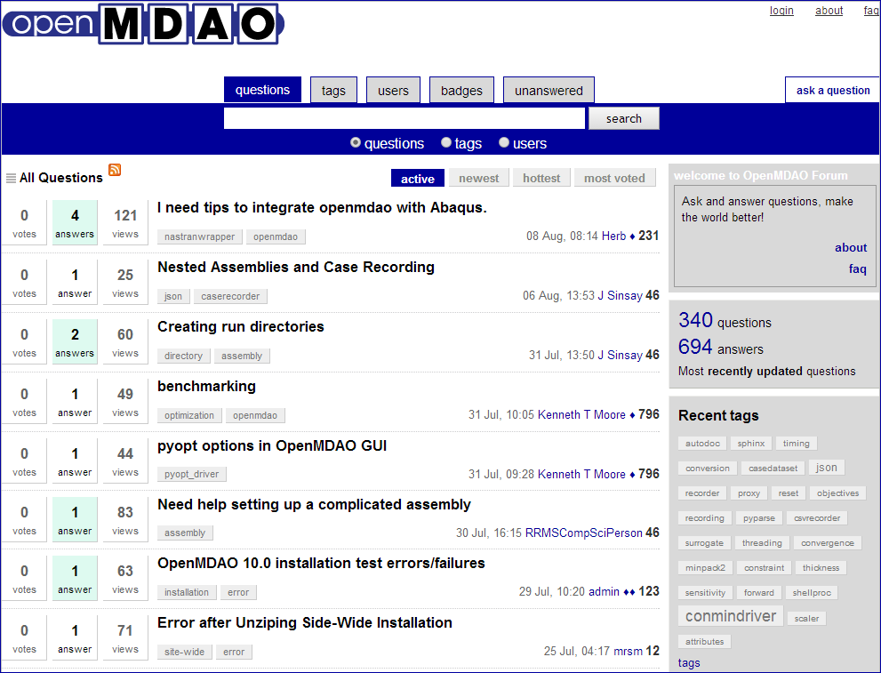
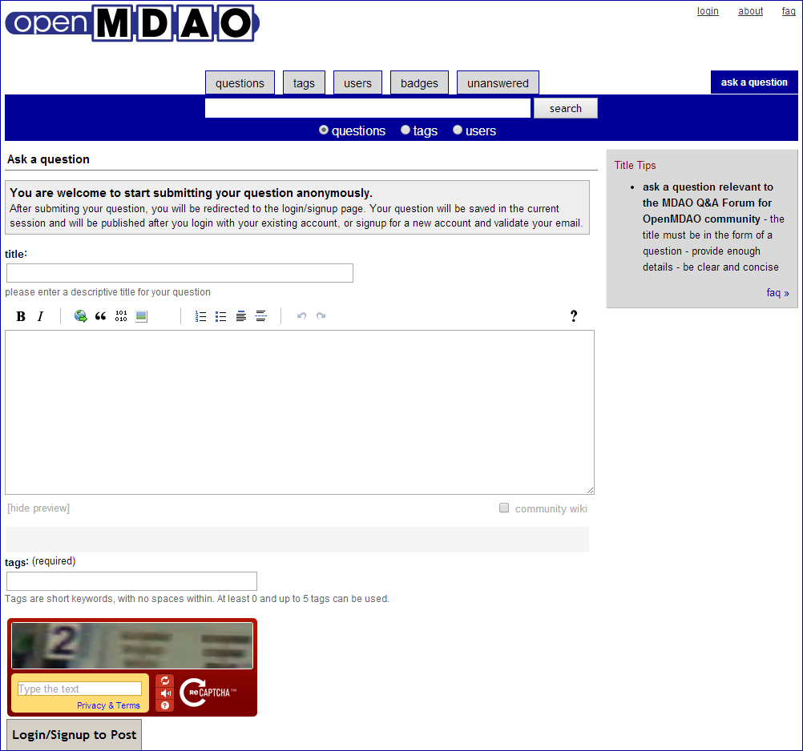
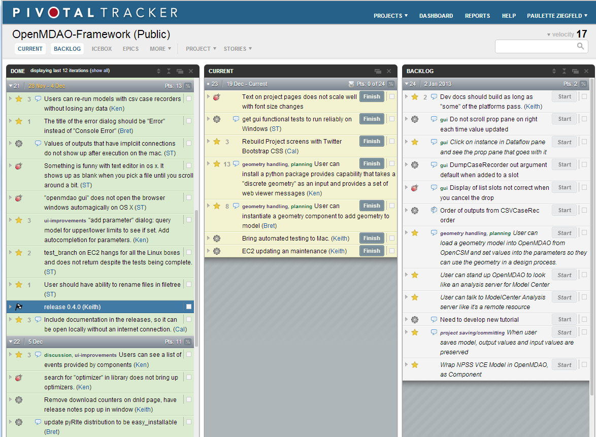

.. index:: Issues

OpenMDAO Issues
===============

Creating an Issue
------------------

If you are not on the OpenMDAO development team and you want to submit a bug request or an enhancement, you
should submit your issue to the OpenMDAO forum at http://openmdao.org/forum. 

When you go to the forum, you will see a page similar to this:

 
   The OpenMDAO Forum 
   
|

Click on the ``ask a question`` tab on the upper right side of the page (as shown above) to access
the following page, where you can submit an issue.

 
   Page for Submitting an Issue 
   
|

Complete the fields and submit your post to the forum. OpenMDAO developers receive an email
notification when a a new forum question/issue is submitted, so your issue should get immediate
attention. If the team agrees that the issue requires a code change, one of the developers will
reply to your forum post and also enter a *story* into our bug tracking system. (For more
information about our tracking tool, see the section on :ref:`Pivotal Tracker <Pivotal-Tracker>`.) 
Once the issue has been resolved (e.g., a bug fixed), the developer who worked the story/issue
should post to the forum.

Working on an Issue
--------------------

If you don't already have a personal fork of the OpenMDAO-Framework repository, you should make one.
Getting a personal fork of the repository lets you have your own branches, which you can use for
writing code to address issues.

Start off by making a new branch for each issue you want to work. Git provides very lightweight
branches, and it's very easy to switch among them, so make as many as you like! Once you have the
branch and write a little code, you will want to test and commit your code. 

After you commit your code, you are ready to issue a pull request to the OpenMDAO team. When your pull
request gets merged into the main repository, you will be notified via email.

.. seealso:: :ref:`Code-Contribution-Tutorial-&-Checklist`

.. _`Pivotal-Tracker`:

Tracking Bug/Feature Development in Pivotal Tracker
====================================================

While the OpenMDAO.org forum allows you to submit and track issues, it does not show you which
features are currently being worked on by the OpenMDAO dev team or how the project is progressing.
OpenMDAO uses Pivotal Tracker, a project management tool designed for agile software development, to
track all code development. As users you do not have direct access to the OpenMDAO-Framework project
in Pivotal Tracker; however, since the project is public, you can view project information to see
the status of features being developed. 

In Pivotal Tracker code changes are submitted as `stories`. A story can be a bug fix, a new feature, or a
chore affecting project management. It might even be an user-submitted issue from the forum entered into
Pivotal Tracker by one of the OpenMDAO devs. As you can see in the example below, stories in the first
column are DONE. Releases also show up in this column. The middle column, CURRENT, shows stories currently
being worked on by the dev team, and the last column, BACKLOG, lists stories waiting to be worked on.
Stories in this column have been discussed and prioritized, so if a developer finishes a story, he can
select one from the BACKLOG. When he clicks on the `Start` button, the story is assigned to him and moves
to the CURRENT column.  

 
   Example of OpenMDAO Story Tracking in Pivotal Tracker

When you go to the OpenMDAO-Framework project in Pivotal Tracker, what you see will probably be
different from the above example. For instance, you might see just the BACKLOG and the ICEBOX columns.
(The ICEBOX is a list of all stories in the system that have not yet been prioritized. These stories
will eventually move to the BACKLOG.) To see completed stories, select the MORE tab at the top of the
page (under the project name) and click *Done* on the drop-down menu. 

So, if you wish to check the status of code development in OpenMDAO, just follow this link to
the OpenMDAO-Framework project in Pivotal Tracker:  https://www.pivotaltracker.com/n/projects/470293. 

If you submitted an issue to the OpenMDAO forum and one of the team created a story for it, you
should be able to search and find the story in Pivotal Tracker. Additionally, the developer who
worked on the story should post to the forum when the issue has been resolved.
