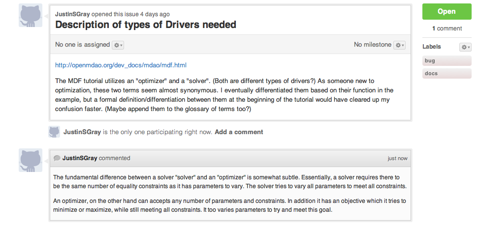

.. index:: Issues

Using GitHub Issues
===================

Creating a Issue
----------------
Whenever you're going to do development on the OpenMDAO code base, there should be an issue related
to that work. The issue could be related to a software requirement, or a bug that was found, or an 
enhancement that has been requested. There are a number of issues which have already been created
for the project, but you can also create a new issue yourself.

To create a GitHub issue, follow these steps:

1.  First, log into GitHub and go to ``http://github.com/OpenMDAO/openmdao/issues``. You must be logged in to create a new issue.

    
2.  Select the the **New Issue** button in the upper right hand corner. 
    
    The *New Issue* page will appear, as shown below:
    
    .. figure:: create_issue.png
       :align: center
 
       Creating a Issue on Github
    
|
    
3.  There are two sections: a title and a comments section. Try to make the title short, but descriptive. 
    "I found a bug", is not a good tittle. Instead try something like "Problem with XXX when doing Y". 
    In the comments section you should put as much detail as you can. The more information you give, 
    the easier it will be for someone to write code to address the issue you are reporting. You may also 
    select a number of *lables* to attach to the issue. For instance if you are reporting a bug, you would 
    select the *bug* label. If you have found a mistake in the documentation, then you would also attach 
    the "docs" label. You can add as many labels as you feel are relevant to the issue.   
    
4.  When you submit the issue, it will be assigned a number. If you plan to work on this issue yourself, 
    you will reference this number in your commit messages to associate your branch with the issue. 

Working on an Issue
-------------------

If you don't already have a personal fork of the OpenMDAO repository, you should make one. Getting a 
personal fork of the repository lets you have your own branches, which you can use to write code to 
address issues. 
    
Start off by making a new branch for each issue you want to work. Git provides very light weight
branches, and it's very easy to switch between them, so make as many as you like! Once you have th
branch and write a little code, you will want to commit it. In your commit message you should reference
the number of the issue you're working on. To do that just put "GH-???" into your commit message, 
where the "???" is replaced by the issue number. When you do this, information about your branch
will automatically show up on the GitHub issues page. So anyone who visits that page will now 
see that you're working on it and have some related code. 

If you have any information you want to add to the issue, you can always go back to GitHub and view 
the issue. On that page there is a place for you to put additional comments. Comments show up underneath
the originial ticket info. So scrolling down the page gives you a time history of information on the issue. 
Multiple people may comment on this issue as well, so a conversation might develop around the issue. 
These kinds of conversations are great. They might deal with specific implementation details, or just 
trying to hash out what the real problem is. This is one of the ways that GitHub encourages "social coding", 
and we hope you will make use of it!

 
       Viewing an existing issue.    
    
 
