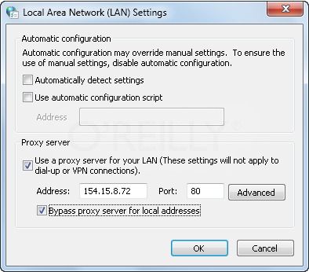

.. index:: pair: proxy settings; Windows

.. _`proxy-settings`:

Appendix B: Configuring Proxy Settings on Windows 7
===================================================

The following instructions for configuring proxy settings on Windows 7 were taken from a post to the
*O'Reilly Answers* webpage at: http://answers.oreilly.com/topic/675-how-to-configure-proxy-settings-in-windows-7/.

A proxy is a server that sits between you and the Internet.
It receives all client requests to the Internet, fulfills the request itself, and then sends the
information to the client. When creating network connections, you may need to configure a proxy in
order to gain access to the Internet or other external servers.

Windows 7 offers support for adding proxies inside Internet Explorer's settings. You can configure
the proxy server and port to support the different protocols you use for accessing services that
require a proxy within your organization.

.. note::
   If you use a different web browser, such as Mozilla Firefox, that browser may have its own
   proxy settings that you must configure using its settings or options dialog. Some browsers, such as
   Google Chrome, use the system-wide proxy settings that you learn to configure in this section.

You can enable or disable proxy settings on a per-connection basis as well as for the LAN. You
should enable proxy settings only when using a proxy is required. If you enable proxy settings and a
proxy is not required, you won't be able to use the related connection to access the Internet or
resources on your network. This happens because your computer will look for a proxy that isn't
there. Malware programs sometimes target your proxy settings, and you may have to enable or disable
these settings as a result.

You can configure a proxy for a LAN connection by completing these steps:

1. Click *Start,* and then click *Control Panel.*

2. Click *Network and Internet*; then click *Internet Options.*

3. In the *Internet Options* dialog box, click the *Connections* tab.

4. Click the *LAN Settings* button.

5. To enable the use of a proxy server, check the box for ``Use a proxy server for your LAN (These
   settings will not apply to dial-up or VPN connections).`` as shown in the figure below.

6. Enter the IP address of the proxy in the *Address* text box.

7. Enter the port number of the proxy in the *Port* text box.

8. If you want to bypass the proxy server for local IP addresses, select the ``Bypass proxy server
   for local addresses`` checkbox.

9. Click *OK* to complete the proxy configuration process.

   

   Configuring LAN Proxy Settings as Needed

You can configure a proxy for a dial-up or VPN connection by completing these steps:

1. Click *Start* --> *Control Panel.* Click *Network and Internet* --> *Internet Options* --> *Connections* tab.

2. Under *Dial-up and Virtual Private Network Settings,* click the connection you want to work with and then
   click *Settings.*

3. In the *Connection Settings* dialog box, enable the use of a proxy server by checking the box for ``Use a
   proxy server for this connection. (These settings will not apply to other connections.)``

4. Enter the IP address of the proxy in the *Address* text box.

5. Enter the port number of the proxy in the *Port* text box.

6. Click *OK* to complete the proxy configuration process.

Whenever you change network connection settings, you should verify that you can establish a connection and access
resources. If you are having difficulty connecting to the Internet after changing your connection settings, check
your proxy settings in *Internet Options* to enable or disable your proxy configuration as appropriate for each
connection.
