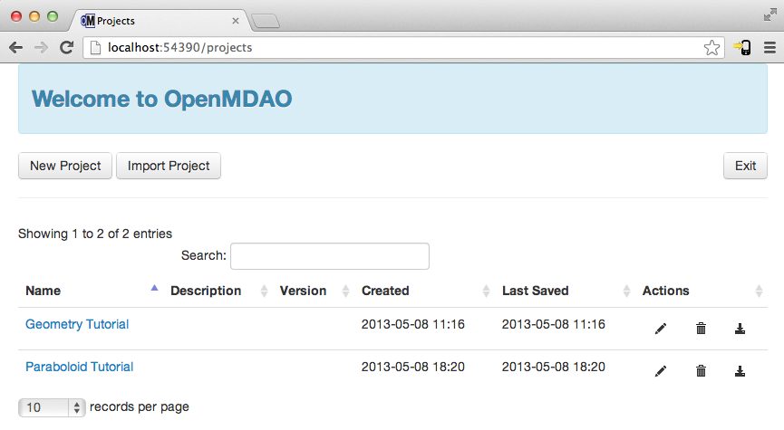
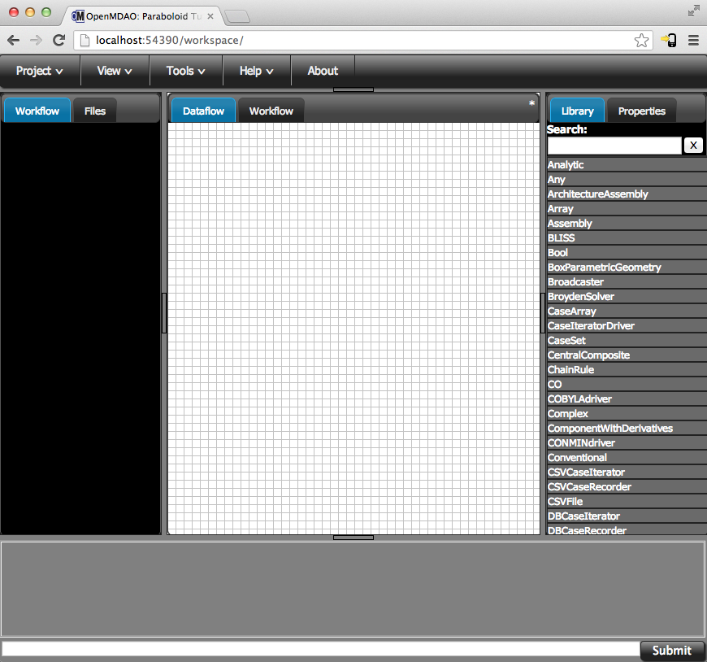

.. _GUI-OpenMDAO:

.. _GUI:

GUI
===

Disclaimer
----------

The OpenMDAO GUI is still under active development. We're working to add functionality and make sure the features that
are there work as expected. Please bear with us if you experience any bugs or you  find that certain things don't work
quite the way you would like them to. The development team would  greatly appreciate any feedback you have (good or
bad). Just post on our `forum <http://openmdao.org/forum>`_. 

Using the GUI
-------------

OpenMDAO ships with a web-browser-based Graphical User Interface. Our GUI is written in Javascript and HTML. 
Even though the GUI is rendered in a web browser, you don't need to be connected to the Internet to use it. OpenMDAO is delivered 
with the GUI built in. So once you've installed OpenMDAO, just open up a command window, :ref:`activate <activate_env>` your OpenMDAO environment, and then 
type: 

:: 

  openmdao gui

Two things should happen next. First, you should see a couple of lines output to the console that looks similar to the following: 

:: 
    
  Opening URL in browser: http://localhost:59499 (pid=74061)
  Opened in open
  <<<74061>>> OMG -- Serving on port 59499

The port number after ``http://localhost:`` and the process id after ``pid=`` will be different
every time you open the GUI, so don't worry if your numbers don't match the ones we show here. 

Second, the Chrome web-browser (You did install a recent version of Chrome, right?) will pop up with a page showing a list of 
all your OpenMDAO projects that the GUI knows about. If this is your first time using the GUI, even if you've been 
using OpenMDAO for a while now, there won't be any projects in the list yet. You have to create new GUI projects for any
existing models.

   
  
When working with the GUI, anything you do will be contained in a project. You can think of a project as a collection of 
information describing your model. That includes all of the Python files you use to define your components and the details of 
the structure of the model itself. 

You can start a new project by clicking on the ``New Project`` link at the bottom of the page. This will open up 
a form where you can input some detais, including a name, description, and version number.  You don't have to put anything
in for description and version number, but they are there if you want to keep track of them. When you hit the ``New Project``
button on this form, you'll be taken to an empty workspace in the GUI that looks like this: 

   
One final note about projects: if you're writing a python script and want to access
objects that were built as part of a project, you can use the ``load_project`` function,
for example:

.. code-block:: python

    from openmdao.main.project import load_project

    proj = load_project('myproj')

    top = proj.get('top')  # grab the 'top' object from the project

    top.comp1.a = 5.0
    top.comp1.b = 7.0
    
    top.run()

You can also tell ``load_project`` to load its objects into a dict that you
specify, e.g., ``load_project('myproj', globals()``.  Just be aware that if 
you load the project objects into ``globals()`` that they will overwrite any 
existing global objects having the same names.

From this point, you're ready to start working with OpenMDAO using our GUI. We have a number of screen casts that walk you
through how to use the GUI, and they follow along with the tutorials that you can go through in the rest of our docs. Just
follow this link to our YouTube channel: https://www.youtube.com/user/OpenMDAO.  

That covers the basics you need to know to start working with the OpenMDAO GUI. You'll learn the rest as you work through the documentation. 

How does the GUI Work?
----------------------

If you're curious about what's going on with the GUI and how it's serving a web page to a browser, you can continue
reading. But the following information is not required reading, so feel free to move  ahead to other parts of the docs or
view our screen casts on  using the GUI. 

Built into OpenMDAO is a small web-server that is set up when you call ``openmdao gui``. We open up a browser window for you 
that points to the address ``http://localhost:xxxx``. You could open up the same page yourself by typing in that address
manually.  What this means is that the server and the browser are both on the same machine but are still passing information
between each other over the the computer's internal network using the HTTP protocol. Since everything is happening over the
computer's internal network, you don't need to be connected to the Internet or even have your wireless card turned on! 

The GUI and the computational server communicate with each other via a technology called 
`web-sockets <http://en.wikipedia.org/wiki/WebSocket>`_, which enables bi-directional communication. All of the things 
you see in the browser window are rendered using HTML5 and javascript. We rely on a number of different javascript libraries 
to make all these things work, but we rely most heavily on `jQuery <http://jqueryui.com/>`_.

That's a quick overview of how the GUI works. Again, if you have any questions or comments, please post them to the `forum
<http://openmdao.org/forum>`_.

