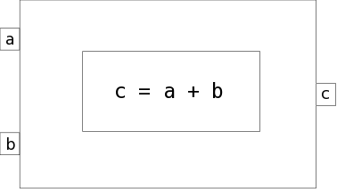

.. index:: MDAO
.. index:: OpenMDAO
.. index:: Component
.. index:: Workflow
.. index:: Assembly

.. _Introduction-to-the-OpenMDAO-Framework:

Overview of the OpenMDAO Framework
======================================

MDAO stands for `Multidisciplinary Design Analysis and Optimization`. OpenMDAO is an
open source framework for analyzing and solving MDAO problems. In OpenMDAO, a
problem is represented by a system of objects called components. Befor you start 
looking over all of our tutorials, it might help you to understand the fundamental 
structure of the framework. There are four main classes that you will work with: 
:term:`Component`, :term:`Driver`, :term:`Workflow`, :term:`Assembly`

.. _`component overview`:

Component
---------
A :term:`Component` is responsible for taking its input values and mapping them 
to a set of output values. This mapping can be done a number of ways. You could 
write a component entirely in Python, or you could wrap some external analysis code
that you are already using. 

Once you have a set of components you can connect the inputs and outputs of 
one component to those of other components, allowing data to be passed between them.

The following figure gives a conceptual view of what a simple Component might
look like. This Component has two inputs (*a, b*) and one output (*c*). The
calculation that it performs is to add the two inputs to produce the output.

.. _`Conceptual-View-of-a-Simple-Component`:

   Conceptual View of a Simple Component

Components within OpenMDAO can be as simple or complex as necessary.
The inputs and outputs to a Component are a kind of :term:`Variable`. 
There are different kinds of variables available in OpenMDAO, such as Float, Int, or Array. 

.. seealso:: :ref:`Variables`

When you connect two variables together, they need be compatible. You can't, for instance, connect 
a  String to a Float. Float variables have a special property 
that they can have physical units specified. The framework will automatically convert between compatible 
units when they are connected, and it will prevent you from connecting incompatible units. A complete 

.. seealso:: :ref:`units`

.. _`driver overview`:

Driver
------
Once you have a bunch of components, you're going to want to do something with them, 
like run an optimization or a Design of Experiments. Any kind of iterative execution 
of components is controlled by a :term:`Driver`. There are a number of differnent kinds 
of drivers in the standard library, but you could also write your own if need be. 

.. _`workflow overview`:

Workflow
--------

When a Driver is running, it need to know which components to execute and in what order 
to execute them. This behavior is controlled by the :term:`Workflow` class. Each driver 
has a workflow associated with it. You can think of the workflow as being responsible for 
controlling the process used to run a given analysis. 

Although in many cases a workflow contains just basic components, it can also contain 
other drivers. This allows nested iterative processes to be created. 
Nested iterations provides the flexibility needed to build 
complex optimization processes defined by MDAO architectures. 
Also Components are allowed to show up multiple times in a single workflow
or in multiple parts of a nested workflow. This can be used, for 
example, if you need to train a meta model in one part of a workflow 
and then optimize it in another. We often refer to collection of drivers/workflows
in a given model as an :term:`iteration hierarchy`. 

The following figure shows an example of an iteration hierarchy involving four 
different Drivers.  Note that in this example the same component, *component2*, 
appears in two different workflows.

.. _`iteration hierarchy concept`:

.. figure:: IterationHierarchy.png
   :align: center
   :alt: Figure shows workflows for each of 4 drivers; the workflows contain a total of 5 components

   View of an Iteration Hierarchy

.. _`assembly overview`:  

Assembly 
--------

An :term:`Assembly` is a container to put all of your components, drivers, and workflows in. 
A named *driver*. When an Assembly executes, it will always look for a Driver named `driver` and 
start there, then work its way down the iteration hierarchy. 

Besided being a container for all the other objects, and Assembly has two other main functions. 
It is responsible for managing all of the data connections between components in the framework. 
Whenever data needs to move from one component to annother, that is specified via the `connect`
method of the assembly. 

.. _`driver intro2`:

.. figure:: Intro-Driver2.png
   :align: center
   :alt: Refer to adjacent text

   View of an Assembly Showing Data Flow

   
An Assembly is also a special type of Component itself. Assemblies, like regular 
components, can have their own inputs and outputs. You can take advantage of this behavior
to construct nested models that can help simplify complex analyses a bit. You could 
produce a model of a jet engine from a number of analysis tools, then wrap that 
up into an assembly that is used as part of an aircraft simulation. 

For example, we could replace *component3* from the figure above with an assembly
containing two other components, resulting in the following:

.. _`driver intro1`:

.. figure:: Intro-Driver1.png
   :align: center
   :alt: Refer to caption

   View of an Assembly within an Assembly

So assemblies allow us to organize our model into a hierarchy of submodels, and within each
submodel, drivers and workflows give us a flexible way to define an iteration scheme.

Thats pretty much it for the basic structure of OpenMDAO. There is a lot more to deal with,
but will introduce the rest via a series of tutorials in teh following sections. 
