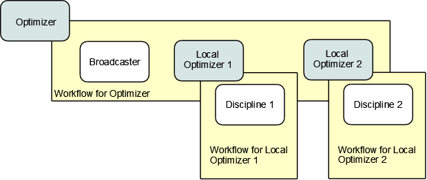

.. index:: Collaborative Optimization (CO)

.. _Collaborative-Optimization-(CO):

Collaborative Optimization (CO)
===============================

Next, we will set up a model that solves the Sellar problem by Collaborative
Optimization (CO). CO is a two-level architecture with three optimizer loops,
one at each discipline, and one acting globally. The global optimizer drives
the design and coupling variables towards an optimal solution that minimizes
the objective while constraining to zero the sum of the squares of the
residuals between the values commanded by the global optimizer and those set
by the local optimizers. Each local optimizer operates on its own
discipline, driving its design variables while minimizing the residual between
the actual value of the design variables and the values commanded by the global
optimizer.

CO for the Sellar case is very interesting because there are no component data connections.
All values are passed through the expression strings for the objectives, constraints, and
parameters of the various optimizers, as shown in the next diagram.

.. figure:: ../images/tutorials/Arch-CO.png
   :align: center
   :alt: Arrows and boxes showing data flow for collaborative optimization; there is one optimizer, one broadcaster, and two workflows.
   
   Data Flow for CO

The CO model has three optimizers, so there are three workflows. The top level
workflow includes the broadcaster and the two lower level optimizers, and each of
those optimizers has a workflow with just the discipline component. This can be
seen in the next figure.
   

      
   Iteration Hierarchy for CO

First, we create the component instances and set up this iteration hierarchy. Notice
that there are three drivers, and we add each component to one of the three workflows.
        
.. testcode:: CO_parts

        from openmdao.examples.mdao.disciplines import SellarDiscipline1, \
                                                       SellarDiscipline2
        from openmdao.examples.mdao.broadcaster import Broadcaster
        
        from openmdao.main.api import Assembly, set_as_top
        from openmdao.lib.drivers.api import CONMINdriver

        class SellarCO(Assembly):
            """Solution of the sellar analytical problem using CO.
            """
        
            def __init__(self):
                """ Creates a new Assembly with this problem
                
                Optimal Design at (1.9776, 0, 0)
                
                Optimal Objective = 3.18339"""
                
                # pylint: disable-msg=E1101
                super(SellarCO, self).__init__()
                
                # Global Optimization
                self.add('driver', CONMINdriver())
                self.add('bcastr', Broadcaster())
                self.add('localopt1', CONMINdriver())
                self.add('localopt2', CONMINdriver())
                self.driver.workflow.add(['bcastr', 'localopt1', 
                                          'localopt2'])
                
                # Local Optimization 1
                self.add('dis1', SellarDiscipline1())
                self.localopt1.workflow.add('dis1')
                
                # Local Optimization 2
                self.add('dis2', SellarDiscipline2())
                self.localopt2.workflow.add('dis2')

Notice that there are no data connections, so we never need to call ``self.connect``.

Now we need to set up the parameters for the outer optimization loop. 

.. testcode:: CO_parts
    :hide:
    
    self = SellarCO()

.. testcode:: CO_parts

        #Parameters - Global Optimization
        self.driver.add_objective('(bcastr.x1)**2 + bcastr.z2 + bcastr.y1' + 
                                                '+ math.exp(-bcastr.y2)')
        self.driver.add_parameter('bcastr.z1_in', low = -10.0, high = 10.0)
        self.driver.add_parameter('bcastr.z2_in', low = 0.0,   high = 10.0)
        self.driver.add_parameter('bcastr.x1_in', low = 0.0,   high = 10.0)
        self.driver.add_parameter('bcastr.y1_in', low = 3.16,  high = 10.0)
        self.driver.add_parameter('bcastr.y2_in', low = -10.0, high = 24.0)

        con1 = '(bcastr.z1-dis1.z1)**2 + (bcastr.z2-dis1.z2)**2 + ' + \
               '(bcastr.x1-dis1.x1)**2 + ' + \
               '(bcastr.y1-dis1.y1)**2 + (bcastr.y2-dis1.y2)**2  < 0'
        con2 = '(bcastr.z1-dis2.z1)**2 + (bcastr.z2-dis2.z2)**2 + ' + \
               '(bcastr.y1-dis2.y1)**2 + (bcastr.y2-dis2.y2)**2  < 0'
        self.driver.add_constraint(con1)
        self.driver.add_constraint(con2)
        
        self.driver.printvars = ['dis1.y1','dis2.y2']
        self.driver.iprint = 0
        self.driver.itmax = 100
        self.driver.fdch = .003
        self.driver.fdchm = .003
        self.driver.delfun = .0001
        self.driver.dabfun = .00001
        self.driver.ct = -.001
        self.driver.ctlmin = 0.001

Here we are able to build up a complicated expression for the sum of the squares
of all of the residuals and use it as our constraint. Note that this is another
example of a constraint that would be better served as an equality constraint, but
it's not problematic because a sum of squares is one-sided. We have two constraints
here, one for each discipline.

Finally, we set up our local optimization loops.

.. testcode:: CO_parts

        #Parameters - Local Optimization 1
        self.localopt1.add_objective('(bcastr.z1-dis1.z1)**2 + ' + \
                                   '(bcastr.z2-dis1.z2)**2 + ' + \
                                   '(bcastr.x1-dis1.x1)**2 + ' + \
                                   '(bcastr.y1-dis1.y1)**2 + ' + \
                                   '(bcastr.y2-dis1.y2)**2')
        self.localopt1.add_parameter('dis1.z1', low = -10.0, high = 10.0)
        self.localopt1.add_parameter('dis1.z2', low = 0.0,   high = 10.0)
        self.localopt1.add_parameter('dis1.x1', low = 0.0,   high = 10.0)
        self.localopt1.add_parameter('dis1.y2', low = -10.0, high = 24.0)
        self.localopt1.iprint = 0
        self.localopt1.itmax = 100
        self.localopt1.fdch = .003
        self.localopt1.fdchm = .003
        self.localopt1.delfun = .001
        self.localopt1.dabfun = .00001
        
        #Parameters - Local Optimization 2
        self.localopt2.add_objective('(bcastr.z1-dis2.z1)**2 + ' + \
                                     '(bcastr.z2-dis2.z2)**2 + ' + \
                                     '(bcastr.y1-dis2.y1)**2 + ' + \
                                     '(bcastr.y2-dis2.y2)**2')
        self.localopt2.add_parameter('dis2.z1', low = -10.0, high = 10.0)
        self.localopt2.add_parameter('dis2.z2', low = 0.0,   high = 10.0)
        self.localopt2.add_parameter('dis2.y1', low = 3.16,  high = 10.0)
        self.localopt2.iprint = 0
        self.localopt2.itmax = 100
        self.localopt2.fdch = .003
        self.localopt2.fdchm = .003
        self.localopt2.delfun = .001
        self.localopt2.dabfun = .00001

This problem is contained in ``sellar_CO.py``. Executing it at the command line should produce
output that resembles this:

::

        $ python sellar_CO.py
        CONMIN Iterations:  60
        Minimum found at (2.007823, 0.000000, 0.003927)
        Couping vars: 3.164985, 3.802037
        Minimum objective:  3.18215119048
        Elapsed time:  22.5064539909 seconds

After 60 iterations of the top level optimizer, CO gives an answer that's slightly off the optimum, but the calculated
objective is still very close.
