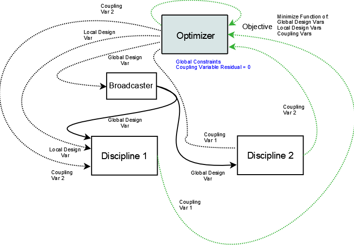
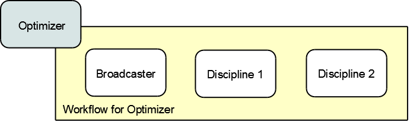

.. index:: Individual Design Feasible (IDF)

.. _Individual-Design-Feasible-(IDF):
        
Individual Design Feasible (IDF)
=================================

Next, we will look at how to set up the Individual Design Feasible (IDF)
architecture for the Sellar problem. In IDF, the direct coupling between the
disciplines is removed, and the input coupling variables are added to
the optimizer's design variables. The algorithm calls for two new equality
constraints that enforce the coupling between the disciplines instead. 
This assures that the solution is a feasible coupling, though it is achieved
through the optimizer's additional effort instead of a solver. The data
flow for IDF is illustrated in the following diagram:

   
   Data Flow for IDF
   
IDF needs only one driver, so there is just one workflow where the two disciplines are executed sequentially.
From the perspective of the iteration hierarchy, IDF is extremely simple.
   

    
   Iteration Hierarchy for IDF
   
To implment IDF, we create the ``SellarIDF`` assembly. First, all of our components
are instantiated and the workflow is defined.
   
.. testcode:: IDF_parts

        from openmdao.examples.mdao.disciplines import SellarDiscipline1, \
                                               SellarDiscipline2
        from openmdao.main.api import Assembly, set_as_top
        from openmdao.lib.drivers.api import CONMINdriver
        
        
        class SellarIDF(Assembly):
            """ Optimization of the Sellar problem using IDF"""
            
            def __init__(self):
                """ Creates a new Assembly with this problem
                
                Optimal Design at (1.9776, 0, 0)
                
                Optimal Objective = 3.18339"""
                        
                super(SellarIDF, self).__init__()
        
                # create Optimizer instance
                self.add('driver', CONMINdriver())
        
                # Disciplines
                self.add('dis1', SellarDiscipline1())
                self.add('dis2', SellarDiscipline2())
                
                # Driver process definition
                self.driver.workflow.add(['dis1', 'dis2'])

Thats all it takes to setup the workflow for IDF. All that is left to do is set up the CONMIN optimizer. 
Pay attention, in the code below, to how we handle the global design variables z1 and z2. They are setup the same
way we did it for the MDF architecture. However, unlike for MDF, the coupling variables are also included as optimizer 
parameters. We also introduce the CONMIN parameter *ct*, which is the constraint thickness for
nonlinear constraints. Our constraints are nonlinear, but note that any
constraint that involves a component output is most likely a nonlinear
constraint because outputs are usually nonlinear functions of the design variables.

.. testcode:: IDF_parts
    :hide:
    
    self = SellarIDF()

.. testcode:: IDF_parts

        # Optimization parameters
        self.driver.add_objective('(dis1.x1)**2 + dis1.z2 + dis1.y1 + math.exp(-dis2.y2)')
        
        #Global Design Variables
        self.driver.add_parameter(('dis1.z1','dis2.z1'), low = -10.0, high=10.0)
        self.driver.add_parameter(('dis1.z2','dis2.z2'), low = 0.0,   high=10.0)
        
        #Local Design Variables and Coupling Variables
        self.driver.add_parameter('dis1.x1',      low = 0.0,   high=10.0)
        self.driver.add_parameter('dis2.y1',      low = 3.16,  high=10.0)
        self.driver.add_parameter('dis1.y2',      low = -10.0, high=24.0)
            
        self.driver.add_constraint('(dis2.y1-dis1.y1)**3 <= 0')
        self.driver.add_constraint('(dis1.y1-dis2.y1)**3 <= 0')
        self.driver.add_constraint('(dis2.y2-dis1.y2)**3 <= 0')
        self.driver.add_constraint('(dis1.y2-dis2.y2)**3 <= 0')
  
        self.driver.iprint = 0
        self.driver.itmax = 100
        self.driver.fdch = .003
        self.driver.fdchm = .003
        self.driver.delfun = .0001
        self.driver.dabfun = .00001
        self.driver.ct = -.01
        self.driver.ctlmin = 0.001
        

Technically, IDF requires the use of equality constraints to enforce coupling between the disciplines. 
Since CONMIN doesn't support equality constraints, we have to fall back on a
trick where we replace it with an equivalent pair of inequality constraints.
For example, if we want to constrain ``x=2``, we could constraint ``x<=2`` and ``x>=2`` and
let the optimizer converge to a solution where both constraints are active.
Working with two inequalities is a bit more tricky though, because it can introduce some instability to 
the optimizer and affect it's final solution. 

You might consider trying a fancier solution such as constraining ``abs(dis2.y1-dis1.y1)<=0``. Be careful though, 
because this nonlinear constraint has a discontinuous slope, and CONMIN won't handle that very well. 
After some experimentation, we found that cubing the difference between the coupling variables, 
i.e. ``(dis1.y1-dis2.y1)**3``, seemed to make CONMIN happy and helped convergence. 

When you put it all together, you get 
:download:`sellar_IDF.py </../examples/openmdao.examples.mdao/openmdao/examples/mdao/sellar_IDF.py>`. 
Once again, we added a small amount of code at the end to execute, and then print out the results of, the IDF
optimization. 

.. testcode:: IDF_full
        from openmdao.examples.mdao.disciplines import SellarDiscipline1, \
                                                       SellarDiscipline2
        from openmdao.main.api import Assembly, set_as_top
        from openmdao.lib.drivers.api import CONMINdriver
        
        
        class SellarIDF(Assembly):
            """ Optimization of the Sellar problem using IDF"""
            
            def __init__(self):
                """ Creates a new Assembly with this problem
                
                Optimal Design at (1.9776, 0, 0)
                
                Optimal Objective = 3.18339"""
                        
                super(SellarIDF, self).__init__()
        
                # create Optimizer instance
                self.add('driver', CONMINdriver())
        
                # Disciplines
                self.add('dis1', SellarDiscipline1())
                self.add('dis2', SellarDiscipline2())
                
                # Driver process definition
                self.driver.workflow.add(['dis1', 'dis2'])
                
        
                # Optimization parameters
                self.driver.add_objective('(dis1.x1)**2 + dis1.z2 + dis1.y1 + math.exp(-dis2.y2)')
                
                #Global Design Variables
                self.driver.add_parameter(('dis1.z1','dis2.z1'), low = -10.0, high=10.0)
                self.driver.add_parameter(('dis1.z2','dis2.z2'), low = 0.0,   high=10.0)
                
                #Local Design Variables and Coupling Variables
                self.driver.add_parameter('dis1.x1',      low = 0.0,   high=10.0)
                self.driver.add_parameter('dis2.y1',      low = 3.16,  high=10.0)
                self.driver.add_parameter('dis1.y2',      low = -10.0, high=24.0)
                    
                self.driver.add_constraint('(dis2.y1-dis1.y1)**3 <= 0')
                self.driver.add_constraint('(dis1.y1-dis2.y1)**3 <= 0')
                self.driver.add_constraint('(dis2.y2-dis1.y2)**3 <= 0')
                self.driver.add_constraint('(dis1.y2-dis2.y2)**3 <= 0')
          
                self.driver.iprint = 0
                self.driver.itmax = 100
                self.driver.fdch = .003
                self.driver.fdchm = .003
                self.driver.delfun = .0001
                self.driver.dabfun = .00001
                self.driver.ct = -.01
                self.driver.ctlmin = 0.001
        
        
        if __name__ == "__main__":
            import time
            
            prob = SellarIDF()
            set_as_top(prob)
            
            # pylint: disable-msg=E1101
                
            prob.dis1.z1 = prob.dis2.z1 = 5.2
            prob.dis1.z2 = prob.dis2.z2 = 2.0
            prob.dis1.x1 = 1.0
            prob.dis2.y1 = 3.16
            
            tt = time.time()
            prob.run()
        
            print "\n"
            print "CONMIN Iterations: ", prob.driver.iter_count
            print "Minimum found at (%f, %f, %f)" % (prob.dis1.z1, \
                                                     prob.dis2.z2, \
                                                     prob.dis1.x1)
            print "Couping vars: %f, %f" % (prob.dis1.y1, prob.dis2.y2)
            print "Minimum objective: ", prob.driver.eval_objective()
            print "Elapsed time: ", time.time()-tt, "seconds"

Executing this at the command line should produce
output that resembles this:

::

        $ python sellar_IDF.py
        CONMIN Iterations:  10
        Minimum found at (1.976427, 0.000287, 0.000000)
        Couping vars: 3.156521, 3.754359
        Minimum objective:  3.18022323743
        Elapsed time:  0.200541973114 seconds

