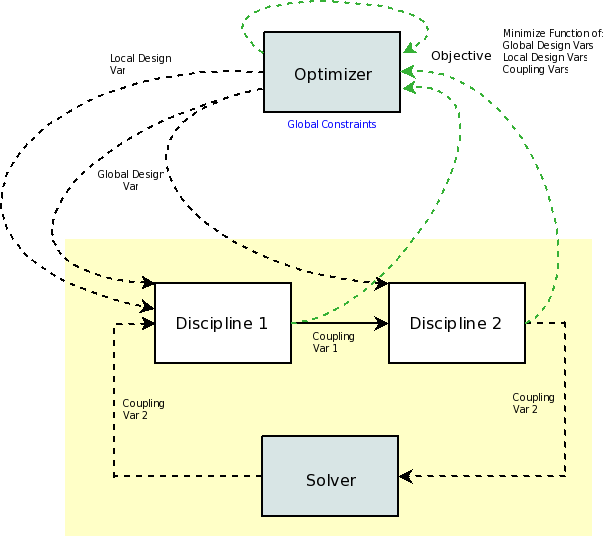
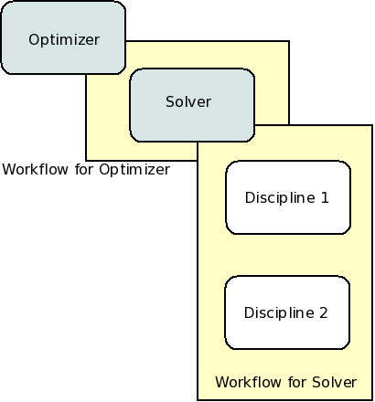

.. index:: Multidisciplinary Design Feasible (MDF)
            
.. _Multidisciplinary-Design-Feasible-(MDF):

Multidisciplinary Design Feasible (MDF)
=======================================

In a Multidisciplinary Design Feasible (MDF) problem, the disciplines are directly coupled
via some kind of solver, and the design variables are optimized all at the top level. The
following spaghetti diagram illustrates MDF applied to the Sellar problem.

   
   Data Flow for MDF Applied to the Sellar Problem

Notice in this diagram, that the optimizer at the top has some data that passes from it to each of the disciplines. 
In MDF, both the global and local design variables are all controlled by the top level solver. So the data connections
you see represent both. 

.. index:: WorkFlow, BroydenSolver, FixedPointIterator

The diagram also shows a solver that takes the output of the component dataflow
and feeds it back into the input. OpenMDAO has two solvers: FixedPointIterator
and BroydenSolver. The FixedPointIterator is a solver that performs fixed point iteration,
which means that it keeps driving ``x_new = f(x_old)`` until convergence is achieved. In
other words, *y2* is passed from the output of ``SellarDiscipline2`` to the input of ``SellarDiscipline1``,
and the loop keeps executing until the change in the value of *y2* between iterations is
smaller than a tolerance. The BroydenSolver is a solver based on a quasi-Newton-Raphson
algorithm that uses a Broyden update to approximate the Jacobian. This solver reads
the output and calculates a new input each iteration. Convergence is achieved when the
residual between the output and input is driven to zero.

The major difference between the MDF problem and some of the previous examples is the
presence of nested drivers. Drivers can be nested in OpenMDAO using WorkFlows
in the iteration hierarchy. A :term:`WorkFlow` is an object that determines execution
order for a group of Components. Each driver contains a single WorkFlow. For
each iteration, a Driver will execute one pass through the WorkFlow, executing
the components contained therein in the order the WorkFlow prescribes.
Although in many cases a WorkFlow contains just Components, it can also
contain Drivers. This allows nested iterative processes to be created. The
following diagram shows an iteration hierarchy for the MDF problem.
   

   
   Iteration Hierarchy for the MDF Problem
   

Note that this iteration hierarchy does not contain any information about the data 
connections necessary to complete the MDF implementation. Workflows describe only 
process.

Now, let's take the iteration hierarchy we just discussed and put in into an 
assembly, so we can actually run it. 

.. testcode:: MDF_parts

        from openmdao.examples.mdao.disciplines import SellarDiscipline1, \
                                                       SellarDiscipline2
                                                       
        from openmdao.main.api import Assembly, set_as_top
        from openmdao.lib.drivers.api import CONMINdriver, FixedPointIterator
        
        class SellarMDF(Assembly):
            """ Optimization of the Sellar problem using MDF
            Disciplines coupled with FixedPointIterator.
            """
            
            def __init__(self):
                """ Creates a new Assembly with this problem
        
                Optimal Design at (1.9776, 0, 0)
                
                Optimal Objective = 3.18339"""
                
                super(SellarMDF, self).__init__()
        
                # create Optimizer instance
                self.add('driver', CONMINdriver())
                
                # Outer Loop - Global Optimization
                self.add('solver', FixedPointIterator())
                self.driver.workflow.add(['solver'])
                
So far nothing is really new in terms of syntax. Note that the top level driver, in this case an 
instance of CONMINdriver, is always named *'driver'*. However, all other drivers can be given any valid name. For this
model, we've chosen to use the ``FixedPointIterator`` for our solver.

Next, we need to create the workflow for the solver. Add instances of ``SellarDiscipline1``
and ``SellarDiscipline2`` to the assembly. Then add those instances to the workflow of ``'solver'``

.. testcode:: MDF_parts
    :hide:
    
    self = SellarMDF()

.. testcode:: MDF_parts

        # Inner Loop - Full Multidisciplinary Solve via fixed point iteration
        self.add('dis1', SellarDiscipline1())
        self.add('dis2', SellarDiscipline2())
        self.solver.workflow.add(['dis1', 'dis2'])
        
Now the iteration hierarchy pictured above is finished. To complete the MDF architecture though, 
we still need to hook up the data connections and configure CONMIN optimization and the fixed point iteration.

Recall that there are two global design variables, ``z1`` and ``z2``. In the model we constructed, 
you find ``z1`` in two places: ``dis1.z1`` and ``dis2.z1``. The same is true for ``z2``: 
``dis1.z2`` and ``dis2.z2``. This means that when you add a parameter to the driver for ``z1`` or ``z2``, 
it needs to point to both locations in the model. We accomplish that below, by just passing a tuple of 
variable names, as the first argument to the ``add_parameter`` method. 

.. testcode:: MDF_parts

        # Add Parameters to optimizer
        self.driver.add_parameter(('dis1.z1','dis2.z1'), low = -10.0, high = 10.0)
        self.driver.add_parameter(('dis1.z2','dis2.z2'), low = 0.0,   high = 10.0)

There is only one local design variable for this problem, ``x1``, which is found in ``dis1.x1``.
Since local design variables only point to one place in the model, we just add them using
``add_parameter`` with a single name as the first argument (just like we've shown you in previous
tutorials). 

.. testcode:: MDF_parts

        self.driver.add_parameter('dis1.x1', low = 0.0,   high = 10.0)   
        
        
Since we're using a fixed point iteration to converge the disciplines, only one of the coupling 
variables (``y2``) is directly varied by the solver. The other one  (``y1``) is just passed from 
the discipline 1 to discipline 2 directly each iteration. The choice of which variable to 
let the solver vary and which to pass directly is arbitrary. You could have swapped the two 
and the problem would still converge.  
               
To tell a ``FixedPointIterator`` which variable to vary, we just use add_parameter again. 
During iteration, this is the variable that is going to be sent to the input
of ``SellarDiscipline1``, which is ``'dis1y2'``. We specify very small and large values for the 
low and high arguments because solvers shouldn't really be constrained like that. 
Similarly, we setup the convergence constraint, as an equality constraint. A solver 
essentially tries to drive something to zero. In this case, we want to
drive the residual error in the coupled variable *y2* to zero. An equality constraint
is defined with an expression string which is parsed for the equals sign, in the above example
you see that 'dis2.y2 = dis1.y2' is equivalent to 'dis2.y2 - dis1.y2 = 0'. We also set the
maximum number of iterations and a convergence tolerance.
        
.. testcode:: MDF_parts

        # Make all connections
        self.connect('dis1.y1','dis2.y1')

        # Iteration loop
        self.solver.add_parameter('dis1.y2', low=-9.e99, high=9.e99)
        self.solver.add_constraint('dis2.y2 = dis1.y2')
        self.solver.max_iteration = 1000
        self.solver.tolerance = .0001     

Finally, the CONIM optimization is set up. We add the objective function as well as the 
constraints, from the problem formulation, to the driver. We also set some configuration 
options which control the details of CONMIN's behavior. The objective function includes 
references to the global design variables. When this happens, you can pick any of the locations
where that global design variable points to. In this case, we used ``dis1.z2``, but we could have
just as easily picked ``dis2.z2``. 

.. testcode:: MDF_parts

        # Optimization parameters
        self.driver.add_objective('(dis1.x1)**2 + dis1.z2 + dis1.y1 + math.exp(-dis2.y2)')
        
        self.driver.add_constraint('3.16 < dis1.y1')
        #Or use any of the equivalent forms below
        #self.driver.add_constraint('3.16 - dis1.y1 < 0')
        #self.driver.add_constraint('3.16 < dis1.y1')
        #self.driver.add_constraint('-3.16 > -dis1.y1')
        
        self.driver.add_constraint('dis2.y2 < 24.0')
        
        self.driver.cons_is_linear = [1, 1]
        self.driver.iprint = 0
        self.driver.itmax = 30
        self.driver.fdch = .001
        self.driver.fdchm = .001
        self.driver.delfun = .0001
        self.driver.dabfun = .000001
        self.driver.ctlmin = 0.0001
        
The process of getting the optimizer to reach a value close enough to the
correct optimum required the use of more of CONMIN's settings. The *fdchm*
parameter is the minimum absolute step size that the finite difference uses,
and *fdch* is the step size relative to the design variable. *Dabfun* is the
absolute change in the objective function to indicate convergence (i.e., if
the objective function changes by less than *dabfun,* then the problem is
converged). Similarly, *delfun* is the relative change of the objective
function with respect to the value at the previous step. Finally, *ctlmin* is
the minimum constraint thickness for the linear constraints. We also use
``cons_is_linear`` to let CONMIN know that both constraints are linear. This
can speed up the algorithm, though it hardly matters here.

As before, the ``add_constraint`` method is used to add our constraints. This
time however, we used a more general expression for the first constraint. Commented 
out below that are three more examples of the same exact constraint composed slightly 
differently. 

Finally, putting it all together gives:

.. testcode:: MDF_full

        from openmdao.examples.mdao.disciplines import SellarDiscipline1, \
                                                       SellarDiscipline2
        from openmdao.main.api import Assembly, set_as_top
        from openmdao.lib.drivers.api import CONMINdriver, FixedPointIterator
        
        class SellarMDF(Assembly):
            """ Optimization of the Sellar problem using MDF
            Disciplines coupled with FixedPointIterator.
            """
            
            def __init__(self):
                """ Creates a new Assembly with this problem
                
                Optimal Design at (1.9776, 0, 0)
                
                Optimal Objective = 3.18339"""
                
                super(SellarMDF, self).__init__()
        
                # create Optimizer instance
                self.add('driver', CONMINdriver())
                
                # Outer Loop - Global Optimization
                self.add('solver', FixedPointIterator())
                self.driver.workflow.add(['solver'])
        
                # Inner Loop - Full Multidisciplinary Solve via fixed point iteration
                self.add('dis1', SellarDiscipline1())
                self.add('dis2', SellarDiscipline2())
                self.solver.workflow.add(['dis1', 'dis2'])
                
                # Add Parameters to optimizer
                self.driver.add_parameter(('dis1.z1','dis2.z1'), low = -10.0, high = 10.0)
                self.driver.add_parameter(('dis1.z2','dis2.z2'), low = 0.0,   high = 10.0)
                self.driver.add_parameter('dis1.x1', low = 0.0,   high = 10.0)        
                
                # Make all connections
                self.connect('dis1.y1','dis2.y1')
                
                # Iteration loop
                self.solver.add_parameter('dis1.y2', low=-9.e99, high=9.e99)
                self.solver.add_constraint('dis2.y2 = dis1.y2')
                # equivalent form
                # self.solver.add_constraint('dis2.y2 - dis1.y2 = 0')
                
                #Driver settings
                self.solver.max_iteration = 1000
                self.solver.tolerance = .0001
                
                # Optimization parameters
                self.driver.add_objective('(dis1.x1)**2 + dis1.z2 + dis1.y1 + math.exp(-dis2.y2)')
                
                self.driver.add_constraint('3.16 < dis1.y1')
                self.driver.add_constraint('dis2.y2 < 24.0')
                
                self.driver.cons_is_linear = [1, 1]
                self.driver.iprint = 0
                self.driver.itmax = 30
                self.driver.fdch = .001
                self.driver.fdchm = .001
                self.driver.delfun = .0001
                self.driver.dabfun = .000001
                self.driver.ctlmin = 0.0001
        
        if __name__ == "__main__": # pragma: no cover         
        
            import time
            
            prob = SellarMDF()
            prob.name = "top"
            set_as_top(prob)
                    
            prob.dis1.z1 = prob.dis2.z1 = 5.0
            prob.dis1.z2 = prob.dis2.z2 = 2.0
            prob.dis1.x1 = 1.0
            
            
            tt = time.time()
            prob.run()
            print "\n"
            print "CONMIN Iterations: ", prob.driver.iter_count
            print "Minimum found at (%f, %f, %f)" % (prob.dis1.z1, \
                                                     prob.dis1.z2, \
                                                     prob.dis1.x1)
            print "Couping vars: %f, %f" % (prob.dis1.y1, prob.dis2.y2)
            print "Minimum objective: ", prob.driver.eval_objective()
            print "Elapsed time: ", time.time()-tt, "seconds"
        
            
        # End sellar_MDF.py

This problem is contained in 
:download:`sellar_MDF.py </../examples/openmdao.examples.mdao/openmdao/examples/mdao/sellar_MDF.py>`. 
We added just a few lines at the end to instantiate the assembly class we defined, and then run it and 
print out some useful information. Executing it at the command line should produce
output that resembles this:

::

        $ python sellar_MDF.py
        CONMIN Iterations:  12
        Minimum found at (1.977657, 0.000000, 0.000000)
        Couping vars: 3.160068, 3.755315
        Minimum objective:  3.18346116811
        Elapsed time:  0.121051073074 seconds

        
We initially chose to use *FixedPointIterator* for our solver, but you can replace that with a better one. Fixed point
iteration works for some problems, including this one, but sometimes another type of solver might be preferred. 
OpenMDAO also contains a Broyden solver called
*BroydenSolver*. This solver is based on a quasi-Newton-Raphson algorithm found in 
``scipy.nonlinear``. It uses a Broyden update to approximate the Jacobian. If we
replace ``FixedPointIterator`` with ``BroydenSolver``, the optimizer's workflow
looks like this:

.. testcode:: MDF_parts

        # Don't forget to put the import in your header
        from openmdao.lib.drivers.api import BroydenSolver

        # Outer Loop - Global Optimization
        self.add('solver', BroydenSolver())
        self.driver.workflow.add('solver')

Next, we set up our parameters for the inner loop. The Broyden solver is connected
using the exact same interface as the fixed point iterator, so that code does not change at all.
We just change some of solver specific settings. 
        
.. testcode:: MDF_parts

        # Iteration loop
        self.solver.add_parameter('dis1.y2', low=-9.e99, high=9.e99)
        self.solver.add_constraint('dis2.y2 = dis1.y2')
        # equivalent form
        # self.solver.add_constraint('dis2.y2 - dis1.y2 = 0')
        
        self.solver.itmax = 10
        self.solver.alpha = .4
        self.solver.tol = .0000001
        self.solver.algorithm = "broyden2"
        
The rest of the file does not change at all either. So you can see that it's pretty easy to reconfigure drivers 
using this setup. Here is the new file, with the modifications: 
:download:`sellar_MDF_solver.py </../examples/openmdao.examples.mdao/openmdao/examples/mdao/sellar_MDF_solver.py>`.

        

