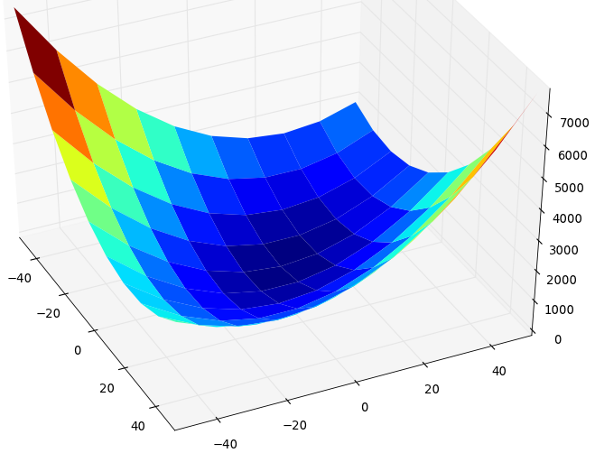

.. index:: DOE
.. _`DOE_paraboloid`:

Building a Model - Executing a Design of Experiment (DOE)
=========================================================

Let's say you're not interested in optimization, but instead you're much more interested 
in design space exploration. In that case you would want to use some kind of a Design 
Of Experiment (DOE). There are few different kinds of DOEs out there. Some of the most
popular are: 

  #. Full Factorial 
  #. Random Uniform
  #. Latin Hypercube
  #. Central Composite
  
OpenMDAO provides options to use all of these in our :ref:`standard library 
<openmdao.lib.doegenerators.api>`. If none of those meet your needs, you can also 
write your own DOEgenerator class to expand OpenMDAO capabilities. (We'll leave that for a different
tutorial). For now, let's assume you wanted to use a Full Factorial DOE, with 10 levels for each 
variable. Create a file called ``doe.py`` and copy the following into it: 

.. testcode:: simple_model_doe

    from openmdao.main.api import Assembly
    from openmdao.lib.drivers.api import DOEdriver
    from openmdao.lib.doegenerators.api import FullFactorial
    from openmdao.lib.casehandlers.api import ListCaseRecorder
    
    from openmdao.examples.simple.paraboloid import Paraboloid
    
    class Analysis(Assembly): 
    
        def configure(self):
            
            self.add('paraboloid',Paraboloid())
            
            self.add('driver',DOEdriver())
            #There are a number of different kinds of DOE available in openmdao.lib.doegenerators
            self.driver.DOEgenerator = FullFactorial(10) #Full Factorial DOE with 10 levels for each variable
            
            #DOEdriver will automatically record the values of any parameters for each case
            self.driver.add_parameter('paraboloid.x',low=-50,high=50)
            self.driver.add_parameter('paraboloid.y',low=-50,high=50)
            #tell the DOEdriver to also record any other variables you want to know for each case
            self.driver.case_outputs = ['paraboloid.f_xy',]
            
            #Simple recorder which stores the cases in memory. 
            self.driver.recorders = [ListCaseRecorder(),]
            
            self.driver.workflow.add('paraboloid')
            
Or download our version of the file 
:download:`here </../examples/openmdao.examples.simple/openmdao/examples/simple/doe.py>`.            
            
To run a DOE we use the :ref:`DOEdriver <DOEdriver.py>`, which serves as the 
driver any time you want to run any kind of DOE. To specify the particular type of DOE, you set the ``DOEgenerator`` 
attribute. In this case we used :ref:`FullFactorial <FullFactorial.py>`, but any of the DOEgenerators 
would work. 

You can see that this code does not look a whole lot different from the code in the previous
tutorials  on :ref:`unconstrained <using-CONMIN>` and :ref:`constrained <constrained-optimization>`
optimizations. We're still using  the same Paraboloid component as before. Also, just like before,
we use the ``add_parameter`` method to specify what inputs should be varied by the DOE. Since we
specified the low and high to be -50 and 50 respectively,  with 10 levels, the FullFactorial DOE
generator will divide each parameter into 10 evenly spaced bins and then generate the full set of
combinations possible (100 cases in total). Note that a full factorial DOE can get very expensive very quickly. 
The total number of cases you run will be :math:`l^n`, where :math:`l` is the number of levels and :math:`n` is the number of
parameters. 

One new thing in this example is the use of a case recorder. Each case in a given DOE results in a set of
inputs being set into your model; then the model gets run, and some outputs are calculated. Obviously you
want to record the results of this process for each case in the DOE. You use a :ref:`CaseRecorder
<openmdao.lib.casehandler.api.py>` for that.  The CaseRecorder's job is to store the information from each
case in some fashion. In this example  we used a :ref:`ListCaseRecorder
<openmdao.lib.casehandlers.listcase.py>` which just stored them in memory. There are other kinds though
that are more permanent, for example, the :ref:`DBcaseRecorder <openmdao.lib.casehandlers.dbcase.py>`, which 
saves all your cases to a SQLite database to be reviewed later. 

All CaseRecorders have the same interface and can be used interchangeably. In fact, 
if you notice, we specified a ListCaseRecorder as part of a list. 

.. testsetup:: simple_model_doe_pieces
    
    from openmdao.main.api import Assembly
    from openmdao.lib.drivers.api import DOEdriver
    from openmdao.lib.doegenerators.api import FullFactorial
    from openmdao.lib.casehandlers.api import ListCaseRecorder
    
    from openmdao.examples.simple.paraboloid import Paraboloid
    
    class Analysis(Assembly): 
    
        def configure(self):
            
            self.add('paraboloid',Paraboloid())
            
            self.add('driver',DOEdriver())
            #There are a number of different kinds of DOE available in openmdao.lib.doegenerators
            self.driver.DOEgenerator = FullFactorial(10) #Full Factorial DOE with 10 levels for each variable
            
            #DOEdriver will automatically record the values of any parameters for each case
            self.driver.add_parameter('paraboloid.x',low=-50,high=50)
            self.driver.add_parameter('paraboloid.y',low=-50,high=50)
            #tell the DOEdriver to also record any other variables you want to know for each case
            self.driver.case_outputs = ['paraboloid.f_xy',]
    
    self = Analysis()
   
.. testcode:: simple_model_doe_pieces
    
            #Simple recorder which stores the cases in memory. 
            self.driver.recorders = [ListCaseRecorder(),]

You can add as many CaseRecorders to that list as you want, and each one will record every case separately. This
enables you to save information to more than one place at the same time.

The last new thing to look at is where we specify some extra variables to be saved off for each case. The DOEdriver 
automatically saves all the variables that were specified as parameters in every case. That way, you will always
know exactly what variable values were used for each case. But, of course, the inputs are just half the story. You will 
also want to store relevant outputs from each case. This is what the ``case_outputs`` attribute is for, on the DOEdriver. 
You would put any variables you want to track into this list, but here we have only the one output from 
paraboloid. 

.. testcode:: simple_model_doe_pieces

           self.driver.case_outputs = ['paraboloid.f_xy',]
           
           

To run this analysis, you would do the following: 

.. testsetup:: simple_model_doe_run

    from openmdao.main.api import Assembly
    from openmdao.lib.drivers.api import DOEdriver
    from openmdao.lib.doegenerators.api import FullFactorial
    from openmdao.lib.casehandlers.api import ListCaseRecorder
    
    from openmdao.examples.simple.paraboloid import Paraboloid
    
    
    class Analysis(Assembly): 
        
        def configure(self):
            
            self.add('paraboloid',Paraboloid())
            
            self.add('driver',DOEdriver())
            #There are a number of different kinds of DOE available in openmdao.lib.doegenerators
            self.driver.DOEgenerator = FullFactorial(10) #Full Factorial DOE with 10 levels for each variable
            
            #DOEdriver will automatically record the values of any parameters for each case
            self.driver.add_parameter('paraboloid.x',low=-50,high=50)
            self.driver.add_parameter('paraboloid.y',low=-50,high=50)
            #tell the DOEdriver to also record any other variables you want to know for each case
            self.driver.case_outputs = ['paraboloid.f_xy',]
            
            #Simple recorder which stores the cases in memory. 
            self.driver.recorders = [ListCaseRecorder(),]
            
            self.driver.workflow.add('paraboloid')
                
.. testcode:: simple_model_doe_run

    if __name__ == "__main__":    

        import time
        
        analysis = Analysis()
    
        tt = time.time()
        analysis.run() 
        
        print "Elapsed time: ", time.time()-tt, "seconds"
        
        #write the case output to the screen
        for c in analysis.driver.recorders[0].get_iterator():
            print "x: %f, y: %f, z: %f"%(c['paraboloid.x'],c['paraboloid.y'],c['paraboloid.f_xy'])
            
The only new stuff here is the bit at the end where we loop over all the cases that were run. To keep
things simple, we just spit out the data to the screen. But the key thing to recognize here is  how you
work with cases. You can loop through each case by calling the ``get_iterator()``  method 
on any case recorder. Then for each case you just address the names of the variables like you would 
when working with a Python dictionary. You can put the data into any format you want from a loop like
this one. 

For instance, here is some code that uses matplotlib to generate a surface plot of the data from this run.

.. code-block:: python

    if __name__ == "__main__":    

        import time
        from matplotlib import pylab as p
        from matplotlib import cm
        import mpl_toolkits.mplot3d.axes3d as p3
        from numpy import array  
        
        analysis = Analysis()
    
        tt = time.time()
        analysis.run() 
        
        print "Elapsed time: ", time.time()-tt, "seconds"          
        
        raw_data = {}
        X=set()
        Y=set()
        for c in analysis.driver.recorders[0].get_iterator():
            raw_data[(c['paraboloid.x'],c['paraboloid.y'])] = c['paraboloid.f_xy']
            X.add(c['paraboloid.x'])
            Y.add(c['paraboloid.y'])
            
        X = sorted(list(X))
        Y = sorted(list(Y))
        
        xi,yi = p.meshgrid(X,Y)
        zi = []
        
        for x in X: 
            row = []
            for y in Y: 
                row.append(raw_data[(x,y)])
            zi.append(row)
        zi = array(zi)
        
        fig=p.figure()
        ax = p3.Axes3D(fig)
        ax.plot_surface(xi,yi,zi,rstride=1,cstride=1,cmap=cm.jet,linewidth=0)
        
        p.show()

|

 
   A Graph of the Output from the Execution of the DOE 

    

At times it's necessary to rerun an analysis. This can be a problem if the
DOE generator used has a random component. To handle this, DOEdriver records
the normalized DOE values to a CSV file. This file can be read in later by
a :ref:`CSVFile <openmdao.lib.doegenerators.csvfile.py>` DOE generator.
The DOEdriver can then be configured to use this CSVFile generator to rerun
the cases previously generated.

.. testcode:: simple_model_doe_rerun

    from openmdao.main.api import Assembly
    from openmdao.lib.drivers.api import DOEdriver
    from openmdao.lib.doegenerators.api import CSVFile, Uniform

    from openmdao.examples.simple.paraboloid import Paraboloid
    
    
    class Analysis(Assembly): 
        
        def configure(self):
            self.add('paraboloid', Paraboloid())
            self.add('driver', DOEdriver())
            self.driver.DOEgenerator = Uniform(num_samples=1000)
            self.driver.add_parameter('paraboloid.x', low=-50, high=50)
            self.driver.add_parameter('paraboloid.y', low=-50, high=50)
            self.driver.case_outputs = ['paraboloid.f_xy']
            self.driver.workflow.add('paraboloid')

    if __name__ == '__main__':    

        analysis = Analysis()

        # Run original analysis.
        analysis.run() 

        # Reconfigure driver to rerun previously generated cases.
        analysis.driver.DOEgenerator = CSVFile(analysis.driver.doe_filename)
        # Note that analysis.driver.doe_filename will give you the name of  
        #   the csv file saved by the DOE driver. 

        # No need to re-record cases (and it avoids overwriting them).
        analysis.driver.record_doe = False

        # Rerun analysis.
        analysis.run()

Re-running the full experiment is often not of interest. Instead, only certain
cases need to be rerun. OpenMDAO provides case filters to select cases, and
DOEdriver's ``case_filter`` attribute is used to configure what filter to use.
Note that filters are applied *after* the normalized parameter values have
been converted to actual values.

.. testcode:: simple_model_doe_filter

    from openmdao.main.api import Assembly
    from openmdao.lib.drivers.api import DOEdriver
    from openmdao.lib.doegenerators.api import CSVFile, Uniform
    from openmdao.lib.casehandlers.api import ExprCaseFilter, SequenceCaseFilter, SliceCaseFilter

    from openmdao.examples.simple.paraboloid import Paraboloid
    
    
    class Analysis(Assembly): 
        
        def configure(self):
            self.add('paraboloid', Paraboloid())
            doe = self.add('driver', DOEdriver())
            doe.DOEgenerator = Uniform(num_samples=1000)
            doe.add_parameter('paraboloid.x', low=-50, high=50)
            doe.add_parameter('paraboloid.y', low=-50, high=50)
            doe.case_outputs = ['paraboloid.f_xy']
            doe.workflow.add('paraboloid')

    if __name__ == '__main__':    

        analysis = Analysis()
        doe = analysis.driver

        # Run full experiment.
        analysis.run() 

        # Don't record reruns.
        doe.record_doe = False

        # Rerun just 5th and 7th cases.
        doe.DOEgenerator = CSVFile('driver.csv')
        doe.case_filter = SequenceCaseFilter((5, 7))
        analysis.run()

        # Rerun every third case starting at 100 through case 200.
        doe.DOEgenerator = CSVFile('driver.csv')
        doe.case_filter = SliceCaseFilter(100, 200, 3)
        analysis.run()
 
        # Rerun every case where x > 0 and y < 0.
        doe.DOEgenerator = CSVFile('driver.csv')
        doe.case_filter = ExprCaseFilter("case['paraboloid.x'] > 0 and case['paraboloid.y'] < 0")
        analysis.run()

In the above example we were able to filter cases on input values, or their
location in the sequence of cases run. If instead you need to rerun cases
based on output values, or if they failed, the filtering has to be applied to
cases after they have been run.
:ref:`CaseIteratorDriver <caseiterdriver.py>` is a driver which will run an
arbitrary set of cases given to it, such as those recorded by DOEdriver.
CaseIteratorDriver has a ``filter`` attribute that can be used in the same
way we used filters with DOEdriver above, but now the filter can operate on
outputs as well as inputs.

.. testcode:: simple_model_cid_filter

    from openmdao.main.api import Assembly
    from openmdao.lib.drivers.api import CaseIteratorDriver, DOEdriver
    from openmdao.lib.doegenerators.api import Uniform
    from openmdao.lib.casehandlers.api import ListCaseRecorder, ListCaseIterator, ExprCaseFilter

    from openmdao.examples.simple.paraboloid import Paraboloid
    
    
    class Analysis(Assembly): 
        
        def configure(self):
            self.add('paraboloid', Paraboloid())
            doe = self.add('driver', DOEdriver())
            doe.DOEgenerator = Uniform(num_samples=1000)
            doe.add_parameter('paraboloid.x', low=-50, high=50)
            doe.add_parameter('paraboloid.y', low=-50, high=50)
            doe.case_outputs = ['paraboloid.f_xy']
            doe.workflow.add('paraboloid')

    if __name__ == '__main__':    

        analysis = Analysis()

        # Run full experiment and record results.
        recorder = ListCaseRecorder()
        analysis.driver.recorders = [recorder]
        analysis.run() 

        # Reconfigure driver.
        workflow = analysis.driver.workflow
        analysis.add('driver', CaseIteratorDriver())
        analysis.driver.workflow = workflow

        # Rerun cases where paraboloid.f_xy <= 0.
        analysis.driver.iterator = recorder.get_iterator()
        analysis.driver.filter = ExprCaseFilter("case['paraboloid.f_xy'] <= 0")
        analysis.run() 

        # Rerun cases which failed.
        analysis.driver.iterator = recorder.get_iterator()
        analysis.driver.filter = ExprCaseFilter("case.msg")
        analysis.run() 

..
  Since DOEdriver and CaseIteratorDriver are derived from
  :ref:`CaseIterDriverBase <caseiterdriver.py>`,
  it's possible to run the various cases concurrently.  If evaluating a case
  takes considerable time and you have a multiprocessor machine, setting
  ``analysis.driver.sequential`` to False will cause the cases to be evaluated
  concurrently, based on available resources, which will usually be quicker.
  Note that concurrent evaluation means you can't rely on the recorded cases
  being in the order you might expect.

