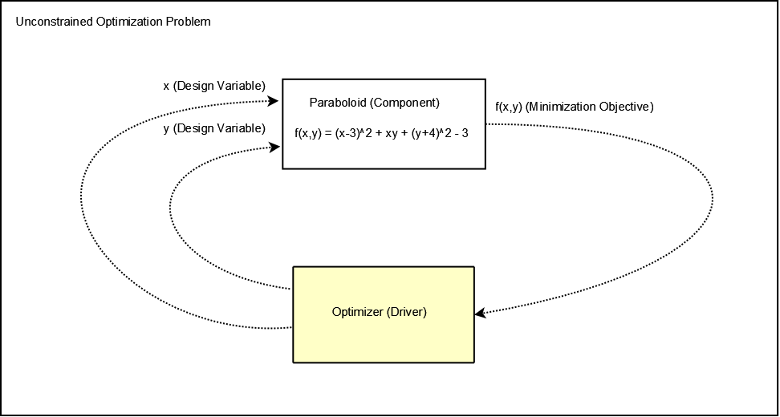

.. index:: simple tutorial

Overview
==========

In this section, you are going to learn how to execute a series of simple optimizations. We're going to 
work with the Paraboloid component that we defined in the :ref:`basic tutorial <basic-tutorial>`. 
The equation in the Paraboloid component is a function of two input variables. Our goal is
to find the minimum value of this equation over a particular range of interest. First, we will solve
this problem with no constraints. Then we will add constraints and solve the problem again. Next we'll 
take a look at how you can specify analytic derivatives for your components and what effect that has on the 
optimization. Lastly, We will run a Design of Experiments (DOE) on the problem and plot 
the results to visually identify the minimum. 

If we express the problem as a block diagram, we can see how to set it up in OpenMDAO:

.. _`OpenMDAO-overview`:

   A Simple Optimization Problem
   
The optimizer is the :term:`Driver`. Its job is to manipulate the two design
variables (*x* and *y*) to minimize the output of the ``paraboloid`` function
(*f*). Both the driver and the component are contained in
an :term:`Assembly`, which maintains the connections between the driver and
the component and knows how to run the whole analysis. 

