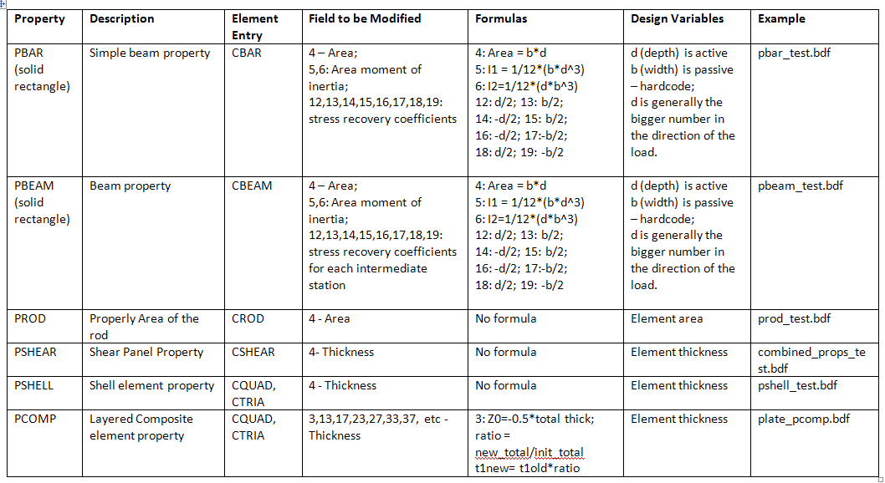
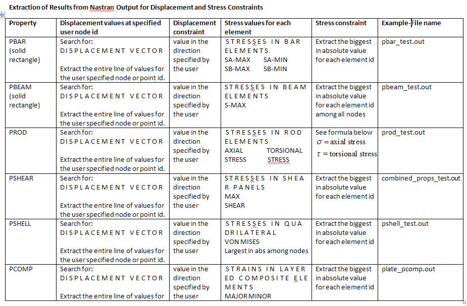
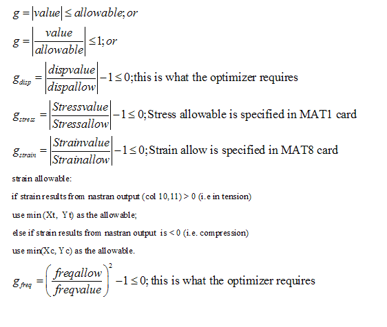
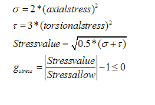

.. index:: Nastran, NastranComponent, MSC Nastran

MSC NastranComponent
====================

The following documentation refers to the MSC (MacNeal-Schwendler Corporation) Nastran Component.

Overview
---------

If you are creating a component that is supposed to call Nastran to calculate your component's outputs,
you must do three things: 

* First, you must make your component a subclass of NastranComponent 
* Second, you must specify how Nastran will deal with your inputs 
* Third, you must specify how Nastran will deal with your outputs 

Once you do these three things, NastranComponent will worry about setting up Nastran's input file (for the
correct input variables), running Nastran, and parsing the output values out of Nastran's output. The MSC
Nastran Component has been tested exclusively with MSC Nastran 2005, although as long as the input and
output don't change, it should work for any version.

.. index:: NastranComponent

Subclassing NastranComponent 
-------------------------------- 

All of NastranComponent's logic is in the ``execute`` function. The ``execute`` function reads the traits that are
connected to it (both input and output variables). It uses NastranReplacer and then NastranMaker to update
the Nastran file for the current input variables. It runs the Nastran command by calling its superclass,
``ExternalCode``. Finally, it parses the output two ways: first, by calling the output variable's
``nastran_func`` function in order to parse out the value from the ``FileParser`` and the ``NastranOutput`` object,
and second, by calling ``NastranParser``.

What all these classes do will be explained when we discuss how to tell NastranComponent how to process
the input and output variables.

.. index:: NastranMaker

Controlling Nastran's Input
------------------------------

To control what Nastran solves, you have to change certain variables in the Nastran input file.
NastranComponent can only insert the correct variables in the right places if you tell it where to insert
the variables. There are two ways of specifying the input variables: via Nastran Replacer or NastranMaker.

.. index:: NastranReplacer

*NastranReplacer (the Crude Way)* 
+++++++++++++++++++++++++++++++++ 

NastranReplacer looks at the Nastran input file and replaces all instances of ``%varname`` with the current
value of the design variable. The length of ``varname`` is limited to seven characters since, along with the
percent sign, it must fit in an eight-character block. You can use the same placeholder in multiple places,
but it will give you a warning.

The main shortcoming, and the reason why it is the crude way, is that the input variable is placed in the
same block as the placeholder variable, which limits its precision. When using an optimizer with a very
small step size, it's possible that eight characters aren't enough to distinguish between iterations.

There is a secondary mode of operation. If you specify a variable that starts with an asterisk (e.g.,
``%*myvar``), NsatranReplacer will overwrite the variable and keep on overwriting for the length of the
value. This is useful when you want to insert a value that doesn't correspond to an eight-character wide
block. The best example is if you wanted to replace the number in the line ``METHOD 103``. If you tried
replacing it with a normal variable (if you insert ``XXXXXXXX``), you would get either ``METHOD 1XXXXXXXX``
or ``XXXXXXXX03``. Using overwrite variables you can insert ``104`` in the expression ``METHOD %*n``, and it
will yield ``METHOD 104``.

The asterisk variables are very useful when replacing variables that aren't in the bulk data section. When
you want to replace a bulk value (in a card), NastranMaker is much more appropriate since it understands
the bulk data format. Replacing bulk data with NastranReplacer is highly discouraged.

.. index:: NastranMaker

*NastranMaker*
++++++++++++++

Using NastranMaker does not rely on placeholder variables; instead, you must provide the `keyword, the id,` and
the `fieldnum` to change a card. NastranMaker will find the right card to modify and will convert the entire
card to long form. This way, you get 16 characters to express numbers. It also allows you to keep the Nastran
input unmodified, instead of littering it with placeholder variables. Below is an example:

::

    >>> t1 = Float(10., desc="Thickness of pshell #1",
               iotype="in",
               nastran_card="PSHELL",
               nastran_id="1",
               nastran_fieldnum=3)

Note that the ``Nastran_card`` (the keyword) and the id must be strings, while the fieldnum must be an
integer. To make sense of which fields to change, an understanding of Nastran is required. Each field
specifies a different attribute that can be modified. To find out which fields modify which attributes,
consult the Nastran documentation. (See the `MSC.Nastran 2004 Quick Reference Guide
<http://www.google.com/search?source=ig&hl=en&rlz=1G1GGLQ_ENUS331&q=MSC.Nastran+2004+Quick+Reference+Guide&aq=f&aqi=&aql=&oq=&gs_rfai=CECsdPelqTJjaLozmNJ_-vcwGAAAAqgQFT9AJml8>`_.)

In general, a sample input line will look something like this:

::

    PSHELL         8       4       3

Here, ``PSHELL`` is the keyword, or the type of thing that you're modifying. The first number is usually the
id, so in this case, it is 8. In this example, there are two attributes, with values 4 and 3, that control
something about this ``PSHELL``. As an example, for a ``PSHELL``, the second argument (4) dictates which
material card you're referencing, and the third argument (3) specifies the thickness.

Parsing Nastran's Output
---------------------------
The goal is to set output variables to certain values in Nastran's output. As with Nastran's input, there
are two ways of going about it: one involves instructing the parser to pick out a certain location denoted
by its distance from a certain anchor; the other way attempts to intelligently parse the grid structure that
most pages of output have. The second way will not work for every case, but it's a much cleaner solution if
it works.

*NastranOutput (the Crude Way)*
+++++++++++++++++++++++++++++++ 
 
Although this method is generally not recommended, sometimes it is necessary to use it. When specifying the
design variable, you also specify a ``nastran_func`` attribute. You will specify a function that takes one
variable: a `FileParser` (from ``openmdao.util.filewrap``). The idea is that the function you specify will be
able to parse out the value you want from the FileParser. The FileParser is a convenient way of looking for
something in the text. You can specify an anchor in the text (such as ``D I S P L A C E M E N T   V E C T O
R``) and then take the value that is x lines down and y fields across the line. You can also access the
output text itself in ``filewrap.data``.

This method is not recommended because it is not very sturdy. If the data in the output file changes
significantly, and you specify the values you want by the number of fields they are away from the beginning of
the line, you may unknowingly get bad data. The other problem is that if you define two functions in your class
(perhaps a helper function and another one that returns the results), when you pass the function that returns
the results in through ``nastran_func``, it will not know where the helper function is and  will break.

.. index:: NastranParser

*NastranParser*
+++++++++++++++

NastranParser tries to parse the grid out of each page of output. It identifies 1) a header for the page, then
2) the grid's headers, and finally 3) its values. If it parses a page correctly, the query for information is
much like querying a database, but much simpler. See the following example.

::

    >>> a = Float(0.0, iotype="out",
              nastran_header="displacement vector",
              nastran_subcase=1, # this must be an integer
              nastran_constraints={"column name" : "value"},
              nastran_columns=["column name"])

Once these values are specified, NastranParser will try to find the header in the output, then apply
the constraints to the grid, and yield a smaller grid with the viable rows and the acceptable columns
(specified by ``nastran_columns``). Note that ``a`` is a two-dimensional Python array. Each row will be a row
in a grid and will contain only the columns listed in ``nastran_columns``.

NastranParser accepts the name of the header as a string of all lower case letters with sane spacing as
well as the header presented in the output file (stripped of spaces at the beginning and end). 

.. note:: As of this writing, if it cannot find the header, it will break. If it cannot find the column names
   you specify, it will break. Right now, even though you specify a smaller grid of values than you want
   returned, the value of the variable will be only ``result[0][0]``. This will change in future versions.

One of the main reasons to support retrieving multiple columns is that you can access the parser
outside of design variable declaration. NastranComponent has an attribute ``parser``, which is the
NastranParser after it's run Nastran. After you call ``super(...).execute()``, you could retrieve values by
calling the parser's ``get`` function, in an identical fashion to the design variable declaration:

::

    >>> displacement_vector = self.parser.get("displacement vector",
                                              1,
                                              {"POINT ID." : "443"},
                                              ["T2"])

Do note that ``displacement_vector`` is a two-dimensional array. In this example, it has one value
(``[[value]]``), but if more columns or more rows were allowed, you would get a bit bigger two-dimensional
array. 

``self.parser.get`` has an optional argument that is useful in parsing grids that have more than one value
per column. A good example can be found in ``test/practice-grid.row-width.txt``. As you can see, if you
wanted to select the data for element id 1, you'd actually want those 15 rows of data. So, you invoke ``get``
with the optional argument ``row_width``. By using ``row_width``, once you find a row that satisfies your
constraints, it'll include the remaining (``row_width-1``) rows in the output.

It is important to understand how NastranParser works. It is a heuristic-based parser. This means that the
developers have built something that correctly identifies most grids that they have thrown at it. Since
there is no official Nastran output specification, it might not work on your grid. This is a known problem
without a known solution.

Another, perhaps more pressing, problem is that NastranParser uses the data in the grid to help the parsing
task. This means that if the data changes significantly, you *could* get different parses. While this is
not very likely, it is a possibility. Currently, if this happens, the hope is that the ``get`` function
will break because you'll try to access a column that NastranParser doesn't recognize. While this is a real
problem, it is not showstopping because most of the time NastranParser will parse the grid correctly
regardless and because, under most runs, the data doesn't undergo drastic changes. One example of a drastic
change would be omitting an entire column of values during one execution and then having values in the
next iteration. Another example would be going from a floating point number to ``0.0``. The problem is that the
floating point numbers are long and usually block unnecessary columns from forming. But if there is a
column of ``0.0``, the parsing problem might think there's an extra column. If you are worried about
inconsistencies in parsing, you could isolate the particular grid you are parsing and change.

.. index:: NastranComponent

NastranComponent
-----------------

We've gone over the parts that make NastranComponent work, but what about NastranComponent itself?
Essentially, it just passes off the work to its subparts. You should be aware of some additional information
to take maximum advantage of its utilities. 

.. index:: nastran_make_hook

To use NastranMaker without actually defining the traits in your subclass, you can implement the function
``nastran_maker_hook`` in your subclass. This function will be called with one argument, the ``NastranMaker``
object. It is called after it has processed all the input variables that are visible on traits. The
function's return is ignored. Right after it finishes, ``NastranMaker`` writes out the Nastran file that will
be run.

Addendum
--------

To run Nastran on chryse: ``/msc/nastran/bin/nastran file.bdf``

The output file is named: ``file.out``

If ``FATAL`` is not found in the ``file.out`` file, the run was successful.

Other files, such as ``file.DBALL`` and ``file.MASTER``, can be removed (used only for restarts).

Comment is specified with a $ at the beginning of the line in ``file.bdf``. 

For static analysis (stress and displacement calculations), the following MSC/Nastran commands should be specified:

::

   EXEC Section Commands
   
   SOL 101
   
   CEND
   
   CASE Control Commands
   
   DISPLACEMENT(SORT1,REAL)=ALL
   
   STRESS(SORT1,REAL,VONMISES,BILIN)=ALL
   
   BEGIN BULK section commands
   
   PARAM,GRDPNT,0 +
   
This parameter calculates and prints the MASS, which is the ``objective`` function in optimization. We extract
the value in the first row of the ``MASS`` column, searching for ``MASS AXIS SYSTEM (S)``.

**MSC/Nastran Property Commands**
 
 

  
       
|

**Extraction of Results from Nastran Output for Displacement and Stress Constraints**

   

|

**Constraint Formula**

 

**Formulation of Constraints for PROD**

