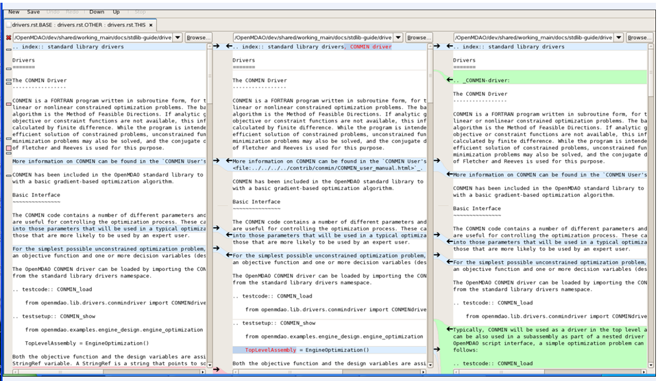

Useful Commands
===============

This section contains commands that developers would use on a regular basis when performing 
everyday tasks (such as branching and merging). Most of them are Bazaar commands; a few are scripts
or commands for local NASA Glenn developers only.

.. index:: Bazaar; commands

.. _Bazaar-Commands:

Bazaar Commands 
---------------

Please note that the OpenMDAO *Developer's Guide* contains everything you need to get started working,
including information on Bazaar setup, code location, and how to create your branch. The information here is a
quick reference for some common tasks you will be doing. 

.. note::
   - In the examples, the percent sign (%) represents the command-line prompt. 
   - Text included in pointy brackets means you have to supply a name or other
     information. For example, ``/OpenMDAO/dev/<your_working_directory>`` requires you
     to supply a name for the working directory, such as: ``pziegfel``.
   - The examples provided assume you are working on OpenMDAO's Linux server. 

References:

* Bazaar User Guide: http://doc.bazaar-vcs.org/latest/en/user-guide/index.html
* Bazaar in five minutes: http://doc.bazaar-vcs.org/latest/en/mini-tutorial/index.html
* Bazaar Tutorial: http://doc.bazaar-vcs.org/latest/en/tutorials/tutorial.html

.. index Bazaar commands

*Common Bazaar Commands*
++++++++++++++++++++++++

To use these commands, type ``bzr <command_name>``, for example ``bzr add``.

::
  
  add 		(Adds files/directories to the Bazaar repository on your branch.)
  branch	(Creates a new copy of a branch.)
  commit	(Commits changes into a new revision. You must add a commit message via "-m" or another text editor.)
  conflicts	(Lists files with conflicts.)
  log --forward	(Displays revisions on a branch. The "--forward" option means the most recent activity will be displayed last.)    
  merge		(Pulls in committed changes from another branch.)
  revert	(Cancels all changes since the last merge, so you revert to the previous revision.)
  status	(Displays pending changes, if any; if no uncommitted changes are pending, it returns to the prompt.)
  
Note that all files on your branch are available to be changed. By running the ``bzr status``
command, you can see all of the uncommitted changes on your branch. 

  
*Managing Files*
+++++++++++++++++

This section discusses some of the commands used to manage your files.

Creating a Directory
~~~~~~~~~~~~~~~~~~~~

If you want to create a new versioned directory, type the following:

::

  %bzr mkdir <directory_name>
  
  
Adding a File
~~~~~~~~~~~~~

To add a file or directory to the Bazaar repository on your branch, type:

::

  %bzr add
  
You can provide an argument with this command (i.e., a specific file name). If you add a
file whose parent directory is not versioned, Bazaar will automatically add the parent
directory and so on up to the root. 

If you use this command without an argument, Bazaar will add everything under the current
directory that has not yet been added to the repository.

After you type ``bzr add``, Bazaar will display a list of the files and directories that were added.

.. index:: removing a file/directory

Removing a File or Directory
~~~~~~~~~~~~~~~~~~~~~~~~~~~~

Bazaar's ``remove`` command is similar to the UNIX command, and either can be used to remove a file.

::

  %bzr remove <file_name>     (Bazaar "remove" command)
  %rm <file_name> 	      (UNIX "remove" command)
    
However, to remove a directory, it's easier to use the UNIX remove command (``rm``), as follows:

::
  
  %rm -rf <directory_name>    (Removes a directory and recursively removes the files in it.)

.. index:: moving a file/directory
.. index:: renaming a file/directory

Moving or Renaming a File
~~~~~~~~~~~~~~~~~~~~~~~~~

The move command (``bzr mv``) is used to rename or move a file, depending on the arguments you
provide. When moving a file, you must provide the path to the new location. When you
move a file, Bazaar deletes the file from its current location.

To rename or move a file, you must be in the directory containing the file you want to rename or move; then enter
the appropriate command. See the examples that follow: 

::

  %bzr mv <old_file_name> <new_file_name>                  (Renames a file)
  Example:
  %bzr mv test1.rst test2.rst                              (Renames "test1.rst" to "test2.rst")
  
  %bzr mv <file_to_move> <path_to_new_location><new_name>  (Moves and renames a file)
  Examples: 
  %bzr mv test1.rst ../user-guide/test2.rst                (Moves "test1.rst" to "user-guide" dir & renames it "test2.rst")   
  %bzr mv test1.rst ../user-guide/.                        (Moves "test1.rst" to "user-guide" dir & keeps the same name)

.. note::
   If you need to move an entire directory, use the ``bzr mv`` command, NOT the UNIX command, to ensure that
   the directory and all its files get moved correctly.

.. index:: diff command

Viewing Changes in a File
~~~~~~~~~~~~~~~~~~~~~~~~~

If you have edited a file and want to see what you have done, type:

::

  %bzr diff <file_name>
  
Bazaar will display the name of the modified file (the name you specified) and then list the additions and deletions with a
plus (+) or minus (-) sign in front of the changed lines.   	

.. index:: log command

Viewing the Revision Log
~~~~~~~~~~~~~~~~~~~~~~~~~

You can see the history of your branch by browsing its log. To see a complete list of revisions on the current branch
beginning with the first revision and displaying the most recent revision last, type: 

::

  %bzr log --forward 
  
Information will be provided about each revision, including:

  * Revision number
  * Name of the person who committed the revision
  * Name of branch where revision originated
  * Date/time the revision was committed
  * Commit message 

If you do not use the ``--forward`` option and merely type ``bzr log``, the first revision will be
displayed last, and you will have to scroll up to view the most recent revisions.

 

.. index:: branch; creating

*Creating a Branch from openmdao on Launchpad*
++++++++++++++++++++++++++++++++++++++++++++++

You need to be in your OpenMDAO working directory (e.g., pziegfel, ktmoore1), so type:

::

  %cd /OpenMDAO/dev/<your_working_directory>  	     (Takes you to your working_directory.)
  %bzr branch lp:openmdao <branchname>               (Creates branch from openmdao on Launchpad.)
  Example:
  %bzr branch lp:openmdao T30-user_guide_updates     (Creates branch: "T30-user_guide_updates" where "T30" is 
                                                     the Trac ticket number.)

Your Trac ticket number and branch number should correspond. When working on your branch, be sure
to add any new files that you create using the ``bzr add`` command. You can use the command to
add a specific file or directory (``bzr add <filename>``), but it's easier to type it by itself. In the
latter case, everything in the current directory will be added. So, if you enter the command at the top of
your branch, all unadded directories and files will be added.

.. index:: branch; building on

.. _Building-on-Your-Branch:

*Building on Your Branch*
+++++++++++++++++++++++++

If you are in your home directory, type:

::

  %cd /OpenMDAO/dev/<your_working_directory>/<branchname>  (Takes you to your branch.)
  %cd /buildout			                           (Takes you to the "buildout" directory.) 
  %repo.py fix					           (Cleans up permissions and files after branching from openmdao
							   trunk on Launchpad.)
  %python2.6 isolated_bootstrap.py                         (Runs the script needed before you can build the first time.)
  %bin/buildout			                           (Builds on your branch.)		
  %bin/docs			                           (Displays the documentation.)  			
  
.. note:: As mentioned above, you should run ``repy.py fix`` after you branch from Launchpad. Before building the first time
   on your branch, you must run the ``python2.6 isolated_bootstrap.py`` script. However, for subsequent builds, only
   ``bin/buildout`` is required  (or ``bin/sphinx-build`` to update just the documents.) 

.. index:: branch; merging to

*Merging openmdao to Your Branch*
+++++++++++++++++++++++++++++++++

As you work on your branch, you may want to update it from openmdao ``trunk`` on Launchpad to avoid conflicts
when you push back to the trunk (for those users who have permission to do this). Type:

::

  %cd /OpenMDAO/dev/<branchname>    (Takes you to the branch you want to merge to.)
  Example:
  %cd /OpenMDAO/dev/pziegfel/T30-user_guide_updates
  
  %bzr status		  	    (Checks your branch for uncommitted changes; you cannot merge if you have any.)
  
If you have uncommitted changes, use the ``bzr commit`` command (below). If you have no uncommitted changes, go
straight to the ``buildout`` directory.

::
  
  %bzr commit -m "<commit_message>"  (Commits changes and allows you to add a commit message on the command line. Omit the
				     "-m" and press "Enter" to enter the required a message using your default text editor.)
  %cd buildout 		             (Takes you to your "buildout" directory.])
  %bin/buildout		             (Makes sure your branch builds before you merge to it [and after your commit, if applicable].)
  %bin/docs 		             (Checks that docs display correctly. Optional if no doc changes.)	
  %bin/test --all 	             (Runs the test suite; all tests should pass before you merge.)
  %bzr merge lp:openmdao             (Merges from openmdao on Launchpad to your branch.)

*- If you have no conflicts,* you can continue. Type:

::

  %repo.py fix			       (Runs the cleanup script on your branch. Run this after merging or branching from Launchpad.)
  %bzr python2.6 isolated_bootstrap.py (Runs required script before first build after the merge.)
  %bin/buildout    		       (Builds on the branch after the merge.)
  %bin/test --all		       (Confirms that all tests pass.)
  
You may now continue working on your branch.

.. _`if-you-have-a-conflict`:

*- If you HAVE a conflict,* you must resolve it before proceeding. Bazaar will display the changes in files or directories and
will also indicate the number of conflicts and where they occurred. See the following example:

.. figure:: ../images/quick-ref/merge_conflict.png
   :align: center
   
   Example of Conflicts When Merging

In the above example the "+N" indicates new files or directories. The "M" indicates modified files or
directories. If a file or directory is deleted, "-D" appears before its name.

.. note:: The graphical interface is not part of Bazaar and is available only to
   developers at Glenn Research Center (GRC). 

To bring up a graphical interface for displaying the conflicts, type the following:

:: 
  			
  %conrez.py

Bazaar automatically creates three versions of the file in conflict, each with a
different suffix. The files appear in columns across the screen, left to right, in the
order listed here:

        | ``filename.BASE`` 	(original file)
	| ``filename.OTHER``	(file being merged)
	| ``filename.THIS``	(file you are merging to)

.. note::

   When you are pushing to ``trunk``, your file will be ``.OTHER`` and ``trunk`` will be ``THIS``.
   However, if you are merging out from ``trunk`` to update your branch, ``.OTHER`` will be ``trunk``,
   and ``.THIS`` will be your branch.

Conflicts will be displayed in colored text across all three files. See the following example:

   
   GUI Showing Versions of a File in Conflict
 
  
In the above example, a new index entry ``CONMIN driver`` shows up in the ``.OTHER`` file (blue background
and red text). In the ``.THIS`` file on the right, the text with the green background is new. 

In some cases, the difference may just be the way the text is formatted. You must look at the files and
decide which version to send to ``filename.THIS`` or if the file is okay as it is. If the ``.THIS`` file is
okay, you can keep scrolling down. However, if you have to update it, select the appropriate change and
click on the arrow next to it. If you make a mistake, you can select *undo* from the menu bar at the top of the screen.

You may have to scroll to the right to read each of the files. After you have reviewed the conflicts and
made your selections, save your changes and click the "X" in the upper right corner to exit.

When you exit you will be asked if you want to *Save Selected*. Assuming that you do, click that option
and then click *Yes* when asked to save the file. 

Make sure there are no more conflicts. If there are, resolve them as above. If there are none, you may build and
commit your changes. Type: 

::

  %bzr conflicts    		     (Checks to see if there are still conflicts. Displays them if there are.)
  %repo.py fix 	  		     (Runs the cleanup script on your branch. Run this after branching or merging from Launchpad.)
  %python2.6 isolated_bootstrap.py   (Required script that must be run before building the first time after branching or merging
                                     from Launchpad.)
                                     merging to a branch.)
  %bin/buildout 		     (Builds the branch.)						
  %bin/docs		             (Displays the documentation [optional].)
  %bin/test --all		     (All tests should pass before you commit.)	
  
You may now continue working on your branch.
 
.. index:: branch; merging from
 

*Pushing Your Branch to openmdao on Launchpad*
++++++++++++++++++++++++++++++++++++++++++++++

You need to commit your changes to your local repository before pushing your branch to openmdao. When you commit changes, you must
add comments. The "-m" option (see below) allows you to enter comments (they must start and end with double quotation marks) from
the command line. If you do not add "-m" and just press "Enter," your default text editor will automatically open a new file
where you must enter a commit message.

::

  %cd /OpenMDAO/dev/<your_working_directory>/<branch_name>    (Takes you to the branch to be merged.) 
  %bzr status			       (Checks for uncommitted changes. You cannot merge if there are any.)
  %bzr commit -m "<commit_message>"    (Needed only if you have uncommitted changes.)       
  %cd buildout			       (Takes you to the "buildout" directory.)
  %bin/buildout 		       (Builds your branch. You should be able to build without errors or warnings.)
  %bin/test --all	               (Runs the test suite. Tests should pass on your branch.)
  
Before you push your branch to the trunk, you must merge from openmdao to the branch you want to push.  

:: 
  
  %bzr merge lp:openmdao	       (Merges openmdao trunk to your branch.)  
  %cd buildout			       (Takes you to the "buildout" directory.)
  %repo.py fix			       (Runs the cleanup script on your branch. Run this after merging or branching from Launchpad.)
  %bzr python2.6 isolated_bootstrap.py (Runs the script required before you build.)
  %bin/buildout    		       (Builds on the branch after the merge.)
  %bin/test --all		       (Confirms that all tests pass.)
  
If you can build successfully and pass the tests after the merge, you may push your branch to openmdao. If you have any conflicts,
you must resolve them. See :ref:`if you have a conflict <if-you-have-a-conflict>`. After you have resolved any conflicts or if you
had none, type: 

::
  
  %cd ../                              (Takes you to the top of your branch.)
  %bzr push lp:openmdao                (Pushes your changes to openmdao trunk.)

This option makes your branch the latest revision on the trunk.

.. index:: merge; canceling
.. index:: reverting changes

.. _`Canceling-a-Merge-and-Reverting-Changes`:

*Canceling a Merge and Reverting Changes*
+++++++++++++++++++++++++++++++++++++++++

If you encounter a problem when merging openmdao to your branch, and the issue cannot be resolved quickly, you can cancel the
merge by using the ``revert`` command. Type:

::

  %bzr revert		(Reverts to the previous revision and removes uncommitted changes.)

You can also use this command if you do not want to commit changes you've made. In this case, it is a
good idea to see what files will be removed, so type:

::

  %bzr diff		(Shows differences [additions, deletions] between two files.)			      
  %bzr revert		(Reverts to the previous revision.)
  
  
.. index:: branch; working on

|

.. note:: The next two sections pertain only to developers at GRC.

Non-Bazaar Commands (for GRC Users)
-----------------------------------

*Editing/Debugging Source Code*
++++++++++++++++++++++++++++++++

Wing is a very nice integrated editor and debugger for Python that is available to
local OpenMDAO developers.  OpenMDAO comes with a buildout recipe called 
``openmdao.recipes:wingproj`` that will create a Wing project file with
Python path and executable settings that will make it work with the buildout.

To run Wing for your buildout, type:

::

    bin/wing
    
from your ``buildout`` directory. If the eggs used in your buildout change and you
re-run your buildout while Wing is still running, you will be notified by Wing
that your project settings have changed. Select *Discard Changes and Reload*
if your Wing path needs to be updated. Otherwise, select *Don't Reload* to
keep your existing project file. If your Wing project seems to not be working
properly after this happens, you can remove the Wing project file
(``<buildout_dir>/parts/wingproj/wingproj.wpr``) and re-run the buildout to
create a new one. 

.. index:: repo.py

*Repository Utility*
+++++++++++++++++++++

The script ``repo.py`` is a utility script for manipulating and navigating in repositories.

::

    Usage: repo.py OP [options] repository, where OP may be:
       check  -- check for lock
       lock   -- lock repository
       unlock -- unlock repository
       set    -- set this as current repository
       fix    -- fix permissions

    Options:
      -h, --help     show this help message and exit
      -f, --force    forced unlock
      -v, --verbose  print info messages

*Repository* is a directory under ``/OpenMDAO/dev/<username>`` or
``/OpenMDAO/dev/shared``.

The *check, lock*, and *unlock* operations can be used to avoid
more than one developer trying to update a shared repository at the same time.
Before making changes, do a *lock*.  If that succeeds, then proceed with
your changes and when complete, do an *unlock.*  If the *lock* fails, then
you'll know who to wait for.  The *check* operation will test for a locked
repository.  Note that no enforcement is done.  Locking/unlocking merely
sets a flag.  If people ignore this convention, then they can potentially
interfere with each other's changes to the shared repository.

The *set* operation sets the given repository directory as your current
repository.  This will start a new shell process with the ``OPENMDAO_REPO``
environment variable set to the full path of the repository.  The local
system scripts will use this to update your *PATH* so the ``buildout/bin``
and ``scripts`` directories are at the beginning.  You will also get some
convenient aliases for navigating around in the repository directory
structure.  Finally, if the repository is under ``/OpenMDAO/dev/shared``,
your umask will be set to 002, allowing others in the *mdao* group to
update files you own.

The *fix* operation is used to fix file permissions in shared repositories.
It will traverse the directory tree and try to ensure all operations enabled
for owner are also enabled for group.  If you don't own the file,
the operation will fail and the owner's user id will be reported.

