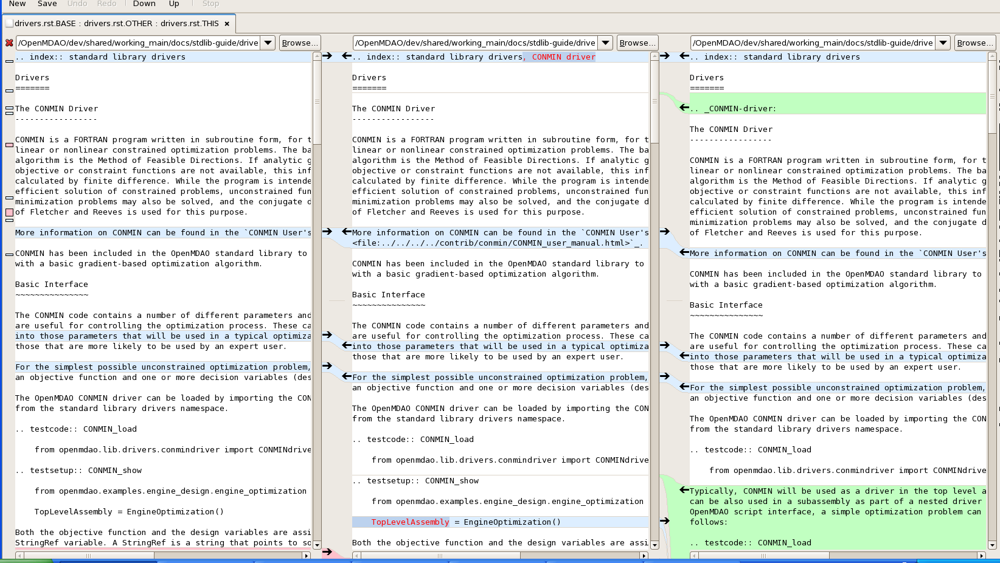

.. index:: Bazaar; commands

.. _Bazaar-Commands:

Bazaar Commands 
===============

Please note that the OpenMDAO *Developer's Guide* contains all the information you need
to get started working, including Bazaar setup, code location, and creating your branch. The
information here is a quick reference for some common tasks you will be doing. 

.. note::
   In the examples, the percent sign (%) represents the command-line prompt. 
   Text included in pointy brackets means you have to supply a name or other
   information. For example, ``/OpenMDAO/dev/<your_working_directory>`` requires you
   to supply a name for the working directory, such as: ``/OpenMDAO/dev/pziegfel``  

References:

* Bazaar User Guide: http://doc.bazaar-vcs.org/latest/en/user-guide/index.html
* Bazaar in Five Minutes: http://doc.bazaar-vcs.org/latest/en/mini-tutorial/index.html
* Bazaar Tutorial: http://doc.bazaar-vcs.org/latest/en/tutorials/tutorial.html

.. index:: branch; creating

Creating a Branch from working_main
-------------------------------------

You need to be in your OpenMDAO working directory (e.g., pziegfel, ktmoore1), so type:

::

  %cd /OpenMDAO/dev/<your_working_directory>  
  %bzr branch /OpenMDAO/dev/shared/working_main/ T<ticket#>-<branch_name>

Your Trac ticket number and branch number should correspond. When working on your branch, be
sure to add any new files that you create. This command will also list the files that were
added.

::

  %bzr add 

.. index:: branch; building on

.. _Building-on-Your-Branch:

Building on Your Branch
-----------------------

If you are in your home directory, type:

::

  %cd /OpenMDAO/dev/<your_working_directory>/T<ticket#>-<branch_name>
  %cd /buildout			
  %python2.6 isolatedbootstrap.py  
  %bin/buildout  			
  %bin/test --all		

.. note:: Always run the ``python2.6 isolatedbootstrap.py`` script the first time you build on a
   branch. For subsequent builds, only ``bin/buildout`` is required. 
   
   The test suite tests the code snippets in the documentation.

.. index:: branch; merging

Merging working_main to Your Branch
------------------------------------

As you work on your branch, you may want to update it every few days to avoid conflicts when you merge
back to ``working_main``. In the example that follows, we display the log first to see what was
recently committed:

::

  %cd /OpenMDAO/dev/shared/working_main
  %bzr log --forward 	(Using the "--forward" option will display the most recent activity last.) 
  %cd /OpenMDAO/dev/<your_working_directory>/T<ticket#>-<branch_name>   
  %bzr status
  %bzr commit -m "<commit comments>"         
  %cd buildout
  %bzr merge /OpenMDAO/dev/shared/working_main

You can check the Bazaar documentation for additional options to use with the *log* command to restrict
how much you see on the screen.

Resolve any conflicts that come up during the merge. See :ref:`if you have a conflict
<if-you-have-a-conflict>`. After you have resolved any conflicts, type:

::

  %bin/buildout

If you have any build errors or warnings, resolve them before continuing. When you can
build successfully without warnings, type the following:

::

  %bin/test --all
  %bzr status
  %bzr commit -m "<commit comments>"

Merging Your Branch to working_main
------------------------------------

You need to commit your changes before merging. When you commit changes, you
must add comments. If you forget to add "-m", you will automatically go into a
file in the NEdit text editor, where you will have to enter comments, save them,
and then exit the file.

::

  %cd /OpenMDAO/dev/<your_working_directory>/T<ticket#>-<branch_name>   
  %bzr status
  %bzr commit -m "<commit comments>"         
  %cd buildout
  %bin/buildout 
  %bin/test --all
  %cd /OpenMDAO/dev/shared/working_main
  %bzr status
  %bzr merge /OpenMDAO/dev/<your_working_directory>/T<ticket#>-<branch_name>

Bazaar will merge and then list all added, removed, and modified files. It will also
list any conflicts. 

- If you have **NO** conflicts, you can build, commit, and fix permissions:

::

  %cd /buildout			
  %python2.6 isolatedbootstrap.py   (Always run this script before building on working_main.)
  %bin/buildout 				
  %bin/test --all				
  %bzr status					
  %bzr commit -m "<commit comments>"	
  %repo.py fix 	             		  (Always run this script after building on work_main.)

The ``repo.py fix`` script fixes file permissions that may have gotten changed during the build process. 

.. _`if-you-have-a-conflict`:

- If you **HAVE** a conflict, you must resolve it:

Bazaar will display the number of conflicts and provide the path to the files in
conflict, as in the following example:

.. figure:: ../images/quick-ref/merge_conflict.png
   :align: center

   Example of Conflicts When Merging

To bring up a graphical interface for displaying the conflicts, type the following:

:: 
  			
  %conrez.py

Bazaar automatically creates three versions of the file in conflict, each with a
different suffix. The files appear in columns across the screen, left to right, in the
order listed here:

        | ``filename.BASE``   	 (original file)
	| ``filename.OTHER``  	 (the file being merged)
	| ``filename.THIS``  	 (the file you are merging to)

.. note::

   When you are mergeing to working_main, your file will be *.OTHER* and working_main will be *.THIS*.
   However, if you are merging out from working_main to update your branch, *.OTHER* will be working_main,
   and *.THIS* will be your branch.

Conflicts will be displayed in colored text across all three files. See the following example:

   GUI Showing Versions of a File in Conflict
  
In the above example, a new index entry *CONMIN driver* shows up in the *.OTHER* file (blue background
and red text). In the *.THIS* file on the right, the text with the green background is new. 

In some cases, the difference may just be the way the text is formatted. You must look at the files and
decide which version to send to ``filename.THIS`` or if the file is okay as it is. If the *.THIS* file is
okay, you can keep scrolling down. However, if you have to update it, select the appropriate change and
click on the arrow for that change. If you make a mistake, you can select *undo* from the menu bar at the
top of the screen.

You may have to scroll to the right to read each of the files. After you have reviewed the conflicts and
made your selections, save your changes and click the "X" in the upper right corner to exit.

When you exit you will be asked if you want to *Save Selected*. Assuming that you do, click that option
and then click *Yes* when asked to save the file. 

Make sure there are no more conflicts; then build and commit your changes by typing: 

::

  %bzr conflicts    	
  %cd /buildout			
  %python2.6 isolatedbootstrap.py  
  %bin/buildout 				
  %bin/test --all				
  %bzr status					
  %bzr commit -m "<commit comments>"	
  %repo.py fix 	  (Always run this script after building on work_main. It fixes permissions that may have gotten changed during the build process.) 

|

Canceling a Merge/Removing Uncommitted Changes
----------------------------------------------

If you have an issue that cannot be resolved quickly, you can cancel the merge by typing:

::

  %bzr revert

You can also use this command if you don't want to commit changes you've made. In this case, it's a
good idea to see what files will be removed, so type:

::

  %bzr diff					      
  %bzr revert

Removing a Directory and Its Files
----------------------------------

This is not a Bazaar command but a UNIX command for removing a directory and its files:

::

  %rm -rf <directory_name>
