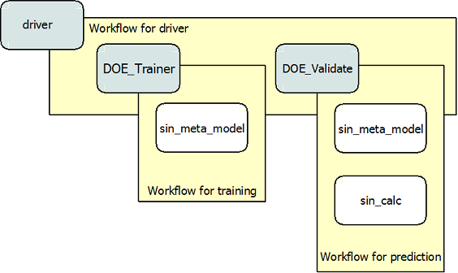

.. index:: NNSurr_Meta

Neural Network Surrogate Model
==================================

This tutorial is a demonstration of how to construct a MetaModel of a component using a
neural network surrogate. Generally, MetaModel capabilities are used to contruct a 
low cost replacement whcih can be used as opposed to an expensive component. A more detailed description of 
this class can be found under the source documentation for :ref:`MetaModel`. 

For this example, a component was written for the sine function. This component 
has only one input and output, which will be mimicked by the MetaModel. Had 
there been additional variables, access to those would also be available 
through the MetaModel.

.. testcode:: NN_MetaModel_parts

    from openmdao.main.api import Assembly, Component, SequentialWorkflow
    from math import sin
        
    from openmdao.lib.datatypes.api import Float
    from openmdao.lib.drivers.api import DOEdriver
    from openmdao.lib.doegenerators.api import FullFactorial, Uniform
    from openmdao.lib.components.api import MetaModel
    from openmdao.lib.casehandlers.api import DBCaseRecorder
    from openmdao.lib.surrogatemodels.api import NeuralNet
       
    class Sin(Component): 
        
        x = Float(0,iotype="in",units="rad",low=0,high=20)
        
        f_x = Float(0.0,iotype="out")
        
        def execute(self): 
            self.f_x = .5*sin(self.x)

To create a MetaModel, we first define an assembly to work in. After we have 
created an assembly, the MetaModel component needs to be instantiated. In this example, 
the MetaModel was instantiated as "sin_meta_model," making it easy to identify.

.. testcode:: NN_MetaModel_parts

    class Simulation(Assembly):        
        def __init__(self):
                super(Simulation,self).__init__()
    
        #Components
        self.add("sin_meta_model",MetaModel())      
        self.sin_meta_model.surrogate = {"default":NeuralNet()}  
        self.sin_meta_model.surrogate_args = {"default":{'n_hidden_nodes':5}}
        self.sin_meta_model.model = Sin()        
        self.sin_meta_model.recorder = DBCaseRecorder()

Once the MetaModel component is in place, the first step is to fill the `surrogate` slot. 
In this case we set the default to NeuralNet, meaning that all outputs would be modeled 
with NeuralNet surrogate models. However, surrogate models can be specified for 
specific output variables (again see the source docs for :ref:`MetaModel` for  more details).

To pass arguments to the surrogate model, ``surrogate_args`` is used.  For NeuralNet,
the number of hidden nodes within the neural network needs to be specified, and is 
currently set to 5. Note how it is specified that this variable is attributed to the 
"default" surrogate model. 

Only after the surrogate slot has been filled can you specify the component that is 
being modeled. This is done by placing the component in the slot called ``model``. 
For this case we are looking at the Sin component created earlier, so this is what's 
placed in the model slot. Once this has been put in, the MetaModel will now have the 
same inputs and outputs as our sine function.

Once the `surrogate` and `model` slots of the MetaModel have been filled, the MetaModel
is ready for training. 

.. testcode:: NN_MetaModel_parts

        #Training the MetaModel
        self.add("DOE_Trainer",DOEdriver())
        self.DOE_Trainer.DOEgenerator = FullFactorial()
        self.DOE_Trainer.DOEgenerator.num_levels = 50
        self.DOE_Trainer.add_parameter("sin_meta_model.x")
        self.DOE_Trainer.case_outputs = ["sin_meta_model.f_x"]
        self.DOE_Trainer.add_event("sin_meta_model.train_next")
        self.DOE_Trainer.recorder = DBCaseRecorder()
        self.DOE_Trainer.force_execute = True
        
In this case, we're going to train with a DOEdriver, called "DOE_Trainer".  
We specify a FullFactorial DOEgenerator, which creates a set of evenly spaced 
points across an interval. We (somewhat arbritrarily) selected 50 points for our training
set, specifed by ``num_levels`` under the DOEgenerator. The proper training set, is of course, 
highly problem dependent. The training interval, is based on the *low* and *high* values
specified in the Sin component, though they could have also been specified in the *add_parameter* call. 

When the ``train_next`` event is set, MetaModel passes the inputs to the model (i.e. Sin) to 
be run. The outputs generated by this run are stored to be used in the generation of a 
surrogate model. This storage occurs via the use of ``DBCaseRecorder()``, on which more 
information can be found under :ref:`caseiterdriver.py`.

Finally, ``force_execute`` is set to True to ensure that the component will always
run when its workflow is executed. 
 
Once the training portion has been completed, the validation/prediction phase is set up 
with another DOEDriver called "DOE_Validate." This time, the Uniform  DOEGenerator was used.  This 
provides a random sampling of points from within the range of input variables.  Twenty 
validation points are being used in this particular case. 

Here, "sin_calc" is also added, giving us the ability to generate data that can be used 
to check the accuracy of the surrogate model.

.. testcode:: NN_MetaModel_parts

        #MetaModel Validation
        self.add("sin_calc",Sin())
        self.add("DOE_Validate",DOEdriver())
        self.DOE_Validate.DOEgenerator = Uniform()
        self.DOE_Validate.DOEgenerator.num_samples = 20
        self.DOE_Validate.add_parameter(("sin_meta_model.x","sin_calc.x"))
        self.DOE_Validate.case_outputs = ["sin_calc.f_x","sin_meta_model.f_x"]
        self.DOE_Validate.recorder = DBCaseRecorder()
        self.DOE_Validate.force_execute = True
        
Notice that the``train_next`` event is not added to the DOE_Validate driver, like it was for
for the training driver.  MetaModel 
automatically runs in predict mode when this event is not set. MetaModel will then check 
for training data which will be used to generate a surrogate model for the provided outputs, 
using the given inputs. Since training data is required to run, the training mode must always 
be run prior to the running of predict mode. 

Now, the outputs of the MetaModel are the predicted outputs as determined by the surrogate 
model, NeuralNet. 

Before this can be implemented, the :ref:`iteration hierarchy` must be specified. The top
driver in any workflow must be called ``driver``, as seen in this example.  The type of 
workflow being executed is a sequential workflow, meaning that is a simple sequence of 
components. 

To this workflow, the two drivers that were created, 'DOE_Trainer' and 'DOE_Validate', are 
added. Furthermore, the individual components are added to each of the two new workflows. 
The training and prediction modes both include 'sin_meta_model' so that it can be trained 
and then used for prediction capabilities.  Then 'sin_calc' was added to the 
prediction workflow so that the comparative values can be generated. 

.. testcode:: NN_MetaModel_parts

        #Iteration Hierarchy
        self.driver.workflow = SequentialWorkflow()
        self.driver.workflow.add(['DOE_Trainer','DOE_Validate'])
        self.DOE_Trainer.workflow.add('sin_meta_model')
        self.DOE_Validate.workflow.add('sin_meta_model')
        self.DOE_Validate.workflow.add('sin_calc')

The following figure visually shows the iteration hierarchy for this MetaModel.  Note that
`sin_meta_model` appears in two workflows. This is necessary since in the training workflow 
the MetaModel is trained, and within the prediction workflow, that data is used to run the 
MetaModel again in order to create a prediction.  Thus it must be added to each workflow 
seperately.
   
.. _`nn_metamodel iteration hierarchy`:

   View of the Iteration Hierarchy

Finally, the first 2 lines of the following is the code required to actually run the 
MetaModel.  The remainder is how to access and print the data.  Using the data recorded 
by the implementation of ``DBCaseRecorder()``, we can access and print the run data. 
        
.. testcode:: NN_MetaModel_parts

    if __name__ == "__main__":
        
       
        sim = Simulation()
        sim.run()
                   
        #This is how you can access any of the data
        train_data = sim.DOE_Trainer.recorder.get_iterator()
        validate_data = sim.DOE_Validate.recorder.get_iterator()
        train_inputs = [case['sin_meta_model.x'] for case in train_data]
        train_actual = [case['sin_meta_model.f_x'] for case in train_data]
        inputs = [case['sin_calc.x'] for case in validate_data]    
        actual = [case['sin_calc.f_x'] for case in validate_data]  
        predicted = [case['sin_meta_model.f_x'] for case in validate_data]
    
    
        for a,p in zip(actual,predicted): 
            print "%1.3f, %1.3f"%(a,p)
            
To view this example, and try running and modifying the code for yourself, you can download it here:
:download:`NN_Sin.py </../examples/openmdao.examples.metamodel_tutorial/openmdao/examples/metamodel_tutorial/NN_Sin.py>`.