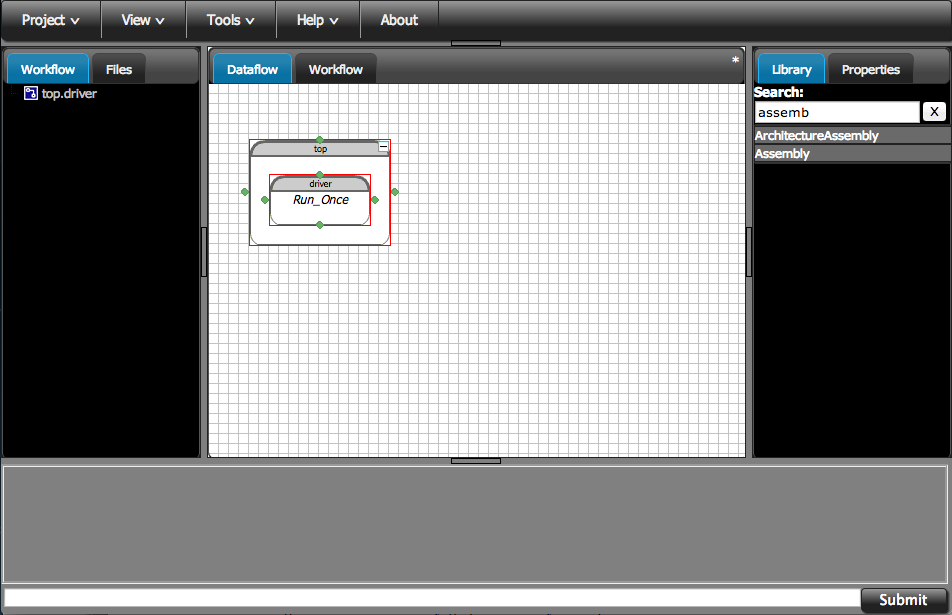

.. index:: geometry

.. _`doe-geometry`:

Design of Experiments with Geometry
===================================

In the overview tutorial for geometry support in OpenMDAO, a very simple example was given
of including geometry into OpenMDAO and displaying it. This example
will demonstrate the use of a geometry object as part of a design
of experiments (DOE). This tutorial will dynamically show how the
design of a simple jet engine nozzle can be varied as part of a DOE.

.. note:: This tutorial will be done in the OpenMDAO GUI. In addition, a script
  version of this tutorial is given in the examples directory of the 
  OpenMDAO distribution, specifically 
  ``examples/openmdao.examples.nozzle_geometry_doe/openmdao/examples/nozzle_geometry_doe``.

Start by creating a new clean project in the GUI. We'll name it `DOE Geometry
Tutorial`.  As in the overview tutorial, first, you should
create an instance of an assembly to work in. On the right-hand side, there is a
Library tab with a text box at the top. In the box type "assemb" and hit enter.
This will filter down the whole library so you can find things easier. Drag the
``Assembly`` and drop it into the workspace. Name it `top.`

   Creating the initial assembly

So now go back to the Library and change the filter text to "geom" and hit enter. 
Drag the ``GeomComponent`` instance and drop it into the `top` assembly.
Name it `geom` when prompted.  Whenever you want to work with geometry, 
you will always start with ``GeomComponent``. 

Now we need to add to our project a parametric geometry file that represents the nozzle geometry.
Select the Files tab on the left side of the GUI. 

