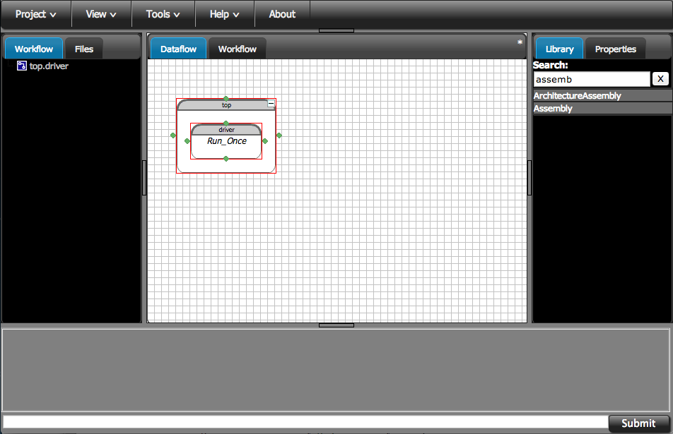
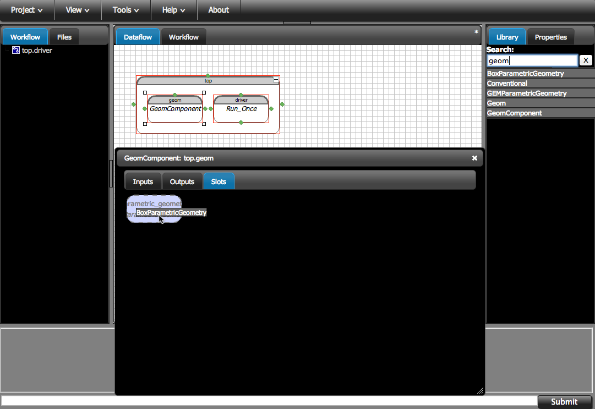
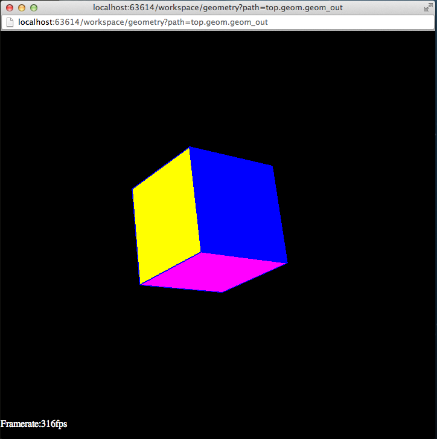
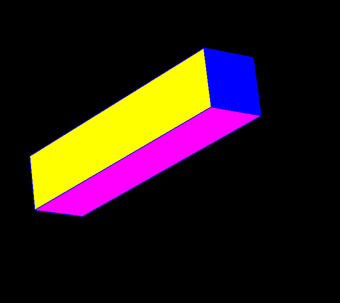

.. index:: geometry

.. _`working-with-geometry`:

Basic Geometry
===========================

OpenMDAO fully supports integrating geometry into a modeling process. 
Before we start working with geometry, let's understand how OpenMDAO was 
designed to interact with geometry. The ``GeomComponent`` class, from 
``openmdao.lib.components.api``,  allows you to plug in the parametric 
geometry engine of your choice and specify a particular geometry model 
to work with. 

.. note:: We're going to work this tutorial in the OpenMDAO GUI. When 
  you're working with geometry, it's nice to be able to see what you're 
  building, and the GUI has a built-in viewer that makes this easy. If you 
  don't know how to use the GUI, check out the instructions in the  
  :ref:`GUI-OpenMDAO` section to get started.

  You could also build a script file that does the same thing we're 
  doing in the GUI. At the end of the tutorial, we'll show you what 
  that would look like, but you won't be able to visualize the results in a
  viewer. 

Start by creating a new clean project in the GUI. We'll name it `Geometry
Tutorial`.  You'll be greeted by a totally blank project page. First, you should
create an instance of an assembly to work in. On the right-hand side, there is a
Library tab with a text box at the top. In the box type "assemb" and hit enter.
This will filter down the whole library so you can find things easier. Drag the
``Assembly`` and drop it into the workspace. Name it `top.`

   Creating the initial assembly

So now go back to the Library and change the filter text to "geom" and hit enter. 
Drag the ``GeomComponent`` instance and drop it into the `top` assembly.
Name it `geom` when prompted.  Whenever you want to work with geometry, 
you will always start with ``GeomComponent``. No actual geometry has been 
loaded yet, so the ``geom`` instance is pretty boring. If you double-click 
on it, a component editor window will come up with nothing much in it. 

.. note:: Depending on the plugins you have installed and the names of classes 
  you've defined in your project (if any), what shows up when you filter the
  library might be slightly different from what we have here.

So now let's add a very simple geometry model of a box. First, switch  over to
the Slots tab in the editor window for `geom.` Find ``BoxParametricGeometry`` in
the Library pane and drag it into the ``parametric_geometry`` slot.  When you're
done, it should look like this:

   Dropping BoxParametricGeometry into the slot
   
Do you want to see what your newly added geometry model of a box looks like? Click 
on the Outputs tab of the editor window and then click the `View Geom` button next
to the ``geom_out`` variable. This will bring up the 3D viewer in a separate 
window. 

   Initial box geometry

This *VERY* simple model lets you control the height of the box, which is its only
parameter. So switch to the Inputs tab in the editor  window and you should see
the `height` variable. Set it to a new value, such as 10. Now, go back to the 3D
editor window. Nothing changed!  ``GeomComponent`` is just like any other OpenMDAO
Component; it needs to be  `run` before the new outputs can be calculated with
the new input values.  So right-click on `geom` and select `run`. Now the viewer
will  update with the new geometry, and you can see how it got much taller. 

   Box with height=10

Auto Run
-------------

Sometimes when you're working with geometry, the extra step of calling ``run`` will be a
bit tedious. On the Inputs tab is an input called ``auto_run``, which you can set to True.
When the value is set to True, the component will run itself whenever a new value is set
for one of its parameters. The viewer will update automatically as well. This makes it
nice for playing with parameters and seeing the results quickly; but for any kind of
actual optimization, this can cause a lot of extra executions of your geometry component as
different variables are set at different times. So make sure that you set ``auto_run`` to
False before you do any kind of DOE or optimization work. 

Working with a Script
------------------------

Below you can see how you would set up this tutorial in a script. It's pretty 
straight forward, but as we said before, you won't be able to render the geometry 
in the viewer this way. 

.. testcode:: box_geom_model

    from openmdao.main.api import Assembly
    from openmdao.lib.components.api import GeomComponent
    from openmdao.lib.geometry.box import BoxParametricGeometry
        
    class GeomAsmb(Assembly): 

        def configure(self): 
            self.add('geom', GeomComponent())
            self.geom.add('parametric_geometry', BoxParametricGeometry())
            self.driver.workflow.add('geom')

    if __name__ == "__main__": 
    
        top = GeomAsmb()
        top.run()
        print "box volume: %3.2f"%top.geom.volume   

        top.geom.height = 10
        top.run()
        print "new box volume: %3.2f"%top.geom.volume 

Next Steps
-----------------
That is pretty much it for the basics of working with geometry in OpenMDAO. 
Obviously for any real work, you'd want to use a more complex geometry model. 
Our next tutorial will cover working with a more substantial geometry model, but 
to do that we'll have to install a plugin that has a more powerful geometry engine. 

