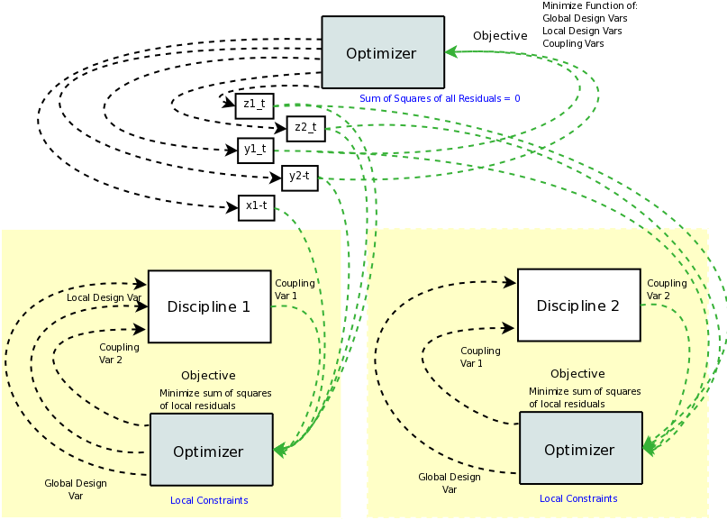
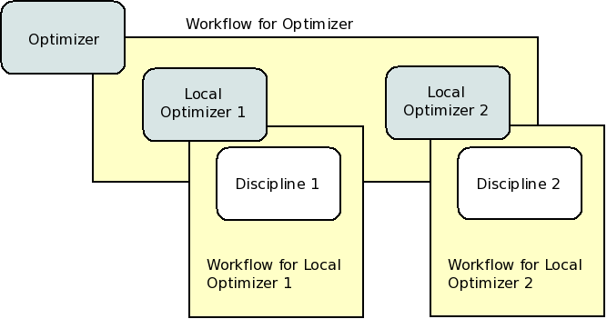

.. index:: Collaborative Optimization (CO)

.. _Collaborative-Optimization-(CO):

Collaborative Optimization (CO)
===============================

Next, we will set up a model that solves the Sellar problem by Collaborative
Optimization (CO). CO is a two-level architecture with three optimizer loops,
one at each discipline, and one acting globally. The global optimizer drives
the design and coupling variables towards an optimal solution that minimizes
the objective while constraining to zero the sum of the squares of the
residuals between the values commanded by the global optimizer and those set
by the local optimizers. Each local optimizer operates on its own
discipline, driving its design variables while minimizing the residual between
the actual value of the design variables and the values commanded by the global
optimizer.

Unlike IDF and MDF, for CO the global optimizer does not work directly with any of the inputs in any of the
disciplines. Instead, the global optimizer works on a set of copies of the global design variables. These
copies are sometimes called *targets*, and we create a few arrays to hold these target variables. Each discipline
has its own  local optimization which works with the local input associated with the global target. This is all
represented in the figure below, and it's a bit of a mess. You can see that it's important to separate data
flow and workflow to help keep things manageable. 

   
   Data Flow for CO

The CO model has three optimizers, so there are three workflows. The top level
workflow includes just the two lower level optimizers, and each of those optimizers has a 
workflow with just the discipline component. This can be seen in the next figure.
   

      
   Iteration Hierarchy for CO

First, we define the global target variables, create the component instances, 
and set up this iteration hierarchy. Pay special attention to how we define the
variables. Notice that the `iotype` metadata is not set at all. Normally 
you would set ``iotype="in"`` or ``iotype="out"`` when you create a variable. In this 
case, the variables are neither inputs nor outputs to the assembly. Instead, they are
meant only to be internal variables, varied by the top level driver and used 
in the lower level optimization objectives. Hence, no iotype is set. 
        
.. testcode:: CO_parts

        from openmdao.lib.datatypes.api import Array
        from openmdao.main.api import Assembly, set_as_top
        from openmdao.lib.drivers.api import SLSQPdriver
        from openmdao.lib.optproblems import sellar
        
        
        class SellarCO(Assembly):
            """Solution of the sellar analytical problem using CO.
            """
            
            global_des_var_targets = Array([5.0,2.0], iotype='in')
            local_des_var_targets = Array([1.0,], iotype='in')
            coupling_var_targets = Array([3.16,0], iotype='in')
        
            def configure(self):
                
                # Global Optimization
                self.add('driver', SLSQPdriver())
                self.add('localopt1', SLSQPdriver())
                self.add('localopt2', SLSQPdriver())
                self.driver.workflow.add(['localopt1', 'localopt2'])
                
                # Local Optimization 1
                self.add('dis1', sellar.Discipline1())
        
                # Local Optimization 2
                self.add('dis2', sellar.Discipline2())

Since there are no data connections, we never need to call ``self.connect``.

Now we need to set up the parameters for the outer optimization loop. 

.. testcode:: CO_parts
    :hide:
    
    self = set_as_top(SellarCO())

.. testcode:: CO_parts

                #Parameters - Global Optimization
                self.driver.add_objective('(local_des_var_targets[0])**2 + global_des_var_targets[1] + coupling_var_targets[0] + math.exp(-coupling_var_targets[1])')
                self.driver.add_parameter('global_des_var_targets[0]', low=-10.0, high=10.0)
                self.driver.add_parameter('global_des_var_targets[1]', low=0.0,   high=10.0)
                
                self.driver.add_parameter('coupling_var_targets[0]', low=-1e99,  high=1e99)
                self.driver.add_parameter('coupling_var_targets[1]', low=-1e99, high=1e99)
                self.driver.add_parameter('local_des_var_targets[0]', low=0.0,   high=10.0)
                
                con1 = '(local_des_var_targets[0]-dis1.x1)**2 + ' \
                       '(global_des_var_targets[0]-dis1.z1)**2 + ' \
                       '(global_des_var_targets[1]-dis1.z2)**2 + ' \
                       '(coupling_var_targets[1]-dis1.y2)**2 + ' \
                       '(coupling_var_targets[0]-dis1.y1)**2 <= .001'
                
                con2 = '(global_des_var_targets[0]-dis2.z1)**2 + ' \
                       '(global_des_var_targets[1]-dis2.z2)**2 + ' \
                       '(coupling_var_targets[0]-dis2.y1)**2 + ' \
                       '(coupling_var_targets[1]-dis2.y2)**2 <= .001'
                self.driver.add_constraint(con1)
                self.driver.add_constraint(con2)
                
                self.printvars = ['dis1.y1', 'dis2.y2']
                self.driver.iprint = 0

Here we are able to build a complicated expression for the sum of the squares
of all of the residuals and use it as our constraint. This is another
example of a constraint that could be better served as an equality constraint, 
but there is some research which indicates the performance of CO can be 
improved by switching to an inequality constraint with a small, but non-zero
tolerance. We created two constraints, one for each discipline.

Finally, we set up our local optimization loops.

.. testcode:: CO_parts
    :hide:
    
    self = set_as_top(SellarCO())
    
.. testcode:: CO_parts

        #Parameters - Local Optimization 1
        """self.localopt1.add_objective('(global_des_var_targets[0]-dis1.z1)**2 + '
                                   '(global_des_var_targets[1]-dis1.z2)**2 + '
                                   '(local_des_var_targets[0]-dis1.x1)**2 + '
                                   '(coupling_var_targets[0]-dis1.y1)**2 + '
                                   '(coupling_var_targets[1]-dis1.y2)**2')"""
        
        self.localopt1.add_objective('(local_des_var_targets[0]-dis1.x1)**2 + '
                                     '(global_des_var_targets[0]-dis1.z1)**2 + '
                                     '(global_des_var_targets[1]-dis1.z2)**2 + '
                                     '(coupling_var_targets[1]-dis1.y2)**2 + '
                                     '(coupling_var_targets[0]-dis1.y1)**2')
        self.localopt1.add_parameter('dis1.x1', low = 0.0,   high = 10.0)        
        self.localopt1.add_parameter('dis1.z1', low = -10.0, high = 10.0)
        self.localopt1.add_parameter('dis1.z2', low = 0.0,   high = 10.0)
        self.localopt1.add_parameter('dis1.y2', low = -1e99, high = 1e99)
        self.localopt1.add_constraint('3.16 < dis1.y1')
        self.localopt1.iprint = 0

        
        #Parameters - Local Optimization 2
        self.localopt2.add_objective('(global_des_var_targets[0]-dis2.z1)**2 + '
                                   '(global_des_var_targets[1]-dis2.z2)**2 + '
                                   '(coupling_var_targets[0]-dis2.y1)**2 + '
                                   '(coupling_var_targets[1]-dis2.y2)**2')
        self.localopt2.add_parameter('dis2.z1', low = -10.0, high = 10.0)
        self.localopt2.add_parameter('dis2.z2', low = 0.0,   high = 10.0)
        self.localopt2.add_parameter('dis2.y1', low = -1e99, high = 1e99)
        self.localopt2.add_constraint('dis2.y2 < 24.0')
        self.localopt2.iprint = 0

This problem is contained in 
:download:`sellar_CO.py </../examples/openmdao.examples.mdao/openmdao/examples/mdao/sellar_CO.py>`. 

Executing it at the command line should produce
output that resembles this:

::

        $ python sellar_CO.py
        Minimum found at (1.977769, 0.000000, 0.000000)
        Minimum target was at (1.978398, -0.000000, 0.000006)
        Couping vars: 3.160216, 3.756415
        Couping var targets: 3.160000, 3.756708
        Minimum objective:  3.18336051509
        Elapsed time:  1.83842110634 seconds

