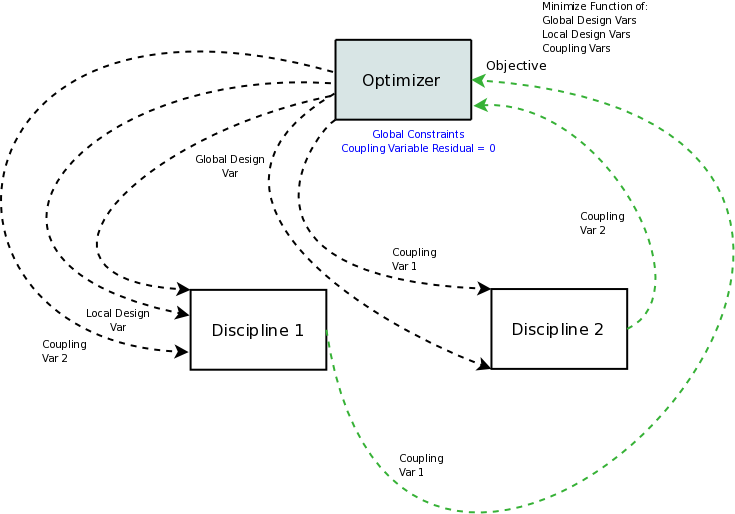
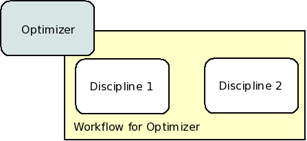

.. index:: Individual Design Feasible (IDF)

.. _Individual-Design-Feasible-(IDF):
        
Individual Design Feasible (IDF)
=================================

Next, we will look at how to set up the Individual Design Feasible (IDF) architecture for the Sellar
problem. In IDF, the direct coupling between the disciplines is removed, and the input coupling
variables are added to the optimizer's design variables. The algorithm calls for two new equality
constraints that enforce the coupling between the disciplines. This ensures that the solution is a
feasible coupling, though it is achieved through the optimizer's additional effort instead of a
solver. The data flow for IDF is illustrated in the following diagram:

   
   Data Flow for IDF
   
IDF needs only one driver, so there is just one workflow where the two disciplines are executed sequentially.
From the perspective of the iteration hierarchy, IDF is extremely simple.
   

    
   Iteration Hierarchy for IDF
   
To implement IDF, we create the ``SellarIDF`` assembly. First, all of our components
are instantiated and the workflow is defined.
   
.. testcode:: IDF_parts

        from openmdao.main.api import Assembly, set_as_top
        from openmdao.lib.drivers.api import SLSQPdriver
        
        from openmdao.lib.optproblems import sellar
        
        class SellarIDF(Assembly):
            """ Optimization of the Sellar problem using IDF"""
            
            def configure(self):
                """ Creates a new Assembly with this problem
                
                Optimal Design at (1.9776, 0, 0)
                
                Optimal Objective = 3.18339"""
                        
                # create Optimizer instance
                self.add('driver', SLSQPdriver())
        
                # Disciplines
                self.add('dis1', sellar.Discipline1())
                self.add('dis2', sellar.Discipline2())
                
                # Driver process definition
                self.driver.workflow.add(['dis1', 'dis2'])

That's all it takes to set up the workflow for IDF. All that is left to do is set up the
optimizer.  In the code below, pay attention to how we handle the global design variables ``z1`` and
``z2``. We set them up the same way we did for the MDF architecture. However, unlike the MDF, the
coupling variables are also included as optimizer  parameters.

.. testcode:: IDF_parts
    :hide:
    
    self = set_as_top(SellarIDF())

.. testcode:: IDF_parts

        # Optimization parameters
        self.driver.add_objective('(dis1.x1)**2 + dis1.z2 + dis1.y1 + math.exp(-dis2.y2)')
        
        #Global Design Variables
        self.driver.add_parameter(('dis1.z1','dis2.z1'), low = -10.0, high=10.0)
        self.driver.add_parameter(('dis1.z2','dis2.z2'), low = 0.0,   high=10.0)
        
        #Local Design Variables and Coupling Variables
        self.driver.add_parameter('dis1.x1',      low = 0.0,   high=10.0)
        self.driver.add_parameter('dis2.y1',      low = -1e99, high=1e99)
        self.driver.add_parameter('dis1.y2',      low = -1e99, high=1e99)
        self.driver.add_constraint('3.16 < dis1.y1')
        self.driver.add_constraint('dis2.y2 < 24.0')
            
        self.driver.add_constraint('(dis2.y1-dis1.y1)**2 <= 0')
        self.driver.add_constraint('(dis2.y2-dis1.y2)**2 <= 0')
  
        self.driver.iprint = 0
        

Technically, IDF requires the use of equality constraints to enforce coupling between the
disciplines.  Not all optimizers support explicit equality constraints, so we have to fall back on a
trick where we replace it with an equivalent pair of inequality constraints. For example, if we want
to constrain ``x=2``, we could constraint ``x<=2`` and ``x>=2`` and let the optimizer converge to a
solution where both constraints are active. Or we could condense  that to a single constraint of
``(x-2)**2<=0``.  SLSQP is a sequential quadratic programming algorithm that actually does support
equality constraints,  but we've left the inequality forms in there to make it easier to try other
optimziers if you want to. 

By the way, you might consider trying a fancier solution such as constraining ``abs(dis2.y1-dis1.y1)<=0``. 
Be careful though, because this nonlinear constraint has a discontinuous slope which can make it 
very hard for some optimizers to converge. Use the squared form of the constraint, as we did in our 
sample code, instead. 

When we put it all together, we get :download:`sellar_IDF.py
</../examples/openmdao.examples.mdao/openmdao/examples/mdao/sellar_IDF.py>`.  Once again, we added a
small amount of code at the end to execute and then print the results of the IDF optimization. 

.. testcode:: IDF_full

        from openmdao.main.api import Assembly
        from openmdao.lib.drivers.api import SLSQPdriver
        
        from openmdao.lib.optproblems import sellar
        
        
        class SellarIDF(Assembly):
            """ Optimization of the Sellar problem using IDF"""
            
            def configure(self):
                """ Creates a new Assembly with this problem
                
                Optimal Design at (1.9776, 0, 0)
                
                Optimal Objective = 3.18339"""
                        
                # create Optimizer instance
                self.add('driver', SLSQPdriver())
        
                # Disciplines
                self.add('dis1', sellar.Discipline1())
                self.add('dis2', sellar.Discipline2())
                
                # Driver process definition
                self.driver.workflow.add(['dis1', 'dis2'])
                
        
                # Optimization parameters
                self.driver.add_objective('(dis1.x1)**2 + dis1.z2 + dis1.y1 + math.exp(-dis2.y2)')
                
                #Global Design Variables
                self.driver.add_parameter(('dis1.z1','dis2.z1'), low = -10.0, high=10.0)
                self.driver.add_parameter(('dis1.z2','dis2.z2'), low = 0.0,   high=10.0)
                
                #Local Design Variables and Coupling Variables
                self.driver.add_parameter('dis1.x1',      low = 0.0,   high=10.0)
                self.driver.add_parameter('dis2.y1',      low = -1e99,  high=1e99)
                self.driver.add_parameter('dis1.y2',      low = -1e99, high=1e99)
                self.driver.add_constraint('3.16 < dis1.y1')
                self.driver.add_constraint('dis2.y2 < 24.0')
                    
                self.driver.add_constraint('(dis2.y1-dis1.y1)**2 <= 0')
                self.driver.add_constraint('(dis2.y2-dis1.y2)**2 <= 0')
          
                self.driver.iprint = 0
        
        
        if __name__ == "__main__":
            import time
            
            prob = SellarIDF()
            
            # pylint: disable-msg=E1101
                
            prob.dis1.z1 = prob.dis2.z1 = 5.0
            prob.dis1.z2 = prob.dis2.z2 = 2.0
            prob.dis1.x1 = 1.0
            prob.dis2.y1 = 3.16
            
            tt = time.time()
            prob.run()
        
            print "\n"
            print "Minimum found at (%f, %f, %f)" % (prob.dis1.z1, \
                                                     prob.dis2.z2, \
                                                     prob.dis1.x1)
            print "Couping vars: %f, %f" % (prob.dis1.y1, prob.dis2.y2)
            print "Minimum objective: ", prob.driver.eval_objective()
            print "Elapsed time: ", time.time()-tt, "seconds"

Executing this at the command line should produce
output that resembles this:

::

        $ python sellar_IDF.py
        Minimum found at (1.976427, 0.000000, 0.000000)
        Couping vars: 3.159994, 3.755276
        Minimum objective:  3.18022323743
        Elapsed time:  0.200541973114 seconds

