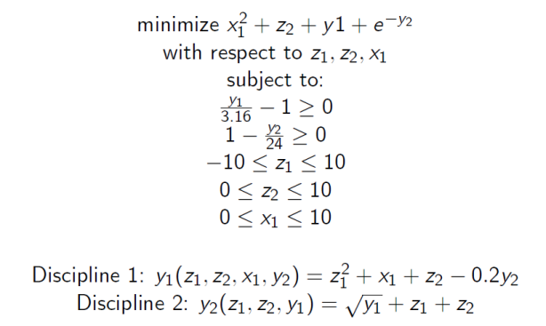

.. index:: MDAO tutorial problem

The Sellar Problem
==================

We will cover some of the more advanced capabilities of OpenMDAO. You should read and
understand :ref:`optimization_tutorial` and :ref:`Tutorial:-MetaModel` before starting this one. 

This tutorial illustrates the features of OpenMDAO that support the use of decomposition-based MDAO
architectures, such as:

#. Multidisciplinary Design Feasible (MDF)
#. Independent Design Feasible (IDF)
#. Collaborative Optimization (CO)

First we'll walk through the manual implementation of these architectures on a simple 
example problem. This will introduce you to using iteration hierarchy, metamodeling, 
and Design of Experiments (DOE) to construct different kinds of optimization processes. 
Understanding this section is important if you want to implement a new MDAO architecture 
or an existing one that is not currently available within OpenMDAO.

Once you understand how to construct an MDAO architecture by hand, you'll see that it can
take a good amount of work to set up.  That's why we'll show you how to set up your problem so you can
automatically apply a number of different MDAO architectures. Using the automatic implementation of an architecture
will dramatically simplify your input files.

.. index:: Sellar

All of these tutorials use the Sellar Problem, which consists of two disciplines as follows:

 
Variables *z1, z2,* and *x1* are the design variables over which we'd like to minimize
the objective. Both disciplines are functions of *z1* and *z2,* so they are called the 
*global* design variables, while only the first discipline is a function of *x1,* so it
is called the *local* design variable. The two disciplines are coupled by the
coupling variables *y1* and *y2.* Discipline 1 takes *y2* as an input, and computes *y1* as
an output, while Discipline 2 takes *y1* as an input and computes *y2* as an output. As
such, the two disciplines depend on each other's output, so iteration is required to
find a set of coupling variables that satisfies both equations.

Disciplines 1 and 2 were implemented in OpenMDAO as components.

.. testcode:: Disciplines

    from openmdao.main.api import Component
    from openmdao.lib.datatypes.api import Float
    
    
    class Discipline1(Component):
        """Component containing Discipline 1"""
        
        # pylint: disable-msg=E1101
        z1 = Float(0.0, iotype='in', desc='Global Design Variable')
        z2 = Float(0.0, iotype='in', desc='Global Design Variable')
        x1 = Float(0.0, iotype='in', desc='Local Design Variable')
        y2 = Float(0.0, iotype='in', desc='Disciplinary Coupling')
    
        y1 = Float(iotype='out', desc='Output of this Discipline')        
    
            
        def execute(self):
            """Evaluates the equation  
            y1 = z1**2 + z2 + x1 - 0.2*y2"""
            
            z1 = self.z1
            z2 = self.z2
            x1 = self.x1
            y2 = self.y2
            
            self.y1 = z1**2 + z2 + x1 - 0.2*y2
    
    
    
    class Discipline2(Component):
        """Component containing Discipline 2"""
        
        # pylint: disable-msg=E1101
        z1 = Float(0.0, iotype='in', desc='Global Design Variable')
        z2 = Float(0.0, iotype='in', desc='Global Design Variable')
        y1 = Float(0.0, iotype='in', desc='Disciplinary Coupling')
    
        y2 = Float(iotype='out', desc='Output of this Discipline')        
    
            
        def execute(self):
            """Evaluates the equation  
            y1 = y1**(.5) + z1 + z2"""
            
            z1 = self.z1
            z2 = self.z2
            
            # Note: this may cause some issues. However, y1 is constrained to be
            # above 3.16, so lets just let it converge, and the optimizer will 
            # throw it out
            y1 = abs(self.y1)
            
            self.y2 = y1**(.5) + z1 + z2
            
``Discipline2`` contains a square root of variable *y1* in its calculation. For negative values
of *y1,* the result would be imaginary, so the absolute value is taken before the square root
is applied. This component is clearly not valid for ``y1 < 0``, but some solvers could 
occasionally force *y1* to go slightly negative while trying to converge the two disciplines . The inclusion
of the absolute value solves the problem without impacting the final converged solution.

These two components are contained in the file :download:`sellar.py 
</../openmdao.lib/src/openmdao/lib/optproblems/sellar.py>` in the  ``openmdao.lib.optproblems`` sub-package.
This part of the standard library contains a number of common optimization problems which you can use to test
your own optimization algorithms. 

Now that you have defined the components for the Sellar Problem for yourself, let's take a momement to
consider what we have really accomplished. Firstly, we have written two (very simple) analysis components. 
If you were working on a real problem, these would likely come in the form of some much more complex tools
that you wrapped in the framework. But keep in mind that from an optimization point of view, whether they 
are simple tools or wrappers for real analyses, OpenMDAO still views them as components with inputs, outputs, 
and an execute function. 

We have talked about the problem formulation and specified that certain variables will be 
design variables, while others are coupling variables. But none of the code we have written has told 
OpenMDAO about those details. That's what we'll get to next! 

**Reference:**

Sellar, R. S., Batill, S. M., and Renaud, J. E., "Response Surface Based,
Concurrent Subspace Optimization for Multidisciplinary System Design,"
*Proceedings References 79 of the 34th AIAA Aerospace Sciences Meeting and
Exhibit,* Reno, NV, January 1996.

