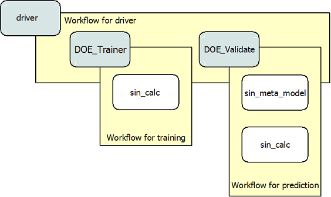

.. index:: single-output metamodel

.. _`Using-a-MetaModel-Component`:

Using a MetaModel Component
===========================

This tutorial is a demonstration of how to construct a MetaModel of a component using a
Kriging surrogate. Generally, MetaModel capabilities are used to construct a 
low computational cost replacement for an expensive component. (A more detailed description of 
this class can be found under the source documentation for :ref:`MetaModel`.) 

For this example, a component was written for the ``sine`` function. This component 
has only one input and one output, which will be mimicked by the MetaModel. Had 
there been additional variables, access to those would also be available 
through the MetaModel.

.. testcode:: MetaModel_parts

    from openmdao.main.api import Assembly, Component, SequentialWorkflow, set_as_top
    from math import sin

    from openmdao.lib.datatypes.api import Float
    from openmdao.lib.drivers.api import DOEdriver
    from openmdao.lib.doegenerators.api import FullFactorial, Uniform
    from openmdao.lib.components.api import MetaModel
    from openmdao.lib.casehandlers.api import CSVCaseRecorder
    from openmdao.lib.surrogatemodels.api import KrigingSurrogate

    class Sin(Component): 
    
        x = Float(0,iotype="in",units="rad")
    
        f_x = Float(0.0,iotype="out")
    
        def execute(self): 
            self.f_x = .5*sin(self.x)
    
To create a MetaModel, we first define an assembly to work in. After we have 
created an assembly, the MetaModel component needs to be instantiated. In this example, 
the MetaModel was instantiated as ``sin_meta_model``, making it easy to identify.

Once the MetaModel component is in place, the first step is to tell the MetaModel which component
it should create an approximation for.  We do this by placing the component in the :term:`Slot`
called `model`.  For this case we are looking at the Sin component created earlier, so this is
what's  placed in the model Slot. The MetaModel will now have the  same inputs and outputs as our
``sine`` component (an input named `x` and an output named `f_x` copied directly from the names in
the Sine component). 

The next step is to fill the ``default_surrogate`` Slot. In this case we set it to
KrigingSurrogate, meaning that all outputs will be modeled  with Kriging surrogate models, unless
otherwise specified. Specific surrogate models can be specified for  specific output variables. We
cover that in the next tutorial.

.. testcode:: MetaModel_parts

    class Simulation(Assembly):        
        def configure(self):

            #Components
            self.add("sin_meta_model",MetaModel())
            self.sin_meta_model.default_surrogate = KrigingSurrogate()
            self.sin_meta_model.model = Sin()

Once the `model` and ``default_surrogate`` Slots of the MetaModel have been filled, the MetaModel
is ready for training. 

 .. testcode:: MetaModel_parts
    :hide:
    
    self =set_as_top(Simulation())

.. testcode:: MetaModel_parts

            #Training the MetaModel
            self.add("DOE_Trainer",DOEdriver())
            self.DOE_Trainer.DOEgenerator = FullFactorial()
            self.DOE_Trainer.DOEgenerator.num_levels = 25
            self.DOE_Trainer.add_parameter("sin_meta_model.x",low=0,high=20)
            self.DOE_Trainer.case_outputs = ["sin_meta_model.f_x"]
            self.DOE_Trainer.add_event("sin_meta_model.train_next")
            self.DOE_Trainer.recorders = [CSVCaseRecorder()]
        
In this case, we're going to train with a DOEdriver, called ``DOE_Trainer``.  
We specify a FullFactorial DOEgenerator, which creates a set of evenly spaced 
points across an interval. We (somewhat arbitrarily) selected 25 points for our training
set, specified by ``num_levels`` under the DOEgenerator. The proper training set, is of course, 
highly problem dependent. The training interval is based on the low and high values
specified in the ``add_parameter`` call. 

When the ``train_next`` event is set, MetaModel passes the inputs to the model
(i.e., Sin) to be run. By adding the ``train_next`` event to the
``DOE_Trainer`` driver, the driver will set the ``train_next`` event in the
MetaModel driver for each iteration. The outputs generated by each training
run are stored for use in training a surrogate model. MetaModel stores the
training data internally for its own uses, but you can also specify an extra
CaseRecorder to store the training cases for your own analysis if you want.
Here this storage occurs via the use of *CSVCaseRecorder*, but you could use
any CaseRecorder here.
 
After you train a MetaModel, you want to do something with it. Here, we just run a simple validation
with another DOEDriver called ``DOE_Validate``. This time, the Uniform  DOEGenerator was used.  This 
provides a random sampling of points from within the range of input variables.  Twenty 
validation points are being used in this particular case. 

Here, we add a new instance of the sine component called ``sin_calc``, 
so we can calculate an actual and a predicted value simultaneously. 

.. testcode:: MetaModel_parts

        #MetaModel Validation
        self.add("sin_calc",Sin())
        self.add("DOE_Validate",DOEdriver())
        self.DOE_Validate.DOEgenerator = Uniform()
        self.DOE_Validate.DOEgenerator.num_samples = 20
        self.DOE_Validate.add_parameter(("sin_meta_model.x","sin_calc.x"),low=0,high=20)
        self.DOE_Validate.case_outputs = ["sin_calc.f_x","sin_meta_model.f_x"]
        self.DOE_Validate.recorders = [CSVCaseRecorder()]
        
        #Iteration Hierarchy
        self.driver.workflow = SequentialWorkflow()
        self.driver.workflow.add(['DOE_Trainer','DOE_Validate'])
        self.DOE_Trainer.workflow.add('sin_meta_model')
        self.DOE_Validate.workflow.add('sin_meta_model')
        self.DOE_Validate.workflow.add('sin_calc')
        
Notice that the ``train_next`` event is not added to the ``DOE_Validate`` driver like it was for for
the training driver.  MetaModel automatically runs in `predict` mode when this event is not set.
On any prediction run, Metamodel will check for new training data and if present, automatically train surrogate 
models for each of the outputs with that data. Since training data is required to run, the training mode
must always be run prior to the running of predict mode. 

Now, the outputs of the MetaModel will be the predicted values as determined by the surrogate 
model. 

The last thing we do is specify the workflows which control the 
execution order of this example. Remember that the top driver in any assembly must be called 
`driver`.  The type of workflow being executed is a sequential workflow, 
meaning that is a simple sequence of components.

The following figure visually shows the iteration hierarchy for this MetaModel.  Note that
``sin_meta_model`` appears in two workflows. This is necessary since in the training workflow 
the MetaModel is trained, and within the prediction workflow, that data is used to run the 
MetaModel again in order to produce predictions.  Thus it must be added to each workflow 
separately.
   
.. _`nn_metamodel iteration hierarchy`:

   View of the Iteration Hierarchy

Finally, the first two lines of the following code are required to actually run the 
MetaModel.  The remaining code is for accessing and printing the data. Using the data recorded 
by the implementation of ``DBCaseRecorder()``, we can access and print the run data. 
        
.. testcode:: MetaModel_parts

    if __name__ == "__main__":
        
        sim = set_as_top(Simulation())
        sim.run()
                   
        #This is how you can access any of the data
        train_data = sim.DOE_Trainer.recorders[0].get_iterator()
        validate_data = sim.DOE_Validate.recorders[0].get_iterator()
        train_inputs = [case['sin_meta_model.x'] for case in train_data]
        #Note: Kriging outputs NormalDistribution (not float), so you need to grab
        #    the mean (.mu) or the std-deviation (.sigma) from the returned object
        train_actual = [case['sin_meta_model.f_x'].mu for case in train_data]
        inputs = [case['sin_calc.x'] for case in validate_data]    
        actual = [case['sin_calc.f_x'] for case in validate_data]  
        predicted = [case['sin_meta_model.f_x'].mu for case in validate_data]
    
        for a,p in zip(actual,predicted): 
            print "%1.3f, %1.3f"%(a,p)
            
To view this example, and try running and modifying the code for yourself, you can download it here:
:download:`krig_sin.py </../examples/openmdao.examples.metamodel_tutorial/openmdao/examples/metamodel_tutorial/krig_sin.py>`.
