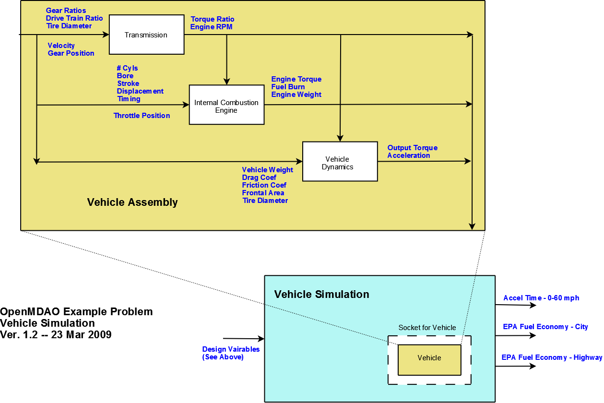

.. index:: tutorial problem

The OpenMDAO Tutorial Problem
=============================

To help new users understand how to use OpenMDAO, an example problem is presented here, somewhat in the
form of a tutorial. The developers felt that the example needed to be chosen carefully to ensure that the
design problem could be understood intuitively regardless of background. This precluded the use of an
aircraft aerodynamics-structural design problem as an example, even though the developers had the
expertise. Additionally, the example problem needed to include enough model complexity to allow a full set
of features to be demonstrated. The automotive design problem presented in the next section satisfied these
requirements.

One important thing should be noted: OpenMDAO is currently under development, and there are a number of
features that haven't been implemented, including a graphical interface (GUI). Interacting with the
framework architecture is done by writing Python code. While the tutorial problem was designed to teach the
user to utilize the framework via all available interfaces, it is difficult to construct a tutorial that
achieves the same level of interactivity for a scripting interface as for a graphical one. 

Problem Overview
----------------

The overall objective of the tutorial problem is to design an automobile that performs "well" as measured
by three metrics: 

- The time to accelerate from rest to 60 mph
- The fuel economy as measured by the EPA highway driving test
- The fuel economy as measured by the EPA city driving test

The automobile to be designed is a conventional one with a gasoline-fueled internal combustion engine and
a 5-speed manual transmission. The scope of this problem is preliminary conceptual design, so the tools
for simulating the vehicle should be chosen to have a relatively compact set of design variables and a
reasonably quick execution time to allow exploration of the design space via multiple executions. Such
tools were generally not available in the open literature or the open-source community in the form
desired, but it was possible to develop them from scratch based on physical first principles. The
mathematical model for the engine came from open literature.

The simulation of the desired performance metrics primarily requires a model of the vehicle's power-train,
including the engine, the transmission, and the rear differential. In addition, the equation of motion for
the vehicle is needed. A logical way to compartmentalize the vehicle model is to break it into component
models matching each of these subsystems: engine, transmission, and vehicle dynamics (which includes the
rear differential ratio). In a typical problem, each of these component models will be a completely
separate implementation, possibly with different authors or vendors. Each of these component models also
requires a set of design variables which are detailed below.

So a vehicle contains an engine, a transmission, and a vehicle dynamics component. In addition to the
design variables, there are three simulation variables: throttle position, gear, and velocity. These
variables, which are independent of any design, are used during simulation, where the vehicle model is
essentially being "driven" in order to determine the desired test metrics. There are also a couple of
other simulation inputs, such as RPM and Power, that are required by the engine and vehicle dynamics
models. These are provided by other components in the vehicle. For example, the engine needs an RPM to
calculate its power. This RPM is output by the transmission component, which determines it from the
vehicle's velocity and gear position. These inter-dependencies define the connection order for vehicle
components in terms of the Data Flow: Transmission -> Engine -> Vehicle Dynamics. 

The full process model is shown below.

.. _`Process Model for Tutorial Problem`:

   Process Model for Tutorial Problem

The process model includes a vehicle simulation component (not to be confused with the vehicle dynamics
model in the vehicle), which actually performs the simulations and calculates the performance metrics. A
typical optimization problem would be to close the loop around the metrics and the design variables,
driving some subset of them to minimize the 0-60 acceleration time and maximizing the EPA city and highway
mileage.

*The Transmission Model*
________________________

There are two tasks that the transmission model must perform:

1. Provide a transformation from engine output torque to torque at the wheels
2. Calculate the engine RPM

The transmission modeled here is a 5-speed manual. Shifting is assumed to occur instantaneously when the
simulation input CurrentGear is given a new value. When the clutch is engaged, there is a direct linkage
between the wheel rotation and the engine rotation via the current gear ratio and the differential ratio,
so the Engine RPM can be calculated given the velocity. However, this direct linkage would cause the
engine RPM to go to zero as the vehicle stops, so the transmission model assumes that the clutch is
partially disengaged for low speed operation (i.e., where the engine speed would drop below 1000 RPM) and
sets the engine speed to 1000 RPM. This only occurs when the transmission is in first gear.

**Transmission - Design Variables:**

=================  ===========================================  ======
**Variable**	 	  **Description**			**Units**
-----------------  -------------------------------------------  ------
Ratio1		   Gear ratio in first gear			
-----------------  -------------------------------------------  ------
Ratio2		   Gear ratio in second gear			
-----------------  -------------------------------------------  ------
Ratio3		   Gear ratio in third gear			
-----------------  -------------------------------------------  ------
Ratio4		   Gear ratio in fourth gear			
-----------------  -------------------------------------------  ------
Ratio5		   Gear ratio in fifth gear			
-----------------  -------------------------------------------  ------
FinalDriveRatio    Gear ratio for vehicle's differential	
-----------------  -------------------------------------------  ------
TireCircumference  Circumference of the tire			inch
=================  ===========================================  ======

|

**Transmission - Simulation Inputs:**

=================     ===========================================  ======
**Variable**	 	  **Description**			   **Units**
-----------------     -------------------------------------------  ------
CurrentGear           Current gear position
-----------------     -------------------------------------------  ------
Velocity	      Current vehicle velocity			   m/s
=================     ===========================================  ======

|

**Transmission - Outputs:**

=================  ===========================================  ======
**Variable**	 	  **Description**			**Units**
-----------------  -------------------------------------------  ------
TorqueRatio	   Ratio of transmission output power to power 
                   at the wheel
-----------------  -------------------------------------------  ------
EngineRPM	   Engine rotational speed			rev/s
=================  ===========================================  ======

  
*The Engine Model*
__________________

There are two pieces of information that the engine model must provide:

1. Torque seen by the transmission
2. Fuel burn under current load

There are quite a few simple models in the literature, but the one published in the Master's Thesis by S.
Sitthiracha (`1`_) appeared to be the best choice for use in the tutorial problem. Sitthiracha presents a
physics-based model of the Otto cycle in a 4-stroke spark-ignition internal combustion engine. The
mathematical model allows the construction of a parametrized engine model with 10 design inputs covering
the engine mechanical design (cylinder bore, stroke, connecting rod length, and compression ratio), intake
valve design (diameter and lift), and the cycle timing (for both intake and spark.) In the thesis, the
model is implemented in Simulink and simulated using data from a family of Mercedes-Benz engines designed
in 1969. The model is actually fairly comprehensive, and includes the effects of burn duration, heat loss
through the cylinder wall, losses due to friction and charge heating, and intake orifice flow. Some of
these effects were derived from empirical data and are essentially valid over an engine speed ranging from
1000 RPM to 6000 RPM.

The model developed by Sitthiracha also includes the fuel type as another design variable. This generally
introduces a half dozen parameters that are dependent on the fuel chemistry. To keep the model reasonably
simple, these parameters were set to values appropriate for gasoline, and were not provided as design
inputs for the engine model. It would not be difficult to modify the component code to allow any of these
to be used as design variables given what will be learned from the tutorial problem.

It should be noted that, as is often the case, there were a couple of errors in the equations presented in
Sitthiracha's model and a couple of factors that needed to be adjusted to obtain reasonable results. The
Sitthirach model also assumed wide-open throttle, so the effect of a throttle was added by assuming that it
acts as an additional restriction on the intake flow that premultiplies the orifice equation to give the mass
flow into the cylinder. For simulation, relating the throttle position to an actual physical foot position is
not important; all that is needed is a continuum of throttle settings between closed and wide open. The
correct value for a closed throttle is currently an unresolved question. This model assumes that closed is
1% of open, but the simulation currently drives it using a minimum of 7%, which seems to give a more
realistic performance.

The design variables in this problem allow for some significant modification to the engine design. This
can strongly impact the engine weight; some estimate of weight is needed. There is a report by Shikida (`2`_)
that contains some empirical data taken from a sampling of engines present in the Japanese market in 2000.
This data maps engine displacement and weight vs power. Displacement is essentially a measurement of the
engine size, and it can be calculated from the design parameters, so a linear fit between engine weight
and displacement was determined. This equation is used by the engine model to estimate the engine weight
and provide the output.

**Engine - Design Variables:**

=================  ===========================================  ======
**Variable**	 	  **Description**			**Units**
-----------------  -------------------------------------------  ------
stroke		   Length of compression zone in cylinder	mm		
-----------------  -------------------------------------------  ------
bore		   Bore (cylinder diameter)			mm
-----------------  -------------------------------------------  ------
conrod		   Connecting rod length			mm
-----------------  -------------------------------------------  ------
compRatio	   Volumetric ratio of compression			
-----------------  -------------------------------------------  ------
sparkAngle	   Spark angle with respect to top dead center	deg		
-----------------  -------------------------------------------  ------
nCyl    	   Number of Cylinders	
-----------------  -------------------------------------------  ------
IVO  		   Intake valve open before top dead center     deg
-----------------  -------------------------------------------  ------
IVC  		   Intake valve close after bottom dead center  deg
-----------------  -------------------------------------------  ------
Liv  		   Maximum valve lift                           mm
-----------------  -------------------------------------------  ------
Div  		   Intake valve diameter                        mm
=================  ===========================================  ======

|

**Engine - Simulation Inputs:**

=================  ===========================================  ======
**Variable**	 	  **Description**			**Units**
-----------------  -------------------------------------------  ------
RPM		   Engine rotational speed (1000-6000)          rev/min
-----------------  -------------------------------------------  ------
throttle	   Throttle position				
=================  ===========================================  ======

|

**Engine - Outputs:**

=================  ===========================================  ======
**Variable**	 	  **Description**			**Units**
-----------------  -------------------------------------------  ------
Power		   Power produced by engine			kW
-----------------  -------------------------------------------  ------
Torque		   Torque produced by engine			N*m
-----------------  -------------------------------------------  ------
FuelBurn	   Fuel burn rate				li/sec
-----------------  -------------------------------------------  ------
EngineWieght	   Engine weight estimate			kg
=================  ===========================================  ======

**References:**

_`1`. Sitthiracha, Sitthichok, "An Analytical Model of Spark Ignition Engine for Performance Prediction,"
Master's Thesis, King Mongkut's Institute of Technology North Bangkok, 2006.

_`2`. Shikida, Takasuke, Yoshikatsu Nakamura, Tamio Nakakubo, and Hiroyuki Kawase, "Development of the High
Speed 2ZZ-GE Engine," SAE World Congress, March 6-9 2000, SAE 2000-01-0671.

  
*The Vehicle Dynamics Model*
____________________________

The vehicle dynamics model must simply provide the vehicle acceleration given the torque produced by
the engine and scaled by the transmission. The equation used for the model comes from summing the
forces acting on the vehicle in the forward direction. These forces include both the rolling friction
associated with the tires and the vehicle drag which is proportional to the square of velocity.

**Vehicle Dynamics - Design Variables:**

=================  ===========================================  ======
**Variable**	 	  **Description**			**Units**
-----------------  -------------------------------------------  ------
Mass_Vehicle       Vehicle mass					kg
-----------------  -------------------------------------------  ------
Cf		   Rolling friction coefficient			
-----------------  -------------------------------------------  ------
Cd		   Drag coefficient			
-----------------  -------------------------------------------  ------
Area		   Front profile area				m*m
=================  ===========================================  ======

|

**Vehicle Dynamics - Simulation Inputs:**

=================  ===========================================  ======
**Variable**	 	  **Description**			**Units**
-----------------  -------------------------------------------  ------
Mass_Engine	   Engine mass estimate				kg
-----------------  -------------------------------------------  ------
Velocity	   Current vehicle velocity			m/s
-----------------  -------------------------------------------  ------
TorqueRatio	   Ratio of transmission output power to power 
                   at the wheel
-----------------  -------------------------------------------  ------
TireCircumference  Circumference of the tire			m
=================  ===========================================  ======

|

**Vehicle Dynamics - Outputs:**

=================  ===========================================  ======
**Variable**	 	  **Description**			**Units**
-----------------  -------------------------------------------  ------
Acceleration	   Vehicle instantaneous acceleration		m/(s*s)
=================  ===========================================  ======

|
|
 
*Simulating the Acceleration Test (0-60)*
_________________________________________

	"I saw this in a movie about a bus that had to **speed** around a city, keeping its **speed** over fifty and if its **speed** dropped, it would explode! I think it was called ... *The Bus That Couldn't Slow Down.*" 
						-- Homer Simpson

The procedure for simulating the maximum acceleration is fairly straightforward. The vehicle is commanded at
wide open throttle, and the resulting acceleration is integrated until the velocity reaches 60 mph. A time
step of 0.1 seconds is used for simulation, which is small enough that a simple (and efficient) trapezoidal
integration was adequate. Gears are shifted at the red line, which is the 6000 RPM limit of the engine model.

It should be noted that shifting at the red line is not always optimal (though it is optimal for the default
engine given here.) The optimal shifting RPMs are dependent on the engine's torque curve as well as the gear
ratios, so creating a generalized yet more optimal shifting procedure would be more numerically intensive. It
would also be possible to promote the shift points as variables, and let an optimizer solve for their
locations.

*Simulating the EPA Mileage Tests*
__________________________________

The EPA mileage tests give an estimate of the fuel consumed while driving a pre-determined velocity profile
that represents a particular class of driving, the two most well-known of which represent typical city
driving and highway driving. These tests aren't actually performed on the open road but are instead done in
the EPA testing garage with the tires on rollers and a hose connected to the exhaust pipe, measuring the 
composition of the exhaust gasses. The test still uses a driver, who must follow a velocity profile given on
a computer screen. The actual velocity profiles are available on the EPA website as the following gif files:

.. _`EPA City Driving Profile`:

.. figure:: ../images/user-guide/EPA-city.gif
   :align: center

   EPA City Driving Profile

.. _`EPA Highway Driving Profile`:

.. figure:: ../images/user-guide/EPA-highway.gif
   :align: center

   EPA Highway Driving Profile

Note that this simulation will differ from the EPA test in that it actually simulates road conditions, albeit
idealized ones. To simulate these tests, the vehicle model must be commanded to follow the velocity
profiles. In other words, the time history of the gear and throttle position must be found that allows the
vehicle to follow these profiles. The fuel consumed is also captured over the profile so that the mileage
estimate can be calculated. This can be summarized by the following procedure:

1. Determine acceleration required to reach next velocity point
2. Determine correct gear
3. Solve for throttle position that matches the required acceleration
4. For that gear and throttle setting, save off the fuel burned

The trickiest part of the entire simulation is determining the right gear. The simulation has to test the
acceleration at min and max throttle to determine if the required acceleration is possible in that gear. The
simulation also has to make sure the engine RPM lies within the its min and max values. For low speed (under
10 mph), the transmission is always set to first gear.

Once the gear is determined, a bisection method is used to find the throttle position that matches the
required acceleration within a small tolerance. This solution method converges reasonably quickly, especially
when applied over a linear range of a torque curve. However, the EPA profiles are long with many calculation
points, so simulating these driving profiles consumes much more CPU time than the acceleration test.

.. index:: Component

Components
----------

In the previous section, three component models were given that comprise a vehicle model that can simulate
its performance. These models have all been implemented as OpenMDAO components written in Python. This
section will examine these components.

It is assumed that the user has some familiarity with Python and the basic concepts of object-oriented
programming, and has access to the OpenMDAO source tree. From the top of the tree, the following directory
contains the pieces needed for the model:

	``openmdao.examples/openmdao/examples/engine_design``

The three engine models have been implemented in transmission.py, engine.py, and vehicle_dynamics.py. It will
be useful to browse these files as you learn some of the basic concepts in this tutorial.

**Building a Python Component**

At the highest level, a component is simply something that takes a set of inputs and operates on them,
producing a set of outputs. In the OpenMDAO architecture, a class called :term:`Component` provides this
behavior. Any component has inputs and outputs and has a function that executes the component, which operates
on the inputs to produce the outputs. To create a new component, a new class is created that inherits from
the base class Component. A very simple component is shown here:

.. _Code1: 

::

	from openmdao.main import Component

	class Transmission(Component):
	    def __init__(self, name, parent=None, doc=None, directory=''):
        	''' Creates a new Transmission object
	            '''
        	super(Transmission, self).__init__(name, parent, doc, directory)        
        
	    def execute(self):
        	''' The 5-speed manual transmission is simulated by determining the
        	    torque output and engine RPM via the gear ratios.
	            '''

This new Transmission component does nothing yet. It does have the two functions that all components must
have. The __init__ function is run once before the model is executed. This is a convenient place to set up
simulation constants. It is also where the inputs and outputs will be declared. The super call is always
required so that the parent's __init__ function is executed. Similarly, the execute function runs the model.
There are some other functions defined in the Component API, but these two are the only ones needed in the
tutorial.

The next step is to add the inputs and outputs that are defined in our model description above.

.. _Code2: 

::

	from openmdao.main import Component, Float, Int
	from openmdao.main.variable import INPUT, OUTPUT

	class Transmission(Component):
	    def __init__(self, name, parent=None, doc=None, directory=''):
	        ''' Creates a new Transmission object
        	'''
        
	        super(Transmission, self).__init__(name, parent, doc, directory)        
        
	        Float('Ratio1', self, INPUT, units=None, default=3.54,
        	      doc='Gear Ratio in First Gear')
	        Float('Ratio2', self, INPUT, units=None, default=2.13,
        	      doc='Gear Ratio in Second Gear')
	        Float('Ratio3', self, INPUT, units=None, default=1.36,
        	      doc='Gear Ratio in Third Gear')
	        Float('Ratio4', self, INPUT, units=None, default=1.03,
        	      doc='Gear Ratio in Fourth Gear')
	        Float('Ratio5', self, INPUT, units=None, default=0.72,
        	      doc='Gear Ratio in Fifth Gear')
	        Float('FinalDriveRatio', self, INPUT, units=None, default=2.80,
        	      doc='Final Drive Ratio')
	        Float('TireCirc', self, INPUT, units='inch', default=75.0,
        	      doc='Circumference of tire (inches)')
	
	        Int('CurrentGear', self, INPUT, default=0,
        	      doc='Current Gear')
	        Float('Velocity', self, INPUT, units='mi/h', default=0.0,
        	      doc='Current Velocity of Vehicle')

        	Float('RPM', self, OUTPUT, units='1/min', default=1000.0, 
	              doc='Engine RPM')        
        	Float('TorqueRatio', self, OUTPUT, units=None, default=0.0, 
	              doc='Ratio of output torque to engine torque')   

Note that the addition of inputs and outputs for this component requires several more imports in the first
two lines. It is important to import only those features that you need from the framework base classes
instead of loading everything into the workspace. A component's inputs and outputs are called Variables in
OpenMDAO. The :term:`Variable` is actually an object that resides in the component and has several member
functions for interaction.

The Float and Int functions are used to create the input and output variables on a component for floating
point and integer input respectively. String variables and arrays are also possible using the String and
ArrayVariable functions. The Variable constructor requires the first five inputs but also allows a few optional
parameters to be specified.

The first parameter gives the variable a name. This name needs to follow Python's standard for variable
names, so it must begin with a letter or underscore and should consist of only alphanumeric characters and
the underscore. Keep in mind that a leading underscore is generally used for private data or functions. Also,
spaces cannot be used in a variable name.

The second parameter specifies the parent, which in this case should be "self," which just means that these
variables are all owned by the Transmission component. The third parameter marks this variable as either an
input or an output.

The fourth parameter is used to specify the units for this variable. OpenMDAO utilizes the units capability
which is part of the Scientific Python package. This allows for unit checking and conversion when connecting
the outputs and inputs of components. The units are defined using the definitions given in Scientific Python,
which can be found at http://www.astro.rug.nl/efidad/Scientific.Physics.PhysicalQuantities.html. If a
variable is dimensionless, the unit should be set to "None."

The fifth required parameter is the default value. Note that a default value must also be defined for
outputs.

There are a couple more parameters of interest that can be seen by inspecting the __init__ function in
engine.py.

.. _Code3: 

::

        	Float('RPM', self, INPUT, units='1/min', default=1000.0, min_limit=1000,
	              max_limit=6000, doc='Engine RPM')

Here, a minimum and maximum limit have been set for the engine input variable RPM. If the engine component is
commanded to operate outside of the limits on this variable, an exception will be thrown. This exception can
be caught elsewhere so that some kind of recovery behavior can be defined (e.g., shifting the gear in the
transmission component to lower the engine RPM.)

Finally, transmission.py needs to actually do something when it is executed. This code illustrates how to use
the input and output variables to perform calculation. 

.. _Code4: 

::

    def execute(self):
        ''' The 5-speed manual transmission is simulated by determining the
            torque output and engine RPM via the gear ratios.
            '''
        Ratios = [0.0, self.Ratio1, self.Ratio2, self.Ratio3, self.Ratio4,
                  self.Ratio5]
        
        Gear = self.CurrentGear
        
        self.RPM = (Ratios[Gear]*self.FinalDriveRatio*5280.0*12.0*self.Velocity
                    )/(60.0*self.TireCirc)
        self.TorqueRatio = Ratios[Gear]*self.FinalDriveRatio
            
        # At low speeds, hold engine speed at 1000 RPM and feather the clutch
        if self.RPM < 1000.0 and Gear == 1 :
            self.RPM = 1000.0
	    
Inputs and Outputs are objects in our component, so they are accessed using self.variablename, where the variablename is the name given to the variable's constructor. Note that the units checking is bypassed when accessing the variable's value directly. This is fine for calculation inside of the components; units checking is intended to be used more at a higher level, where component inputs and outputs are being connected.

Executing a Component in the Python Shell
-----------------------------------------

The Python implementations of the three component models (engine.py, transmission.py, vehicle_dynamics.py) should all make sense now. This next section will demonstrate how to instantiate and use these components in the Python shell. From the top level directory in your OpenMDAO source tree, go to the ``buildout`` directory. From here, the Python shell can be launched by typing the following at the Unix prompt:

.. _Prompt1: 

::

	[unix_prompt]$ bin/python

The python environment in buildout/bin is a special one that has all of the OpenMDAO site packages installed,
including the tutorial problem. The user interface for the default Python shell leaves a lot to be desired,
but it is still a good way to demonstrate these components.

An instance of the class Engine can be created by typing the following:

	>>> from openmdao.examples.engine_design.engine import Engine
	>>> MyEngine = Engine("New Engine")

The object MyEngine is an engine created with default values for all of its inputs.

Models and Assemblies
---------------------

Executing a Model
-----------------

Wrapping an External Module using f2py
--------------------------------------

As the most computationally intensive component, the engine model in engine.py is the main performance
bottleneck during repeated execution. As an interpreted language, Python is not the ideal choice for the
implementation of a numerical algorithm, particularly where performance is important. Much can be gained by
implementing the engine model in a compiled language like C or Fortran.

Sockets and Interfaces
----------------------

Solving an Optimization Problem
-------------------------------

Multiobjective Optimization 
---------------------------

Plugins for this feature are not ready yet, but they are coming soon.
