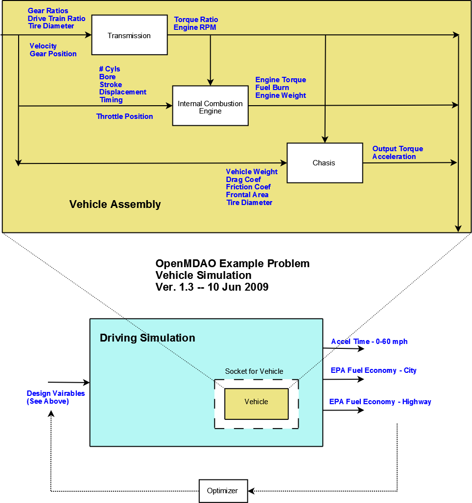

.. index:: tutorial problem

.. _A-More-Complex-Tutorial-Problem:

A More Complex Tutorial Problem
================================

To help you understand how to use OpenMDAO, an example problem is presented here, somewhat in the
form of a tutorial. We felt that the example needed to be chosen carefully to ensure that the
design problem could be understood intuitively regardless of background. This precluded the use of an
aircraft aerodynamics-structural design problem as an example, even though the developers had the
expertise. Additionally, the example problem needed to include enough model complexity to allow a full
set of features to be demonstrated. The automotive design problem presented in the next section satisfied
these requirements.

One important thing should be noted: OpenMDAO is currently under development, and there are a number of
features that haven't been implemented, including a graphical interface (GUI). Interacting with the
framework architecture is done by writing Python code. While the tutorial problem was designed to teach
you to utilize the framework via all available interfaces, it is difficult to construct a tutorial
that achieves the same level of interactivity for a scripting interface as for a graphical one. 

This tutorial assumes that you have already created a local copy of the code repository. (Add
reference.)

Problem Overview
----------------

The overall objective of the tutorial problem is to design an automobile that performs "well" as measured
by three metrics: 

- The time to accelerate from rest to 60 mph
- The fuel economy as measured by the EPA highway driving test
- The fuel economy as measured by the EPA city driving test

The automobile to be designed is a conventional one with a gasoline-fueled internal combustion engine and
a 5-speed manual transmission. The scope of this problem is preliminary conceptual design, so the tools
for simulating the vehicle should be chosen to have a relatively compact set of design variables and a
reasonably quick execution time to allow exploration of the design space via multiple executions. Such
tools were generally not available in the open literature or the open-source community in the form
desired, but it was possible to develop them from scratch based on physical first principles. The
mathematical model for the engine came from open literature.

The simulation of the desired performance metrics primarily requires a model of the vehicle's power-train,
including the engine, the transmission, and the rear differential. In addition, the equation of motion for
the vehicle is needed. A logical way to compartmentalize the vehicle model is to break it into component
models matching each of these subsystems: engine, transmission, and chassis (which includes the
rear differential ratio). In a typical problem, each of these component models will be a completely
separate implementation, possibly with different authors or vendors, and will require a set of design variables which are
detailed below.

So a vehicle contains an engine, a transmission, and a chassis component. In addition to the
design variables, there are three simulation variables: throttle position, gear, and velocity. These
variables, which are independent of any design, are used during simulation, where the vehicle model is
essentially being "driven" to determine the desired test metrics. There are also a couple of
other simulation inputs, such as RPM and Power, that are required by the engine and chassis
models. These are provided by other components in the vehicle. For example, the engine needs an RPM to
calculate its power. This RPM is output by the transmission component, which determines it from the
vehicle's velocity and gear position. These inter-dependencies define the connection order for vehicle
components in terms of the Data Flow: Transmission -> Engine -> Chassis. 

.. _`process-model`:

The full process model is shown below.

   Process Model for Tutorial Problem

The process model includes a driving simulation component, which actually performs the simulations and calculates the performance metrics. A
typical optimization problem would be to close the loop around the metrics and the design variables,
driving some subset of them to minimize the 0-60 acceleration time and maximizing the EPA city and highway
mileage.

*The Transmission Model*
________________________

There are two tasks that the transmission model must perform:

1. Provide a transformation from engine output torque to torque at the wheels
2. Calculate the engine RPM

The transmission modeled here is a 5-speed manual. Shifting is assumed to occur instantaneously when the
simulation input *CurrentGear* is given a new value. When the clutch is engaged, there is a direct linkage
between the wheel rotation and the engine rotation via the current gear ratio and the differential ratio,
so the engine RPM can be calculated given the velocity. However, this direct linkage would cause the
engine RPM to go to zero as the vehicle stops, so the transmission model assumes that the clutch is
partially disengaged for low speed operation (i.e., where the engine speed would drop below 1000 RPM) and
sets the engine speed to 1000 RPM. This only occurs when the transmission is in first gear.

**Transmission - Design Variables:**

==================  ===========================================  ======
**Variable**	 	  **Description**			 **Units**
------------------  -------------------------------------------  ------
ratio1		    Gear ratio in first gear			
------------------  -------------------------------------------  ------
ratio2		    Gear ratio in second gear			
------------------  -------------------------------------------  ------
ratio3		    Gear ratio in third gear			
------------------  -------------------------------------------  ------
ratio4		    Gear ratio in fourth gear			
------------------  -------------------------------------------  ------
ratio5		    Gear ratio in fifth gear			
------------------  -------------------------------------------  ------
final_drive_ratio   Gear ratio for vehicle's differential	
------------------  -------------------------------------------  ------
tire_circumference  Circumference of the tire			 inch
==================  ===========================================  ======

|

**Transmission - Simulation Inputs:**

=================     ===========================================  ======
**Variable**	 	  **Description**			   **Units**
-----------------     -------------------------------------------  ------
current_gear          Current gear position
-----------------     -------------------------------------------  ------
velocity	      Current vehicle velocity			   m/s
=================     ===========================================  ======

|

**Transmission - Outputs:**

=================  ===========================================  ======
**Variable**	 	  **Description**			**Units**
-----------------  -------------------------------------------  ------
torque_ratio	   Ratio of transmission output power to power 
                   at the wheel
-----------------  -------------------------------------------  ------
RPM    		   Engine rotational speed			rev/s
=================  ===========================================  ======

  
*The Engine Model*
__________________

There are two pieces of information that the engine model must provide:

1. Torque seen by the transmission
2. Fuel burn under current load

There are quite a few simple models in the literature, but the one published in a master's thesis by S.
Sitthiracha (`1`_) appeared to be the best choice for use in the tutorial problem. Sitthiracha presents a
physics-based model of the Otto cycle in a 4-stroke spark-ignition internal combustion engine. The
mathematical model allows the construction of a parametrized engine model with 10 design inputs covering
the engine mechanical design (cylinder bore, stroke, connecting rod length, and compression ratio), intake
valve design (diameter and lift), and the cycle timing (for both intake and spark.) In the thesis, the
model is implemented in Simulink and simulated using data from a family of Mercedes-Benz engines designed
in 1969. The model is actually fairly comprehensive and includes the effects of burn duration, heat loss
through the cylinder wall, losses due to friction and charge heating, and intake orifice flow. Some of
these effects were derived from empirical data and are essentially valid over an engine speed ranging from
1000 RPM to 6000 RPM.

The model developed by Sitthiracha also includes the fuel type as another design variable. This generally
introduces a half dozen parameters that are dependent on the fuel chemistry. To keep the model reasonably
simple, these parameters were set to values appropriate for gasoline and were not provided as design
inputs for the engine model. It would not be difficult to modify the component code to allow any of these
to be used as design variables, given what will be learned from the tutorial problem.

It should be noted that, as is often the case, there were a couple of errors in the equations presented in
Sitthiracha's model and a couple of factors that needed to be adjusted to obtain reasonable results. The
Sitthirach model also assumed wide-open throttle, so the effect of a throttle was added by assuming that it
acts as an additional restriction on the intake flow that premultiplies the orifice equation to give the mass
flow into the cylinder. For simulation, relating the throttle position to an actual physical foot position is
not important; all that is needed is a continuum of throttle settings between closed and wide open. The
correct value for a closed throttle is currently an unresolved question. This model assumes that closed is
1% of open, but the simulation currently drives it using a minimum of 7%, which seems to give a more
realistic performance.

The design variables in this problem allow for some significant modification to the engine design. This
can strongly impact the engine weight; some estimate of weight is needed. There is a report by Shikida (`2`_)
that contains some empirical data taken from a sampling of engines present in the Japanese market in 2000.
This data maps engine displacement and weight vs power. Displacement is essentially a measurement of the
engine size, and it can be calculated from the design parameters, so a linear fit between engine weight
and displacement was determined. This equation is used by the engine model to estimate the engine weight
and provide the output.

**Engine - Design Variables:**

=================  ===========================================  ======
**Variable**	 	  **Description**			**Units**
-----------------  -------------------------------------------  ------
stroke		   Length of compression zone in cylinder	mm		
-----------------  -------------------------------------------  ------
bore		   Bore (cylinder diameter)			mm
-----------------  -------------------------------------------  ------
conrod		   Connecting rod length			mm
-----------------  -------------------------------------------  ------
comp_ratio	   Volumetric ratio of compression			
-----------------  -------------------------------------------  ------
spark_angle	   Spark angle with respect to top dead center	deg		
-----------------  -------------------------------------------  ------
n_cyl    	   Number of Cylinders	
-----------------  -------------------------------------------  ------
IVO  		   Intake valve open before top dead center     deg
-----------------  -------------------------------------------  ------
IVC  		   Intake valve close after bottom dead center  deg
-----------------  -------------------------------------------  ------
L_v  		   Maximum valve lift                           mm
-----------------  -------------------------------------------  ------
D_v  		   Intake valve diameter                        mm
=================  ===========================================  ======

|

**Engine - Simulation Inputs:**

=================  ===========================================  ======
**Variable**	 	  **Description**			**Units**
-----------------  -------------------------------------------  ------
RPM		   Engine rotational speed (1000-6000)          rev/min
-----------------  -------------------------------------------  ------
throttle	   Throttle position				
=================  ===========================================  ======

|

**Engine - Outputs:**

=================  ===========================================  ======
**Variable**	 	  **Description**			**Units**
-----------------  -------------------------------------------  ------
power		   Power produced by engine			kW
-----------------  -------------------------------------------  ------
torque		   Torque produced by engine			N*m
-----------------  -------------------------------------------  ------
fuel_burn	   Fuel burn rate				li/sec
-----------------  -------------------------------------------  ------
engine_weight	   Engine weight estimate			kg
=================  ===========================================  ======

**References:**

_`1`. Sitthiracha, Sitthichok, "An Analytical Model of Spark Ignition Engine for Performance Prediction,"
Master's Thesis, King Mongkut's Institute of Technology North Bangkok, 2006.

_`2`. Shikida, Takasuke, Yoshikatsu Nakamura, Tamio Nakakubo, and Hiroyuki Kawase, "Development of the High
Speed 2ZZ-GE Engine," SAE World Congress, March 6-9 2000, SAE 2000-01-0671.

  
*The Chassis Model*
____________________________

The chassis model must simply provide the vehicle acceleration given the torque produced by
the engine and scaled by the transmission. The equation used for the model comes from summing the
forces acting on the vehicle in the forward direction. These forces include both the rolling friction
associated with the tires and the vehicle drag which is proportional to the square of velocity.

**Chassis - Design Variables:**

=================  ===========================================  ======
**Variable**	 	  **Description**			**Units**
-----------------  -------------------------------------------  ------
mass_vehicle       Vehicle mass					kg
-----------------  -------------------------------------------  ------
Cf		   Rolling friction coefficient			
-----------------  -------------------------------------------  ------
Cd		   Drag coefficient			
-----------------  -------------------------------------------  ------
area		   Front profile area				m*m
=================  ===========================================  ======

|

**Chassis - Simulation Inputs:**

==================  ===========================================  ======
**Variable**	 	  **Description**			 **Units**
------------------  -------------------------------------------  ------
mass_engine	    Engine mass estimate			 kg
------------------  -------------------------------------------  ------
velocity	    Current vehicle velocity			 m/s
------------------  -------------------------------------------  ------
torque_ratio	    Ratio of transmission output power to power 
                    at the wheel
------------------  -------------------------------------------  ------
tire_circumference  Circumference of the tire			 m
==================  ===========================================  ======

|

**Chassis - Outputs:**

=================  ===========================================  ======
**Variable**	 	  **Description**			**Units**
-----------------  -------------------------------------------  ------
acceleration	   Vehicle instantaneous acceleration		m/(s*s)
=================  ===========================================  ======

|
|
 
*Simulating the Acceleration Test (0-60)*
_________________________________________

	"I saw this in a movie about a bus that had to **speed** around a city, keeping its **speed** over fifty and if its **speed** dropped, it would explode! I think it was called ... *The Bus That Couldn't Slow Down.*" 
						-- Homer Simpson

The procedure for simulating the maximum acceleration is fairly straightforward. The vehicle is commanded at
wide open throttle, and the resulting acceleration is integrated until the velocity reaches 60 mph. A time
step of 0.1 seconds is used for simulation, which is small enough that a simple (and efficient) trapezoidal
integration was adequate. Gears are shifted at the red line, which is the 6000 RPM limit of the engine model.

It should be noted that shifting at the red line is not always optimal (though it is optimal for the default
engine given here.) The optimal shifting RPMs are dependent on the engine's torque curve as well as the gear
ratios, so creating a generalized yet more optimal shifting procedure would be more numerically intensive. It
would also be possible to promote the shift points as variables, and let an optimizer solve for their
locations.

*Simulating the EPA Mileage Tests*
__________________________________

The EPA mileage tests give an estimate of the fuel consumed while driving a pre-determined velocity profile
that represents a particular class of driving, the two most well-known of which represent typical city
driving and highway driving. These tests aren't actually performed on the open road but are instead done in
the EPA testing garage with the tires on rollers and a hose connected to the exhaust pipe, measuring the 
composition of the exhaust gasses. The test still uses a driver, who must follow a velocity profile given on
a computer screen. The actual velocity profiles are available on the EPA website as the following gif files:

.. _`EPA City Driving Profile`:

.. figure:: ../images/user-guide/EPA-city.gif
   :align: center

   EPA City Driving Profile

.. _`EPA Highway Driving Profile`:

.. figure:: ../images/user-guide/EPA-highway.gif
   :align: center

   EPA Highway Driving Profile

Note that this simulation will differ from the EPA test in that it actually simulates road conditions, albeit
idealized ones. To simulate these tests, the vehicle model must follow the velocity profiles. That is, the time
history of the gear and throttle position must be found that allows the vehicle to follow these profiles. The
fuel consumed is also captured over the profile so that the mileage estimate can be calculated. This can be
summarized by the following procedure:

1. Determine acceleration required to reach next velocity point
2. Determine correct gear
3. Solve for throttle position that matches the required acceleration
4. For that gear and throttle setting, save off the fuel burned

The trickiest part of the entire simulation is determining the right gear. The simulation has to test the
acceleration at min and max throttle to determine if the required acceleration is possible in that gear. The
simulation also has to make sure the engine RPM lies within the its min and max values. For low speed (under
10 mph), the transmission is always set to first gear.

Once the gear is determined, a bisection method is used to find the throttle position that matches the
required acceleration within a small tolerance. This solution method converges reasonably quickly, especially
when applied over a linear range of the torque curve. However, the EPA profiles are long, with many calculation
points, so simulating these driving profiles consumes much more CPU time than the acceleration test.

Using OpenMDAO
--------------
OpenMDAO provides two interfaces through which you interact to build and execute models -- a graphical user interface and a scripting/command line interface. The graphical interface is currently
under developed and is not covered here. This tutorial describes how to build and run models using
the scripting interface, or more specifically, how to write Python scripts to interact with the OpenMDAO
framework and components.

This tutorial will also introduce you to using the Python shell for creating and interacting with
components and models. The shell is a good environment for playing around with some of the concepts
learned here without having to edit files and run models at the operating system's command prompt. It is, however,
not the way that most of you would ultimately run OpenMDAO to perform any real-world analysis. Most work
will be done using the graphical interface or the scripting interface. 

.. index:: Component

Components
----------

In the previous section, three component models were given that comprise a vehicle model that can simulate
its performance. These models have all been implemented as OpenMDAO components written in Python. This
section will examine these components.

We are assuming that you have some familiarity with Python and the basic concepts of object-oriented
programming and have either installed an official distribution bundle or have access to the OpenMDAO
source tree. The following instructions will help you locate the directory containing the pieces
needed for the model relative to the install directory.

If you have a branch from the source repository:

	``examples/openmdao.examples.enginedesign/openmdao/examples/enginedesign``
	
If you have downloaded the latest release version from the website:

	``openmdao-X.X.X/lib/python2.6/site-packages/openmdao.examples.enginedesign-X.X.X-######.egg/openmdao/examples/enginedesign``
	
where X.X.X is the current OpenMDAO version, and ###### is a string that
contains the Python version, and the Operating System description. This will
vary depending on your system and version, but there will only be one
*enginedesign* egg.

The three engine models have been implemented in ``transmission.py, engine.py,`` and ``chassis.py``. It will
be useful to browse these files as you learn some of the basic concepts in this tutorial.

**Building a Python Component**

At the highest level, a component is simply something that takes a set of inputs and operates on them,
producing a set of outputs. In the OpenMDAO architecture, a class called :term:`Component` provides this
behavior. Any component has inputs and outputs and has a function that executes the component, which operates
on the inputs to produce the outputs. To create a new component, a new class is created that inherits from
the base class Component. A very simple component is shown here:

.. _Code1: 

.. testcode:: Code1

	from openmdao.main.api import Component

	class Transmission(Component):
	    """ A simple transmission model."""
	
    	    def __init__(self, doc=None, directory=''):
        	""" Creates a new Transmission object """
        	super(Transmission, self).__init__(doc, directory)        
        
	    def execute(self):
	        """ The 5-speed manual transmission is simulated by determining the
	            torque output and engine RPM via the gear ratios.
	            """

This new Transmission component does nothing yet. It does have the two functions that all components must have.
The *__init__* function is run once before the model is executed. This is a convenient place to set up simulation
constants. It is also where the inputs and outputs will be declared. The super() call is always required so that the
*__init__* function of the base class is executed. Similarly, the execute function runs the model. There are some
other functions defined in the Component API, but these two are the only ones needed for this part of the tutorial. Note
that if your *__init__* or execute function does nothing (as in this case), then it does not need to be 
declared in the component.

The next step is to add the inputs and outputs that are defined in our model description above.

.. _Code2: 

.. testcode:: Code2

	from openmdao.main.api import Component
	from openmdao.lib.api import Float, Int

	class Transmission(Component):
	    """ A simple transmission model."""
	
	    ratio1 = Float(3.54, iotype='in', 
	             desc='Gear ratio in First Gear')
	    ratio2 = Float(2.13, iotype='in', 
	             desc='Gear ratio in Second Gear')
	    ratio3 = Float(1.36, iotype='in', 
	             desc='Gear ratio in Third Gear')
	    ratio4 = Float(1.03, iotype='in', 
	             desc='Gear ratio in Fourth Gear')
	    ratio5 = Float(0.72, iotype='in', 
	             desc='Gear ratio in Fifth Gear')
	    final_drive_ratio = Float(2.8, iotype='in', 
	             desc='Final Drive Ratio')
	    tire_circ = Float(75.0, iotype='in', units='inch', 
	             desc='Circumference of tire (inches)')

	    current_gear = Int(0, iotype='in', low=1, high=5, \
                          desc='Current Gear')
	    velocity = Float(0., iotype='in', units='mi/h',
	             desc='Current Velocity of Vehicle')

	    RPM = Float(1000., iotype='out', units='1/min',
	             desc='Engine RPM')        
	    torque_ratio = Float(0., iotype='out',
	             desc='Ratio of output torque to engine torque')    

Note that the addition of inputs and outputs for this component requires several more imports in the first
two lines. It is important to import only those features that you need from the framework base classes
instead of loading everything into the workspace. 

.. Index: public variables

A component's inputs and outputs are called :term:`public variables` in OpenMDAO. The term *Public* contrasts  with
*internal* variables, which are valid only inside of a component. At times, the term :term:`Variable` or *Framework
Variable* may also be used to refer to public variables. You could think of them in a more general sense as a data
object, which reflects the ability to pass more generalized objects such as data structures or geometries. A Public
Variable is a wrapper for data passed between framework components, containing a value, a default value, optional
min/max values, and units. Public variables can also perform their own validation when being assigned to another
public variable.

The Float and Int constructors are used to create the inputs and outputs on a component for floating point
and integer inputs respectively. String variables and arrays are also possible using the Str and Array Public
Variables, which are also found in ``openmdao.lib.api``. Generally, each of these constructors takes several arguments,
many of which are optional. The only argument that can be unnamed is the default value, which must be the first item
in the function call if it is unnamed.

.. index:: PEP 8

You give a public variable a name when it is assigned to a Python variable (i.e., the left-hand side argument when calling the 
constructor.) As a Python variable, this name needs to follow Python's standard for variable names,
so it must begin with a letter or underscore and should consist of only alphanumeric characters and the
underscore. Keep in mind that a leading underscore is generally used for private data or functions. Also, spaces cannot be used
in a variable name. Generally, we've tried to follow the `PEP 8 <http://www.python.org/dev/peps/pep-0008/>`_ standard for
component instance names as well as Python variable names, which proscribes the use of lower case names with words separated by
underscores. 

The first parameter is the default value for the variable.

The parameter *iotype* marks this public variable as either an input (*in*) or an output (*out*) to the parent component.
The parameter *desc* contains a documentation string that describes this variable. This should be used to provide an 
adequate explanation for each input and output on a component.

The parameter *units* is used to specify the units for this public variable. OpenMDAO contains a units capability
that is based on part of the Scientific Python package. This Units module allows for unit checking and conversion when connecting
the outputs and inputs of components. The units are defined based on the definitions given in Scientific Python,
which can be found at :ref:`Summary-of-Units`. If a public variable is dimensionless, no unit should be assigned.

There are a couple more named arguments that are needed for the Transmission component.

.. _Code3: 

.. testcode:: Code2

        current_gear = Int(0, iotype='in', low=0, high=5, \
                       desc='Current Gear')	      

Here, a minimum and maximum limit have been set for the current gear position using the
arguments *low* and *high*. If the transmission  component is commanded to operate outside of
the limits on this input, a TraitError exception will be raised. This exception can be caught
elsewhere so that some kind of recovery behavior can be defined.

Finally, ``transmission.py`` needs to actually do something when it is executed. This code
illustrates how to use the input and output variables to perform a calculation. 

.. _Code4: 

.. testcode:: Code2

    def execute(self):
        """ The 5-speed manual transmission is simulated by determining the
            torque output and engine RPM via the gear ratios.
            """
	    
        ratios = [0.0, self.ratio1, self.ratio2, self.ratio3, self.ratio4,
                  self.ratio5]
        
        gear = self.current_gear
        differential = self.final_drive_ratio
        tire_circ = self.tire_circ
        velocity = self.velocity
        
        self.RPM = (ratios[gear]*differential*5280.0*12.0 \
                    *velocity)/(60.0*tire_circ)
        self.torque_ratio = ratios[gear]*differential
        
        # At low speeds, hold engine speed at 1000 RPM and partially engage the clutch
        if self.RPM < 1000.0 and self.current_gear == 1 :
            self.RPM = 1000.0
	    
Inputs and Outputs are objects in our component, so they are accessed using
``self.variablename``, where the variablename is the name given to the variable's constructor.
Note that a local copy of some of the inputs is created here (e.g., *gear* vs.
*self.current_gear*.) Since we already know the data types and the units that are used in
these calculations, we don't need the explicit typing or unit checking provided by the public
variables, so we can bypass any overhead that is normally associated with them by assigning
their values to an ordinary untyped Python variable. In general this should be more efficient,
though for simple calculations like this the difference may not be noticeable. The type
checking and unit checking are absolutely necessary outside of the component boundary, where
components are connected to each other.

Executing a Component in the Python Shell
-----------------------------------------

The Python implementations of the three component models (``engine.py,
transmission.py, chassis.py``) should all make sense now. This next section
will demonstrate how to instantiate and use these components in the Python
shell. Be sure to use the python link found in devenv/bin. This Python
environment is a special one that has all of the OpenMDAO site packages
installed, including the tutorial problem. The user interface for the default
Python shell leaves a lot to be desired, but it is still a good way to
demonstrate these components.

An instance of the class Engine can be created by typing the following:

	>>> from openmdao.examples.enginedesign.engine import Engine
	>>> my_engine = Engine("new_engine")

The object MyEngine is an engine created with default values for all of its inputs. We can interact with the
inputs and outputs by using the get and set functions.

	>>> my_engine.get("bore")
	82.0
	>>> my_engine.get("stroke")
	78.799999999999997
	
Note that we can also access the value of the input directly:

	>>> my_engine.bore
	82.0

While this is perfectly valid, it should be noted that we can bypass some things by not calling the get function.
In particular, the direct access may not be able to find the value of the input if some objects are executing on
remote servers. In such a case, the *get()* function will be able to find the input value.
	
Let's change the engine speed from its default value (1000 RPM) to 2500 RPM.

	>>> my_engine.set("RPM",2500)
	>>> my_engine.get("RPM")
	2500.0

Similarly, we can also set these values directly:

	>>> my_engine.RPM = 2500
	>>> my_engine.RPM
	2500.0

Note that directly setting the input's value bypasses the check that normally prevents linked inputs from being changed.
Type and units checking all work fine:

	>>> my_engine.RPM = "Hello"
	Traceback (most recent call last):
	    ...
	TraitError: Trait 'RPM' must be a float in the range [1000.0, 6000.0] but a value of Hello <type 'str'> was specified.
	
Now, let's try setting the engine speed to a value that exceeds the maximum, which is 6000 RPM.

	>>> my_engine.set("RPM",7500)
	Traceback (most recent call last):
	    ...
	TraitError: Trait 'RPM' must be a float in the range [1000.0, 6000.0] but a value of 7500 <type 'int'> was specified.

The set function raises an exception indicating that the maximum value for RPM has been violated. This exception can be
handled to provide some logical response to this condition; you will see this in the acceleration simulation.
Now, run the engine and examine the power and torque at 2500 RPM.

	>>> my_engine.run()
	>>> my_engine.get("torque")
	203.963228...
	>>> my_engine.get("power")
	53.3974483...
	
The component is executed by calling the run function, which runs the *_pre_execute* (which determines if the
component needs to be executed), *execute* (which is the function we created in the Engine class above), and
*_post_execute* (which validates the outputs.) These _pre_execute and _post_execute functions are private
functions, as denoted by the leading underscore, and are not intended for you to redefine in your
components. Remember that a component is always executed by calling *run()*.

.. index:: Assembly

Assemblies
----------

Now that Python components representing the three vehicle subsystems have been created, they need to be
connected so that they can be executed in sequence. In OpenMDAO, a component that contains a collection of
other components is called an :term:`Assembly`. The Assembly allows a set of components to be linked together by
connecting their inputs and outputs. The data connections define an execution order based on their dependencies, i.e., components that are upstream in the data flow will be executed prior to those downstream so that input data to a component will always be valid with respect to the other parts of the workflow. Component execution is also lazy, meaning that a component will not execute if its inputs have not changed since its last execution.
In addition, an Assembly can also contain a Driver, such as an optimizer or a design of experiments.
When an Assembly does not explicitly contain a driver, the assembly executes the components sequentially based on the
data connections.

For the vehicle simulation, a Vehicle assembly is needed that can sequentially execute the Transmission,
Engine, and Chassis components.

.. _Code5: 

.. testcode:: Code5

	from openmdao.main.api import Assembly
	from openmdao.lib.api import Float, Int

	from openmdao.examples.enginedesign.engine import Engine
	from openmdao.examples.enginedesign.transmission import Transmission
	from openmdao.examples.enginedesign.chassis import Chassis
	
	class Vehicle(Assembly):
	    """ Vehicle assembly. """

    
	    def __init__(self, directory=''):
	        """ Creates a new Vehicle Assembly object """

	        super(Vehicle, self).__init__(directory)

	        # Create component instances
        
	        self.add_container('transmission', Transmission())
	        self.add_container('engine', Engine())
	        self.add_container('chassis', Chassis())

The Engine, Transmission, and Chassis components are imported the same way as they were in the
Python shell, using ``openmdao.examples.enginedesign`` name-space. In creating a new class, the main
difference between a Component and an Assembly is that an Assembly inherits from the Assembly class
instead of the Component class. This gives it the ability to contain other components, and to manage their
data flow.

Notice here that an instance of the Transmission, Engine, and Chassis are created, with the
parent set to "self," which in this context is Vehicle. This way, these components are created as part
of the assembly, and are accessible through ``Vehicle.Transmission``, etc.

Now that the components are instantiated in the assembly, they need to be hooked up:

.. testsetup:: Code5

	# Note: This block of code does not display in the documentation.

	from openmdao.main.api import Assembly
	from openmdao.lib.api import Float, Int

	from openmdao.examples.enginedesign.engine import Engine
	from openmdao.examples.enginedesign.transmission import Transmission
	from openmdao.examples.enginedesign.chassis import Chassis
	
	class Vehicle(Assembly):
	    """ Vehicle assembly. """
    
	    def __init__(self, directory=''):
	        """ Creates a new Vehicle Assembly object """

	        super(Vehicle, self).__init__(directory)

	        # Create component instances
        
	        self.add_container('transmission', Transmission())
	        self.add_container('engine', Engine())
	        self.add_container('chassis', Chassis())
		
	# This is a trick to get around a limitation in Sphinx's doctest, where
	# there is no way to preserve the indentation level between code
	# blocks, and the concept of "self" is not defined when we fall out of
	# the class scope.
	
	self = Vehicle()

.. _Code6: 

.. testcode:: Code5

	self.connect('transmission.RPM','engine.RPM')
        self.connect('transmission.torque_ratio','chassis.torque_ratio')
        self.connect('engine.torque','chassis.engine_torque')
        self.connect('engine.engine_weight','chassis.mass_engine')
	
The first argument in the call to ``self.connect`` is the output variable, and the second argument is
the input variable. For a connection to be valid, the units of the output and input must be of the same
class (i.e., length, speed, etc.) If they differ within the same class (e.g., meters vs. inches), then
the unit is converted to the correct unit before being sent from the output component to the input
component.

The Vehicle assembly behaves like any other component when interacting with the external world. It has
inputs and outputs, it can be hooked up to other components and included in other assemblies, and it can
be run. For the Vehicle block to be connected to other components and used in a simulation or design
study, the inputs and outputs have to be assigned. We essentially just want to promote the design and
simulation variables from the Engine, Transmission, and Chassis components to the input and
output of the Vehicle component. We can do this by creating passthroughs in the Vehicle assembly.

.. _Code7: 

.. testcode:: Code5

	self.create_passthrough('engine.stroke')
	self.create_passthrough('engine.bore')
	# ...
	# ...
	self.create_passthrough('transmission.ratio1')
	self.create_passthrough('transmission.ratio2')
	# ...
	# ...
	self.create_passthrough('chassis.mass_vehicle')
	self.create_passthrough('chassis.Cf')
		
Now, the Vehicle assembly has its own inputs and outputs and can be accessed just like in any other
component. As the name implies, these passthroughs purely pass data from the assembly input to the contained 
component inputs. As such, there is no unit conversion as this would not be computationally efficient. 

However, the engine example problem actually contains components that expects inputs to be in English units (Engine and 
Transmission) as well as a component that expects inputs to be in metric (Chassis). There are two inputs that
are required by components with units that differ from the assembly level -- *velocity* and *tire_circumference*. 
Unit conversion must be performed on these, so they need to be handled by regular component connections. To
accomplish this, we must declare the inputs in the class header:

.. _Code7a: 

.. testcode:: Code5

	class Vehicle(Assembly):
	    """ Vehicle assembly. """
    
	    tire_circumference = Float(75.0, iotype='in', units='inch', 
                                desc='Circumference of tire (inches)')
    
	    velocity = Float(75.0, iotype='in', units='mi/h', 
                       desc='Vehicle velocity needed to determine engine RPM (mi/h)')

Now these input are available to connect to the components.

.. testsetup:: Code7b

	from enthought.traits.api import implements, Interface

	from openmdao.main.api import Assembly
	from openmdao.lib.api import Float, Int

	from openmdao.examples.enginedesign.engine import Engine
	from openmdao.examples.enginedesign.transmission import Transmission
	from openmdao.examples.enginedesign.chassis import Chassis
	
	class Vehicle(Assembly):
	    """ Vehicle assembly. """
    
	    tire_circumference = Float(75.0, iotype='in', units='inch', 
                                    desc='Circumference of tire (inches)')
    
	    velocity = Float(75.0, iotype='in', units='mi/h', 
                desc='Vehicle velocity needed to determine engine RPM (mi/h)')
    
	    def __init__(self, directory=''):
	        """ Creates a new Vehicle Assembly object. """
        
	        super(Vehicle, self).__init__(directory)

	        # Create component instances
        
	        self.add_container('transmission', Transmission())
	        self.add_container('engine', Engine())
	        self.add_container('chassis', Chassis())
		
	self = Vehicle()

.. _Code7b: 

.. testcode:: Code7b

        self.connect('velocity', 'chassis.velocity')
        self.connect('velocity', 'transmission.velocity')
        self.connect('tire_circumference', 'chassis.tire_circ')
        self.connect('tire_circumference', 'transmission.tire_circ')

This ensures that the units for these inputs to the Vehicle are converted properly for use in the Chassis and 
Transmission components. On the surface, this might seem confusing or perhaps redundant, but it demonstrates
a way that Assemblies can be used to define a more consistent external interface 

Executing the Vehicle Assembly
------------------------------

We can manipulate the Vehicle Assembly in the Python shell in the same manner as the engine component
above. As inputs, the Vehicle takes a commanded velocity, throttle position, a gear Shift position, and
a set of vehicle design parameters, and returns the vehicle's instantaneous acceleration and rate of fuel
burn. 

	>>> from openmdao.examples.enginedesign.vehicle import Vehicle
	>>> my_car = Vehicle("new_car")
	>>> my_car.set("velocity",25)
	>>> my_car.set("current_gear",3)
	>>> my_car.set("throttle",.5)
	>>> my_car.run()
	>>> my_car.get("acceleration")
	1.1086409681...
	>>> my_car.get("fuel_burn") 
	0.0027991856...

When we run the Vehicle, we are essentially performing a simple multidisciplinary analysis via the
OpenMDAO framework. Try setting the simulation variables to other values, including ones that should
trigger an exception. (One way to do this is to command a high velocity in first gear, which should
violate the maximum RPM that the engine allows.) Note that the we can also manipulate design variables the
same way using the set and get functions.

.. index:: F2PY
.. index:: SWIG

.. _Wrapping-an-External-Module-Using-F2PY:

Wrapping an External Module Using F2PY
--------------------------------------

As the most computationally intensive component, the engine model in ``engine.py`` is the main performance
bottleneck during repeated execution. As an interpreted language, Python is not the ideal choice for
implementing a numerical algorithm, particularly where performance is important. Much can be gained by
implementing the engine model in a compiled language like C or Fortran.

One of the most important characteristics of Python is that it was designed to be smoothly integrated
with other languages, in particular C (in which Python was written) and related languages (Fortran and
C++). This is particularly important for a scripting language, where code execution is generally slower,
and it is often necessary to use a compiled language like C for implementing computationally intensive
functions. On top of this native integration ability, the community has developed some excellent tools,
such as `F2PY <http://cens.ioc.ee/projects/f2py2e/>`_ (Fortran to Python) and :term:`SWIG` (Simplified Wrapper and
Interface Generator), that simplify the process of building the wrapper for a code. As the name implies,
F2PY is a Python utility that takes a Fortran source code file and compiles and generates a wrapped
object callable from Python. F2PY is actually part of the numerical computing package NumPy. SWIG has a
broader application and can be used to generate wrappers for C and C++ functions for execution in a
variety of different target languages, including Python. For the most general case, Python has the
built-in capability to wrap any shared object or dynamically loadable library (DLL) written in any
language. This *ctypes* package is a foreign function interface, and it allows an object to be wrapped
without recompiling the library. Care must be taken when using ctypes to wrap a function that passes
data types not native to C. 

The main algorithm in ``engine.py`` was rewritten in C as ``engine.C``. A wrapped shared object of ``engine.C``
was created using F2Py; this tool can also be used to generate wrappers for C code provided that the signature
file ``engine.pyf`` is manually created. This file ``engine.pyf`` defines the interface for the
functions found in ``engine.C`` and can be viewed in ``examples/openmdao.examples.enginedesign/openmdao/examples/enginedesign``. The
C code has been placed in a function called *RunEngineCycle* that takes the design and simulation
variables as inputs. 

The C function containing the engine simulation algorithm is called *RunEngineCycle*. A new Python
component named ``engine_wrap_c.py`` was created to replace ``engine.py``. This component contains the same
inputs and outputs as ``engine.py``, but replaces the engine internal calculations with a call to the C
function *RunEngineCycle*. We can import and use the function just like any Python function:

.. _Code8: 

.. literalinclude:: ../../examples/openmdao.examples.enginedesign/openmdao/examples/enginedesign/engine_wrap_c.py
   :start-after: engine_weight = 0.0
   :end-before: # end engine.py
   :language: python

Notice that the return values are stored in lists, so a scalar value is accessed by grabbing the first
element (element zero.) This is not typically needed for return values from Fortran codes compiled with
F2PY, but it seems to be needed for C codes for which the signature file is manually created. This is
something that might be fixable and will be investigated.

.. index:: Sockets and Interfaces
.. index:: Interfaces
.. _Sockets-and-Interfaces:

Sockets and Interfaces
----------------------

Now that we have a functional (and reasonably quick) Vehicle component, we need to complete the problem
by providing a way to simulate the acceleration and the EPA fuel economy estimates. The acceleration test
requires an integration in time with the vehicle component being executed at each time step to produce
the instantaneous acceleration. The EPA fuel economy tests are a bit more tricky and require an
integration in time. The vehicle component must be executed while varying the throttle and gear
position inputs to match a desired acceleration for the integration segment. Both of these solution
procedures were implemented in a component called *DrivingSim,* which requires a Vehicle component to
perform a simulation.

At this point, we can implement this kind of problem in OpenMDAO in a couple of ways. One way is to
implement the solution procedure as a driver (or two drivers if preferred). So far, drivers have been
mentioned only as an attribute of assemblies, and they will be more thoroughly treated in the next section.
Implementing the vehicle simulation as a driver might be a bit confusing for your first exposure to
drivers, particularly since it involves nesting the simulation driver with an optimizer, so the vehicle
simulations were implemented in a single Component instead. However, this leads to the concept of 
*Sockets,* which requires the implementation to be an Assembly instead of just a Component.

To investigate designs, a Vehicle class was defined as an Assembly in OpenMDAO. This class has a set of specific inputs and outputs
that include the design variables for the engine, transmission, and chassis, and the simulation
variables velocity, gear position and throttle position. These inputs and outputs comprise an interface
for the Vehicle class. In the future, the user might want to replace the current vehicle model with a new model. This new model
will be compatible provided that it has the same interface as the current vehicle model. The interface checking is 
facilitated by the creation of a :term:`Socket` in the vehicle simulation assembly.

.. todo::
   
	 Define an interface for Vehicle and add more info on that to this part of the tutorial

**SimVehicle - Outputs:**

=================  ===========================================  ======
**Variable**	 	  **Description**			**Units**
-----------------  -------------------------------------------  ------
accel_time	   Time for vehicle to accelerate to 60 mph 	s
		   from a stop.
-----------------  -------------------------------------------  ------
EPA_city    	   Fuel economy estimate based on EPA city	mi/galUS
		   driving profile
-----------------  -------------------------------------------  ------
EPA_highway    	   Fuel economy estimate based on EPA highway	mi/galUS
		   driving profile
=================  ===========================================  ======

Setting up an Optimization Problem
----------------------------------

The final step is the creation of a top level Assembly which defines the problem using DrivingSim and the vehicle assembly.
The top level Assembly is a container that can be thought of as the workspace where the model is built, or the container that
ultimately contains the entire model. Functionally, it's no different than an assembly such as Vehicle.py; this implies that
any OpenMDAO model can be packaged up and inserted into some other model as a component. Generally, the top level Assembly
contains one or more Components or Assemblies. It may also contain a solution Driver, or it may just rely on sequential
execution based on the data flow.

The first problem we would like to solve is a single objective optimization problem where we adjust some subset of the design
variables to minimize the 0-60 acceleration time. The chosen design variables are the bore and spark angle; the optimal value
of the first variable should be quite intuitive (i.e., larger bore means faster acceleration), but the second variable cannot
be optimized by mere inspection. 

The optimization will be handled by CONMIN, which is a gradient based algorithm written in Fortran, and developed at NASA in
the 1970s. The source code is in the public domain, and a Python wrapped CONMIN component has been included in the OpenMDAO
standard library.

In openMDAO, the top level Assembly is always derived from Assembly. In ``engine_optimization.py``, we created the class
EngineOptimization, and instantiated SimVehicle and CONMINdriver:

.. _Code9: 

.. testcode:: Code9

	from openmdao.main.api import Assembly
	from openmdao.lib.api import CONMINdriver

	from openmdao.examples.enginedesign.driving_sim import DrivingSim

	class EngineOptimization(Assembly):
	    """ Top level assembly for optimizing a vehicle. """
    
	    def __init__(self, directory=''):
        	""" Creates a new Assembly containing a SimVehicle and an optimizer"""
        
	        super(EngineOptimization, self).__init__(directory)

	        # Create SimVehicle component instances
        	self.add_container('driving_sim', Driving_Sim())

	        # Create CONMIN Optimizer instance
        	self.add_container('driver', CONMINdriver())

Note that the syntax for instantiating the CONMIN driver is the same as for any other component or subassembly. The CONMIN 
driver requires some initialization and connecting before it can be used:

        
.. testsetup:: Code10

	from openmdao.main.api import Assembly
	from openmdao.lib.api import CONMINdriver

	from openmdao.examples.enginedesign.driving_sim import DrivingSim

	class EngineOptimization(Assembly):
	    """ Top level assembly for optimizing a vehicle. """
    
	    def __init__(self, directory=''):
        	""" Creates a new Assembly containing a SimVehicle and an optimizer"""
        
	        super(EngineOptimization, self).__init__(directory)

	        # Create SimVehicle component instances
        	self.add_container('driving_sim', DrivingSim())

	        # Create CONMIN Optimizer instance
        	self.add_container('driver', CONMINdriver())

	self = EngineOptimization()		
		
.. _Code10:

.. testcode:: Code10

	        # CONMIN Flags
        	self.driver.iprint = 0
	        self.driver.itmax = 30
        
	        # CONMIN Objective 
        	self.driver.objective = 'driving_sim.accel_time'
        
	        # CONMIN Design Variables 
        	self.driver.design_vars = ['driving_sim.spark_angle', 
                                         'driving_sim.bore' ]
	        
        	self.driver.lower_bounds = [-50, 65]
	        self.driver.upper_bounds = [10, 100]

In ``self.driver.iprint``, *driver* refers to the title that the CONMIN driver is given when it is created above. The *iprint* flag
enables or disables the printing of diagnostics internal to CONMIN, while the *itmax* parameter specifies the maximum number
of iterations for the optimization loop. Both of these have a default value (*itmax* is 40), so setting them here is not required.

.. index:: Expression

The optimization objective is to minimize the 0-60 mph acceleration time by adjusting the design variables, which
we chose as *bore* and *spark angle*. Both the objective and the design variables are assigned using a type of
public variable called an *Expression*. Instead of containing a variable value, the Expression contains a string that
gives the OpenMDAO path pointing to the variable that the Expression references. This path is always relative to the
driver's parent, so here we use *driving_sim.accel_time* instead of *self.driving_sim.accel_time*. Expressions are
primarily used to connect the inputs and outputs of drivers (e.g.,  optimizers, solvers, etc.) CONMIN is a single
objective optimizer, so there can only be one objective. However, there can be multiple design variables, and these
are stored in a list. The upper and lower bounds for all the design variables are set  using *lower_bounds* and
*upper_bounds* respectively.

The CONMIN driver can actually handle more sophisticated objective expressions that are functions of multiple simulation variables
using the Expression. For example, if you want to maximize *accel_time* instead of minimizing it, you can do this by
negating the expression:

.. _Code11: 

.. testcode:: Code10

	        # CONMIN Objective = Maximize accel_time 
        	self.driver.objective = '-driving_sim.accel_time'
		
You can build up expressions from any number of OpenMDAO variables by using Python's mathematical syntax:

.. _Code12: 

.. testcode:: Code10

	        # CONMIN Objective = Maximize weighted sum of EPA city and highway fuel economy 
        	self.driver.objective = '-(.93*driving_sim.EPA_city + 1.07*driving_sim.EPA_highway)'

Here, we used a weighted sum of the EPA city and highway fuel economy estimates as the objective in a maximization problem.

Solving the Optimization Problem
---------------------------------

The top level Assembly described in ``engine_optimization.py`` can be executed just like any Component or Assembly.
