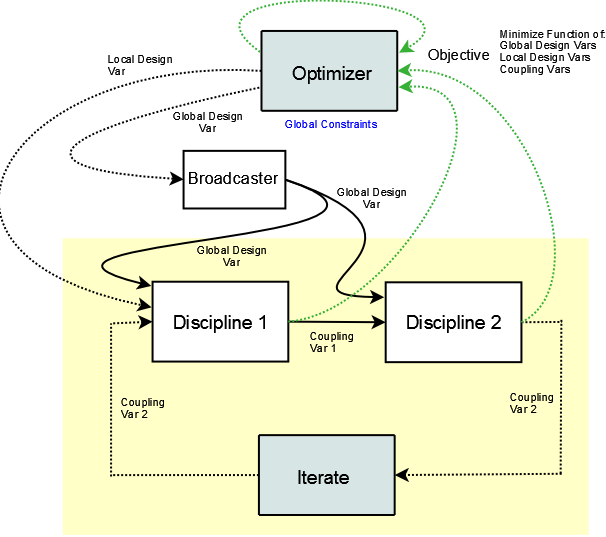
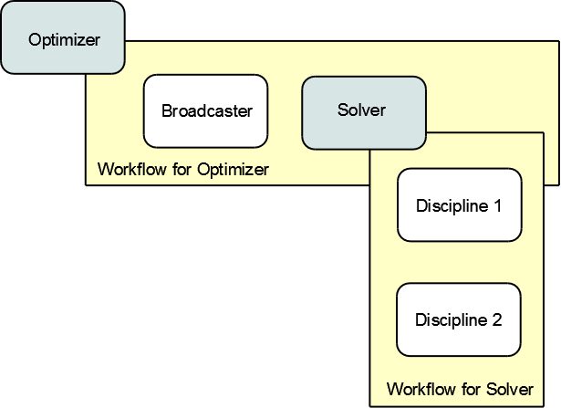

.. index:: MDAO tutorial problem

.. _Tutorial:-MDAO-Architectures:

Tutorial: MDAO Architectures
============================

This tutorial shows how to create a model to solve a simple problem consisting of
two coupled disciplines using several MDAO strategies, including:

#. Multidisciplinary Design Feasible (MDF)
#. Independent Design Feasible (IDF)
#. Collaborative Optimization (CO)

The tutorial will introduce you to some new topics that include using the iteration
hierarchy to set up models with nested optimization loops, using a solver to "close
the loop" in a coupled multidisciplinary simulation, and using a broadcaster to set
the values of design variables in multiple places at one time.

This tutorial covers some of the more advanced capabilities of OpenMDAO. You should read and understand
the :ref:`simple tutorial problem <Getting-Started-with-OpenMDAO>` before starting this one. An
understanding of the material presented in :ref:`A-More-Complex-Tutorial-Problem` is also
recommended.

.. index:: Sellar

All of these tutorials use the Sellar problem which consists of two disciplines as follows:

.. figure:: ../images/user-guide/SellarResized.png
   :align: center
 
Variables *z1, z2,* and *x1* are the design variables over which we'd like to minimize
the objective. Both disciplines are functions of *z1* and *z2,* so they are called the 
*global* design variables, while only the first discipline is a function of *x1,* so it
is called the *local* design variable. The two disciplines are coupled by the
coupling variables *y1* and *y2.* Discipline 1 takes *y2* as an input, and computes *y1* as
an output, while Discipline 2 takes *y1* as an input and computes *y2* as an output. As
such, the two disciplines depend on each other's output, so iteration is required to
find a set of coupling variables that satisfies both equations.

Disciplines 1 and 2 were implemented in OpenMDAO as components.

.. testcode:: Disciplines

    from openmdao.main.api import Component
    from openmdao.lib.api import Float
    
    class SellarDiscipline1(Component):
        """Component containing Discipline 1"""
        
        # pylint: disable-msg=E1101
        z1 = Float(0.0, iotype='in', desc='Global Design Variable')
        z2 = Float(0.0, iotype='in', desc='Global Design Variable')
        x1 = Float(0.0, iotype='in', desc='Local Design Variable')
        y2 = Float(0.0, iotype='in', desc='Disciplinary Coupling')
    
        y1 = Float(iotype='out', desc='Output of this Discipline')        
    
            
        def execute(self):
            """Evaluates the equation  
            y1 = z1**2 + z2 + x1 - 0.2*y2"""
            
            z1 = self.z1
            z2 = self.z2
            x1 = self.x1
            y2 = self.y2
            
            self.y1 = z1**2 + z2 + x1 - 0.2*y2
    
    
    class SellarDiscipline2(Component):
        """Component containing Discipline 2"""
        
        # pylint: disable-msg=E1101
        z1 = Float(0.0, iotype='in', desc='Global Design Variable')
        z2 = Float(0.0, iotype='in', desc='Global Design Variable')
        y1 = Float(0.0, iotype='in', desc='Disciplinary Coupling')
    
        y2 = Float(iotype='out', desc='Output of this Discipline')        
    
            
        def execute(self):
            """Evaluates the equation  
            y1 = y1**(.5) + z1 + z2"""
            
            z1 = self.z1
            z2 = self.z2
            
            # Note: this may cause some issues. However, y1 is constrained to be
            # above 3.16, so lets just let it converge, and the optimizer will 
            # throw it out
            y1 = abs(self.y1)
            
            self.y2 = y1**(.5) + z1 + z2
            
``SellarDiscipline2`` contains a square root of variable *y1* in its calculation. For negative values
of *y1,* the result would be imaginary, so the absolute value is taken before the square root
is applied. This component is clearly not valid for ``y1 < 0``, and our first thought was to add
a *low* attribute to the variable definition for *y1.* However, the solver that was used to
converge the two disciplines occasionally forced *y1* to go slightly negative. The inclusion
of the absolute value solved the problem without impacting the eventual convergence of the
solver.

These two components are contained in the file ``disciplines.py``.

**Reference:**

Sellar, R. S., Batill, S. M., and Renaud, J. E., "Response Surface Based,
Concurrent Subspace Optimization for Multidisciplinary System Design,"
Proceedings References 79 of the 34th AIAA Aerospace Sciences Meeting and
Exhibit, Reno, NV, January 1996.

.. index:: Multidisciplinary Design Feasible (MDF)
            
.. _Multidisciplinary-Design-Feasible-(MDF):

Multidisciplinary Design Feasible (MDF)
---------------------------------------

In a Multidisciplinary Design Feasible (MDF) problem, the disciplines are directly coupled
via some kind of solver, and the design variables are optimized in a single loop. The
following diagram illustrates the data flow for MDF applied to the Sellar problem.

   
   Data Flow for MDF Applied to the Sellar Prroblem

This diagram introduces a component called a *Broadcaster.* A Broadcaster is a component that
enables a design variable to be set to the same value at multiple locations. If you recall, a
driver such as the CONMIN optimizer contains a list of *parameters,* where each parameter is
a location in OpenMDAO's data hierarchy. Each parameter is a single design variable, and there
is no way to indicate that one design variable might be needed at multiple component inputs
in the model. We can overcome this by creating a component that passes an input to its output.
Thus, CONMIN can set the design variable in this Broadcaster, and when the Broadcaster executes,
the new value gets passed to all of the components that need it.

OpenMDAO doesn't have a built-in Broadcaster, so we need to make our own. It's a simple
component with some inputs, some outputs, and an execute function that passes the inputs
to the outputs.

.. testcode:: Broadcaster

    from openmdao.main.api import Component
    from openmdao.lib.api import Float
    
    class Broadcaster(Component):
        """Component that holds some design variables.
        This is only needed because we can't hook an optimizer up to multiple
        locations of the same design variable"""
        
        # pylint: disable-msg=E1101
        z1_in = Float(0.0, iotype='in', desc='Global Design Variable')
        z2_in = Float(0.0, iotype='in', desc='Global Design Variable')
        x1_in = Float(0.0, iotype='in', desc='Local Design Variable for CO')
        y1_in = Float(0.0, iotype='in', desc='Coupling Variable')
        y2_in = Float(0.0, iotype='in', desc='Coupling Variable')
        z1 = Float(0.0, iotype='out', desc='Global Design Variable')
        z2 = Float(0.0, iotype='out', desc='Global Design Variable')
        x1 = Float(0.0, iotype='out', desc='Local Design Variable for CO')
        y1 = Float(0.0, iotype='out', desc='Coupling Variable')
        y2 = Float(0.0, iotype='out', desc='Coupling Variable')
        
        def execute(self):
            """ Pass everything through"""
            self.z1 = self.z1_in
            self.z2 = self.z2_in
            self.x1 = self.x1_in
            self.y1 = self.y1_in
            self.y2 = self.y2_in

We've added the coupling variables in our Broadcaster as well, foreseeing the need
for them in some of the other MDAO architectures.

.. index:: WorkFlow

The diagram also shows a solver that takes the output of the component dataflow
and feeds it back into the input. OpenMDAO presently has two solvers: ``FixedPointIterator``
and ``BroydenSolver``. The ``FixedPointIterator`` is a solver that performs fixed point iteration,
which means that it keeps driving ``x_new = f(x_old)`` until convergence is achieved. In
other words, *y2* is passed from the output of ``SellarDiscipline2`` to the input of ``SellarDiscipline1``,
and the loop keeps executing until the change in the value of *y2* between iterations is
smaller than a tolerance. The ``BroydenSolver`` is a solver based on a quasi-Newton-Raphson
algorithm that uses a Broyden update to approximate the Jacobian. This solver reads
the output and calculates a new input each iteration. Convergence is achieved when the
residual between the output and input is driven to zero.

The major difference between the MDF problem and previous examples is the
presence of nested drivers. Drivers can be nested in OpenMDAO using WorkFlows
in the iteration hierarchy. A :term:`WorkFlow` is an object that determines execution
order for a group of Components. Each driver contains a single WorkFlow. For
each iteration, a Driver will execute one pass through the WorkFlow, executing
the components contained therein in the order the WorkFlow prescribes.
Although in many cases a WorkFlow contains just Components, it can also
contain Drivers. This allows nested iterative processes to be created. The
following diagram shows an iteration hierarchy for the MDF problem.
   

   
   An Iteration Hierarchy for the MDF Problem
   
In the top left of this diagram, the gray box labeled *Optimizer* is the
top level (or outermost) driver. This driver has a workflow that contains
two objects -- the Broadcaster and a Solver -- so each time the optimizer runs
an iteration, both of these components run. The Solver also has a workflow
which contains the two discipline components. With the nesting of the drivers
we get the behavior we want, namely, that for each optimizer iteration, the 
solver runs the discipline components until they converge. We now have a nested
driver loop.

The execution order is determined by the components' dataflow. Here, the
broadcaster feeds the design variables to the discipline components, which
are contained in the solver's workflow, so the broadcaster must run first. Also,
the data connection between the two discipline components means that ``SellarDiscipline1``
runs before ``SellarDiscipline2``. Sometimes a workflow may contain components that are
not directly connected and can be run concurrently. Future tutorials will
demonstrate this.

Now, let's create the assembly for the MDF problem. First, we'll create
the top level optimization loop.

.. testcode:: MDF_parts

        from openmdao.examples.mdao.disciplines import SellarDiscipline1, \
                                                       SellarDiscipline2
        from openmdao.examples.mdao.broadcaster import Broadcaster
        
        from openmdao.main.api import Assembly, set_as_top
        from openmdao.lib.api import CONMINdriver, FixedPointIterator
        
        class SellarMDF(Assembly):
            """ Optimization of the Sellar problem using MDF
            Disciplines coupled with FixedPointIterator.
            """
            
            def __init__(self):
                """ Creates a new Assembly with this problem
                
                Optimal Design at (1.9776, 0, 0)
                
                Optimal Objective = 3.18339"""
                
                # pylint: disable-msg=E1101
                super(SellarMDF, self).__init__()
        
                # create Optimizer instance
                self.add('driver', CONMINdriver())
                
                # Outer Loop - Global Optimization
                self.add('bcastr', Broadcaster())
                self.add('fixed_point_iterator', FixedPointIterator())
                self.driver.workflow.add([self.bcastr, self.fixed_point_iterator])
                
So far nothing is really new in terms of syntax. Note that the top level driver is
always named ``'driver'``. However, all other drivers can be given any valid name. For this
model, we've chosen to use the ``FixedPointIterator``.

Next, we need to create the workflow for the solver. We create instances of ``SellarDiscipline1``
and ``SellarDiscipline2`` and add them to the assembly. Then, instead of adding them to the
workflow of ``'driver'``, we add them to the workflow of ``'fixed_point_iterator'``.

.. testcode:: MDF_parts
    :hide:
    
    self = SellarMDF()

.. testcode:: MDF_parts

        # Inner Loop - Full Multidisciplinary Solve via fixed point iteration
        self.add('dis1', SellarDiscipline1())
        self.add('dis2', SellarDiscipline2())
        self.fixed_point_iterator.workflow.add([self.dis1, self.dis2])
        
Now the iteration hierarchy is finished. We still need to hook up the data connections
and set up the CONMIN optimization and the fixed point iteration.

We need one connection between ``'dis1'`` and ``'dis2'``. We also need to hook up ``'bcastr'``
so that the design variables carry through to the discipline components.

.. testcode:: MDF_parts

        self.connect('bcastr.z1','dis1.z1')
        self.connect('bcastr.z1','dis2.z1')
        self.connect('bcastr.z2','dis1.z2')
        self.connect('bcastr.z2','dis2.z2')
        self.connect('dis1.y1','dis2.y1')

.. index:: Expression

Next, the parameters for the fixed point iterator must be set. ``FixedPointIterator``
is a specialized solver that is applicable only to single-input/single-output problems.
As such, it does not conform to the standard driver interface. The output from ``SellarDiscipline2``
is ``'dis2.y2'``. During iteration, this is the variable that is going to be sent to the input
of ``SellarDiscipline1``, which is ``'dis1y2'``. The parameter ``x_out`` takes the output variable
while the parameter ``x_in`` takes the input variable. These are :term:`Expressions`, but fixed point
iteration doesn't make sense using anything other than single variables. We also set the
maximum number of iterations and a convergence tolerance.
        
.. testcode:: MDF_parts

        # Iteration loop
        self.fixed_point_iterator.x_out = 'dis2.y2'
        self.fixed_point_iterator.x_in = 'dis1.y2'
        self.fixed_point_iterator.max_iteration = 1000
        self.fixed_point_iterator.tolerance = .0001       

Finally, the CONIM optimization is set up.

.. testcode:: MDF_parts

        # Optimization parameters
        self.driver.objective = '(dis1.x1)**2 + bcastr.z2 + dis1.y1 + math.exp(-dis2.y2)'
                
        self.driver.add_parameter('bcastr.z1_in', low = -10.0, high = 10.0)
        self.driver.add_parameter('bcastr.z2_in', low = 0.0,   high = 10.0)
        self.driver.add_parameter('dis1.x1',      low = 0.0,   high = 10.0)
        
        self.driver.add_constraint('3.16 < dis1.y1')
        self.driver.add_constraint('dis2.y2 - 24.0')
        
        self.driver.cons_is_linear = [1, 1]
        self.driver.iprint = 0
        self.driver.itmax = 30
        self.driver.fdch = .001
        self.driver.fdchm = .001
        self.driver.delfun = .0001
        self.driver.dabfun = .000001
        self.driver.ctlmin = 0.0001
        
The process of getting the optimizer to reach a value close enough to the
correct optimum required the use of more of CONMIN's settings. The *fdchm*
parameter is the minimum absolute step size that the finite difference uses,
and *fdch* is the step size relative to the design variable. *Dabfun* is the
absolute change in the objective function to indicate convergence (i.e., if
the objective function changes by less than *dabfun,* then the problem is
converged). Similarly, *delfun* is the relative change of the objective
function with respect to the value at the previous step. Finally, *ctlmin* is
the minimum constraint thickness for the linear constraints. We also use
``cons_is_linear`` to let CONMIN know that both constraints are linear. This
can speed up the algorithm, though it hardly matters here.

As before, the ``add_constraint`` function is used to add our constraints. This
time however, we used a more general expression for the first constraint. Expressions
in OpenMDAO can also be parsed as inequalities, so all of the following are
equivalent ways of defining this constraint:

.. testcode:: MDF_parts

        self.driver.add_constraint('3.16 - dis1.y1')
        self.driver.add_constraint('3.16 - dis1.y1 < 0')
        self.driver.add_constraint('3.16 < dis1.y1')
        self.driver.add_constraint('-3.16 > -dis1.y1')

Finally, putting it all together gives:

.. testcode:: MDF_full

        from openmdao.examples.mdao.disciplines import SellarDiscipline1, \
                                                       SellarDiscipline2
        from openmdao.examples.mdao.broadcaster import Broadcaster
        
        from openmdao.main.api import Assembly, set_as_top
        from openmdao.lib.api import CONMINdriver, FixedPointIterator
        
        class SellarMDF(Assembly):
            """ Optimization of the Sellar problem using MDF
            Disciplines coupled with FixedPointIterator.
            """
            
            def __init__(self):
                """ Creates a new Assembly with this problem
                
                Optimal Design at (1.9776, 0, 0)
                
                Optimal Objective = 3.18339"""
                
                # pylint: disable-msg=E1101
                super(SellarMDF, self).__init__()
        
                # create Optimizer instance
                self.add('driver', CONMINdriver())
                
                # Outer Loop - Global Optimization
                self.add('bcastr', Broadcaster())
                self.add('fixed_point_iterator', FixedPointIterator())
                self.driver.workflow.add([self.bcastr, self.fixed_point_iterator])
        
                # Inner Loop - Full Multidisciplinary Solve via fixed point iteration
                self.add('dis1', SellarDiscipline1())
                self.add('dis2', SellarDiscipline2())
                self.fixed_point_iterator.workflow.add([self.dis1, self.dis2])
                
                # Make all connections
                self.connect('bcastr.z1','dis1.z1')
                self.connect('bcastr.z1','dis2.z1')
                self.connect('bcastr.z2','dis1.z2')
                self.connect('bcastr.z2','dis2.z2')
                self.connect('dis1.y1','dis2.y1')
        
                # Iteration loop
                self.fixed_point_iterator.x_out = 'dis2.y2'
                self.fixed_point_iterator.x_in = 'dis1.y2'
                self.fixed_point_iterator.max_iteration = 1000
                self.fixed_point_iterator.tolerance = .0001
        
                # Optimization parameters
                self.driver.objective = '(dis1.x1)**2 + bcastr.z2 + dis1.y1 + math.exp(-dis2.y2)'
                
                self.driver.add_parameter('bcastr.z1_in', low = -10.0, high = 10.0)
                self.driver.add_parameter('bcastr.z2_in', low = 0.0,   high = 10.0)
                self.driver.add_parameter('dis1.x1',      low = 0.0,   high = 10.0)
        
                self.driver.add_constraint('3.16 < dis1.y1')
                self.driver.add_constraint('dis2.y2 - 24.0')
                    
                self.driver.cons_is_linear = [1, 1]
                self.driver.iprint = 0
                self.driver.itmax = 30
                self.driver.fdch = .001
                self.driver.fdchm = .001
                self.driver.delfun = .0001
                self.driver.dabfun = .000001
                self.driver.ctlmin = 0.0001

This problem is contained in ``sellar_MDF.py``. Executing it at the command line should produce
output that resembles this:

::

        $ python sellar_MDF.py
        CONMIN Iterations:  12
        Minimum found at (1.977657, 0.000000, 0.000000)
        Couping vars: 3.160068, 3.755315
        Minimum objective:  3.18346116811
        Elapsed time:  0.121051073074 seconds

We can also replace the fixed point iterator with a better solver. Fixed point
iteration works for some problems, including this one, but may not converge to
a solution for other problems. OpenMDAO also contains a Broyden solver called
``BroydenSolver``. This solver is based on a quasi-Newton-Raphson algorithm found in 
``scipy.nonlinear``. It uses a Broyden update to approximate the Jacobian. If we
replace ``FixedPointIterator`` with ``BroydenSolver``, the optimizer's workflow
looks like this:

.. testcode:: MDF_parts

        # Don't forget to put the import in your header
        from openmdao.lib.api import BroydenSolver

        # Outer Loop - Global Optimization
        self.add('bcastr', Broadcaster())
        self.add('solver', BroydenSolver())
        self.driver.workflow.add([self.bcastr, self.solver])

Next, we set up our parameters for the inner loop. The Broyden solver can be
connected using the standard driver interface. It can take multiple inputs and outputs
though we only have one input and one output in this example.
        
.. testcode:: MDF_parts

        # Iteration loop
        self.solver.add_parameter('dis1.y2', low=-9.e99, high=9.e99)
        self.solver.add_constraint('dis2.y2 = dis1.y2')
        self.solver.itmax = 10
        self.solver.alpha = .4
        self.solver.tol = .0000001
        self.solver.algorithm = "broyden2"
        
The input is selected using ``add_parameter``. You might also be familiar with the
term *independent* used to describe this. Here, we've given a *low* and a
*high* attribute, but we've set them very high as the Broyden solver doesn't
use either of these. The output is specified by adding an equality constraint.
A solver essentially tries to drive something to zero. In this case, we want to
drive the residual error in the coupled variable *y2* to zero. An equality constraint
is defined with an Expression which is parsed for the equals sign, so the
following constraints are equivalent:

.. testcode:: MDF_parts

        # Iteration loop
        self.solver.add_constraint('dis2.y2 = dis1.y2')
        self.solver.add_constraint('dis2.y2 - dis1.y2 = 0')

Be careful not to omit the equals sign, or OpenMDAO will treat the constraint
as an inequality constraint.
        
Equality constraints may also be available for some optimizers, but you should 
verify that they are supported. CONMIN does not support equality constraints.

.. index:: Individual Design Feasible (IDF)

.. _Individual-Design-Feasible-(IDF):
        
Individual Design Feasible (IDF)
--------------------------------

Next, we will look at how to set up the Individual Design Feasible (IDF)
architecture using the Sellar problem. In IDF, the coupling between the
disciplines is removed, and the input coupling variables are added to
the optimizer's design variables. The algorithm calls for two new equality
constraints that constrain to zero the residual error between the coupling variable
output by the optimizer and the coupling variable output by the components.
This assures that the solution is a feasible coupling, though it is achieved
through the optimizer's additional effort instead of a solver. The data
flow for IDF is illustrated in the following diagram:

.. figure:: ../images/user-guide/Arch-IDF.png
   :align: center

   Date Flow for IDF
   
IDF needs only one driver, so there is just one workflow. The broadcaster and
the two disciplines are executed sequentially.
   
.. figure:: ../images/user-guide/Arch-IDF-OpenMDAO.png
   :align: center
   
   An Iteration Hierarchy for IDF
   
Next, we will create the SellarIDF assembly. First, all of our components
are instantiated and the workflow is defined.
   
.. testcode:: IDF_parts

        from openmdao.examples.mdao.disciplines import SellarDiscipline1, \
                                                       SellarDiscipline2
        from openmdao.examples.mdao.broadcaster import Broadcaster
        
        from openmdao.main.api import Assembly, set_as_top
        from openmdao.lib.api import CONMINdriver
        
        
        class SellarIDF(Assembly):
            """ Optimization of the Sellar problem using IDF"""
            
            def __init__(self):
                """ Creates a new Assembly with this problem
                
                Optimal Design at (1.9776, 0, 0)
                
                Optimal Objective = 3.18339"""
                
                # pylint: disable-msg=E1101
                
                super(SellarIDF, self).__init__()
        
                # create Optimizer instance
                self.add('driver', CONMINdriver())
        
                # Disciplines
                self.add('bcastr', Broadcaster())
                self.add('dis1', SellarDiscipline1())
                self.add('dis2', SellarDiscipline2())
                
                # Driver process definition
                self.driver.workflow.add([self.bcastr, self.dis1, self.dis2])
                
                # Make all connections
                self.connect('bcastr.z1','dis1.z1')
                self.connect('bcastr.z1','dis2.z1')
                self.connect('bcastr.z2','dis1.z2')
                self.connect('bcastr.z2','dis2.z2')

We've also hooked up our data connections. Only the design variables that are shared
by both components need to be connected to the broadcaster.

All that is left to do is set up the CONMIN optimizer.

.. testcode:: IDF_parts
    :hide:
    
    self = SellarIDF()

.. testcode:: IDF_parts

        # Optimization parameters
        self.driver.objective = \
            '(dis1.x1)**2 + bcastr.z2 + dis1.y1 + math.exp(-dis2.y2)'
        
        self.driver.add_parameter('bcastr.z1_in', low = -10.0, high=10.0)
        self.driver.add_parameter('bcastr.z2_in', low = 0.0,   high=10.0)
        self.driver.add_parameter('dis1.x1',      low = 0.0,   high=10.0)
        self.driver.add_parameter('dis2.y1',      low = 3.16,  high=10.0)
        self.driver.add_parameter('dis1.y2',      low = -10.0, high=24.0)
            
        self.driver.add_constraint('(dis2.y1-dis1.y1)**3')
        self.driver.add_constraint('(dis1.y1-dis2.y1)**3')
        self.driver.add_constraint('(dis2.y2-dis1.y2)**3')
        self.driver.add_constraint('(dis1.y2-dis2.y2)**3')        
        self.driver.iprint = 0
        self.driver.itmax = 100
        self.driver.fdch = .003
        self.driver.fdchm = .003
        self.driver.delfun = .0001
        self.driver.dabfun = .00001
        self.driver.ct = -.01
        self.driver.ctlmin = 0.001
        
Notice that the coupling variables are included as optimizer parameters. We
also introduce the CONMIN parameter *ct*, which is the constraint thickness for
nonlinear constraints. Our constraints are nonlinear, but note that any
constraint that involves a component output is most likely a nonlinear
constraint because outputs are usually nonlinear functions of the design variables.

Since CONMIN doesn't support equality constraints, we have to fall back on a
trick where we replace it with an equivalent pair of inequality constraints.
For example, if we want to constrain ``x=2``, we could constraint ``x<=2`` and ``x>=2`` and
let the optimizer converge to a solution where both constraints are active.
Stability may be questionable for such a method, so it is always advisable to use an
optimizer that has equality constraints rather than trying to squeeze a solution
out of an optimizer this way. In particular, be careful about trying a fancier
solution such as constraining ``abs(dis2.y1-dis1.y1)<=0``. This nonlinear
constraint has a discontinuous slope, and CONMIN won't handle that constraint very well.
Here, we take ``(dis2.y1-dis1.y1)`` and turn it into a cubic expression, which seemed
to make the problem a little less sensitive to changes in the computational
environment (32 bit vs 64 bit, etc.)

This problem is contained in ``sellar_IDF.py``. Executing it at the command line should produce
output that resembles this:

::

        $ python sellar_IDF.py
        CONMIN Iterations:  10
        Minimum found at (1.976427, 0.000287, 0.000000)
        Couping vars: 3.156521, 3.754359
        Minimum objective:  3.18022323743
        Elapsed time:  0.200541973114 seconds

.. index:: Collaborative Optimization (CO)

.. _Collaborative-Optimization-(CO):

Collaborative Optimization (CO)
-------------------------------

Next, we will set up a model that solves the Sellar problem by Collaborative
Optimization (CO). CO is a two-level architecture with three optimizer loops,
one at each discipline, and one acting globally. The global optimizer drives
the design and coupling variables towards an optimal solution that minimizes
the objective while constraining to zero the sum of the squares of the
residuals between the values commanded by the global optimizer and those set
by the local optimizers. Each local optimizer operates on its own
discipline, driving its design variables while minimizing the residual between
the actual value of the design variables and the values commanded by the global
optimizer.

CO for the Sellar case is very interesting because there are no component data connections.
All values are passed through the expressions for the objectives, constraints, and
parameters of the various optimizers, as shown in the next diagram.

.. figure:: ../images/user-guide/Arch-CO.png
   :align: center

   Data Flow for CO

The CO model has three optimizers, so there are three workflows. The top level
workflow includes the broadcaster and the two lower level optimizers, and each of
those optimizers has a workflow with just the discipline component. This can be
seen in the next figure.
   
.. figure:: ../images/user-guide/Arch-CO-OpenMDAO.png
   :align: center
   
   An Iteration Hierarchy for CO

First, we create the component instances and set up this iteration hierarchy. Notice
that there are three drivers, and we add each component to one of the three workflows.
        
.. testcode:: CO_parts

        from openmdao.examples.mdao.disciplines import SellarDiscipline1, \
                                                       SellarDiscipline2
        from openmdao.examples.mdao.broadcaster import Broadcaster
        
        from openmdao.main.api import Assembly, set_as_top
        from openmdao.lib.api import CONMINdriver

        class SellarCO(Assembly):
            """Solution of the sellar analytical problem using CO.
            """
        
            def __init__(self):
                """ Creates a new Assembly with this problem
                
                Optimal Design at (1.9776, 0, 0)
                
                Optimal Objective = 3.18339"""
                
                # pylint: disable-msg=E1101
                super(SellarCO, self).__init__()
                
                # Global Optimization
                self.add('driver', CONMINdriver())
                self.add('bcastr', Broadcaster())
                self.add('localopt1', CONMINdriver())
                self.add('localopt2', CONMINdriver())
                self.driver.workflow.add([self.bcastr, self.localopt1, 
                                          self.localopt2])
                
                # Local Optimization 1
                self.add('dis1', SellarDiscipline1())
                self.localopt1.workflow.add(self.dis1)
                
                # Local Optimization 2
                self.add('dis2', SellarDiscipline2())
                self.localopt2.workflow.add(self.dis2)

Notice that there are no data connections, so we never need to call ``self.connect``.

Now we need to set up the parameters for the outer optimization loop. 

.. testcode:: CO_parts
    :hide:
    
    self = SellarCO()

.. testcode:: CO_parts

        #Parameters - Global Optimization
        self.driver.objective = '(bcastr.x1)**2 + bcastr.z2 + bcastr.y1' + \
                                                '+ math.exp(-bcastr.y2)'
        self.driver.add_parameter('bcastr.z1_in', low = -10.0, high = 10.0)
        self.driver.add_parameter('bcastr.z2_in', low = 0.0,   high = 10.0)
        self.driver.add_parameter('bcastr.x1_in', low = 0.0,   high = 10.0)
        self.driver.add_parameter('bcastr.y1_in', low = 3.16,  high = 10.0)
        self.driver.add_parameter('bcastr.y2_in', low = -10.0, high = 24.0)

        con1 = '(bcastr.z1-dis1.z1)**2 + (bcastr.z2-dis1.z2)**2 + ' + \
               '(bcastr.x1-dis1.x1)**2 + ' + \
               '(bcastr.y1-dis1.y1)**2 + (bcastr.y2-dis1.y2)**2'
        con2 = '(bcastr.z1-dis2.z1)**2 + (bcastr.z2-dis2.z2)**2 + ' + \
               '(bcastr.y1-dis2.y1)**2 + (bcastr.y2-dis2.y2)**2'
        self.driver.add_constraint(con1)
        self.driver.add_constraint(con2)
        
        self.driver.printvars = ['dis1.y1','dis2.y2']
        self.driver.iprint = 0
        self.driver.itmax = 100
        self.driver.fdch = .003
        self.driver.fdchm = .003
        self.driver.delfun = .0001
        self.driver.dabfun = .00001
        self.driver.ct = -.001
        self.driver.ctlmin = 0.001

Here we are able to build up a complicated Expression for the sum of the squares
of all of the residuals and use it as our constraint. Note that this is another
example of a constraint that would be better served as an equality constraint, but
it's not problematic because a sum of squares is one-sided. We have two constraints
here, one for each discipline.

Finally, we set up our local optimization loops.

.. testcode:: CO_parts

        #Parameters - Local Optimization 1
        self.localopt1.objective = '(bcastr.z1-dis1.z1)**2 + ' + \
                                   '(bcastr.z2-dis1.z2)**2 + ' + \
                                   '(bcastr.x1-dis1.x1)**2 + ' + \
                                   '(bcastr.y1-dis1.y1)**2 + ' + \
                                   '(bcastr.y2-dis1.y2)**2'
        self.localopt1.add_parameter('dis1.z1', low = -10.0, high = 10.0)
        self.localopt1.add_parameter('dis1.z2', low = 0.0,   high = 10.0)
        self.localopt1.add_parameter('dis1.x1', low = 0.0,   high = 10.0)
        self.localopt1.add_parameter('dis1.y2', low = -10.0, high = 24.0)
        self.localopt1.iprint = 0
        self.localopt1.itmax = 100
        self.localopt1.fdch = .003
        self.localopt1.fdchm = .003
        self.localopt1.delfun = .001
        self.localopt1.dabfun = .00001
        
        #Parameters - Local Optimization 2
        self.localopt2.objective = '(bcastr.z1-dis2.z1)**2 + ' + \
                                   '(bcastr.z2-dis2.z2)**2 + ' + \
                                   '(bcastr.y1-dis2.y1)**2 + ' + \
                                   '(bcastr.y2-dis2.y2)**2'
        self.localopt2.add_parameter('dis2.z1', low = -10.0, high = 10.0)
        self.localopt2.add_parameter('dis2.z2', low = 0.0,   high = 10.0)
        self.localopt2.add_parameter('dis2.y1', low = 3.16,  high = 10.0)
        self.localopt2.iprint = 0
        self.localopt2.itmax = 100
        self.localopt2.fdch = .003
        self.localopt2.fdchm = .003
        self.localopt2.delfun = .001
        self.localopt2.dabfun = .00001

This problem is contained in ``sellar_CO.py``. Executing it at the command line should produce
output that resembles this:

::

        $ python sellar_CO.py
        CONMIN Iterations:  60
        Minimum found at (2.007823, 0.000000, 0.003927)
        Couping vars: 3.164985, 3.802037
        Minimum objective:  3.18215119048
        Elapsed time:  22.5064539909 seconds

After 60 iterations of the top level optimizer, CO gives an answer that's slightly off the optimum, but the calculated
objective is still very close.
