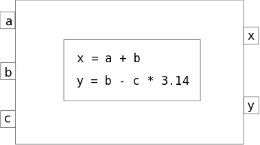

.. index:: User Guide overview
.. index:: MDAO
.. index:: OpenMDAO
.. index:: Component
.. index:: Workflow
.. index:: Assembly

.. _Introduction-to-the-OpenMDAO-Framework:

Introduction to the OpenMDAO Framework
======================================

MDAO stands for Multidisciplinary Analysis and Optimization. OpenMDAO is
an open source framework for analyzing and solving MDAO problems. In OpenMDAO, a
problem is represented by a system of objects called :term:`components`. These objects
have input and output attributes and can perform some sort of calculation when
they are executed. They can have their inputs and outputs connected to those
of other components, allowing data to be passed between them when they perform
their calculations.

The following figure gives a conceptual view of what a simple Component might
look like. This Component has two inputs (*a, b*) and one output (*c*). The
calculation that it performs is to add the two inputs to produce the output.

.. _`Conceptual-View-of-a-Simple-Component`:

   Conceptual View of a Simple Component

Components within OpenMDAO can be as simple or complex as necessary.
The inputs and outputs to a Component are Python objects, so they are not limited
to being simple types like floating point or integer.

An :term:`Assembly` is a special kind of Component that contains other
components. When an Assembly is executed, it runs the components it contains
in the order determined by its Workflow object. A :term:`Workflow` is simply an
object that determines execution order for a group of components. The workflow
orders the components according to the direction of the data flow between them,
i.e., such that any Component that supplies input values to another Component
will always run *before* that Component.

A :term:`Driver` is another special kind of Component. Drivers are designed to iterate
over a Workflow until some condition is met. Some examples of Drivers
are optimizers, solvers, and design space explorers.

.. todo:: Expand this section

This concludes a brief introduction to OpenMDAO. Please see the next section for
details on system requirements and how to install the software.
