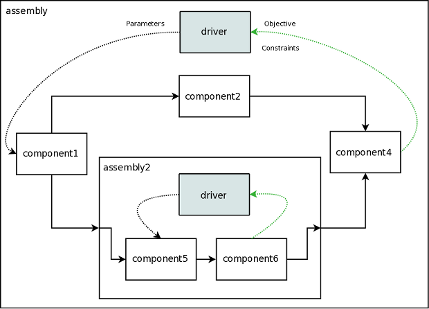

.. index:: User Guide overview
.. index:: MDAO
.. index:: OpenMDAO
.. index:: Component
.. index:: Workflow
.. index:: Assembly

.. _Introduction-to-the-OpenMDAO-Framework:

Introduction to the OpenMDAO Framework
======================================

MDAO stands for `Multidisciplinary Analysis and Optimization`. OpenMDAO is an
open source framework for analyzing and solving MDAO problems. In OpenMDAO, a
problem is represented by a system of objects called components. 

A :term:`Component` is an object with an ``execute`` function that updates
the values of its output variables based on the values of its input variables.
You can connect the inputs and outputs of one component to those of other
components, allowing data to be passed between them.

The following figure gives a conceptual view of what a simple Component might
look like. This Component has two inputs (*a, b*) and one output (*c*). The
calculation that it performs is to add the two inputs to produce the output.

.. _`Conceptual-View-of-a-Simple-Component`:

.. figure:: ../generated_images/Component.png
   :align: center

   Conceptual View of a Simple Component

Components within OpenMDAO can be as simple or complex as necessary.
The inputs and outputs to a Component are Python objects, so they are not limited
to being simple types like floating point or integer.

A :term:`Workflow` is an object that executes a group of components in a particular
order.

A :term:`Driver` is a special kind of Component that executes a Workflow
repeatedly until some condition is met. Some examples of Drivers are
optimizers, solvers, and design space explorers.

An :term:`Assembly` is a special kind of Component that contains other components. 
One of those components must be a Driver named *driver*. When an Assembly executes, 
it executes *driver*, which then executes its Workflow. A Driver's Workflow may contain 
other Drivers, and each of those Drivers has a Workflow of its own. The hierarchical
structure defined by the contents of an Assembly's drivers and the contents of their
workflows is called an :term:`iteration hierarchy`.

The following figure shows an example of an iteration hierarchy involving four 
different Drivers.  Note that in this example the same component, *component2*, 
appears in two different workflows.

   
.. _`iteration hierarchy concept`:

.. figure:: ../generated_images/IterationHierarchy.png
   :align: center

   View of an Iteration Hierarchy

The next figure shows the data flow within an Assembly having one Driver and four
Components. A solid line between two Components indicates that one of them is
supplying inputs to the other. Each dashed line between a Driver and a
Component indicates a parameter, objective, or constraint in the Driver that
references an input or output variable in the Component. The arrow at the end
of a dashed or solid line indicates the direction of the data flow between two
connected objects.

.. _`driver intro2`:

.. figure:: ../generated_images/Intro-Driver2.png
   :align: center

   View of an Assembly Showing Data Flow

   
Because an Assembly is also a Component, a hierarchy of assemblies can be constructed.
For example, we could replace *component3* from the figure above with an assembly
containing two other components, resulting in the following:

.. _`driver intro1`:

   View of an Assembly within an Assembly

So assemblies allow us to organize our model into a hierarchy of submodels, and within each
submodel, drivers and workflows give us a flexible way to define an iteration scheme.

The functionality of OpenMDAO can be extended through the use of
:term:`plugins`. In the figure below, objects of the sort found outside of the
*Framework* box can be integrated into the framework as plugins. This means
that a user can create any of these and the framework will understand how to
interact with them. This is possible because plugins have a specific interface
that the framework expects.  To learn how to create your own plugins, see the 
:ref:`Plugin-Developer-Guide`.

.. figure:: ../generated_images/TopContext.png
   :align: center

   Top Level Context Diagram

This concludes a brief introduction to OpenMDAO. Please see the next section for
details on system requirements and how to install the software.
