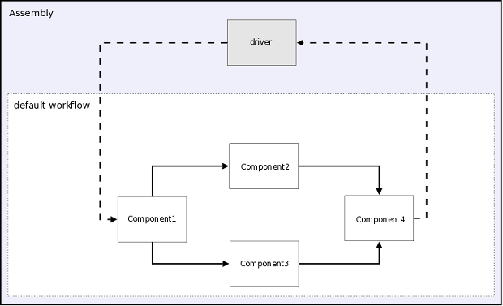

.. index:: User Guide overview
.. index:: MDAO
.. index:: OpenMDAO
.. index:: Component
.. index:: Workflow
.. index:: Assembly

.. _Introduction-to-the-OpenMDAO-Framework:

Introduction to the OpenMDAO Framework
======================================

MDAO stands for Multidisciplinary Analysis and Optimization. OpenMDAO is an
open source framework for analyzing and solving MDAO problems. In OpenMDAO, a
problem is represented by a system of objects called :term:`components`. These
objects have input and output attributes and can perform some sort of
calculation when they are executed. You can connect the inputs and outputs of
one component to those of other components, allowing data to be passed between
them.

The following figure gives a conceptual view of what a simple Component might
look like. This Component has two inputs (*a, b*) and one output (*c*). The
calculation that it performs is to add the two inputs to produce the output.

.. _`Conceptual-View-of-a-Simple-Component`:

.. figure:: ../generated_images/Component.png
   :align: center

   Conceptual View of a Simple Component

Components within OpenMDAO can be as simple or complex as necessary.
The inputs and outputs to a Component are Python objects, so they are not limited
to being simple types like floating point or integer.

A :term:`Workflow` is an object that determines execution order for a group of Components.

A :term:`Driver` is a special kind of Component that executes a Workflow
repeatedly until some condition is met. Some examples of Drivers are
optimizers, solvers, and design space explorers.

An :term:`Assembly` is a special kind of Component that contains other
Components, Drivers, and two Workflows. The first Workflow, called
*driverflow*, specifies the execution order of all of the Drivers in the
Assembly. The second, called *workflow*, specifies the execution order of the
non-Driver Components in the Assembly. When an Assembly executes, it runs the
*driverflow* Workflow, which executes each Driver in turn. The execution of
each Driver will run *workflow* until that Driver decides it is finished. Then
the next Driver in *driverflow* will execute, running *workflow* until it
finishes, and so on until all of the Drivers in *driverflow* have finished. If
*driverflow* happens to be empty, then the Assembly will run *workflow* once.

The next figure shows and example of an Assembly with two Drivers and four
Components. A solid line between two Components indicates that one of them
is supplying inputs to the other. Each dashed line between a Driver and a 
Component indicates an :term:`Expression` object in the Driver that references
an input or output variable on the Component. The arrow ending a dashed or solid line
indicates the direction of the data flow between the two connected objects.

.. _`driver flow`:

   View of an Assembly with *driverflow* and *workflow*

The functionality of OpenMDAO can be extended through the use of
:term:`plugins`. In the figure below, objects of the sort found outside of the
*Framework* box can be integrated into the framework as plugins. This means
that a user can create any of these and the framework will understand how to
interact with them. This is possible because plugins have a specific interface
that the framework expects.  To learn how to create your own plugins, see the 
`Plugin-Developer's-Guide`_.

.. figure:: ../generated_images/TopContext.png
   :align: center

   Top Level Context Diagram

.. todo:: Expand this section

This concludes a brief introduction to OpenMDAO. Please see the next section for
details on system requirements and how to install the software.
