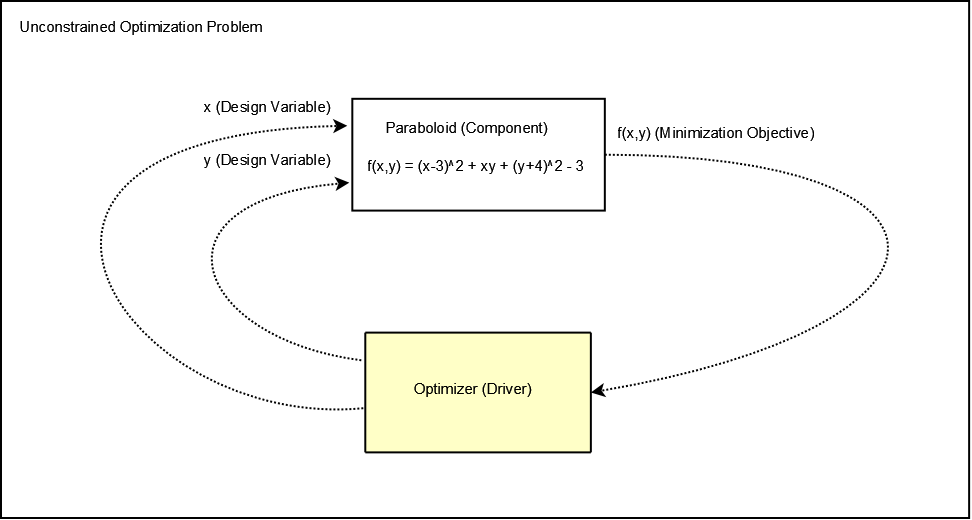

.. index:: simple example

.. _`Getting-Started-with-OpenMDAO`:

Getting Started: A Simple Tutorial Problem
==========================================

In this section, you are going to learn how to execute a simple optimization
problem using the OpenMDAO script interface. To get the most out of this
tutorial, you should be familiar (though you don't have to be proficient) with
the Python language and the concepts presented in
:ref:`Introduction-to-the-OpenMDAO-Framework`. You should understand the terms
:term:`Component`, :term:`Assembly`, and :term:`Driver`. If you don't have
much experience with Python, we recommend trying `Dive into Python
<http://diveintopython.org/>`_. It is an excellent introduction to Python that
is licensed under the GNU Free Documentation License, so you can download and
use it as you wish.

The problem we present here is a paraboloid that is a function of two input variables. Our goal is
to find the minimum value of this function over a particular range of interest. First, we will solve
this problem with no constraints. Then we will add constraints and solve the problem again. We will
not be providing analytical gradients. The optimizer will calculate numerical gradients internally.

If we express the problem as a block diagram, we can see how to set it up in OpenMDAO:

.. _`OpenMDAO-overview`:

   A Simple Optimization Problem
   
The optimizer is the :term:`Driver`. Its job is to manipulate the two design
variables (*x* and *y*) to minimize the output of the paraboloid function
(*f*). The Paraboloid equation fits into the OpenMDAO process as a
:term:`Component`. This Paraboloid component contains a method that operates
on the inputs (*x* and *y*) and returns the value of the function (*f*)
evaluated at those inputs. Both the driver and the component are contained in
an :term:`Assembly`, which maintains the connections between the driver and
the component and knows how to run the system.

The following instructions will help you locate the directory containing
the pieces needed for the model.

If you have downloaded the latest release version from the website, the files you need should be
here:

    ``openmdao-X.X.X/lib/python2.6/site-packages/openmdao.examples.simple-X.X.X-######.egg/openmdao/examples/simple``
    
``X.X.X`` is the current OpenMDAO version, and ``######`` is a string that
contains the Python version and the operating system description. This path may
vary depending on your system and version, but there will be only one
*simple* egg.
    
If you are a developer and have a branch from the source repository, the files you need will
be here:

    ``examples/openmdao.examples.simple/openmdao/examples/simple``
    
Getting Started
---------------

The first thing you must do before running OpenMDAO is to activate the environment. If
you have not done this, then please refer to the instructions in the section on 
:ref:`installation <Installation>`.

With the environment activated, you can run OpenMDAO from anywhere by typing ``python`` and
the name of a Python script. We recommend creating a clean directory somewhere and starting
your work there. You will need some kind of editor to create the Python files, so use
whichever editor you prefer.

.. index:: Component

Building a Component - Paraboloid
---------------------------------

A component takes a set of inputs and operates on them to produce a set of
outputs. In the OpenMDAO architecture, a class called *Component*
provides this behavior. Any Component has inputs and outputs and
contains a function called *execute* that calculates the outputs based on the
values of the inputs. Let's take a look at how you would implement the
paraboloid as an OpenMDAO component:

.. testcode:: simple_component_Paraboloid

    from openmdao.main.api import Component
    from openmdao.lib.api import Float
    
    class Paraboloid(Component):
        """ Evaluates the equation f(x,y) = (x-3)^2 + xy + (y+4)^2 - 3 """
    
        # set up interface to the framework  
        x = Float(0.0, iotype='in', desc='The variable x')
        y = Float(0.0, iotype='in', desc='The variable y')

        f_xy = Float(0.0, iotype='out', desc='F(x,y)')        

        
        def execute(self):
            """f(x,y) = (x-3)^2 + xy + (y+4)^2 - 3
                Minimum: x = 6.6667; y = -7.3333
            """
        
            x = self.x
            y = self.y
        
            self.f_xy = (x-3.0)**2 + x*y + (y+4.0)**2 - 3.0

Your component should look pretty close to this when it is complete. 
To implement a component in the OpenMDAO framework, you write some Python
code and place it in a file. This file is called a *module* in Python.
Typically, a module will contain one component, although you can include more
than one component in a single file. The file ``paraboloid.py`` contains the
code shown above. Later in this tutorial we will discuss how to execute a
model containing this component.

In Python, a class or function must be imported before it can be used. Most of
what you need in OpenMDAO can be imported from: ``openmdao.main.api`` and
``openmdao.lib.api``.

The first two lines in the ``paraboloid.py`` module import the definitions
of the Component class and the Float class. You will use these in the definition
of your Paraboloid class. Open an editor and create a file called ``paraboloid.py``.
Type these two lines into that file:

.. testcode:: simple_component_Paraboloid_pieces

    from openmdao.main.api import Component
    from openmdao.lib.api import Float
    
You could import many other objects from ``openmdao.main.api`` and ``openmdao.lib.api``, but you
are importing only the two classes that you need. This is a good idea because it helps to
prevent any namespace collisions in your module. In other words:

.. testcode:: package

    # BAD
    from openmdao.main.api import *
    
    # INCONVENIENT
    import openmdao.main.api
    
    # GOOD
    from openmdao.main.api import Component

The next line defines a class called *Paraboloid:*

.. testcode:: simple_component_Paraboloid_pieces

    class Paraboloid(Component):
        """ Evaluates the equation f(x,y) = (x-3)^2 + xy + (y+4)^2 - 3 """
    
.. index:: classes, functions

You define the Paraboloid class by deriving it from the Component class. A Paraboloid is a
Component, so it contains all of the data and members that a Component contains. This includes a lot
of helper functions that are used by the framework infrastructure to manage things. You don't have
to worry about any of the framework back-end. Typically there are just two functions that you
provide -- one for initialization (anything that needs to be set up once) and one to execute the
component (calculate the outputs from the inputs.)

Please edit the ``paraboloid.py`` that you created and define the class
Paraboloid as you did above.

If you stop here, you have a Paraboloid component with no inputs, no 
outputs, and an execute function that does nothing. The next thing you need
to do is define the inputs and outputs in the class definition
by adding these lines:

.. testcode:: simple_component_Paraboloid_pieces

        # set up interface to the framework  
        x = Float(0.0, iotype='in', desc='The variable x')
        y = Float(0.0, iotype='in', desc='The variable y')

        f_xy = Float(iotype='out', desc='F(x,y)')

.. index:: Traits

In python, all objects have *attributes*, but making all of those attributes
visible to the framework would be overwhelming, so OpenMDAO requires you to
declare what we call *Variables* to indicate the specific inputs and outputs
that you want your component to make available to other components. Variables
are usually declared in the class definition of a component.

In this example, all of your inputs and outputs are floating point numbers, so
you will use a type of variable called *Float*. The Float constructor contains
a default value and some arguments. The default value has been set to zero for
the x and y.

The argument *iotype* declares this variable as an input or an output. This
argument is required. If it is omitted (or misspelled), then the variable
won't be visible in the framework.

The argument *desc* contains a description, or a string of text that describes this
variable. This argument, while not required, is encouraged.

The variable is given a name by which it will be known internally and externally.

Please edit the ``paraboloid.py`` that you created and add three variables to
class Paraboloid. You will need to have *x* and *y* as inputs and ``f_xy`` as an output. Use
the example above to check your work.

For the Paraboloid component, you have created two inputs and one output. Later
in this example, an optimizer will set these inputs. In later examples, you
will see how they can be set by connecting them to an output of another
component.

Finally, you need a function to execute this component:

.. testcode:: simple_component_Paraboloid_pieces

    def execute(self):
        """f(x,y) = (x-3)^2 + xy + (y+4)^2 - 3
        Optimal solution (minimum): x = 6.6667; y = -7.3333
        """
        
        x = self.x
        y = self.y
        
        self.f_xy = (x-3.0)**2 + x*y + (y+4.0)**2 - 3.0
        
The execute function is where you define what a component does when it runs.
For your Paraboloid component, the equation is evaluated here. The input and
output variables are members of the Paraboloid class, which means that
they must be accessed using *self*. For example, ``self.x`` gives you the value
stored in x. This ``self.`` can be cumbersome in a big equation, so a pair of
internal variables, *x* and *y*, are used in the calculation.

Often, you will already have the code for evaluating your component outputs,
but it will be in some other language, such as Fortran or C/C++. The :ref:`Plugin-Developer-Guide` 
gives some examples of how to incorporate these kinds of components into OpenMDAO.

Please edit the ``paraboloid.py`` that you created and add an execute function
that solves the equation given above. Don't forget that indentation is important
in Python; your execute function must be indented so that Python knows
it is part of the Paraboloid class. The finished result should look like the code
from the beginning of this tutorial.

To make sure this component works, try running it. Please enter the Python
shell by typing

::

    python

at the command prompt. Now you will create an instance of your Paraboloid component,
set a new value for each of the inputs, run the component, and look at the output.

::

    >>> from paraboloid import Paraboloid
    >>> my_comp = Paraboloid()
    >>> my_comp.x = 3
    >>> my_comp.y = -5
    >>> my_comp.run()
    >>> my_comp.f_xy
    -17.0

If you have done everything correctly, you should also get -17.0 as the solution.    

The Paraboloid component is now built and ready for inclusion in a larger model.

.. index:: CONMIN

.. _`using-CONMIN`:

Building a Model - Unconstrained Optimization using CONMIN
-----------------------------------------------------------

Your next task is to build a model that finds the minimum value for the Paraboloid component
described above. This model contains the Paraboloid as well as a public domain gradient optimizer
called :term:`CONMIN`, for which a Python-wrapped driver has been included in OpenMDAO. As the name
implies, CONMIN finds the minimum of a function. The model can be found in
the Python file ``optimization_unconstrained.py``:

.. testcode:: simple_model_Unconstrained

    from openmdao.main.api import Assembly
    from openmdao.lib.api import CONMINdriver
    from openmdao.examples.simple.paraboloid import Paraboloid

    class OptimizationUnconstrained(Assembly):
        """Unconstrained optimization of the Paraboloid with CONMIN."""
    
        def __init__(self):
            """ Creates a new Assembly containing a Paraboloid and an optimizer"""
        
            super(OptimizationUnconstrained, self).__init__()

            # Create CONMIN Optimizer instance
            self.add('driver', CONMINdriver())
        
            # Create Paraboloid component instances
            self.add('paraboloid', Paraboloid())

            # Driver process definition
            self.driver.workflow.add(self.paraboloid)

            # CONMIN Flags
            self.driver.iprint = 0
            self.driver.itmax = 30
            self.driver.fdch = .000001
            self.driver.fdchm = .000001
        
            # CONMIN Objective 
            self.driver.objective = 'paraboloid.f_xy'
        
            # CONMIN Design Variables 
            self.driver.add_parameter('paraboloid.x', low=-50., high=50.)
            self.driver.add_parameter('paraboloid.y', low=-50., high=50.)

Please create a file called ``optimization_unconstrained.py`` and copy this
block of code into it. We will discuss this code next.

.. index:: top level Assembly

An :term:`Assembly` is a container that can hold any number of components, drivers, and other
assemblies. An Assembly also manages the connections between the components that it
contains. In OpenMDAO the top assembly
in a model is called the *top level assembly.* In this problem, the top level assembly includes a
Paraboloid component and a CONMINdriver called *driver*. The name *driver* is special. When an 
assembly is executed, it looks for a Driver named *driver* and executes it. That Driver is the root
of what is called an :term:`iteration hierarchy`.

The OptimizationUnconstrained class is derived from Assembly instead of Component.

.. testsetup:: simple_model_Unconstrained_pieces

    from openmdao.main.api import Assembly
    from openmdao.lib.api import CONMINdriver
    from openmdao.examples.simple.paraboloid import Paraboloid
    from openmdao.examples.simple.optimization_unconstrained import OptimizationUnconstrained
    
    self = OptimizationUnconstrained()
    
.. testcode:: simple_model_Unconstrained_pieces

    class OptimizationUnconstrained(Assembly):
        """Unconstrained optimization of the Paraboloid with CONMIN."""
    
In the Paraboloid component, you created an execute function to tell it what to do when the
component is run. The ``OptimizationUnconstrained`` assembly does not need an execute function because
the Assembly class already has one that is sufficient for most cases. However, this assembly does
need an initialize function to set parameters for the optimization. This is what the ``__init__``
function does:

.. testcode:: simple_model_Unconstrained_pieces

        def __init__(self):
            """ Creates a new Assembly containing a Paraboloid and an optimizer"""
        
            super(OptimizationUnconstrained, self).__init__()

.. index:: Expression

The ``__init__`` function is called by the class constructor on a new
uninitialized instance of the class, so it's a good spot to set up any
parameters that CONMIN needs. The *super* command calls the
``__init__`` function of the parent (Assembly). This is required, and forgetting it
can lead to unexpected behavior.

Next, the Paraboloid and the CONMIN driver have to be instantiated and added
to ``OptimizationUnconstrained``. The function *add* is used to add them
to the assembly:

.. testcode:: simple_model_Unconstrained_pieces

            # Create CONMIN Optimizer instance
            self.add('driver', CONMINdriver())

            # Create Paraboloid component instances
            self.add('paraboloid', Paraboloid())

Here you will make an instance of the *Paraboloid* component that you created above and
give it the name *paraboloid.* Similarly you will create an instance of CONMINdriver and 
give it the name *driver.* It will be the root of the iteration hierarchy for our class. 
As with other class members,
these are now accessible in the ``OptimizationUnconstrained`` assembly via ``self.paraboloid``
and ``self.driver``.

Next, the CONMINdriver needs to be told what to run. Every driver has a *Workflow*
that contains a list of the components that the driver tells to run. We can add the
*Paraboloid* component to the driver's workflow by using its *add* function.

.. testcode:: simple_model_Unconstrained_pieces

            # Iteration Hierarchy
            self.driver.workflow.add(self.paraboloid)

For this problem, you want to minimize ``f_xy``. In optimization, this is called
the *objective function*. In OpenMDAO, you define the objective function using an
*Expression* variable:
        
.. testcode:: simple_model_Unconstrained_pieces

            # CONMIN Objective 
            self.driver.objective = 'paraboloid.f_xy'

An *Expression* is a special kind of variable that contains a string
expression that combines variables with Python mathematical syntax. 
Every variable has a unique name in the OpenMDAO data hierarchy. This
name combines the variable name with its parents' names. You can think
of it as something similar to the path name in a file system, but it uses a "."
as a separator. This allows two components to have the same variable name
while assuring that you can still refer to each of them uniquely. Here, the
``f_xy`` output of the Paraboloid component is selected as the objective for
minimization. Expressions differ from typical OpenMDAO variables in that they 
cannot be connected to other variables.

While CONMIN operates only on a single objective,
it allows multiple design variables. The design variables can be declared
individually using the ``add_parameter`` method:
        
.. testcode:: simple_model_Unconstrained_pieces

            # CONMIN Design Variables 
            self.driver.add_parameter('paraboloid.x', -50, 50)
            self.driver.add_parameter('paraboloid.y', -50, 50)

Here, both x and y from the *Paraboloid* component are chosen as the design
variables. The ``add_parameter`` method also allows you to add a range of
validity for these variables, so that the unconstrained optimization can be
performed on a bounded region. For this problem, you are constraining x and y
to lie on [-50, 50].
        
The problem is now essentially ready to execute. CONMIN contains quite a few
additional control parameters, though the default values for many of them are
adequate. These parameters are detailed in the section on :ref:`CONMIN-driver`.
        
.. testcode:: simple_model_Unconstrained_pieces

            # CONMIN Flags
            self.driver.iprint = 1
            self.driver.itmax = 30
            self.driver.fdch = .000001
            self.driver.fdchm = .000001

The parameters specified here include the debug verbosity (*iprint*) and the number of
iterations (*itmax*). The relative and absolute step sizes for the
numerical gradient calculation are adjusted to reduce the step size for this
problem (*fdch* and *fdchm*). If the default values are used, only two places of
accuracy can be obtained in the calculated minimum because CONMIN's default step
size is too large for this problem.

This model is now finished and ready to run. The next section will show how this is done.

Executing the Simple Optimization Problem
------------------------------------------

To run your model, you need to create an instance of ``OptimizationUnconstrained`` and tell it to run.
You did this above using an interactive Python session. Try doing this for
``optimization_unconstrained.py``.

You can execute this model another way. You can add some code to the end of
the ``optimization_unconstrained.py`` so that it can be executed in Python,
either at the command line or in the Python shell. Using the conditional

::

    ``if __name__ == "__main__":``
    
you can include some Python code at the bottom of ``optimization_unconstrained.py``. It will execute
only when you call it at the command line or the shell, and not when another module imports it. So,
the final lines in this file are:

.. testsetup:: simple_model_Unconstrained_run

    from openmdao.examples.simple.optimization_unconstrained import OptimizationUnconstrained
    __name__ = "__main__"

.. testcode:: simple_model_Unconstrained_run

    if __name__ == "__main__": 

        from openmdao.main.api import set_as_top
        opt_problem = OptimizationUnconstrained()
        set_as_top(opt_problem)

        import time
        tt = time.time()
        
        opt_problem.run()

        print "\n"
        print "CONMIN Iterations: ", opt_problem.driver.iter_count
        print "Minimum found at (%f, %f)" % (opt_problem.paraboloid.x, \
                                         opt_problem.paraboloid.y)
        print "Elapsed time: ", time.time()-tt, "seconds"

.. testoutput:: simple_model_Unconstrained_run
    :hide:

    ...
    CONMIN Iterations:  5
    Minimum found at (6.666309, -7.333026)
    Elapsed time:  ... seconds
        
 
In this block of code you are doing four things. 1) In the first statement, you create an instance
of the class ``OptimizationUnconstrained`` with the name ``opt_problem``. 2) In the second statement,
you set ``opt_problem`` as the top Assembly in the model hierarchy. (This will be explained in a
later tutorial.) 3) In the fifth statement, you tell ``opt_problem`` to run. (The model will execute
until the optimizer's termination criteria are reached.) 4) In the remaining statements, you define
the results to print, including the elapsed time.

Please edit your copy of ``optimization_unconstrained.py`` and add the
block of code into it. Now, save the file and type the following at the command
prompt:

::

        python optimization_unconstrained.py

This should produce the output:

:: 

    [ CONMIN output not shown ]
    CONMIN Iterations:  5
    Minimum found at (6.666309, -7.333026)
    Elapsed time:  0.0558300018311 seconds

Now you are ready to solve a more advanced optimization problem with constraints.
    
.. index:: constraints, CONMIN
.. _`constrained-optimization`:

Building a Model - Constrained Optimization using CONMIN
---------------------------------------------------------

Usually, an optimization problem also contains constraints that reduce the design space.
*Constraints* are equations or inequalities that are expressed as functions of the design
variables. You will add a constraint to your model in ``optimization_unconstrained.py``.
First, copy the file and give the new file the name ``optimization_constrained.py``. Inside
of this file, change the name of the assembly from ``OptimizationUnconstrained`` to
``OptimizationConstrained``. Don't forget to also change it in the bottom section where it is
instantiated and run.

In OpenMDAO, you can construct a constraint with an expression string, which is
an equation or inequality built using available variables with Python
mathematical syntax and functions. CONMIN supports inequality
constraints but not equality constraints.

We want to add the constraint ``x-y >= 15`` to this problem. The unconstrained
minimum violates this constraint, so a new minimum must be found by
the optimizer. You can add a constraint to your existing ``OptimizationUnconstrained``
model by adding one line to the initialize function:

.. testcode:: simple_model_Unconstrained_pieces

        # CONMIN Constraints
        self.driver.add_constraint('paraboloid.x-paraboloid.y >= 15.0')

The ``add_constraint`` method is used to add a constraint to the driver.

Please add this line to the ``__init__`` function in
``optimization_constrained.py`` and save it. Execute it by typing:

::

        python optimization_constrained.py
    
When it is executed, it should produce this output:

:: 

    [ CONMIN output not shown ]
    CONMIN Iterations:  6
    Minimum found at (7.175775, -7.824225)
    Elapsed time:  0.0295481681824 seconds
    
Notice that the minimum of the constrained problem is different from the minimum of
the unconstrained problem.

This concludes an introduction to a simple problem of component creation and execution in
OpenMDAO. The next tutorial introduces a problem with more complexity and
presents additional features of the framework.
